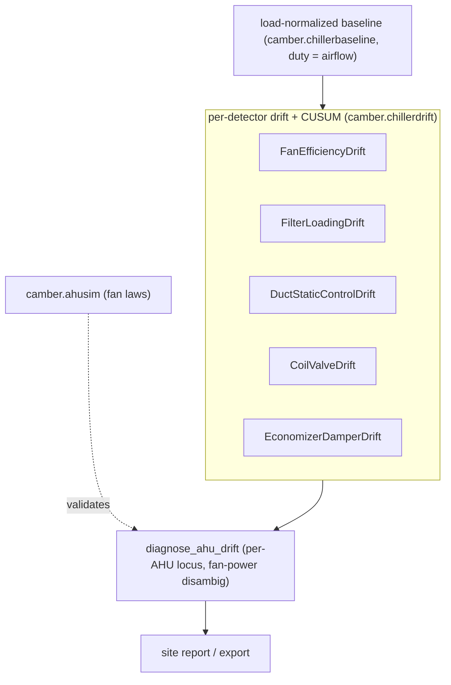

# AHU / air-side drift detection

The chiller ([CHILLER-DRIFT.md](CHILLER-DRIFT.md)) and pump ([PUMP-DRIFT.md](PUMP-DRIFT.md)) families
watch the refrigerant and hydronic sides. The AHU family asks the same "is this slowly getting worse
than it used to be, at matched load?" question of the **air side** — supply fans, coils, filters, and
duct-static control — reusing the exact same load-normalized frozen-baseline engine
(`camber.chillerbaseline`, `camber.chillerdrift`), with an *air-side duty* normalizer (airflow) in
place of thermal tons.



*Airflow-normalized baselines feed five per-detector drifts; co-movement rolls up into one per-AHU locus, with ahusim as the physics check.*

Like the other families, each detector is a **period rule** (`Registry.run_periods`), freezes a
load-normalized baseline into a `BaselineStore` on first use, reports a period statistic **and** a
sustained-shift CUSUM alarm, labels its thresholds *screening-grade* / *provisional-untuned*, and
**declines loudly** (never reads healthy) when an instrumented point is missing. They complement the
existing static air-side rules (`economizer_lockout`, `satreset`, `staticreset`, `airflow`) the way
the chiller drift rules complement the static approach check.

## The detector family

| Detector | Signal | Normalizer | Sided | Catches |
|---|---|---|---|---|
| `FanEfficiencyDrift` | supply-fan power | airflow (cfm) | up | wire-to-air efficiency loss — a slipping/worn belt, bearing drag, a degrading motor/VFD, or the fan pushed off its curve; a power **excess** at matched airflow |
| `FilterLoadingDrift` | filter differential pressure | airflow (cfm) | up | filter loading (dirty filter) — a DP **rise** at matched airflow; a fall is a filter change |
| `DuctStaticControlDrift` | duct static pressure | airflow (cfm) | both | fall = fan cannot hold setpoint (degradation/leakage) vs rise = over-pressurization (sensor-low/stuck damper) — with the static-reset schedule subtracted out |
| `CoilValveDrift` | cool/heat valve position | delivered air-ΔT (MAT↔SAT) | up | coil fouling / waterside starvation / air bypass / valve-authority loss — valve creep before SAT control fails (econ-gated; waterside-reset caveated) |
| `EconomizerDamperDrift` | outdoor-air fraction (temp-inferred) | OA-damper command (%) | both | up = damper leaking / stuck-open (excess OA) vs down = damper stuck/slipping closed (lost free cooling / under-ventilation) — degenerate-mixing gated, MAT-stratification caveated |

**Fan efficiency is the air-side energy signal.** A healthy fan draws a repeatable power at a given
airflow; more power at matched airflow is efficiency loss. It is **one-sided up** and reuses the
generic `Role.POWER` on the AHU equip-frame (the equip identifies the fan) with `Role.AIRFLOW` as the
normalizer — the air-side twin of `PumpPowerDrift`. **Its confound is stated:** fan power also rises
when the *duct-static setpoint* is raised (the fan works harder to hold a higher static), so when a
duct-static point is mapped the rule reports the concurrent static shift and caveats a power excess
that co-moves with rising static.

**The economizer detector watches OA delivery, not OA logic.** A healthy OA damper delivers a
repeatable outdoor-air fraction for a given command; `EconomizerDamperDrift` freezes an `OAF ~
f(command)` baseline — where `OAF = 100·(RAT−MAT)/(RAT−OAT)` (`camber.oafraction`) — and scores the
current period's OA-fraction residual **at matched command**, so mechanical drift (linkage slipping,
seals leaking, the blade sticking, minimum-position creep) shows up as delivery moving while the
command stays put. It is **two-sided**: more OA than baseline = a leaking / stuck-open damper (excess
outdoor air), less OA = a stuck or slipping-closed damper (lost free cooling, possible
under-ventilation). It is *not* a sequence check — an economizer commanded wrong for the conditions is
the job of `economizer_lockout_rule` and `freecoolingmissed_rule`. Two confounds are handled: the
mixed-air sensor stratifies badly and sits in the numerator, so a standing caveat (Sellers, *Relative
Accuracy*) flags that and the magnitude floor is set high above it; and where outdoor and return air
are too close (`|RAT−OAT|` small) the ratio is ill-conditioned, so those rows are excluded before the
fit. Reuses `OAT` / `RETURN_AIR_TEMP` / `MIXED_AIR_TEMP` / `OA_DAMPER`; no new role. `diagnose_ahu_drift`
consumes it as the fifth `outdoor-air` locus (see below).

## One per-AHU verdict

The five detectors fail *independently* (a slipping belt, a dirty filter, a lost static setpoint, a
fouled coil, and a drifting OA damper are different faults) but corroborate when a problem is
AHU-wide. `camber.ahudrift.diagnose_ahu_drift(findings)` reads them and returns one localized
`AhuDriftDiagnosis` — naming each cause, flagging **corroboration** when two or more agree, and running
the **fan-power disambiguation** that no single signal can do (the air-side twin of `pumpdrift`'s
flow-vs-head check):

- fan-power excess **with** a loading filter or a rising duct static → the **air path** (fix the
  filter / check the ductwork first; the fan power is corroborating, not a separate fan fault);
- fan-power excess **with** the duct static falling below setpoint → **fan degradation**;
- fan-power excess with a **clean** filter and **steady** static → the **fan itself**;
- fan-power excess with **no** filter or static point → called ambiguous rather than asserted.

It splits the AHU into fan (mechanical) / air-path (filter + static) / coil / outdoor-air (economizer
OA mixing) sides, reports a `locus` (steady · fan · air-path · coil · outdoor-air · ahu-wide) with an
`ahu_wide` flag, and names a cooling and a heating coil separately. The economizer is an **independent
side** (like a coil): it corroborates and can make the verdict AHU-wide, but it is deliberately
**outside** the fan-power disambiguation, because its signal is outdoor-air fraction, not fan power.
Screening-grade; pure over Findings. (The `outdoor-air` locus is exercised end-to-end by `ahusim`'s
confusion matrix via an OA/RA mixing regime — see Calibration.)

## Surfacing the verdict

The per-AHU verdicts flow downstream like the chiller and pump ones:
`camber.integrate.export.ahu_diagnoses_to_frame` / `export_ahu_diagnoses` write one row per AHU (locus
· severity · ahu_wide · corroborated · causes · fingerprint) to CSV/JSON/Parquet, and
`camber.report.ahu_diagnosis_table` renders a worst-first HTML table. `build_site_report(...,
ahu_diagnoses=[...])` splices that table into the owner-facing site report, alongside the chiller and
pump verdict tables.

## Calibration

Thresholds are constructor arguments (screening-grade); the CUSUM parameters are provisional-untuned.
As with the other families, `camber.driftvalidation` tunes them once labelled AHU-fault periods exist,
and the physics generator `camber.ahusim` (system curve ΔP ∝ Q² + fan laws) characterizes the family
end-to-end without a dataset — on clear faults the AHU diagnosis localizes to the right `locus` at
~100% with no false alarms on healthy AHUs or a static-reset schedule, and it proves the fan-power
disambiguation (`filter_loading → air-path` vs `fan_belt_slip → fan`). All five loci are exercised,
including **`outdoor-air`**: the generator models a genuine OA/RA mixing box (`MAT` a real mix of a
swept OA-damper command) with two economizer faults — a leaking / stuck-open damper (over-delivery)
and a stuck / slipping-closed one (under-delivery). To keep the coil signal invariant under the mix,
`SUPPLY_AIR_TEMP` is derived as `MAT − dt`, so the cooling-coil air-ΔT stays `dt` by construction
while `MAT` floats — an economizer fault localizes to `outdoor-air` alone and leaves the other four
families untouched.

```python
from camber.ahusim import make_cases, locus_confusion

lc = locus_confusion(make_cases(), min_severity=3)
print(lc.accuracy, lc.as_dict()["matrix"])
```
