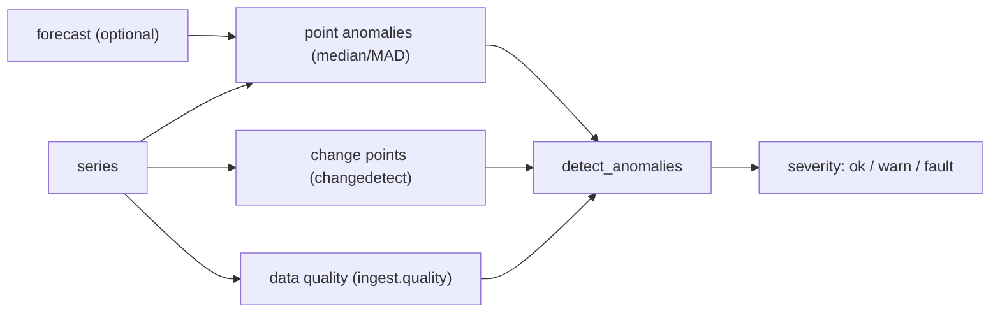

# Anomaly ensemble

Any single anomaly test has a blind spot: a robust point test misses a slow regime shift; a
change-point test misses isolated spikes; both miss a series that's simply full of gaps.
`camber.anomaly` fuses three signals CAMBER already computes into one verdict:

*Three canonical detectors — point outliers, level shifts, data quality — fuse into one severity verdict.*



```python
from camber.anomaly import detect_anomalies

r = detect_anomalies(series, forecast=forecast)  # forecast optional
r.severity, r.n_point_anomalies, r.n_change_points, r.quality_score
```

- **point anomalies** — robust median/MAD outliers of the residual (against a supplied `forecast`,
  else the series' own robust centre) — the learned-normal / `camber.forecast` signal;
- **change points** — level shifts in time (`camber.changedetect`);
- **data quality** — coverage / gaps / flatline / duplicates (`camber.ingest.quality`). Note this
  call is **role-blind**, so it uses the *pooled* quality score, not the two-regime read that
  `sensorhealth.sensor_trust` opts into per role. On a duty-cycled point the point test above also
  counts every legitimate burst, so a healthy BTU meter still reads `fault` here — use
  `sensor_trust` for a trust decision, or pass a `forecast` so the point test measures against
  expected behaviour.

Combined **severity**: `fault` when point anomalies exceed `fault_frac`, ≥2 change points occur, or
the quality score drops below `fault_quality`; `warn` for any single signal (or quality below
`warn_quality`); else `ok`. Flags: `k`, `change_z`, `min_segment`, `warn_quality`, `fault_quality`,
`fault_frac`. Reuses the canonical detectors — no new math.
