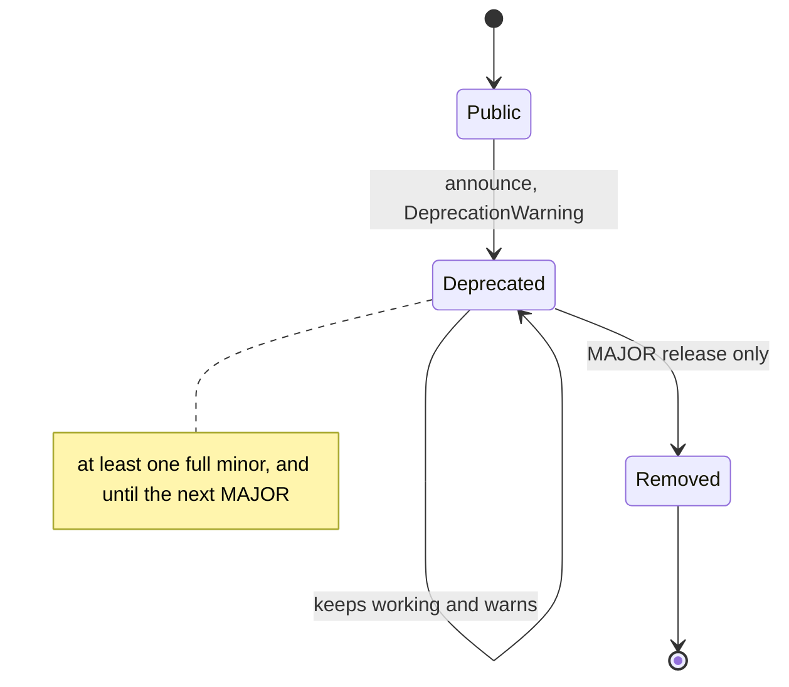

# API stability & deprecation policy

This document defines what CAMBER promises about its API: what counts as **public**, what
those version numbers mean, and how a public name is changed or removed. It is the contract
behind the `1.0` release.

Until `1.0`, CAMBER is in the `0.x` range, where [Semantic Versioning](https://semver.org)
explicitly allows anything to change between releases. This policy describes the guarantees
that **take effect at `1.0`** — the `0.9.x` hardening series exists to make them true before
they are promised.

## What is public

> **A name is public if and only if it does not start with an underscore, and it lives in a
> module whose name does not start with an underscore, under the `camber` package.**

Concretely, the public API is:

- Every non-underscore function, class, and constant in a non-underscore module — whether you
  reach it through a package (`from camber.rules import builtin_registry`) or by its module
  path (`from camber.mandv.towt import fit_towt`, `from camber.ingest.quality import assess`).
- Each package and module also defines `__all__`, its **curated surface**: the names you get
  from `from camber.x import *`, the names featured in the docs, and the recommended way to
  import. `__all__` is a convenience and a curation, **not** a narrowing — a non-underscore
  name reachable by its module path is public even if it is not lifted into a package `__all__`.

The top-level `camber` namespace is intentionally minimal: it exposes only `__version__`. Import
from the subpackages and modules, not from `camber` directly.

### What is **not** public (may change or vanish without notice)

- Anything whose name starts with `_` (functions, classes, constants, methods, attributes).
- Any module whose name starts with `_` (e.g. `camber._deprecation`).
- The individual `camber.rules.*_rule` diagnostic modules **as import targets**: they are
  discovered through `camber.rules.builtin_registry()`, which *is* public and stable. The set
  of shipped rules and their behavior is part of the product; the module path you'd import a
  rule class from is not a promised import surface.
- Internal structure of returned objects beyond their documented fields, private attributes,
  and the exact text of messages, logs, and reprs.
- The optional-integration bridges under `camber.interop.*` that wrap third-party libraries
  (PySAM, pvlib, psychrolib, better-lbnl, rdflib, …): CAMBER's own wrapper functions are
  public, but where they surface an upstream type or option, that part follows the upstream
  library's compatibility, not CAMBER's.

### Provisional surfaces

A few public modules are marked **provisional**: they follow the naming rule above and are locked
by the snapshot test, but their names and signatures may still change in a MINOR release (with a
CHANGELOG entry, without a deprecation window) until they are declared stable.

- **`camber.datasets`** (added in 0.86) -- the open dataset catalog: `DatasetEntry`, `FetchResult`,
  `IngestResult`, `catalog`, `get`, `fetch`, `ingest`, `status`, `remove`, `config_template`,
  `score`. The catalog's *content* (`catalog.json`: entries, subsets, pinned checksums) is data, not
  API, and changes whenever a publisher reissues a file or an entry is added. Added in 0.89, also
  provisional: `ingest(..., accept_noncommercial=, from_dir=)`, the `DatasetEntry.manual` /
  `manual_instructions` fields, the catalog fields `manual`, `manual_instructions`,
  `requires_extras` (`"xlsx"`, `"brick"`), `licence_check.expect` / `json_path`, a run's `sheet`
  and `group: "brick"`, `ingest.brick` (`file`, `member`, `equip_classes`) and the mapping-file
  keys `equipment` / `equipment_classes`; the `xlsx` extra; and `BrickPointMapping.owner` /
  `owner_class` plus `camber.interop.brick.part_parents_from_brick`. Reports built from store
  frames pick up the dataset provenance stamped on the frame (`DataFrame.attrs`), an internal
  mechanism, not API.
- **`camber.portfolio`** (added in 0.86) -- the portfolio workspace and facility lifecycle:
  `Portfolio` (including `state_dir`, `manifest`, `migrate` and `legacy_sites`),
  `PortfolioLocked`, `LifecycleError`, `STATES`, `TRANSITIONS`, `DELETING`, `DEFAULT_POLICY`,
  `allowed_actions`, `transition`, `find_workspace`, `is_workspace`, and the
  `camber portfolio` / `camber facility` commands. The on-disk formats are versioned and read
  back-compatibly: `_portfolio.json` with its `schema_version`, `_audit.ndjson`, the registry-v2
  fields, `state/<fid>/manifest.json` with its `schema_version`, and the migration redirect
  stubs. See [PORTFOLIO.md](PORTFOLIO.md).
- **The RCx report** (added in 0.88): `camber.report.rcx` -- `RcxOptions`, `RcxReport`
  (`to_html`, `to_dict`, `slots`), `build_rcx_report`, `select_week`, `WeekChoice`, `load_notes`,
  `notes_template`, `P3_FAMILIES`, `WEEK_MODES`; `PLANT_FAMILIES` and `select_week(roles_for=)`
  are provisional additions in 0.91 (#32) -- and the issue layer in
  `camber.rules.triage`: `Issue`, `SensorCause`, `Confidence`, `link_findings`,
  `finding_confidence`, `sensor_causes`, `issue_totals`, `SHARED_ROLES`. The HTML layout, the
  notes-file schema and the `report.rcx` config keys may change with the grounded-prose work. The
  additive pieces that shipped with it are stable in shape: the `RunResult` fields `registry`,
  `frame_for`, `refs`, `data_sources`, `config` and `base_dir`; `data_sources=` on
  `build_site_report` / `build_dashboard`; `gate=` on `sensor_trust` / `frame_sensor_health`;
  `gate=` on `g36_reset.sat_reset_compliance`; `schedules.fan_on_mask`; `charts.template_violations`;
  `charts.box_by_hour`; the `fan_gate` / `denom_min_f` parameters and `n_masked_*` / `fan_gate`
  / `failure_mode` metrics on the OA and SAT-reset rules; `OAFractionResult.masked`;
  `FleetReport.cost_estimated`; and the `--layout` flag. See [RCX-REPORT.md](RCX-REPORT.md).
- **Facility-keyed identity** (added in 0.86, part of the lifecycle work). These keyword
  arguments are additive and optional, and each call behaves exactly as before without them:
  `facility_id=` / `legacy_sites=` on `FaultLifecycle` and `BaselineStore` (and their `load`),
  `facility_id=` on `FaultLifecycle.update`, the `camber.integrate.tickets` and
  `camber.integrate.export` functions, and `FaultRegister.update`. The same holds for the new
  record fields `FaultRecord.facility_id` / `aliases` and `BaselineRecord.facility_id` /
  `aliases`, and for the ticket fields `facility_id` / `legacy_fingerprint`. The new config keys
  `facility_id`, `workspace` and `faults`, and the `RunResult` fields `facility_id`, `workspace`
  and `faults`, are also additive. Their semantics may still be refined with the lifecycle work.
  Records now ignore unknown keys when they are read back, so a newer file loads in this
  version.

- **M&V foundations for rebaselining** (added in 0.87; issue #21, phase 21a): `camber.mandv.methods`
  (`MethodResult`, `backcast_savings`), `camber.mandv.nonroutine.detect_step_changes` /
  `StepChangesResult` / `StepChange`, `camber.mandv.stats.regression_tests` /
  `RegressionTests` / `sep_validity` / `Validity` / `model_regression_tests` / `logical_signs`,
  the keyword-only `kernel=` on the savings functions, and the `as_dict()` / `from_dict()` model
  serialisation format. Later phases (SEP chaining and method selection, adjustments, versioned
  baselines) may reshape them.
- **M&V SEP methods and adjustments** (issue #21, phases 21b and 21c; one flow: method, then
  adjustments, then result):
  - `camber.mandv.methods`: `forecast_savings`, `standard_conditions_savings`, `chained_savings`,
    `sequential_chain`, `select_method`, `MethodProposal`, `ChainLink` (with its trailing
    `period`, `model_window`, `sep_terms`, `df`, `enpi_uncertainty` and `uncertainty_terms`),
    `METHODS`, `SAME_LENGTH_TOLERANCE_DAYS`, and the new trailing `MethodResult` fields;
  - the whole of `camber.mandv.sep`;
  - `camber.mandv.adjustments`: `NonRoutineAdjustment`, `StaticFactorAdjustment`,
    `IndicatorFit`, `AdjustedResult` (with its trailing `enpi`, `enpi_uncertainty`,
    `unadjusted_enpi` and `links`), `WaterfallStep`, `ConfoundedAdjustment`, `EcmSchedule`,
    `DEFAULT_SETTLE_DAYS`, `VALIDITY`, `check_validity`, `apply_adjustments` (and its keyword-only
    `reporting_index=`, `links=` and `schedule=`), `estimate_nre_indicator`,
    `nra_from_isolation`, `propose_adjustments`, `is_material`, `adjustment_from_dict`,
    `NRA_METHODS`, `STATIC_METHODS`;
  - `camber.mandv.multivariable` (`ChangePointDriverModel`, `fit_cp_driver_model`) and
    `camber.charts.adjustment_waterfall`;
  - the config keys `mv[].method`, `kernel`, `intermediate_period`, `normal_year`, `validity`,
    `adjustments`, `ecm_dates`, `settle_days` and `materiality_threshold`, the `mv_savings`
    metrics they add, and the `mv_method_proposal` finding.

- **M&V versioned baselines and rebaselining** (issue #21, phase 21d; #48):
  - the whole of `camber.mandv.rebaseline` (`MVBaselineStore`, `RebaselinePolicy`, `Trigger`,
    `DeclaredChange`, `StaticFactorChange`, `assess_triggers`, `propose_rebaseline`,
    `new_baseline_window`, `BaselineWindow`, `RebaselineProposal`, `version_segments`,
    `mv_provenance` and the rest of its `__all__`), `camber.mvrun` and `camber.report.mv`;
  - the additive surfaces they needed: the keyword-only `model_types=` of `BaselineStore`, the
    trailing `BaselineRecord.provenance` (left out of `as_dict` when empty, so drift baseline
    files are unchanged), the class attributes `LIST_KEY` / `SCHEMA`, the keyword-only
    `provenance=` / `accepted_by=` of `freeze` and `provenance=` of `accept_new_normal`;
    `IndicatorFit.from_dict` (and `adjustment_from_dict` now rebuilding `fit`);
    `AdjustedResult.baseline_version`; `MethodProposal.fitted`; the keyword-only `windows=` of
    `sequential_chain`; `camber.config.run_mv_config`; `camber.charts.chained_cusum_plot`;
  - the on-disk `state/<fid>/mv_baselines.json` (`{"schema": 1, "mv_baselines": [...]}`), the
    `mv_baselines` retention class and manifest kind, the config keys `mv[].rebaseline` and the
    top-level `mv_store`, the `mv_trigger` finding and the `baseline_version`, `partial` and
    `triggers` metrics on `mv_savings`;
  - the config keys `mv[].model` (`"change_point"` | `"cp_driver"`), `drivers`,
    `occupied_weekdays` and `holidays`, and the `model_form`, `drivers` and `driver_coef`
    metrics they add to `mv_baseline` (0.90; the change-point + driver form of phase 21c on the
    config path);
  - the `camber mv run | freeze | list | propose | rebaseline | adjust | report` commands and
    their `mv.freeze`, `mv.rebaseline` and `mv.adjust` audit actions.

- **Site time zone** (0.90.1; #56): `camber.tsparse.TimezoneWarning` and `check_timezone`, the
  `timezone=` / `strict_timezone=` keywords on `parse_timestamps`, `io.load_csv`,
  `realio.load_point` / `load_status` / `load_equipment` and the wide, long, per-point CSV, SQL,
  OPC-UA and BACnet adapters, the `EquipRef.timezone` / `strict_timezone` fields, and the config
  keys `source.timezone` / `source.strict_timezone`.
- **M&V fixes** (0.90.1; #51, #55, #59): `lag1_autocorrelation(period_start=, period_end=)` and its
  monthly adjacency window, `ExtrapolationPolicy.min_points_outside`, `mvrun.baseline_window_check`,
  `DegreeDayModel.caveats` and the `short_baseline` metric of `mv_baseline`. The thresholds may be
  retuned.
- **Weather fallback** (0.90.1; #53): `oat_reference_blended`, `oat_reference_isd(fallback=,
  power_transport=)`, `power_grid_cell`, `isd_catalog_end`, `WeatherCacheMiss`, `POWER_GRID_DEG`,
  `fetch_isd(on_missing_year=)`, `fetch_nasa_power(snap_to_cell=)`,
  `cached_transport(offline=, should_cache=)`, `cached_bytes_transport(offline=)`,
  `nasa_power_url(time_standard=)`, and the `weather_provenance`, `isd_missing_years`,
  `power_coverage_end` and `power_cell` series attributes. The bias-correction method may change.
- **False-verdict and sensor-trust fixes** (0.90.1; #57, #58), all additive:
  - `min_unoccupied_run_pct=` on `setback.analyze_setback` and `NightWeekendSetback`, and the
    trailing `SetbackResult.unoccupied_to_occupied_ratio` / `min_unoccupied_run_pct`;
  - the trailing `SATResetComplianceResult` fields `mean_abs_error_f`, `pct_above_g36_target`,
    `mean_above_gap_f` and `n_warm`, `track_gap_f=` on `SupplyAirResetCompliance`, and the optional
    rule attribute `equip_classes` that `Registry.run` declines other classes by;
  - `sensorhealth.STUCK_HOURS`, `sensorhealth.frame_checks`, `stuck_hours=` on `sensor_trust`, the
    trailing `SensorTrust` fields `longest_flat_hours`, `stuck_intervals`, `first_valid`,
    `window_coverage`, `n_state_changes` and `frame_checks`, and the flags `late_start`,
    `never_changes`, `fractional_status`, `implausible_fan_off`, `status_speed_mismatch` and
    `all_points_frozen`. The limits and thresholds may be retuned.
- **M&V billing-period series** (added in 0.90.1; #54): the whole of `camber.mandv.billing`
  (`BillingSeries`, `as_billing_series`, `is_billing_like`, `daily_weather`), the billing
  columns and `attrs["billing"]` that `daily_energy_vs_temp` returns for billing input, and the
  trailing `billing` / `n_days` fields of `NonRoutineResult` and `billing` / `n_periods` fields
  of `StepChangeResult` and `StepChangesResult` (in `as_dict` only for billing input).

- **Equipment classes, plant tracking and plant links** (0.91; #61, #62), all additive:
  - `camber.model.equipclass` (`EQUIP_FAMILIES`, `equip_family`, `family_matches`) and
    `camber.rules.applicability` (`RULE_EQUIP_CLASSES`, `ROLES_SUFFICE`, `rule_equip_classes`):
    which equipment family each built-in rule applies to. `Registry.run` / `run_periods` decline
    a recognised class outside a rule's families and caveat an unrecognised one; `run_fleet`
    leaves such equipment out of the batch and records `metrics["_class_excluded"]`. The families,
    spellings and per-rule classification may change;
  - the config `topology` section, `camber.topology_infer.topology_from_config`,
    `CHILD_COLUMNS` / `PARENT_COLUMNS`, and `RunResult.topology` / `topology_source`;
  - `CHWSupplyTracking` (`chw_supply_tracking`), `RUN_STATUS_ROLE` and `TEMPERATURE_GATE_CAVEAT`
    in `camber.rules.chwplant_rule`; `analyze_chw_tracking`, `CHWTrackingResult`,
    `chiller_running`, `chw_tracking_mask`, `analyze_chw_plant(running=)` and the trailing
    `CHWPlantResult.run_source` in `camber.chwplant`; the `run_source` metric of
    `chw_plant_reset`. The tracking threshold and severity bands may be retuned;
  - in `camber.rules.triage`: `UpstreamCause`, `PLANT_CAPACITY_RULES`, `SAT_HIGH_RULES`,
    `G36_SAT_HIGH_FCS`, `is_sat_high`, `link_findings(topology=, plant_overlap_min=)`, the trailing `Issue` fields
    `upstream_causes` / `downstream`, and the `scope_equips` metric that scopes a sensor-drift
    cause to the units reading that sensor;
  - the G36 engine as a rule: `camber.rules.g36_rule.G36AFDD` (`g36_afdd`, #60) and its
    finding metrics (`fc`, `flagged_fcs`, `worst_fc`, `fan_gate`, ...); the new `fdd_g36` names
    (`MODE_DELAY_MIN`, `ALARM_DELAY_MIN`, `AVG_WINDOW_MIN`, `FC_OMIT_NO_HEATING`,
    `FC_OMIT_NO_COOLING`, `G36Thresholds.fc14_fan_heat`) and the trailing `G36Result` fields.
    A built-in rule's `equip_classes` attribute (`g36_afdd`, `supply_air_reset_compliance`) is its
    `RULE_EQUIP_CLASSES` entry, the air-handler family;
  - `camber.freecooling.integrated_economizer_mask` with `ECON_DAMPER_MIN_PCT`,
    `ECON_OAF_MIN_PCT`, `ECON_MIN_DELTA_F`, and `camber.setpoint_reset`
    (`classify_setpoint_reset`, #63); the thresholds may be retuned;
  - `sources=True` on the RCx report's OAT-source helper is internal; the per-source OAT rows and
    `oat_equips` / `scope_equips` metrics on `sensor_drift:oat` findings are provisional.

- **Plant detectors and the plant run gate** (0.92; #13, #14, #15, #66), all additive and
  provisional:
  - the run gate (#66): `camber.schedules.plant_run_mask` with `CHILLER_POWER_RUN_FRAC`,
    `GAS_FIRING_FRAC` and `PLANT_GATE_NONE`; in `camber.sensorhealth`, `PLANT_GATED_ROLES`,
    `PLANT_SETTLE`, `plant_gates`, `frame_sensor_health(plant_gate=)`,
    `sensor_trust(run_gate=, run_gate_source=)`, the trailing `SensorTrust.run_gate` and the
    `not_running` flag; `link_findings(shared_scope=)` / `sensor_causes(shared_scope=)`; the
    chilled-water plant rules' `run_source="power"` fallback (`POWER_GATE_CAVEAT`); the RCx
    report's OAT peer check without a reference;
  - roles `gas_input_rate`, `cond_entering_water_temp` and `cw_bypass_valve`, and their Brick
    mappings;
  - `camber.rules.boiler_efficiency_rule` (`BoilerEfficiencyDrift`), `camber.rules.
    tower_fan_effort_rule` (`CoolingTowerFanEffortDrift`), `camber.rules.condenser_bypass_rule`
    (`CondenserBypassLeak`, built-in) and their threshold constants, which are screening-grade
    and may be retuned; `camber.plantdrift` (`PlantDriftDiagnosis`, `diagnose_boiler_drift`,
    `diagnose_tower_drift`) and the `boiler` / `tower` drift families;
  - `camber.faultlab.PENDING_SCENARIOS` (scenarios awaiting sign-off as gated synthetic keys;
    empty in 0.92 and again in 0.93, whose six new scenarios were signed off and promoted).
- **Air-side correctness** (0.92; #16, #17, #65, #67), all additive and provisional:
  - system-level ASHRAE 62.1 VRP (#17): in `camber.ventilation`, `VentZone`,
    `SystemVrpRequirement`, `SystemVrpResult`, `system_outdoor_air`, `simplified_ev`,
    `estimate_oa_cfm`, `assess_system_62_1`, `zones_from_records`, `load_vent_zones`,
    `DEFAULT_EZ_COOLING`, `DEFAULT_EZ_HEATING`; the fleet rule
    `camber.rules.ventilation_rule.VentilationSystemVRP` (`ventilation_system_62_1`, not
    auto-registered) and the config `ventilation` section. The defaults (D = 1 without a system
    population, Ez 1.0 / 0.8, the 2 F estimate error) and the finding metrics may change;
  - the `copied_signal` / `mixing_balance` trust flags and their `frame_checks` entries (#16);
  - `SATResetResult.direction` and the `reset_direction` / `sp_wrong_direction` metrics of
    `supply_air_reset` (#65);
  - `Evidence.masks`, `link_findings(part_mask_for=)` and `UpstreamCause.unit_hours` (#67).
- **Billing M&V and weather fallbacks** (0.92; #64), all additive:
  - days-weighted fits: `weights=` on `mandv.models.fit_model` / `best_model`,
    `mandv.stats.fit_stats`, `regression_tests` / `model_regression_tests` and
    `mandv.adjustments.estimate_nre_indicator`; `mandv.models.fit_weights`; `days=` on
    `avoided_energy_savings`, `forecast_savings`, `backcast_savings` and
    `mandv._design.projection_variance`, `days_baseline=` / `days_reporting=` on
    `chained_savings`, `days=` on `select_method`; the fit records' `weight_scale` (serialised
    only when set) and the trailing `IndicatorFit.weight_scale` / `noise_scale`;
  - `BillingSeries.from_csv`, `BillingSeries.merge_estimated` and the trailing
    `BillingSeries.merged` field; `energy_vs_temp` now sets `attrs["billing"]`;
  - `camber.mvbilling` (`billing_label`, `load_bills`, `billing_oat`, `billing_findings`) and
    the config keys of an `mv` entry with `bills` (`bills.*`, `name`, `oat`, `base_f`,
    `min_coverage`, `min_bills`), a config with no `source` when it has no `equipment`, and the
    billing metrics of `mv_baseline` / `mv_savings` (`billing`, `weighted_by_days`, `n_bills`,
    `n_report_bills`, `g14_interval`, `hdd_total`, `cdd_total`, `oat_source`, `bills_dropped`,
    `estimated_merged`, `estimated_dropped`, `mean_bill_days`);
  - in `camber.weather_source`: `FALLBACKS`, `open_meteo_url`, `open_meteo_transport`,
    `fetch_open_meteo`, `oat_reference_open_meteo`, `oat_reference_auto`,
    `oat_reference_blended(fallbacks=, meteo_transport=, diurnal=, station_offsets=)`,
    `oat_reference_isd(fallback="open_meteo")`, and the provenance keys `fallbacks`,
    `stations[].offset_correction`, `hour_of_day_f`, `hour_basis` and `rmse_after_monthly_f`;
    the RCx `oat_reference.fetch` values `auto`, `isd` and `open_meteo` with `cache_dir` /
    `offline`. The correction method and its thresholds may be retuned.
- **Energy units** (0.92; #69), all additive and provisional:
  - the module `camber.energy_units`: the factor tables, `parse_unit`, `parse_heat_content`,
    `convert`, `energy_factor`, `to_kwh`, `convert_power`, `power_factor`,
    `energy_unit_of_rate`, `convert_eui`, `eui_factor`, `convert_rate`, `format_energy`, `Unit`
    and `UnitSystem`. The alias table and the ambiguous-unit list may grow;
  - the config block `units` (`system`, `area`), an `mv` entry's `units`, `bills.heat_content` /
    `bills.enthalpy`, `report.benchmark.unit`, and the per-unit `price.electricity` /
    `price.gas` forms (`EnergyPrice.from_dict`);
  - the metrics `energy_unit`, `meter_unit` and `unit_system` on `mv_*` findings under a unit
    system, and `waste_energy` / `energy_unit` from `annotate_costs(units=)`;
  - `units=` / `heat_content=` / `enthalpy=` / `energy_unit=` on `mandv.sep.primary_energy` and
    `aggregate_energy_types`, with the trailing `unit` / `delivered_units` fields of
    `PrimaryEnergy` and `FacilitySEP` (serialised only when set);
  - `bps.site_eui_units`, `BillingSeries.converted`, `mvbilling.billing_units` and the trailing
    `Benchmark.unit`.
- **Energy conversion factor sets** (0.92; #69), all additive and provisional:
  - the package `camber.energy_factors`: `factor_sets`, `get_factor_set`, `load_factor_set`,
    `validate_factor_set`, `resolve_unit`, `resolve_meter_type`, `factor_for`, `to_kbtu`,
    `reference_markdown`, `FactorSet`, `FactorEntry`, `Conversion`, `EnergyFactorWarning`,
    `UNIT_KEYS` and `SCHEMA`. The factor-set JSON schema (`camber.energy_factors/1`), the unit
    keys, the meter-type aliases and the bundled sets may grow. A published set's numbers change
    only to correct a transcription error; a new edition is a new set;
  - the config keys `units.factor_set` / `units.region` and `bills.meter_type`, the metric
    `energy_factor` on billing `mv_*` findings, `mvbilling.billing_conversion`, and the
    trailing `UnitSystem.factor_set` / `UnitSystem.region` fields.
- **Unit-scale plausibility** (0.92; #71), all additive and provisional:
  - the module `camber.unit_scale`: `check_bills`, `check_series`, `check_eui`,
    `parse_scale_override`, `fuel_group`, `kbtu_per_unit`, `Evidence`, `UnitScaleCheck`,
    `SCALES`, `DEFAULT_PRICE_BANDS` and `DEFAULT_EUI_REFERENCE`. The evidence weights, the
    combination rule, the intensity bounds and the step test may be retuned;
  - the module `camber.interop.eia`: `fetch_state_price`, `eia_price_url`, `eia_transport`,
    `StatePrice` and `EIA_FUELS`;
  - in `camber.energy_factors`: the `kind` argument of `factor_sets` (its default keeps the
    0.92 conversion-only list), `get_reference_set`, `load_reference_set`, `ReferenceSet` and
    `PRICE_BAND_METER_TYPES`, and the `price_band` and `eui_reference` document kinds. The
    bundled bands and policy factors are CAMBER screening policy and may be revised; the
    transcribed ENERGY STAR medians change only to correct a transcription;
  - the config keys `bills.scale_check` and `bills.scale_override` and `report.benchmark.
    property_type`, the `unit_scale` finding (and `scale_override` metric),
    `mvbilling.billing_scale_check`, `bps.site_eui_plausibility`, and
    `datasets._ingest.meter_scale_warning` with the BDG2 ingest warnings.
<!-- 0.93 rules1 (#42, #43, #44) -->
- **Setback, leaking valve and reheat capacity** (0.93; #42, #43, #44), all additive and
  provisional:
  - `night_weekend_setback`'s held-setback test (#43): the constructor parameters
    `unoccupied_heat_sp_f`, `unoccupied_cool_sp_f`, `min_setback_depth_f` and
    `max_hold_duty_pct`; the same keywords on `camber.setback.analyze_setback` (`max_hold_duty` as
    a 0..1 fraction there); the trailing `SetbackResult` fields (`setback_basis`,
    `unoccupied_duty_when_running_pct`, `zone_temp_source`, `zone_temp_unoccupied_f`,
    `zone_temp_occupied_f`, `unoccupied_heat_sp_f`, `unoccupied_cool_sp_f`, `held_side`) and the
    matching finding metrics. The hold thresholds may be retuned;
  - `leaking_valve`'s constructor (#42): `fan_heat_f` (default 2 F, G36's ΔT_SF),
    `delta_thr_f`, `valve_closed_thr`, `coil_sensor_fan_heat`; the `coil_sensor_fan_heat` and
    `fan_speed_thr` keywords of `camber.leakvalve.analyze_leak_valves`, whose `fan_heat_f` default
    moved from 1 F to 2 F and is now an allowance on the heating side only; the trailing
    `LeakValveResult` fields (`fan_heat_f`, `fan_gated`, `hw_basis`, `chw_basis`,
    `hw_median_delta_f`, `chw_median_delta_f`) and the matching finding metrics;
  - the roles `heat_coil_leaving_temp` and `cool_coil_leaving_temp` (#42);
  - `camber.rules.reheat_capacity_rule.ReheatCapacityShortfall`
    (`reheat_capacity_shortfall`, built-in, terminal boxes only; #44), its parameters, metrics
    and `AIRFLOW_SHORT_RATIO`. Its thresholds are screening-grade and may be retuned; its
    `faultlab` scenario is a gated synthetic key since the 0.93 sign-off.
- **Ventilation and heat/cool hardening** (0.93; #37, #38, #41), all additive and provisional:
  - `camber.iaq.economizer_mode_mask` and `DEFAULT_ECON_HIGH_LIMIT_F`;
    `camber.rules.iaq_rule.CO2VentilationSystem` (`co2_ventilation_system`, built-in fleet rule);
    the `CO2Ventilation` parameters `exclude_economizer`, `oa_damper_min_pct`,
    `econ_high_limit_f` and the trailing `CO2VentilationResult` fields `econ_hours_pct`,
    `over_vent_econ_pct`, `over_vent_all_pct` (#38);
  - the `DemandControlledVentilation` / `DcvSystemVerification` parameters `full_outdoor_air` and
    `stratify_hour`, `assess_dcv(stratify_hour=)`, the trailing `DcvResult` fields `lift_basis`
    and `demand_lift_pooled`, and the `oa_segments` metric (#37);
  - the `SimultaneousHeatCool` parameters `dehumidification`, `reheat_lift_f`,
    `dewpoint_margin_f`, `humid_rh_pct`, `fault_pct`, `warn_pct`; `analyze_ahu(simul_classes=)`
    and the trailing `AHUResult.simul_class_pct` (#41). `cool_coil_leaving_temp` is the same role
    as #42's.
- **Refrigerant properties and DX / heat-pump rules** (0.93; #39, #40, #6), all additive and
  provisional:
  - the module `camber.refrigerant` (saturation curves, the pressure-to-subcooling / superheat /
    approach transforms, `derive_refrigerant_roles`), the config / `EquipRef` / `StoreEquipRef`
    key `refrigerant`, and the roles `liquid_line_temp`, `suction_line_temp`,
    `discharge_line_temp`, `liquid_line_pressure`, `discharge_superheat_temp`,
    `return_air_dewpoint_temp`, `source_loop_supply_temp`, `source_loop_return_temp`,
    `source_loop_diff_press`, `source_loop_pump_speed`. A fit's coefficients may be refined
    against the reference equations of state;
  - the rules `dx_refrigerant_charge`, `dx_indoor_airflow`, `hp_mode_vs_need`,
    `hp_capacity_shortfall`, `hp_room_imbalance` (fleet), `source_loop_deltat` and
    `discharge_superheat_drift` (modules `camber.rules.dx_charge_rule`, `dx_airflow_rule`,
    `heatpump_ops_rule`, `source_loop_rule`, `dx_discharge_superheat_rule`), their threshold
    constants (screening-grade, may be retuned), `camber.dxdrift` (`DX_DETECTORS`,
    `diagnose_dx_drift`) and the `dx` / `source_loop` equipment and drift families.
<!-- 093-mv (#68, #70) -->
- **M&V days and holiday calendars** (0.93; #68), all additive and provisional:
  - `mandv.intervalfit.repeated_hour_weights` and the keyword-only `timezone=` of
    `daily_energy_vs_temp` and `rate_to_energy`; a source's `timezone` (or a catalog store's
    `local_timezone`) now also sets daily `mv` day lengths;
  - the package `camber.calendars` (`HolidayCalendar`, `public_holidays`, `calendar_info`,
    `load_calendar_csv`, `register_calendar`, `registered`, `bundled`, `SCHEMA`), its JSON schema
    (`camber.calendars/1`) and bundled files, and the CSV calendar format. Bundled years may grow;
    a date changes only to follow its official source;
  - the config keys `mv[].holiday_calendar` and `mv[].break_calendar`, and the `"break_day"`
    driver; `mandv._mvform.with_base_dir` (private module).
- **Energy-units follow-ups** (0.93; #70), all additive and provisional:
  - `energy_units.VOLUME_FLOW_UNITS`, `quantity_of_rate` and the `volume_flow` unit kind; the
    `mv[]` keys `heat_content` and `meter_type` for a trended gas volume flow;
  - the trailing `MeterChain.units` and the `units` key of its `as_dict` under a unit system;
  - `build_fleet_report(eui_unit=, units=)` and the trailing `FleetReport.eui_unit`;
  - `carbon.factor_per` and per-unit factor specs in `carbon.emissions(factors=)`.
<!-- /093-mv -->
- **Weather privacy guardrails** (0.94; #73), all additive and provisional:
  - the module `camber.weather_privacy` (`PRIVACY_MODES`, `DEFAULT_PRECISION_DEG`,
    `MIN_PRECISION_DEG`, `POWER_GRID`, `AUDIT_FILE`, `OFFLINE_HELP`, `PrivacyViolation`,
    `OfflineViolation`, `WeatherPolicy`, `resolve_policy`, `WeatherContext`, `weather_context`,
    `grid_snap`, `coarsen`, `coarsening_note`, `check_url`, `redact_url`, `WeatherAudit`,
    `read_weather_audit`, `weather_audit_path`, `default_weather_dir`, `guarded_transport`,
    `CITY_TABLE`, `resolve_city`). The city table's content is data and may grow;
  - in `camber.weather_source`: `isd_url`, `resolve_place`, the trailing `IsdStation.icao`, and
    the keyword-only `privacy=` of `nasa_power_url`, `open_meteo_url`, `nominatim_url`, `geocode`,
    `fetch_nasa_power`, `fetch_open_meteo`, `oat_reference`, `oat_reference_open_meteo`, plus
    `privacy=` / `audit=` / `purpose=` of `oat_reference_blended` and `oat_reference_auto`, and
    `place=` of `oat_reference_auto`; the provenance keys `weather_privacy`,
    `weather_provenance["privacy"]` and `weather_place`;
  - `interop.eia.fetch_state_price(privacy=, audit=, purpose=)`,
    `interop.openei.fetch_urdb_rate(privacy=, audit=, purpose=)`,
    `unit_scale.check_bills(privacy=, audit=)`, `mvbilling.billing_scale_check(prep=)` and
    `RcxOptions.weather`;
  - `Portfolio.add_facility(private=)`, `Portfolio.set_private`, the registry field `private` and
    the audit action `facility.private`;
  - the config keys `private` and `weather` (`privacy`, `precision_deg`), `weather` and `place`
    in an `mv` entry's `oat` and in `report.rcx.oat_reference`; the audit file
    `weather_audit.ndjson` and its record fields; the CLI `camber weather audit` and
    `camber facility private`, and `camber facility add --private`.
<!-- 095-edge (#18 step 5) -->
- **Edge lifecycle** (0.95; #18 step 5), all additive and provisional:
  - the modules `camber.edge.landing` (`ACCEPTING_STATES`, `NON_ACCEPTING_STATES`,
    `QUARANTINE_PREFIX`, `CATEGORIES`, `LandedKey`, `parse_landed_key`, `facility_status`,
    `route_key`, `read_key_listing`, `reconcile`), `camber.edge.quarantine` (`QUARANTINE_DIR`,
    `RECORD_SUFFIX`, `quarantine_root`, `list_quarantine`, `land`, `quarantine_reconciled`,
    `release`, `discard`), `camber.edge.decommission` (`DecommissionResult`,
    `default_device_id`, `decommission`, `record_retirement`) and `camber.edge.bucket_rules`
    (`PROVIDERS`, `BUCKET_CLASSES`, `DAYS_PER_MONTH`, `DAYS_PER_YEAR`, `rule_days`,
    `normalize_policy`, `policy_from_portfolio`, `bucket_lifecycle_rules`);
  - in `camber.edge.spool`: `Spool.compact`, `Spool.lock`, `Spool.retire`, `Spool.retirement`,
    `Spool(lock_timeout=)`, `CompactResult` and `SpoolRetired` (also exported from
    `camber.edge`); the journal record `op: "mark"` and the optional `attempts` field of an
    `enqueue` record; the spool files `_lock` and `retired.json`;
  - `EdgeConfig.device_id` (config key `device_id`, env `CAMBER_EDGE_DEVICE_ID`);
  - the workspace directory `quarantine/` and its `*.quarantine.json` records; the registry field
    `edge_devices`; the audit actions `edge.land`, `edge.reconcile.quarantine`,
    `edge.quarantine.release`, `edge.quarantine.discard` and `edge.decommission`;
  - the bucket-rules input schema and the reconciliation report's JSON keys;
  - the CLI `camber edge compact | decommission | reconcile | land | quarantine |
    record-retirement | bucket-rules`.
<!-- /095-edge -->

## Deprecated

Currently deprecated names and code paths, each with its replacement. Each emits a
`DeprecationWarning` when it is used.

| Deprecated | Since | Removed in | Use instead |
|---|---|---|---|
| Site-keyed fault and baseline records (fingerprint `sha1(site, equip, rule/kind)`), read through the compatibility path of a `FaultLifecycle` / `BaselineStore` opened with `facility_id=` | 0.86 | 2.0 | `camber portfolio migrate` (re-keys them to `facility_id` once, on disk) |
| The ticket field `legacy_fingerprint` (present only when `facility_id=` is passed) | 0.86 | 2.0 | the facility-keyed `fingerprint` |

Stores opened **without** a facility (plain stores outside a portfolio workspace) are not
deprecated in this release and do not warn: nothing there can be migrated to a facility id yet.
Keying by the site string will be deprecated for them too once facility ids are the default
outside workspaces. That change will be announced here with its own window.

## What the version number means

From `1.0.0`, CAMBER follows Semantic Versioning `MAJOR.MINOR.PATCH`:

| Part | Bumped when | Your code |
|---|---|---|
| **PATCH** (`1.0.0` → `1.0.1`) | Backward-compatible bug fixes only. | Keeps working. |
| **MINOR** (`1.0.0` → `1.1.0`) | New public API added; existing public API unchanged. New deprecations may be *announced*. | Keeps working. |
| **MAJOR** (`1.0.0` → `2.0.0`) | A public name is removed or changed incompatibly. | May need changes — see the CHANGELOG and the deprecation warnings you'll have seen since the last major. |

"Backward-compatible" is judged against the public surface defined above. Bug fixes that change
a genuinely wrong result are allowed in a MINOR/PATCH even though output changes — correctness
is not a frozen contract. Documented numerical results validated against a standard (the FDD/M&V
benchmarks) are guarded separately by the benchmark CI gate.

### Recommended pin

```
camber-toolkit>=1.0,<2
```

Pin the major. Minor and patch upgrades within a major are safe by this policy.

## Deprecation policy

A public name is **never removed or changed incompatibly without a deprecation period.** The
lifecycle:

1. **Announce.** In some MINOR release `X.Y`, the name starts emitting a `DeprecationWarning`
   that says the version it will be removed in and what to use instead. It keeps working
   unchanged. This is wired with the `@deprecated` decorator / `warn_deprecated()` helper in
   the private `camber._deprecation` module.
2. **Window.** The name keeps working, warning, for **at least one full minor release** and
   until the **next MAJOR** — whichever is longer. In practice a name deprecated during a
   `1.x` line is not removed before `2.0`.
3. **Remove.** The name is removed only in a MAJOR release, listed under **Removed** in the
   CHANGELOG.



*A public name is never removed without a full warning window; removal happens only at a MAJOR.*

So: to stay current, run your test suite with deprecation warnings visible
(`python -W error::DeprecationWarning` to make them hard failures), and act on them before the
next major. You will never be surprised by a removal you weren't warned about a full release
line in advance.

A deprecated object carries a machine-readable `__deprecated__ = {"since", "remove_in", "use"}`
attribute for tooling, and its docstring gains a deprecation note.

## How this is enforced

- **`tests/test_public_api.py`** holds a committed **snapshot** of the entire public surface
  (`tests/public_api_snapshot.json`). Adding or removing any public name fails the test until
  the snapshot is regenerated — so a change to the promised surface is always a deliberate,
  reviewed act, never an accident. The test also asserts every `__all__` name resolves and that
  no underscore-prefixed name leaks into an `__all__`.
- The lint gate (ruff, since `0.9.1`) and type gate (mypy, from `0.9.3`) keep the surface clean.

## Support

- **Python:** the versions in `requires-python` and the CI matrix (currently 3.10–3.11; widening
  to 3.13 in the `0.9.x` series). Dropping a Python version is a MINOR-release change announced
  in the CHANGELOG.
- **Dependencies:** NumPy / pandas / pyarrow / matplotlib within the ranges in `pyproject.toml`.
