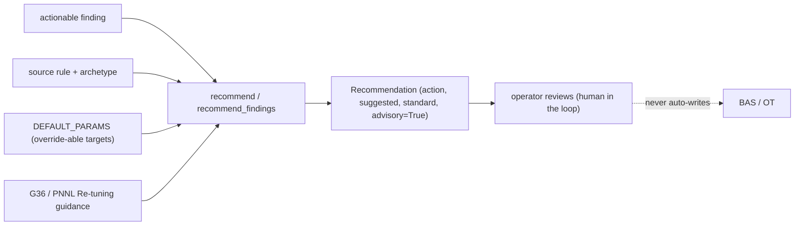

# Advisory system optimization (ASO)

FDD tells you *what's wrong*; `camber.aso` maps an actionable finding to a **suggested corrective
action** — a setpoint or sequence change an operator can review and apply.

**Advisory and read-only by construction.** ASO returns structured recommendations; it never issues
a command to the BAS/OT. Closed-loop write-back stays a roadmap Horizon item — a human stays in the
loop. Each recommendation is *grounded*: it names the source finding + rule and cites the
sequence-of-operations guidance (ASHRAE Guideline 36 / PNNL Re-tuning) behind the correction, and
targets come from documented, override-able defaults (no fabricated site-specific values).


*Advisory only: a grounded `Recommendation` reaches an operator, never a BAS command.*

## Use

```python
from camber.aso import recommend, recommend_findings

recs = recommend_findings(findings, min_severity="warn")  # worst-first, skips ok/info + unmapped
for r in recs:
    print(r.severity, r.equip, r.rule, "→", r.title)
    print("   ", r.action, "| target:", r.suggested, "| cite:", r.standard)
```

`recommend(finding)` returns a single `Recommendation` (or `None` for a non-actionable finding or a
rule with no recommender). A `Recommendation` carries: `title`, `action`, `parameter`, `suggested`
(the target, possibly qualitative), `expected_effect`, `confidence` (high/medium/low), `standard`
(the citation), `caveats`, and `advisory=True` (always). It is JSON-friendly via `as_dict()`.

## Targets & flags

`DEFAULT_PARAMS` holds the tunable targets (H/C changeover deadband, economizer high limit, SAT-reset
schedule, minimum airflow fraction, unoccupied setback, CHW/CW reset, tower approach, …); override
per call with `params=` (shallow-merged). `recommend_findings` flags: `min_severity` (`"warn"` or
`"fault"`), `params`, `frame` (optional role-frame for context).

## Coverage

Recommenders map the main FDD archetypes: simultaneous heat/cool (lockout + deadband), SAT reset,
economizer/OA, reheat minimization (G36), overcooling, unoccupied setback, chiller kW/ton (CW/CHW
reset + staging), loop resets (CHW/HW/pump-ΔP, trim-and-respond), cooling-tower approach, boiler
short-cycle, leaking valve (maintenance), and DCV. Rules without a recommender yield **no**
recommendation rather than a fabricated one.

Pairs with `camber.fault_economics` (what a fault is worth) and `camber.soo` (conformance to the
intended sequence).
