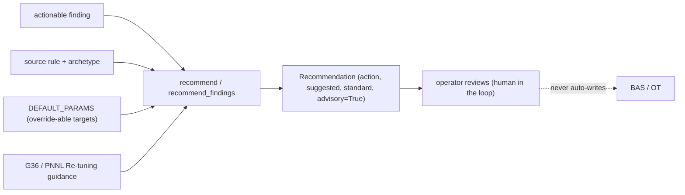

# Advisory system optimization (ASO)

FDD tells you *what's wrong*; `camber.aso` maps an actionable finding to a **suggested corrective
action** — a setpoint or sequence change an operator can review and apply.

**Advisory and read-only by construction.** ASO returns structured recommendations; it never issues
a command to the BAS/OT. Closed-loop write-back stays a roadmap Horizon item — a human stays in the
loop. Each recommendation is *grounded*: it names the source finding + rule and cites the
sequence-of-operations guidance (ASHRAE Guideline 36 / PNNL Re-tuning) behind the correction, and
targets come from documented, override-able defaults (no fabricated site-specific values).


```mermaid
flowchart LR
  finding["actionable finding"] --> recommend["recommend / recommend_findings"]
  rule["source rule + archetype"] --> recommend
  params["DEFAULT_PARAMS (override-able targets)"] --> recommend
  g36["G36 / PNNL Re-tuning guidance"] --> recommend
  recommend --> rec["Recommendation (action, suggested, standard, advisory=True)"]
  rec --> operator["operator reviews (human in the loop)"]
  operator -. "never auto-writes" .-> bas["BAS / OT"]
```
*Advisory only: a grounded `Recommendation` reaches an operator, never a BAS command.*

## Use

```python
from camber.aso import recommend, recommend_findings

recs = recommend_findings(findings, min_severity="warn")  # worst-first, skips ok/info + unmapped
for r in recs:
    print(r.severity, r.equip, r.rule, "→", r.title)
    print("   ", r.action, "| target:", r.suggested, "| cite:", r.standard)
```

`recommend(finding)` returns a single `Recommendation` (or `None` for a non-actionable finding or a
rule with no recommender). A `Recommendation` carries: `title`, `action`, `parameter`, `suggested`
(the target, possibly qualitative), `expected_effect`, `confidence` (high/medium/low), `standard`
(the citation), `caveats`, `references`, `cause` and `advisory=True` (always). It is
JSON-friendly via `as_dict()`. `cause` (0.98, #88) names the finding's cause in a short phrase
("Outdoor-air damper not modulating (stuck low)", "Low chilled-water loop ΔT (40% of running
hours)"), built from the same metrics the advice follows; `title` stays the action. The RCx
report heads each issue with the cause.

## Targets & flags

`DEFAULT_PARAMS` holds the tunable targets (H/C changeover deadband, economizer high limit, SAT-reset
schedule, minimum airflow fraction, unoccupied setback, CHW/CW reset, tower approach, …); override
per call with `params=` (shallow-merged). `recommend_findings` flags: `min_severity` (`"warn"` or
`"fault"`), `params`, `frame` (optional role-frame for context).

## Coverage

Recommenders map the main FDD archetypes: simultaneous heat/cool (lockout + deadband), SAT reset,
economizer/OA, reheat minimization (G36), overcooling, unoccupied setback, chiller kW/ton (CW/CHW
reset + staging), loop resets (CHW/HW/pump-ΔP, trim-and-respond), cooling-tower approach, boiler
short-cycle, leaking valve (maintenance), and DCV. Rules without a recommender yield **no**
recommendation rather than a fabricated one.

Outside-air advice follows the finding's **failure mode**, not just its rule name. An
`outdoor_air_fraction` under-ventilation finding (it records `failure_mode`; older findings are
inferred from their metrics) gets "restore minimum outside air": check the minimum-OA damper
position, actuator and linkage, the min-OA setpoint against design, and the outdoor airflow.
Excess OA and `economizer_high_limit` get lockout advice at the rule's configured high limit, and
`free_cooling_missed` gets "enable economizer free cooling", unless the finding shows the damper
was commanded open and outside air did not arrive (`missed_cause: damper_not_delivering`, 0.98):
then it gets "repair the outdoor-air damper or actuator", a mechanical fix, "stuck low" or
"stuck part open" by the OA fraction delivered while commanded open
(`commanded_open_oaf_median_pct` against `stuck_low_oaf_pct`, default 30 %,
`DEFAULT_PARAMS["econ_stuck_low_oaf_pct"]`).

**Every recommender follows the cause (0.96, #78).** Advice is keyed to the reason a finding
fired, read from its metrics, never only to its rule name:

| Rule | Cause (metric) | Action |
|---|---|---|
| `dcv_verification`, `dcv_system_verification` | DCV works, OA above its floor at low demand (`status: functioning`, `excess_at_low_demand_pct`) | Lower the minimum outdoor air at low demand (to the Ra·Az floor) |
| | OA static / not following demand (`status`) | Enable / repair DCV; tie outdoor air to demand |
| | under-ventilation (`below_floor_pct`, `co2_breach_at_min_pct`, `unventilated_high_co2_hours`) | Restore the OA floor; make OA respond to high CO₂; restore ventilation while occupied |
| `chw_plant_reset` | low loop ΔT (`low_deltaT_pct`; not on a constant-flow plant, `flow_mode`) / CHWST rising with OAT (`chwst_reset_direction: reverse`) / flat CHWST (`chwst_reset_present`) | Fix low loop ΔT / find why the chilled-water supply warms in hot weather / reset the CHW supply temperature |
| `chw_pump_dp_reset`, `hw_pump_dp_reset` | at the VFD minimum / near full with a reset / near full without | Right-size the pump / find the valve driving the reset / reset the DP setpoint |
| `boiler_summer_lockout`, `hw_pump_summer_lockout` (0.103) | running above the lockout (`summer_run_pct`, `lockout_oat_f`); for the pump, with the boiler off (`boiler_off_pct` at least 50 %) | Lock the boiler / the hot-water pump out above the heating lockout; find the override or the call for heat |
| `supply_air_reset` | the setpoint already resets (`sp_behaviour`) / SAT rises with load (`reset_direction`) | Widen the reset range / check cooling capacity |
| `cooling_tower_approach` | wide approach at full fan (`effort_gated`) | Restore tower capacity (fill, distribution, flow) |
| `reheat_minimization_g36` | reheat above the minimum airflow | Implement the dual-maximum heating sequence |
| `overcooling_min_flow`, `overcooling_severity` | at minimum flow / depth below setpoint | Lower min flow or raise SAT (never a higher cooling setpoint) |
| `free_cooling_missed` | damper commanded open, OA not delivered (`missed_cause`) / economizer not commanded | Repair the OA damper or actuator / enable economizer free cooling |

The dispatch thresholds mirror the rules' defaults (`DEFAULT_PARAMS`: `dcv_*`, `chw_low_dt_warn_pct`,
`pump_near_*_warn_pct`); a finding's severity and metrics are never changed. The DCV system rule
reads the cause from the air handler that set its severity (`metrics["per_ahu"]`).

**Learn more.** Each `Recommendation` carries `references`: the ids of the
[PNNL Re-tuning guides](REFERENCES.md) behind it, most specific first (an under-ventilation
`outdoor_air_fraction` finding points at the minimum-OA guide, excess OA at the economizer guide).
Reports turn them into links.

Pairs with `camber.fault_economics` (what a fault is worth) and `camber.soo` (conformance to the
intended sequence).
