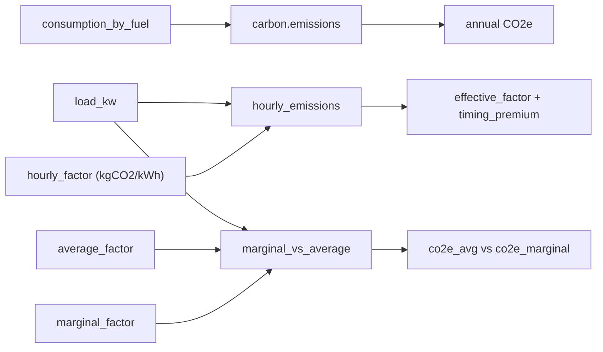

# Carbon accounting

Two layers: annual/average from fuel totals (`camber.carbon`), and **hourly / marginal Scope-2**
from interval electricity (`camber.carbon_hourly`).

*Annual CO2e from fuel totals, plus hourly Scope-2 where a time-varying factor times interval load yields the timing-aware footprint.*



## Annual — `camber.carbon`

`emissions(consumption_by_fuel, factors=…)` → CO₂e from `{fuel: amount}` with per-fuel factors
(kgCO₂e/unit), optionally normalized per ft². The location-based, single-average-factor view.

## Hourly / marginal Scope-2 — `camber.carbon_hourly`

Grid electricity emissions vary hour to hour, so *when* a building uses power changes its real
Scope-2 footprint. Factors are user-supplied (from a grid-signal provider); no hard-coded grid data.

### Emissions against a time-varying factor — `hourly_emissions`

```python
from camber.carbon_hourly import hourly_emissions

e = hourly_emissions(load_kw, hourly_factor)  # factor: kgCO2/kWh, aligned to load
e.co2e_kg, e.effective_factor, e.timing_premium_pct
```

The **effective factor** (`co2e / kWh`) is what the building actually incurred given its timing;
the **timing premium** compares it to the plain time-average factor — positive when the building
runs disproportionately in dirty hours, negative when it favors clean hours. `unit_kg_per_kwh=False`
accepts a g/kWh factor.

### Average vs marginal — `marginal_vs_average`

```python
from camber.carbon_hourly import marginal_vs_average

c = marginal_vs_average(load_kw, average_factor, marginal_factor)
c.co2e_avg_kg, c.co2e_marginal_kg, c.marginal_over_avg
```

Reporting/compliance uses the **average** (location-based) factor; **load-shift value** should use
the **marginal** factor (the emissions of the next kWh — what actually changes when you move load).
Reporting both makes the gap explicit. Pairs with `camber.geb.carbon_aware_shift` /
`operation_score`.
