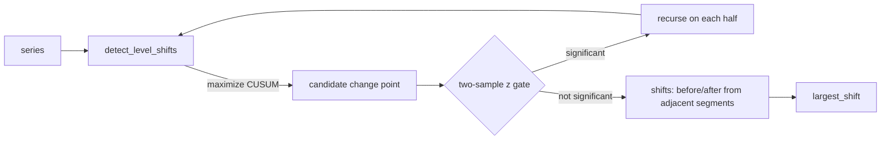

# Operational change-point detection

`camber.changedetect` finds **when** a signal's mean shifts in time — step changes — as opposed to
the change-point *models* (energy vs temperature) in `camber.mandv`. It answers the monitoring-based
commissioning questions without being told the date: did a control change take effect? did a fixed
measure persist or silently regress? did equipment degrade?

*Binary segmentation: find the most likely single change point, gate it on a two-sample statistic, then recurse on each half.*



```python
from camber.changedetect import detect_level_shifts, largest_shift

shifts = detect_level_shifts(series, z=4.0, min_delta=5.0)
for s in shifts:
    print(s.at, s.before_mean, "->", s.after_mean, f"(Δ{s.delta:+.1f}, score {s.score})")
big = largest_shift(series)  # the single most significant shift, or None
```

Transparent binary segmentation: the most likely single change point maximizes the CUSUM of the
mean-centered signal; a standardized two-sample statistic (`z`) gates significance; recurse on each
half. Once all breakpoints are found, each shift's `before`/`after` levels are computed from the
**adjacent** segments (an early shift isn't blurred by a later regime). Flags: `min_segment`,
`max_shifts`, `z`, `min_delta`. Pairs with `camber.rcx.before_after` (which verifies a change across
a *known* date — this finds the dates). numpy/pandas only.
