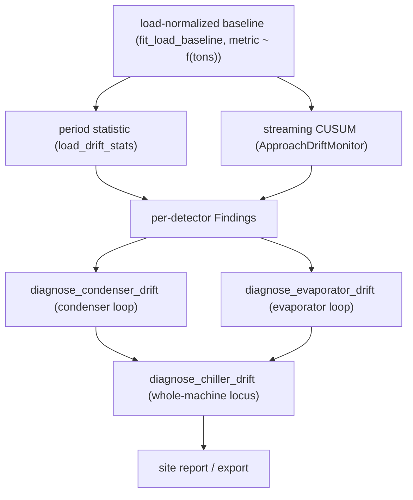
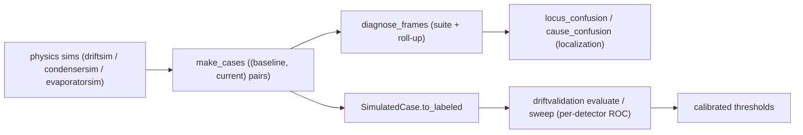

# Chiller drift detection & threshold calibration

Most FDD asks "is this reading bad **right now**?" Drift detection asks a harder, quieter question:
"is this machine **slowly getting worse** than it used to be?" A chiller can pass every instantaneous
check while its condenser fouls, its charge leaks, or its evaporator feed degrades over months. CAMBER
catches that by comparing the machine **to its own frozen past, at matched load**.



*Frozen-baseline fit feeds a period statistic and a streaming CUSUM; per-side roll-ups combine into one whole-machine verdict.*

All of these detectors are **period rules** — run them with
[`Registry.run_periods`](API-STABILITY.md) against a baseline period and a current period. Each
freezes a load-normalized baseline into a [`BaselineStore`](SCALE.md) on first use, so the reference
survives between runs instead of drifting along with the fault.

## The load-normalized baseline

A chiller's approach, subcooling and superheat all move with load, so a raw month-to-month comparison
confuses "ran harder this month" with "degraded this month." Every detector fits
`metric ~ f(tons)` over the baseline period (`camber.chillerbaseline.fit_load_baseline`) and scores
the current period as the **residual against that fit** — the drift at matched load. Two readouts come
off the same frozen baseline:

- a **period statistic** — how far the current period sits above/below the baseline, in °F and in
  baseline sigmas (`camber.chillerbaseline.load_drift_stats`);
- a **sustained-shift alarm** — a streaming tabular CUSUM
  (`camber.chillerdrift.ApproachDriftMonitor`) that fires only when the signal moves **and stays
  moved**, not on a single hot hour.

**Machines of any size.** The load gates were absolute (a 5-ton floor and a 10-ton span to identify
a slope) — 10 % and 20 % of a 50-ton machine — so a 5-ton chiller or a 3-ton heat pump declined
every time. Since 0.82.0 every tons-normalized chiller rule takes `min_tons` / `min_tons_span`, and
by default derives them from the baseline's observed capacity
(`camber.chillerbaseline.size_relative_load_gates`: 10 % / 20 % of the 95th-percentile load, capped
at 5 t / 10 t, so any machine of 50 t or more gets exactly the gates it always had). A machine whose
load does not move enough to identify a slope (fixed capacity, single stage) gets a **flat level**
baseline instead of a decline; it is only scored at the load it was observed at, and the finding
says so.

**Plausibility bands are physical, per metric.** The fit's default band (0–50 °F) suits approach,
not superheat or subcooling: liquid floodback reads ~0 °F superheat and, with transducer error, a
few °F below zero; flash gas does the same to subcooling; a starved evaporator runs superheat past
50 °F. Filtering those out discarded the fault itself (floodback declined; a half-flooded period
scored "ok −0.1 °F"). Superheat now uses −20…150 °F and subcooling −20…80 °F, shared with
`camber.sensorhealth.PHYSICAL_BOUNDS`, which still reject sentinel codes. Refrigerant pressures use
−15…2000 psig (discharge) and −15…1000 psig (suction) — genuinely refrigerant-neutral, covering a
CO₂ (R744) transcritical gas cooler at 1100–1750 psig, which the former 700 / 400 psig ceilings
rejected wholesale.

**A second regressor where physics demands one.** Head pressure is set first by the heat-sink
temperature and suction pressure by the leaving chilled-water temperature — load comes second. So
`fit_load_baseline(..., covariate_col=...)` fits `metric ~ load + covariate` and every score is made
at matched load *and* matched condition (`LoadBaseline.predict(tons, covariate)`; the CUSUM folds
the reading referred to the baseline's reference condition, `LoadBaseline.adjust`). A covariate is
used only when its 5–95 % spread in the baseline is at least 2 °F (four times a plant sensor's
accuracy) and its fitted effect has the physically expected sign; otherwise the rule falls back to
load only and says why.

**The CUSUM accounts for serial correlation.** Its slack and limit are in sigmas of *independent*
samples, but trend residuals wander slowly — lag-1 autocorrelation 0.8–0.9 at 1–5 minute cadence on
real plant data — so one half-hour excursion sampled every minute was counted thirty times. On the
normal days of a real 5-ton chiller that made the sustained alarm fire on 50–90 % of days
(subcooling, 5-min / 1-min data). The fitted baseline now records its residual lag-1
autocorrelation (`LoadBaseline.resid_lag1`, zero unless significant) and the monitor expresses its
parameters in the residual's **long-run** sigma, `σ·√((1+ρ)/(1−ρ))`, carrying ρ to the current
period's cadence as `ρ^(Δt/Δt_baseline)`. Hourly trend data with independent residuals is
unchanged. A CUSUM also has no °F floor, so it will (correctly) flag a *sustained* shift smaller than
the period rule's magnitude floor — e.g. a machine run at loads outside its baseline envelope for a
season. That is a tuning question for the provisional parameters below, not a defect, and they are
left as they are.

## The detector family

| Detector | Signal | Sides | Catches |
|---|---|---|---|
| `ChillerApproachFouling` / `ChillerApproachDrift` | condenser/evaporator approach | one-sided (up) | heat-transfer loss (fouling, air/water flow) |
| `ChillerSubcoolingDrift` | liquid-line subcooling | two-sided | refrigerant **charge** (under/overcharge, non-condensables) |
| `ChillerSuperheatDrift` | suction superheat | two-sided | evaporator **feed** (overfeed/floodback vs. starvation) |
| `ChillerCwRangeDrift` | condenser-water range / ΔT | two-sided | condenser-side hydraulics |
| `CoolingTowerApproachDrift` | tower approach (CW supply − wet-bulb) | one-sided (up) | tower heat rejection (fouled/scaled fill, plugged nozzles, reduced airflow) |
| `ChillerHeadPressureDrift` | discharge / condensing pressure | one-sided (up) | high-side heat rejection (fouling/scale, non-condensables, reduced CW flow), read off the gauge |
| `ChillerSuctionPressureDrift` | suction / evaporating pressure | two-sided | low-side evaporator condition — a fall is heat-transfer loss / low charge / starved feed, a rise is overfeed / flooding |

**The condenser side pairs up.** `ChillerCwRangeDrift` (hydraulics) and `CoolingTowerApproachDrift`
(tower heat rejection) sit on the same condenser water loop as the chiller's condenser approach — a
widening tower approach raises condenser-water temperature, chiller lift, and kW/ton, so it shows up
downstream in the chiller too. The tower approach is one-sided (fouling only widens it) and is scored
against a load-normalized baseline just like the chiller detectors; wet-bulb is taken measured, or
derived from outdoor dry-bulb + RH (Stull) when it isn't a BAS point. Stull's fit assumes sea-level
pressure; pass `elevation_ft` (or a measured `pressure_psia`) to the tower rules and wet-bulb is
solved psychrometrically at site pressure instead (at 1600 m in hot, dry air the sea-level value
reads ~2.6 °F high, understating the approach).

**One condenser-loop verdict.** These four condenser-side signals fail *independently* (a scaling
tube, a throttled valve, a fouled tower, and a rising high-side pressure localize different things) but
corroborate when a problem is system-wide. `camber.condenserdrift.diagnose_condenser_drift(findings)`
reads the individual drift Findings and returns one localized `CondenserDriftDiagnosis` — naming the
cause of each drifting signal (tube fouling/scale · reduced CW flow vs. bypass · tower heat-rejection ·
high-side pressure rising) and flagging **corroboration** when two or more agree. It isolates the
chiller condenser leg from the evaporator leg (the approach rule scores both), and for head pressure it
removes the entering-CW-temperature confound at source when head pressure is regressed on it (a
fouled tower then reads as a tower fault with a healthy chiller high side, not a corroborated pair);
when head pressure had to fall back to load only, it uses the tower signal to disambiguate — a
co-moving CW-temp rise *backed by* a degrading tower corroborates a real heat-rejection fault, while
the same rise with a quiet tower is flagged as likely ambient rather than a high-side fault. Stays screening-grade:
corroboration raises priority and specificity, not the severity tier — the thing that turns a set of
screening alerts into a work order.

**Surfacing the verdict.** The per-loop verdicts flow downstream like the chiller, pump, and AHU
ones: `camber.integrate.export.condenser_diagnoses_to_frame` / `export_condenser_diagnoses` write one
row per loop (severity · corroborated · joined causes · caveat count · fingerprint — note there is
**no locus / loop-wide** column, since the condenser diagnosis carries neither) to CSV/JSON/Parquet,
and `camber.report.condenser_diagnosis_table` renders a worst-first HTML table.
`build_site_report(..., condenser_diagnoses=[...])` splices that table into the owner-facing site
report, alongside the chiller, pump, and AHU verdict tables.

**Head pressure is the high side, read directly.** `ChillerHeadPressureDrift` trends the discharge /
condensing pressure (`Role.DISCHARGE_PRESSURE`, psig) — the same fault modes that widen the condenser
approach (fouling/scale, non-condensables, reduced CW flow) also raise head pressure, but the pressure
is directly instrumented, often earlier, and it is what a mechanic actually gauges. It is **one-sided**
like approach (only a rise is a fault). **Its confound is regressed out, not just flagged:** head
pressure climbs with the heat-sink temperature at least as much as with load, so the baseline is
`pressure ~ load + entering condenser-water temperature` (`Role.CW_SUPPLY_TEMP`, water-cooled) or
`+ outdoor-air temperature` (`Role.OAT`, air-cooled) when either is mapped and varied in the
baseline. On a residential heat pump's lab data that cut the baseline scatter from ~61 psi (load
only) to ~5 psi, and head-pressure recall on the labeled faults from 1 % to 32 % with no false
alarms. Without a usable heat-sink temperature the rule falls back to load only, says so in a
caveat, and reports and caveats a co-moving CW-supply rise as before; a mapped
`Role.SUCTION_PRESSURE` adds the condensing-over-suction *lift* as further context. Absolute head pressure is refrigerant-dependent, so
the **sigma floor carries the weight** (self-scaling against the baseline's own scatter) and the psi
floor is only a coarse backstop.

**Suction pressure is the low side, read directly.** `ChillerSuctionPressureDrift` is the evaporator
twin: it trends the suction / evaporating pressure (`Role.SUCTION_PRESSURE`, psig). At matched load a
*fall* is the evaporator heat-transfer-loss / low-charge / starved-feed signature and a *rise* is
overfeed / flooding, so unlike head pressure it is **two-sided** (both directions are faults, scored on
magnitude with the sign reported), sharing head pressure's psi/σ floors because it is the same raw-gauge
signal class. Its confound is the mirror of head pressure's: suction pressure tracks *chilled-water*
supply temperature, so a chilled-water reset lifts it with no fault. When CHW supply varied in the
baseline the fit is `pressure ~ load + CHW supply` and the reset is accounted for (on a real 5-ton
chiller a reset to 52.7 °F read as a +9σ suction fault under load-only normalization and −0.6σ
with it; false alarms on normal days fell from 33 % to 0 %). With a fixed setpoint in the baseline
the rule falls back to load only and **caveats a co-moving CHW-supply move** as possibly
setpoint-driven.

**Subcooling and superheat are complementary.** Subcooling watches the condenser/liquid side (how much
liquid is standing in the condenser); superheat watches the evaporator/suction side (whether the
evaporator is fed correctly). Both are **two-sided** because both directions are genuine faults —
subcooling falls on undercharge and rises on overcharge; superheat falls on overfeed (liquid-floodback
risk) and rises on starvation. The magnitude is scored symmetrically and the **direction is reported
alongside**, so an equal rise and fall score identically while the sign says which fault it is.

**One evaporator-loop verdict.** Mirroring the condenser side, three evaporator-side signals — the
chiller's **evaporator-approach** leg (heat transfer), **superheat** (feed), and **suction pressure**
(the low-side pressure itself) — combine in `camber.evaporatordrift.diagnose_evaporator_drift(findings)`,
which returns one localized `EvaporatorDriftDiagnosis` naming each cause (tube fouling/scale ·
overfeed-floodback vs. starvation · heat-transfer loss/low-charge vs. overfeed/flooding) and flagging
**corroboration** when two or more agree. It isolates the evaporator leg from the condenser leg (the
approach rule scores both). Because superheat and suction pressure are two reads on the same
feed/charge axis, it **cross-checks** them: both agreeing on overfeed (falling superheat + rising
suction) or on starvation (rising superheat + falling suction) is a strong, specific verdict, while a
disagreement is called ambiguous rather than asserted — the low-side twin of the tower-disambiguates-
head-pressure check on the condenser side. Screening-grade and pure over Findings.

**Surfacing the verdict.** Like the condenser side, the per-loop evaporator verdicts flow downstream:
`camber.integrate.export.evaporator_diagnoses_to_frame` / `export_evaporator_diagnoses` write one row
per loop (severity · corroborated · joined causes · caveat count · fingerprint — **no locus /
loop-wide** column, as the diagnosis carries neither) to CSV/JSON/Parquet, and
`camber.report.evaporator_diagnosis_table` renders a worst-first HTML table.
`build_site_report(..., evaporator_diagnoses=[...])` splices it into the owner-facing site report,
alongside the chiller, condenser, pump, and AHU verdict tables.

**One whole-machine verdict.** `camber.chillerdiag.diagnose_chiller_drift(findings)` rolls both side
diagnoses into a single per-chiller `ChillerDriftDiagnosis` and adds the cross-side reasoning neither
side can do alone: only the condenser side degrading localizes to the condenser loop, only the
evaporator side to the evaporator, but **both sides drifting together** points at a *circuit-wide*
cause (refrigerant charge, non-condensables, a compressor / metering fault) rather than one fouled
heat exchanger. Liquid-line subcooling folds in as the dedicated charge signal — a subcooling drift
alongside both sides moving corroborates a charge / inventory problem. It reports a `locus` (steady ·
condenser · evaporator · charge · whole-machine) and a `machine_wide` flag, so a screening pass can
separate "one exchanger needs a walkdown" from "gauge the whole machine". Screening-grade; re-uses the
side diagnoses unchanged.

### Instrumentation gating

Subcooling and superheat are **controller-reported differences**, and discharge/suction pressure are
**raw pressures** — CAMBER models no refrigerant saturation curve, so none of them can be derived from a
plain temperature and each must be mapped directly (`Role.SUBCOOLING_TEMP`, `Role.SUPERHEAT_TEMP`,
`Role.DISCHARGE_PRESSURE`). Many chillers do not publish a given point, so the rule that depends on it
**declines with a caveat** when it is absent — a chiller missing from a charge/feed/high-side report must
never read as a healthy one.

## Thresholds are honest about what they are

Every finding is labelled with two threshold classes (`camber.driftthresholds`), because they are not
provisional in the same way:

- **Magnitude floors** (`warn_f`, `fault_sigma`, …) are **screening-grade**: characterized for the
  signal class and good enough to **rank a walkdown**, but not established on your specific machines.
- **Temporal / CUSUM parameters** are **provisional-untuned**: textbook starting points whose
  false-alarm rate and detection delay have never been measured on real chiller trends.

Read a sustained alarm as "worth looking at now," never as a dispatch-grade verdict — until you
calibrate.

## Running the family

From a config, no Python needed — add a `drift` section naming this family (`"family": "chiller"`) and run
`camber drift freeze` once to establish the references, then `camber drift run` to score. `camber
run` folds the verdicts into the ordinary audit report. Only `freeze` (and the attributed
`accept_new_normal`) ever writes a baseline; scoring is read-only. See
**[CLI.md](CLI.md#drift-baselines)**.

```sh
camber drift freeze config.json      # establish the references (refuses to overwrite)
camber drift run    config.json      # score current vs baseline, worst-first
camber drift accept config.json --equip <EQ> --by <NAME> --reason "<what changed>"
```

## Calibrating the thresholds

Every threshold above is a **constructor argument**, so tuning is a config change, not a code change.
When you have chiller periods with **confirmed, dated fault events**, `camber.driftvalidation` turns
that evidence into a calibrated operating point.

**No labelled data yet? Characterize on physics.** `camber.driftsim` generates physically consistent
`(baseline, current)` frame pairs for a healthy chiller and for the standard fault families (condenser
fouling, reduced CW/evaporator flow, tower degradation, under/overcharge, non-condensables, excess
oil), imposing each fault's known signature at a graded severity. It runs the whole suite + roll-up
end-to-end (`diagnose_frames`) and scores localization (`locus_confusion`) — on clear faults the
roll-up lands on the right `locus` at ~100% with no false alarms on healthy periods, and its
`SimulatedCase.to_labeled(relevant=…)` feeds the same `evaluate`/`sweep` per-detector ROC below. This
turns *screening-grade* thresholds into *characterized* ones; real-data tuning still refines them.



*Without labelled data, physics sims characterize localization and per-detector ROC; real fault periods then calibrate.*

```python
from camber.driftsim import make_cases, locus_confusion

lc = locus_confusion(make_cases(), min_severity=3)  # localization on the clear faults
print(lc.accuracy, lc.as_dict()["matrix"])
```

**The condenser heat-rejection family has its own physics validator.** Because
`diagnose_condenser_drift` produces a *cause + corroboration* verdict (not a `locus`),
`camber.condensersim` characterizes it with a `CauseConfusion` instead: it models the coupled loop —
condensing temperature `TCOND = CWS + condenser approach`, entering water `CWS = wet-bulb + tower
approach` — so co-movement is emergent (tube scaling widens the condenser approach **and** lifts head
pressure; a fouling tower lifts `CWS` **and** head pressure), and it includes the negative confound
`ambient_cw_rise` — a CW/head rise with a **quiet tower** that the head-pressure confound must demote
to likely-ambient rather than flag. On clear faults it names the right cause and sets the right
corroboration flag at ~100% with no false alarms, and `SimulatedCase.to_labeled(relevant=…)` feeds
the same per-detector ROC.

```python
from camber.condensersim import make_cases, cause_confusion

cc = cause_confusion(
    make_cases(), min_severity=3
)  # cause detection + corroboration on clear faults
print(cc.accuracy, cc.corroboration_accuracy, cc.as_dict()["matrix"])
```

**The evaporator side has the same physics validator.** `camber.evaporatorsim` characterizes
`diagnose_evaporator_drift` (also cause + corroboration, no `locus`) with a `CauseConfusion` too. It
models the low side through **one shared feed latent**: an overfeed lowers superheat **and** raises
suction pressure together, a starvation raises superheat **and** lowers suction — so the two feed
reads co-move and the diagnosis's superheat-vs-suction cross-check fires for real. Evaporator fouling
widens the approach alone. It includes the negative confound `chw_reset` — a chilled-water-supply
shift that lifts suction through the evaporating-temperature chain while superheat stays quiet, which
the cross-check correctly does **not** corroborate. On clear faults it names the right cause and sets
the right corroboration flag at ~100% with no false alarms.

```python
from camber.evaporatorsim import make_cases, cause_confusion

cc = cause_confusion(make_cases(), min_severity=3)
print(cc.accuracy, cc.corroboration_accuracy, cc.as_dict()["matrix"])
```

```python
from camber.driftvalidation import LabeledCase, evaluate, sweep
from camber.rules.chiller_superheat_rule import ChillerSuperheatDrift
from camber.store.modelstore import BaselineStore

# Label each (baseline, current) period pair faulty or healthy.
cases = [
    LabeledCase("CH_1", baseline_df, current_df, fault=True),
    LabeledCase("CH_2", baseline_df2, current_df2, fault=False),
    # ...
]


# A fresh detector per case (so no case leaks its frozen baseline into another).
def build(**params):
    return ChillerSuperheatDrift(BaselineStore(), site="plant", run_id="cal", **params)


# Score the shipped defaults:
score = evaluate(lambda: build(), cases)
print(score.as_dict())  # precision / recall / f1 + confusion counts

# Search a grid for the best operating point:
best = sweep(
    build,
    cases,
    {"fault_f": [3.0, 4.0, 5.0], "fault_sigma": [6.0, 8.0]},
    objective="f1",  # or "recall" / "precision" / "accuracy" / "youden"
)
print(best.best_params)  # feed these straight back into the rule's constructor
```

`sweep` scores every combination in the grid and returns the parameters that maximize the objective,
breaking ties toward **fewer false positives** (the quieter operating point wins). The harness is built
on CAMBER's FDD confusion matrix (`camber.eval.confusion`), so its precision/recall are the same
metrics the rest of the validation suite uses.

The shipped defaults stay screening-grade until you replace them with calibrated values — the harness
is the tool for doing that against real data, not a change to the defaults themselves.
