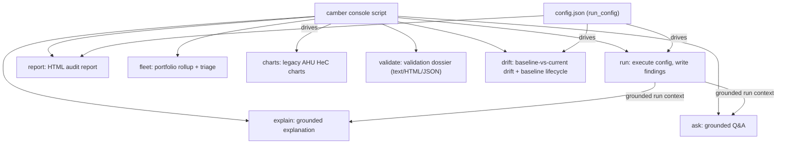

# Command-line interface

The `camber` console script (installed with the package; also `python -m camber.cli`) exposes the
analysis pipeline and the grounded agent as subcommands.

```
camber run     <config.json> [--out DIR]        # run a config, print/write findings
camber report  <config.json> --out site.html    # run + write an HTML audit report
camber explain <config.json> [--llm-cmd CMD]    # grounded plain-language explanation of findings
camber ask "<question>" --config <config.json>  # grounded natural-language Q&A over the run
camber fleet   '<glob>' [--ask Q] [--out f.html] # portfolio rollup across configs + triage
camber charts  (--csv F | --demo reheat) [--ahu N] [--out DIR]   # legacy AHU HeC charts
camber validate [--html d.html] [--json d.json] [--full]         # validation credibility dossier
camber serve   <store> [--host H] [--port P]                     # read-only API + live /ui dashboard
camber drift   run|report|freeze|list|accept <config.json>       # baseline-vs-current drift
```

`camber serve` starts the stdlib read-only HTTP API and the **live web dashboard** at
`http://127.0.0.1:8080/ui` (facility/equip/role selectors + a synchronized multitrend, brush-linked
and polling). Read-only (GET-only), localhost-bound by default; see
[VISUALIZATION.md](VISUALIZATION.md) and [SECURITY.md](SECURITY.md).

A **config** is the same declarative JSON that drives `camber.config.run_config` (source, mapping,
equipment, rules — see the config examples). `run`/`report` execute it; `explain`/`ask` build the
grounded [agent](AGENT.md) context from the run and answer over it.

*Command map: a shared config drives `run`/`report`; the run context grounds `explain`/`ask`.*



A `rules` entry is either a bare name or a `{"name", "params"}` object that overrides that rule's
constructor for the run — e.g. a high-outside-air building setting its design minimum:

```json
"rules": ["simultaneous_heat_cool",
          {"name": "economizer_high_limit", "params": {"high_limit_f": 75, "min_damper": 0.45}}]
```

## Grounded agent from the shell

`explain` and `ask` are useful with **no LLM** — they fall back to the deterministic template answer,
fully grounded with `[id]` citations. To wire a model, pass `--llm-cmd` a shell command that reads the
**prompt on stdin** and writes the **completion on stdout**:

```bash
camber ask "which zones are uncomfortable and why?" --config site.json \
  --llm-cmd 'my-llm-cli --model whatever'
```

This is deliberately **vendor-neutral**: CAMBER names and imports no provider. The subprocess wrapper
lives in the CLI, not in `camber.agent`, so the agent package stays free of I/O (enforced by
`tests/test_agent_readonly_guard.py`). Every answer is verified against the fact whitelist; ungrounded
claims are repaired (or the answer falls back to the template).

## Portfolio triage

`camber fleet 'sites/*/config.json' --ask "which building wastes the most?"` runs each config, builds a
[fleet rollup](SITE-REPORT.md), and answers the question grounded in per-building facts (EUI, fault
counts, recoverable $/yr). Add `--out fleet.html` for the rollup report.

## Drift & baselines

The [drift detectors](CHILLER-DRIFT.md) compare a **current** window against a **frozen baseline**
one, so they need two things an ordinary run does not: explicit windows, and a durable place to keep
the reference. Both live in a `drift` section of the same config:

```json
"drift": {
  "store":    "baselines.json",
  "baseline": ["2025-03-01", "2025-05-31"],
  "current":  ["2026-06-01", "2026-08-31"],
  "families": [
    {"class": "AHU",  "family": "ahu", "coils": ["cooling", "heating"]},
    {"class": "CH",   "family": "chiller", "sustained_alarm": true},
    {"class": "CHWP", "family": "pump", "plant": "CHW plant"},
    {"class": "VAV",  "family": "vav", "baseline": ["2025-04-01", "2025-05-31"]}
  ]
}
```

`family` is one of `ahu · chiller · condenser · evaporator · pump · vav`; each `class` must appear in
the config's `equipment` list. `coils` (AHU) adds one coil-valve detector per coil; `plant` (pump)
adds the cross-pump roll-up; `sustained_alarm` (chiller) appends the opt-in CUSUM alarm rule. A
family may override `baseline` / `current` — a chiller re-commissioned later has its own reference
window. Any `trust_gate`, `shared_oat` and `resample` settings apply unchanged.

With that section present, `camber run` scores drift alongside the ordinary rules and folds the
verdicts into the audit report. The `drift` subcommands drive it directly:

```sh
camber drift freeze config.json          # establish the references (the only create path)
camber drift list   config.json          # what is frozen, and on whose say-so
camber drift run    config.json --out d/ # score current vs baseline; writes drift.json + findings.json
camber drift report config.json --out drift.html
```

When a fix lands, the reference *should* move — on someone's say-so:

```sh
camber drift accept config.json --equip AHU_1 --by "A. Engineer" --reason "filter replaced"
```


### The write policy is a verb, not a setting

A run that mints the baseline it scores against is circular: whatever the equipment is doing now
becomes, by construction, normal. So **only `freeze` creates a reference**, and it refuses to
overwrite one that already exists (`--dry-run` shows what it would do). `run` and `report` open the
store read-only and leave the file byte-identical.

**`accept` moves.** `--by` and `--reason` are required at the argparse level, so the command exits
before any code runs without them (`BaselineStore.accept_new_normal` re-rejects an empty one as the
backstop), and `--equip` is explicit and repeatable — there is no blanket "accept everything".
`--kind` narrows further; `--period START END` picks the window to re-fit over, defaulting to
`drift.current`, because accepting a new normal means *what it is doing now is the reference*.
`--dry-run` shows the moves without writing. The superseded record is kept in `history`, so what was
normal, when, and on whose authority stays answerable.

The re-fit is not a second copy of the fitting logic: `camber.driftrun.refit_baselines` runs the
family against a **scratch in-memory store** and harvests what it froze, so each model comes from its
own detector — same metric and load columns, same minimum-load filter and plausibility bounds — and
cannot drift away from the rule it will be compared against. A detector that cannot fit over the
window is reported (`could not refit … — leaving it frozen`) rather than skipped silently.

There is deliberately no `--reason` on `freeze`: the initial reason string lives inside each
detector, so the flag would not be honoured.

### Untested is not steady

Two things can leave an equipment unscored — no detector's required roles resolved, or every
detector *declined* (nothing frozen yet, an untrusted input, an empty window). Both would roll up to
`severity=ok, locus=steady`, which asserts a negative nobody tested. Neither is diagnosed: the
equipment is listed under **Equipment not evaluated** with the reason, in the terminal, in
`drift.json`, and in the HTML.

### Severities are screening-grade

Every drift command prints, and every drift page renders, the two-class threshold-confidence note:
magnitude floors are *screening-grade* (characterized for the signal class, not established on your
machines) and the CUSUM timing parameters are *provisional-untuned*. There is no flag to suppress
it. Read a drift finding as "worth a walkdown", not as a dispatch-grade verdict — see
[CHILLER-DRIFT.md](CHILLER-DRIFT.md#calibrating-the-thresholds) for how to calibrate.


## Backward compatibility

Before 0.5 the CLI took `--csv`/`--demo` at the top level; those AHU heating-vs-cooling charts now live
under **`camber charts`** (e.g. `camber charts --demo reheat --ahu 1 --out out/`).
