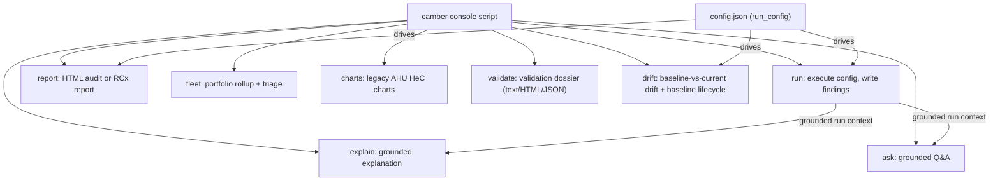

# Command-line interface

The `camber` console script (installed with the package; also `python -m camber.cli`) exposes the
analysis pipeline and the grounded agent as subcommands.

```
camber run     <config.json> [--out DIR]        # run a config, print/write findings
camber report  <config.json> --out site.html    # run + write an HTML audit report
               [--layout audit|rcx|<plugin>]    # rcx: the printable retro-commissioning layout
camber explain <config.json> [--llm-cmd CMD]    # grounded plain-language explanation of findings
camber ask "<question>" --config <config.json>  # grounded natural-language Q&A over the run
camber fleet   '<glob>' [--ask Q] [--out f.html] # portfolio rollup across configs + triage
camber charts  (--csv F | --demo reheat) [--ahu N] [--out DIR]   # legacy AHU HeC charts
camber validate [--html d.html] [--json d.json] [--full]         # validation credibility dossier
camber serve   <store> [--host H] [--port P]                     # read-only API + live /ui dashboard
camber drift   run|report|freeze|list|accept <config.json>       # baseline-vs-current drift
camber datasets list|info|fetch|ingest|status|remove|config|score # open dataset catalog
camber portfolio init|adopt|status|audit|migrate                  # portfolio workspace
camber facility add|list|show|rename|activate|suspend|resume      # facility lifecycle
```

`camber serve` starts the stdlib read-only HTTP API and the **live web dashboard** at
`http://127.0.0.1:8080/ui` (facility/equip/role selectors + a synchronized multitrend, brush-linked
and polling). Read-only (GET-only), localhost-bound by default; see
[VISUALIZATION.md](VISUALIZATION.md) and [SECURITY.md](SECURITY.md).

A **config** is the same declarative JSON that drives `camber.config.run_config` (source, mapping,
equipment, rules — see the config examples). `run`/`report` execute it; `explain`/`ask` build the
grounded [agent](AGENT.md) context from the run and answer over it.

*Command map: a shared config drives `run`/`report`; the run context grounds `explain`/`ask`.*


```mermaid
flowchart TD
  camber["camber console script"]
  cfg["config.json (run_config)"]
  camber --> run["run: execute config, write findings"]
  camber --> report["report: HTML audit or RCx report"]
  camber --> explain["explain: grounded explanation"]
  camber --> ask["ask: grounded Q&A"]
  camber --> fleet["fleet: portfolio rollup + triage"]
  camber --> charts["charts: legacy AHU HeC charts"]
  camber --> validate["validate: validation dossier (text/HTML/JSON)"]
  camber --> drift["drift: baseline-vs-current drift + baseline lifecycle"]
  cfg -- "drives" --> run
  cfg -- "drives" --> report
  cfg -- "drives" --> drift
  run -- "grounded run context" --> explain
  run -- "grounded run context" --> ask
```

A `rules` entry is either a bare name or a `{"name", "params"}` object that overrides that rule's
constructor for the run — e.g. a high-outside-air building setting its design minimum:

```json
"rules": ["simultaneous_heat_cool",
          {"name": "economizer_high_limit", "params": {"high_limit_f": 75, "min_damper": 0.45}}]
```

## Report layouts

`camber report` writes the Std-211 **audit** report by default. `--layout rcx` writes the printable
[RCx report](RCX-REPORT.md) instead. Without the flag, the config's `report.layout` decides, and
any other name is looked up in the `camber.reports` [plugin](PLUGINS.md) group.

```
camber report site.json --out rcx.html --layout rcx
    [--week auto|evidence|oat-range|typical|YYYY-MM-DD]   # the representative week
    [--notes notes.json] [--notes-template slots.json]    # engineer notes in, empty slots out
    [--paper letter|a4] [--lifecycle]                     # page size; fault-store notes too
```

The rcx options also live in the config, under `"report": {"layout": "rcx", "rcx": {...}}`:
`top_n`, `week`, `paper`, `chart_format`, `sections`, `price`, `loads`, `occupancy`,
`oat_reference`, `sequence` and `notes`. A flag overrides the config value. `report.loads` sizes
equipment for the cost estimators. An unknown layout exits with code `2` and lists the known ones.

## Grounded agent from the shell

`explain` and `ask` are useful with **no LLM** — they fall back to the deterministic template answer,
fully grounded with `[id]` citations. To wire a model, pass `--llm-cmd` a shell command that reads the
**prompt on stdin** and writes the **completion on stdout**:

```bash
camber ask "which zones are uncomfortable and why?" --config site.json \
  --llm-cmd 'my-llm-cli --model whatever'
```

This is deliberately **vendor-neutral**: CAMBER names and imports no provider. The subprocess wrapper
lives in the CLI, not in `camber.agent`, so the agent package stays free of I/O (enforced by
`tests/test_agent_readonly_guard.py`). Every answer is verified against the fact whitelist; ungrounded
claims are repaired (or the answer falls back to the template).

## Portfolio triage

`camber fleet 'sites/*/config.json' --ask "which building wastes the most?"` runs each config, builds a
[fleet rollup](SITE-REPORT.md), and answers the question grounded in per-building facts (EUI, fault
counts, recoverable $/yr). Add `--out fleet.html` for the rollup report.

## Drift & baselines

The [drift detectors](CHILLER-DRIFT.md) compare a **current** window against a **frozen baseline**
one, so they need two things an ordinary run does not: explicit windows, and a durable place to keep
the reference. Both live in a `drift` section of the same config:

```json
"drift": {
  "store":    "baselines.json",
  "baseline": ["2025-03-01", "2025-05-31"],
  "current":  ["2026-06-01", "2026-08-31"],
  "families": [
    {"class": "AHU",  "family": "ahu", "coils": ["cooling", "heating"]},
    {"class": "CH",   "family": "chiller", "sustained_alarm": true},
    {"class": "CHWP", "family": "pump", "plant": "CHW plant"},
    {"class": "VAV",  "family": "vav", "baseline": ["2025-04-01", "2025-05-31"]}
  ]
}
```

`family` is one of `ahu · chiller · condenser · evaporator · pump · vav`; each `class` must appear in
the config's `equipment` list. `coils` (AHU) adds one coil-valve detector per coil; `plant` (pump)
adds the cross-pump roll-up; `sustained_alarm` (chiller) appends the opt-in CUSUM alarm rule. A
family may override `baseline` / `current` — a chiller re-commissioned later has its own reference
window. Any `trust_gate`, `shared_oat` and `resample` settings apply unchanged.

With that section present, `camber run` scores drift alongside the ordinary rules and folds the
verdicts into the audit report. The `drift` subcommands drive it directly:

```sh
camber drift freeze config.json          # establish the references (the only create path;
                                         #   add --reason R inside a portfolio workspace)
camber drift list   config.json          # what is frozen, and on whose say-so
camber drift run    config.json --out d/ # score current vs baseline; writes drift.json + findings.json
camber drift report config.json --out drift.html
camber drift report config.json --out drift.html --charts   # + each finding's evidence chart
```

When a fix lands, the reference *should* move — on someone's say-so:

```sh
camber drift accept config.json --equip AHU_1 --by "A. Engineer" --reason "filter replaced"
```


### The write policy is a verb, not a setting

A run that mints the baseline it scores against is circular: whatever the equipment is doing now
becomes, by construction, normal. So **only `freeze` creates a reference**, and it refuses to
overwrite one that already exists (`--dry-run` shows what it would do). `run` and `report` open the
store read-only and leave the file byte-identical.

**`accept` moves.** `--by` and `--reason` are required at the argparse level, so the command exits
before any code runs without them (`BaselineStore.accept_new_normal` re-rejects an empty one as the
backstop), and `--equip` is explicit and repeatable — there is no blanket "accept everything".
`--kind` narrows further; `--period START END` picks the window to re-fit over, defaulting to
`drift.current`, because accepting a new normal means *what it is doing now is the reference*.
`--dry-run` shows the moves without writing. The superseded record is kept in `history`, so what was
normal, when, and on whose authority stays answerable.

The re-fit is not a second copy of the fitting logic: `camber.driftrun.refit_baselines` runs the
family against a **scratch in-memory store** and harvests what it froze, so each model comes from its
own detector — same metric and load columns, same minimum-load filter and plausibility bounds — and
cannot drift away from the rule it will be compared against. A detector that cannot fit over the
window is reported (`could not refit … — leaving it frozen`) rather than skipped silently.

There is deliberately no `--reason` on `freeze`: the initial reason string lives inside each
detector, so the flag would not be honoured.

### Untested is not steady

Two things can leave an equipment unscored — no detector's required roles resolved, or every
detector *declined* (nothing frozen yet, an untrusted input, an empty window). Both would roll up to
`severity=ok, locus=steady`, which asserts a negative nobody tested. Neither is diagnosed: the
equipment is listed under **Equipment not evaluated** with the reason, in the terminal, in
`drift.json`, and in the HTML.

### Every finding shows its own evidence

`--charts` embeds, per finding, the **current period scattered on that detector's frozen baseline
band** — the comparison the rule actually made, rather than a trend of the raw points, which would
show the levels and hide the movement. A loading filter reads as ~100% of the period outside the
band while a healthy unit sits near the ~5% you'd expect outside ±2σ, so the chart separates the two
cases rather than decorating the verdict.

Equipment with nothing frozen gets **no chart** rather than a scatter with no line to judge it by,
and the plain page (without `--charts`) stays pure text and tables with no matplotlib import.

### Severities are screening-grade

Every drift command prints, and every drift page renders, the two-class threshold-confidence note:
magnitude floors are *screening-grade* (characterized for the signal class, not established on your
machines) and the CUSUM timing parameters are *provisional-untuned*. There is no flag to suppress
it. Read a drift finding as "worth a walkdown", not as a dispatch-grade verdict — see
[CHILLER-DRIFT.md](CHILLER-DRIFT.md#calibrating-the-thresholds) for how to calibrate.


## Open datasets

`camber datasets` fetches open building datasets from their publishers, verifies them, ingests
them into a Parquet store and writes a ready-to-run config (see [DATASETS.md](DATASETS.md)):

```
camber datasets list [--licence commercial|all] [--kind simulated|real|lab] [--labeled] [--json]
camber datasets info  <id> [--json]                  # summary, licence, citation, subsets, data issues
camber datasets fetch <id>... | --all [--subset S] [--dir D] [--licence all] [--accept-noncommercial]
camber datasets ingest <id>... | --all --store DIR [--subset S] [--force] [--no-corrections]
                        [--from-dir DIR] [--accept-noncommercial]
camber datasets status [--dir D] [--store DIR] [--json]
camber datasets remove <id> [--dir D] [--store DIR --purge-store]
camber datasets config <id> --store DIR [--out cfg.json] [--facility ID]
camber datasets score  <id> --store DIR [--findings findings.json] [--json]
```

`list` shows each entry's licence **tier** (`open` / `research-only`) and marks manual downloads.
`fetch --all` takes the open tier only; research-only (NC/ND) datasets also need `--licence all`
**and** `--accept-noncommercial` (`--all --licence all` without it is refused before anything
downloads). A named research-only id needs `--accept-noncommercial` on every fetch; each acceptance
is recorded in `acknowledgements.json`. There is no environment-variable bypass. `ingest` of
research-only data needs that recorded acknowledgement (or its own `--accept-noncommercial`).
A **manual** entry (files you download yourself, e.g. from a portal with terms) is never fetched:
`fetch <id>` exits 1 with the instructions and `fetch --all` skips it; download the files, then
`ingest <id> --from-dir DIR --store STORE`, which verifies every pinned file (size + SHA-256)
before using it -- `--from-dir` works for any entry whose files you already have. An entry with
Excel workbooks needs the `xlsx` extra (`pip install "camber-toolkit[xlsx]"`); without it `ingest`
exits 1 and says so. `ingest --no-corrections` skips the catalog's fixes for problems in
the published data (`info <id>` lists them) and ingests it exactly as published -- use a second
store to compare the two; `ingest` warns when the store's disk is smaller than the subset's
estimated size. Exit codes: `2` checksum mismatch (a download is kept as `.bad`; a
`--from-dir` file is left untouched), `3` licence gate, `4` not enough disk, `1` any other error
(including a manual entry named to `fetch`, or a missing extra). A typical session:

```
camber datasets fetch lbnl-sdahu
camber datasets ingest lbnl-sdahu --store lab_store
camber datasets config lbnl-sdahu --store lab_store --out sdahu.json
camber report sdahu.json --out sdahu.html        # carries the dataset's citation + licence
camber report sdahu.json --out rcx.html --layout rcx   # the printable RCx layout
camber datasets score lbnl-sdahu --store lab_store
```

The config it writes uses a **store source** -- `"source": {"kind": "store", "store": "...",
"facility_id": "ds-lbnl-sdahu"}` -- which works for any Parquet store, not only catalog data:
equipment is discovered by the class recorded at ingest (`{"class": "AHU", "marker_role":
"mixed_air_temp"}`), no mapping is needed (the store already holds roles), and `shared_oat` may name
a stored equipment (`{"equip": "weather", "role": "oat"}`). Any `equipment` entry may add
`"equip": [names]` to keep only those equipment, for example one scenario of a dataset. An `mv` section fits a daily
change-point M&V baseline per meter (`{"class": "CHILLEDWATER_METER", "role": "energy_rate",
"period": [start, end]}`), reported as an `mv_baseline` finding with its fit statistics and OAT
support (`oat_fit_min`/`oat_fit_max`, `oat_support_lo`/`oat_support_hi`). Add
`"reporting_period": [start, end]` for an `mv_savings` finding per meter (avoided energy, `fsu`,
coverage); a reporting period outside the baseline's conditions is declined rather than reported,
and `"extrapolation": {...}` tunes that policy (see
[MANDV.md](MANDV.md#extrapolation-coverage-caveats-and-declining)). An `"adjustments": [...]`
ledger restates the saving for non-routine events and static factors, guarded by `ecm_dates`
(see [MANDV.md](MANDV.md#non-routine-and-static-factor-adjustments)).

## Portfolio and facility lifecycle

`camber portfolio` manages a **workspace**: one directory holding a portfolio's store, retention
policy, append-only audit log and single-writer lock. `camber facility` moves facilities through
their lifecycle (see [PORTFOLIO.md](PORTFOLIO.md)):

```
camber portfolio init <root>                           # create a workspace (idempotent)
camber portfolio adopt <store> [root] --reason R       # wrap an existing store; moves nothing
camber portfolio status [--json]                       # counts by state, holds, lock, policy
camber portfolio audit [--facility ID] [--json]        # who did what, when, and why
camber portfolio migrate [FILE...] [--config CFG]... [--map "SITE=ID"]... [--json]   # dry run
camber portfolio migrate ... --apply --reason R        # re-key site-keyed state to facility_id

camber facility add <name> [--id ID] [--owner O] [--tag T]... [--activate] --reason R
camber facility list [--state S] [--json]
camber facility show <id> [--json]                     # record, retention, state manifest, audit
camber facility rename <id> "<new display name>" --reason R
camber facility activate|suspend|resume <id> --reason R
```

Every command except `init` and `adopt` takes `--workspace PATH`, else `$CAMBER_PORTFOLIO`, else
the current directory. Every change requires `--reason`, which is audited with the OS user and
host. A change takes the workspace lock without waiting. A second concurrent change is refused
with `portfolio is locked by <pid>@<host> since <ts>` (exit code 1).

`add` creates a facility as `provisioning` unless `--activate` is given. Its id defaults to one
derived from the name. Ids are never reused: a removed id is tombstoned. `offboard`, `restore`,
`archive` and `purge` are defined but answer "available in a later release" (exit code 2).

Analyses skip facilities that are not active. A store-backed `camber run` on a suspended facility
warns and finds no equipment unless the config source sets `"include_inactive": true`.

`migrate` moves fault and baseline files written before 0.86, which were keyed by the free-text
site name, into `state/<facility_id>/`. It is a dry run unless `--apply` is given. It maps each
site label to a facility through the registry (name, display name, earlier display names). It
refuses ambiguous labels, unknown labels and labels of tombstoned facilities, with exit code 1 and
nothing written, until you resolve them with `--map`. Each legacy file is replaced with a redirect
stub, so configs that name it keep working. Re-running is a no-op. See
[PORTFOLIO.md](PORTFOLIO.md#migrating-site-keyed-state).

**Runs inside a workspace.** A config whose store source belongs to a workspace, or a folder
config with `"workspace": "<root>"` (and ideally a `"facility_id"`), keys its drift baselines and
its optional `faults` history by the facility id. Both default to `state/<facility_id>/` when the
config names no path, and every file the run writes is listed in the facility's manifest. `camber
drift freeze` then needs `--reason`, and `freeze` / `accept` take the lock and are audited.
Renaming the facility changes none of it. See
[PORTFOLIO.md](PORTFOLIO.md#per-facility-state).

## Backward compatibility

Before 0.5 the CLI took `--csv`/`--demo` at the top level; those AHU heating-vs-cooling charts now live
under **`camber charts`** (e.g. `camber charts --demo reheat --ahu 1 --out out/`).
