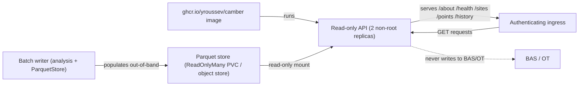

# Deployment

Reference deployment artifacts for running the CAMBER **read-only** API over a Parquet store.
These are starting points, not turnkey infra, and nothing here publishes anything.

The API serves GET only (`/about` `/health` `/sites` `/points` `/history`) and never writes to the
BAS/OT. Keep it behind the cluster boundary or an authenticating ingress — see
[SECURITY.md](SECURITY.md).

*Runtime topology: a separate writer populates the store out-of-band; the API pods only read.*



## Docker / Compose

The primary path. See [../DOCKER.md](https://github.com/yroussev/camber/blob/main/DOCKER.md): `docker compose up api` serves the API over
`./data/store`; the multi-arch image is at `ghcr.io/yroussev/camber`.

## Kubernetes

[`deploy/k8s/camber-api.yaml`](https://github.com/yroussev/camber/blob/main/deploy/k8s/camber-api.yaml) — a namespace, a read-only PVC for the
store, a 2-replica non-root Deployment (readiness/liveness on `/health`, resource limits, read-only
root FS), and a `ClusterIP` Service.

```sh
kubectl apply -f deploy/k8s/camber-api.yaml
# populate the PVC out-of-band (the API only reads); front the Service with an auth ingress.
```

The store is a `ReadOnlyMany` PVC: a separate writer (a batch job running the analysis + `ParquetStore`)
populates it; the API pods mount it read-only.

## conda-forge

CAMBER is on conda-forge: `conda install -c conda-forge camber-toolkit`. The package is built by
[`conda-forge/camber-toolkit-feedstock`](https://github.com/conda-forge/camber-toolkit-feedstock),
live since 2026-09-24, and **its `recipe/recipe.yaml` is the source of truth**.
[`deploy/conda/recipe.yaml`](https://github.com/yroussev/camber/blob/main/deploy/conda/recipe.yaml)
is a mirror of it.

The recipe is in the **v1 `recipe.yaml`** format (rattler-build; conda-forge deprecated the v0
`meta.yaml`): `noarch: python`, the runtime deps (`matplotlib-base` is the conda-forge name), the
`camber` entry point, `license_file: [LICENSE, NOTICE]`, and a `tests` block that imports the
package, `pip check`s the deps, and runs `camber --help` against both the minimum and latest Python.
It deliberately omits `run_constrained` (several optional extras aren't packaged on conda-forge, which
would fail lint).

**On each release**, `regro-cf-autotick-bot` opens a version-bump PR on the feedstock a few hours
after the PyPI upload. It bumps only the version and the sdist `sha256`; it does **not** notice a
changed dependency. Before merging, compare the recipe's `requirements.run` with `pyproject.toml`'s
`dependencies` (and `requires-python`) and push a fix to the bot's branch if they differ. Then copy
the version and hash into the mirror:

```bash
curl -sL https://pypi.org/pypi/camber-toolkit/<version>/json \
  | jq -r '.urls[] | select(.packagetype=="sdist") | .digests.sha256'
```

Stacked releases land as one PR for the newest version; an intermediate version is simply not
built on conda-forge, which is normal. Validate a recipe change locally with
`conda-smithy lint recipes/camber-toolkit` and `rattler-build build --recipe recipe.yaml -c
conda-forge` (downloads the sdist, verifies the `sha256`, resolves deps, runs the test block).

## Docs site (GitHub Pages)

[`.github/workflows/pages.yml`](https://github.com/yroussev/camber/blob/main/.github/workflows/pages.yml) builds the MkDocs site
(`mkdocs build`) and deploys it to GitHub Pages, on every push to `main` that touches `docs/`,
`mkdocs.yml` or the workflow itself, plus a manual `workflow_dispatch`. The site is live at
<https://yroussev.github.io/camber/>. Build locally with `pip install -e .[docs] && mkdocs serve`.

**Enabling Pages on a fork or a new repo** is a one-time action, and `enablement: true` on
`actions/configure-pages` is *not* reliably enough on its own: the workflow's `GITHUB_TOKEN` is
often refused with `Create Pages site failed. Error: Resource not accessible by integration`, which
is what happened here. Enable it with a credential that can, then run the workflow:

```sh
gh api -X POST repos/:owner/:repo/pages -f build_type=workflow   # or: Settings → Pages → Source: GitHub Actions
gh workflow run pages.yml
```

## Hosted demo

The site can carry a self-contained demo — the runnable examples on public CC-BY datasets
(`examples/lbnl_fdd`, `examples/bdg2`) plus a rendered site report — as static Pages content, needing
no infrastructure beyond the Pages deploy above.

## Community (repo-owner actions)

- Enable **GitHub Discussions** (*Settings → Features → Discussions*).
- Confirm the issue/PR templates surface; set repo topics/description.
- Track the **PEP-541** request to reclaim the bare `camber` PyPI name (`camber-toolkit` remains the
  permanent distribution name regardless).
