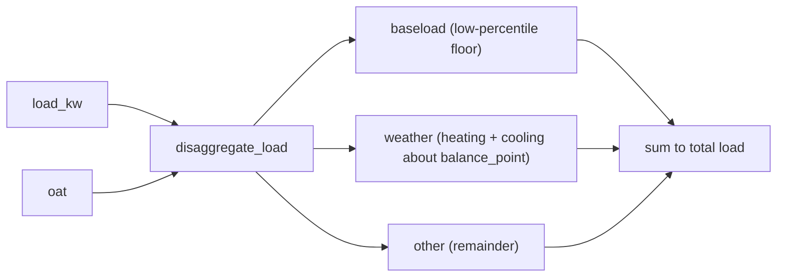

# Load disaggregation

`camber.disaggregate` splits an interval load into three transparent components — the framing behind
baseload reduction, envelope/HVAC targeting, and setback opportunity:

*Three components that sum exactly to the metered load: an always-on floor, the weather-explained part, and an honest remainder.*



```python
from camber.disaggregate import disaggregate_load

c = disaggregate_load(load_kw, oat)
c.baseload_frac, c.weather_frac, c.other_frac  # e.g. 0.61, 0.26, 0.13 (sum to 1)
c.baseload_kw, c.balance_point_f
```

- **baseload** — the always-on floor (a low percentile of the series; per-interval it can't exceed
  the actual load, so the three components sum exactly to the total);
- **weather** — the part above baseload that outdoor-air temperature explains (heating + cooling
  legs about a balance point, searched for best fit unless fixed);
- **other** — the remainder (occupancy, plug loads, and anything the weather model doesn't explain).

Deliberately honest: weather is only what OAT explains; the rest is labeled *other*, not
over-attributed to a schedule the data can't cleanly separate. Flags: `baseload_pct`,
`balance_point`, `balance_range`. numpy/pandas.
