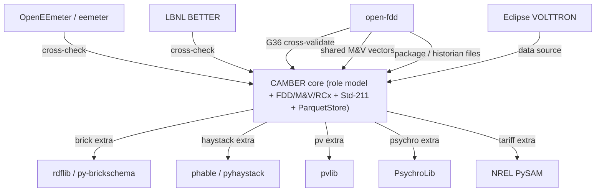

# Ecosystem — where to leverage existing OSS instead of reinventing

CAMBER deliberately ships a **dependency-light, zero-config core** (stdlib +
numpy/pandas/pyarrow/matplotlib). For several heavier or highly-standardized
pieces, mature open-source libraries already exist. The strategy is **not** to fork
them wholesale — it is to **integrate them as optional extras** so the core stays
light while users who need depth can opt in, and so we don't reinvent
well-trodden wheels.

*Own the distinctive core; integrate mature libraries as optional extras and cross-checks, never forks.*

> License notes: items marked ✓ were verified during research; items marked
> "confirm" are from general knowledge — check the repo's LICENSE before depending.

## Candidates by area

| Area | Project | License | What it gives us | Recommendation |
|------|---------|---------|------------------|----------------|
| **M&V** | [OpenEEmeter / eemeter](https://github.com/openeemeter/eemeter) (now `opendsm`) | Apache-2.0 ✓ | CalTRACK-compliant normalized metered energy / avoided-energy at meter scale | **Align + optional backend.** Keep our lightweight change-point/TOWT core; offer an `[eemeter]` path and match CalTRACK terminology for credibility. |
| **M&V weather** | [eeweather](https://github.com/openeemeter/eeweather) | Apache-2.0 (confirm) | NOAA station matching / normalization-year weather | Optional, complements our TMY/EPW loader. |
| **Ontology (Brick)** | [py-brickschema](https://github.com/BrickSchema/py-brickschema) + [rdflib](https://github.com/RDFLib/rdflib) | BSD-style / BSD-3 (confirm) | Robust Turtle/RDF parsing, Brick reasoning/validation | **Optional `[brick]` extra** using rdflib for full models; keep our minimal zero-dep parser as the default. |
| **Ontology (modeling)** | [BuildingMOTIF](https://github.com/NREL/BuildingMOTIF) | BSD-3 (confirm) | Template-driven Brick/223P model creation + SHACL validation | Watch / optional for Phase-2 full-ontology work. |
| **Haystack client** | [phable](https://github.com/rick-jennings/phable) (modern, zero-dep) / [pyhaystack](https://github.com/ChristianTremblay/pyhaystack) | confirm / Apache-2.0 ✓ | A real `hisRead`/Zinc client | **Optional `[haystack]` extra** wired as the transport our adapter already accepts — no need to hand-roll the HTTP/Zinc layer. |
| **PV modeling** | [pvlib-python](https://github.com/pvlib/pvlib-python) | BSD-3 ✓ | Rigorous PV performance/irradiance modeling | **Optional `[pv]` extra** for serious PV; keep our performance-ratio basics dep-free. |
| **Psychrometrics** | [PsychroLib](https://github.com/psychrometrics/psychrolib) | MIT ✓ | ASHRAE psychrometric properties (humidity ratio, enthalpy, wet-bulb) | Optional; back any psychrometric needs (e.g. App-C solar-MRT comfort, latent loads). |
| **Controls / agents** | [Eclipse VOLTTRON](https://github.com/eclipse-volttron) | Apache-2.0 ✓ | BACnet/Modbus drivers, historians, an agent platform | **Interoperate, don't vendor** — read its historian via our SQL adapter / its telemetry via MQTT; study its driver framework. Too heavy (ZMQ/gevent) to import. See note 9 below. |

### Related tool: ECAM

[ECAM](https://latticeenergyworks.com/services/technology-market-assessment/) (Energy Charting and
Metrics) is an Excel-based charting and M&V tool for interval and trend data, now listed by
Lattice Energy Works. PNNL's Building Re-tuning program uses it for whole-building interval-data
analysis ([Interval Data Analysis with ECAM, PNNL-20495](https://www.pnnl.gov/sites/default/files/media/file/pnnl_20495.pdf)).
It is a related tool, not a dependency: CAMBER neither ships nor wraps it, and its own load
profiles, carpet plots and change-point M&V cover the same ground in Python. See
[References](REFERENCES.md) for the Re-tuning material CAMBER links to.

## The strategy: optional extras, not forks

- **Core stays zero-dep.** Today's `camber/` runs on numpy/pandas/pyarrow/
  matplotlib only. None of the above becomes a hard dependency.
- **Add `pyproject` extras** so capability is opt-in, e.g.:
  `pip install camber-toolkit[brick,haystack,pv]`. Each extra wires a mature library behind
  an interface we already have (the Haystack adapter's injectable transport, a PV
  backend, a Brick parser swap).
- **Why integrate rather than fork:** these projects are maintained, tested, and
  standards-tracking (CalTRACK, Brick, Haystack, PV). Forking would mean owning
  that maintenance; depending optionally gets the value without the burden, and
  keeps CAMBER's distinct contribution (the vendor-neutral role model + the unified
  FDD/M&V/RCx pipeline) clear.
- **Where we keep our own:** the role/mapping/entity model, the FDD rule engine and
  triage/lifecycle, the Std-211 reporting, and the Parquet store are CAMBER's
  reason to exist — no equivalent single OSS package combines them.

## Near-term integration picks

1. **Brick via rdflib (`[brick]`) — DONE.** `camber.interop.brick` has an rdflib
   backend (`backend="rdflib"`, auto-selected when installed); the zero-dep minimal
   parser remains the default. Verified identical to the minimal parser on the LBNL
   model and able to parse models it can't (`rdf:type`, full IRIs).
   `pip install camber-toolkit[brick]`.
2. **Haystack via phable/pyhaystack (`[haystack]`) — DONE.**
   `camber.ingest.haystack` provides `client_transport(his_read)` to wire any
   maintained client into the adapter's transport seam in one line, plus a
   dependency-free `http_json_transport` for token/JSON-capable servers; the
   decoders handle both the v3 and Hayson JSON encodings. The `[haystack]` extra
   pulls phable (Python >= 3.11) or pyhaystack (older).
3. **M&V: align with CalTRACK / eemeter — DONE.** `mandv.caltrack.caltrack_savings`
   assembles the Option-C / CalTRACK-Daily NMEC workflow (baseline model → avoided
   energy + FSU); [docs/MANDV.md](MANDV.md) maps the terminology, notes where we
   differ from strict CalTRACK, and gives an eemeter cross-check recipe (no
   dependency added).

4. **Tariffs / OpenEI URDB — DONE (hybrid).** A native, dependency-free engine
   (`camber.tariff`) bills an interval load against a URDB-shaped rate (fixed, TOU
   energy + tiers, TOU/flat demand, ratchet) and covers the common cases; `camber.interop.openei`
   fetches + maps a URDB rate (stdlib `urllib`). The URDB API needs a free key —
   get one at <https://openei.org/services/> and export it as **`OPENEI_API_KEY`**
   (`fetch_urdb_rate` reads it automatically); never hard-code or commit the key. For
   exotic rates and
   cross-checking, an optional `[tariff]` extra bridges to **NREL PySAM**'s
   battle-tested `UtilityRate5` (`camber.interop.tariff_nrel`) — BSD-3-Clause, but a
   ~47 MB binary, so it stays an opt-in extra, never a core dependency. Same own-it +
   cross-check-the-heavyweight pattern as M&V/eemeter. (NREL REopt's tariff logic is
   also BSD-3 but Julia-native — reachable via the REopt API, not embedded.)

5. **LBNL BETTER (change-point M&V + targeting) — DONE (cross-check).** LBNL's BETTER
   analytical engine (`better-lbnl-os` on PyPI; modified BSD + U.S. DOE clauses) fits
   change-point models to monthly energy-vs-temperature and benchmarks/targets retrofits.
   CAMBER already has its own change-point M&V, so the value is **cross-validation**:
   `camber.interop.better.compare_changepoint` runs CAMBER and BETTER on the same series
   and reports model-order / baseload / R² agreement — two independent engines agreeing
   is a stronger baseline than one. Optional `[better]` extra, imported lazily; the core
   needs none of it. Same own-it-+-cross-check pattern as eemeter.

6. **pvlib (PV modeling) — DONE (extend + cross-check).** `camber.pv` monitors a PV array
   against a *measured* plane-of-array resource with a flat performance ratio. For users who
   must *estimate* generation from weather, `camber.interop.pvlib_bridge` (`[pv]` extra,
   BSD-3) adds what pvlib does well and CAMBER deliberately doesn't: `poa_from_ghi`
   transposes horizontal irradiance (GHI/DNI/DHI) onto the array plane, and
   `pvwatts_expected_kwh` applies a temperature-derated PVWatts yield. `compare_expected`
   puts CAMBER's flat-PR estimate beside pvlib's temperature-corrected one (e.g. a ~0.92
   ratio at a 55 °C cell — the derate the simple model omits). Lazy import; core dep-free.

7. **PsychroLib (psychrometrics) — DONE (extend + cross-check).** CAMBER computes wet-bulb
   where it needs it (cooling-tower approach) with Stull's dependency-free closed form.
   `camber.interop.psychro` (`[psychro]` extra, MIT) bridges to PsychroLib's exact
   ASHRAE-formulation properties (`psychrometrics` → wet-bulb, dew point, humidity ratio,
   enthalpy) and `compare_wetbulb` validates the Stull approximation against the exact value
   (~1 °F agreement at hot/dry CZ15 conditions). Lazy import; core dep-free.

8. **Network ingest protocols — DONE (optional extras).** Read-only adapters for Modbus
   (`[modbus]`/pymodbus, BSD-3), MQTT/Sparkplug (`[mqtt]`/paho-mqtt under EDL-1.0), BACnet
   incl. experimental BACnet/SC (`[bacnet]`/bacpypes3, MIT), and OPC-UA (`[opcua]`/asyncua).
   All lazy-imported, read-only by construction, and steered behind the historian/SQL/Haystack
   default posture. We depend on the permissive libraries directly and keep the **LGPL** ones
   (asyncua — and BAC0, which we don't use) as optional, dynamically-imported deps only, never
   vendored/bundled, so CAMBER's own code stays Apache-2.0. See [SECURITY.md](SECURITY.md) +
   [INGEST-PROTOCOLS.md](INGEST-PROTOCOLS.md).

9. **VOLTTRON — interoperate, don't vendor.** Eclipse VOLTTRON (Apache-2.0) is a full
   ZMQ/gevent agent platform, not a light library: its modules assume a live message bus + agent
   runtime (its BACnet driver even needs a *separate proxy process*), so it can't be imported
   into a dependency-light tool. CAMBER instead treats a VOLTTRON deployment as a **data source**
   — point the SQL adapter at its SQLite/PostgreSQL historian, or the MQTT adapter at its
   forwarded telemetry — and mines its driver framework (registry-CSV point maps, scrape
   scheduling, COV) as a **design reference**. No `volttron-*` dependency; if any snippet is ever
   adapted, its Apache-2.0 NOTICE/attribution is retained.

## For open-fdd users

If you come from [open-fdd](https://github.com/bbartling/open-fdd) (MIT), these are the four
places where the two projects meet. Every result is labelled with the engine and version that
produced it, and neither project imports the other's code: the exchange is files and processes.

| What | Where | Engines and versions |
|---|---|---|
| **G36 cross-check**: CAMBER's `g36_afdd` and open-fdd's two rule engines scored side by side on the same labelled open data | [`examples/openfdd_crosscheck`](https://github.com/yroussev/camber/tree/main/examples/openfdd_crosscheck) (harness, role map, tolerance profiles), [`results/`](https://github.com/yroussev/camber/tree/main/examples/openfdd_crosscheck/results), and the write-up [below](#re-compared-against-open-fdd-449-2026-09) | CAMBER `g36_afdd` (0.99); open-fdd pandas engine (PyPI 4.4.9) and SQL engine `fdd_cli`, both from commit `32a6d44` |
| **Reading open-fdd data**: an importer for the building package and the historian Parquet layout, a versioned role crosswalk, and a draft findings-exchange JSON that hands CAMBER's results back | [INTEROP-OPENFDD.md](INTEROP-OPENFDD.md), with the [findings-exchange schema (draft 0.1)](INTEROP-OPENFDD.md#findings-exchange-schema-draft-01) | CAMBER `camber.interop.openfdd` (0.99, provisional); open-fdd `openfdd_package_v1` and the crosswalk's pinned docs commit |
| **Shared M&V test vectors**: change-point and bill cases with expected outputs, checkable without installing CAMBER | [`examples/mv_vectors`](https://github.com/yroussev/camber/tree/main/examples/mv_vectors) and the [section below](#open-fdds-ecm-tooling-and-the-shared-mv-vectors) | CAMBER M&V (0.98); schema `mv_vectors/1`; any engine that reads CSV or Parquet |
| **Open questions for the open-fdd author** | [Questions for open-fdd](INTEROP-OPENFDD.md#questions-for-open-fdd) | — |

The questions, in short:

1. **Time zone and units**: a stable, documented place for a building's IANA zone and unit
   system.
2. **Historian layout**: whether the Parquet layout is stable enough for an external reader, and
   whether `equipType` could travel with it.
3. **Vocabulary**: whether point names seen in packages but not in the quick reference belong to
   the vocabulary, and which SQL roles they map to.
4. **Weather**: whether a weather folder always carries a points map.
5. **Commands**: a declared way to tell 0/1 commands from percentages.

Corrections and answers are welcome on [#22](https://github.com/yroussev/camber/issues/22).

## Cross-validation: G36 fault conditions vs. open-fdd

Our G36 AHU fault engine (`camber.fdd_g36`) is a clean-room implementation of the
ASHRAE Guideline 36 §5.16.14 fault conditions. To check it independently, we
cross-validated it against [open-fdd](https://github.com/bbartling/open-fdd) (MIT) —
a separate, independently-authored G36 FDD library — on the **public LBNL simulated
single-duct AHU dataset** (the CC-BY dataset the [`examples/lbnl_fdd`](https://github.com/yroussev/camber/tree/main/examples/lbnl_fdd)
example uses). Running on a public, downloadable dataset makes this corroboration
fully reproducible and shareable, with no client data involved.

Two comparisons are described here. The first pinned **open-fdd 0.1.5**, the last release that
still exposes the classic **FC1–FC16** per-fault API; its subsections describe that comparison
only. Current open-fdd is a different engine and was re-compared in 2026-09, on labelled open data
and with a reusable harness: see
[Re-compared against open-fdd 4.4.9](#re-compared-against-open-fdd-449-2026-09) below, including
[where the 0.1.5 comparison no longer applies](#where-the-015-comparison-no-longer-applies).

> **Since 0.91** `run_g36_afdd` also applies the G36 §5.16.14 time filters by default: fan-on
> gating, ModeDelay, AlarmDelay and 5-minute averaging. The 0.1.5 comparison below compares the
> per-interval fault equations. To reproduce it, pass `mode_delay_min=0, alarm_delay_min=0,
> avg_window_min=0`, and pass `fan_gate="none"` when the frame has no fan signal.

### What was runnable

With the signals available in this dataset, the runnable common set was
**FC2, FC3, FC5, FC8, FC10, FC12**. The rest were unrunnable **in both tools** for
lack of inputs, not because of any Camber limitation:

- **FC7, FC9, FC11, FC13** need a **supply-air-temperature setpoint** trend, which
  this dataset didn't include.
- **FC14, FC15** need **coil entering/leaving temperatures**, also not trended.

Neither tool can evaluate a fault whose required inputs aren't present, so these
were excluded symmetrically.

### Result — the equations agree

On a **common denominator** (the intersection of each rule's applicable rows, so
both tools are scored over exactly the same hours):

- **FC5, FC8, FC10, FC12 match open-fdd to 0.00 percentage points on every AHU
  fault scenario tested.** The fault *equations* are equivalent; the only differences
  observed came from how each tool frames its denominator (see the convention below).
- **FC3** had a lone residual of **≤ 2.3 pts**, an immaterial mixed-air-bounds edge
  artifact on a fault that **fires in neither tool** (it is a boundary-rounding
  difference in the "applicable" count, not a disagreement about any flagged hour).

**Conclusion: Camber's G36 implementation is independently corroborated** — a second,
independently-written G36 library computes the same fault equations and, on a like-
for-like denominator, the same fault rates.

### Convention: operating-state gating vs. single-signal gating

The one systematic difference between the two tools is **which hours each fault is
considered "applicable"** — the denominator of the fault percentage, not whether a
fault fires or where:

- **Camber gates each fault by its G36 operating-state classifier.** We classify
  every interval into an operating state **OS#1–OS#5** from the heating/cooling
  valve commands plus the OA-damper position (`classify_os` →
  heating / free-cooling / mechanical+economizer / mechanical+min-OA / none of these),
  and evaluate each FC **only in the operating states G36 §5.16.14.9 lists for it**
  (`OS_FAULTS`). So FC10 ("OAT/MAT should track in 100% economizer"), for example,
  is scored only over the hours the AHU is actually in that economizer state.
- **open-fdd gates on a single-signal threshold.** Each fault is applied over the
  rows selected by one signal (e.g. fan running, or a single mode flag), without the
  full multi-signal operating-state classification.

These two definitions select **different sets of "applicable hours,"** which changes
the reported fault **magnitude** (the percentage) — but **not which faults fire, nor
the hours at which they fire** (the fault equations and their per-row results are the
same). That is exactly why the cross-validation matches to 0.00 pts once both tools
are put on a common denominator.

**Camber's operating-state gating is the chosen convention**, deliberately, because
it is the more **G36-faithful** definition of when a fault is applicable: G36 ties
each fault condition to the operating state(s) in which it is meaningful, and we
honor that mapping directly. **Tradeoff:** operating-state gating yields a
**narrower applicable set** than a single-signal gate (an FC is counted over fewer
hours — only those in its valid operating states), so Camber's denominators are
smaller and its percentages are computed over a stricter, more specific population
of hours. We consider that the correct, standard-aligned behavior; the
single-signal framing is broader but less precisely tied to the standard's intent.

> **Since 0.98 (#94)** free cooling (OS#2) also needs the OA damper open beyond its minimum
> position. An interval with both valves shut at minimum OA is OS#5, where only FC1–FC4 apply.
> Before 0.98 it was OS#2. **Since 0.99 (#95)** heating (OS#1) likewise needs the OA damper at its
> minimum, judged against the same `oa_damper_min` and `oa_damper_tol`. A heating interval with the
> damper open beyond it is OS#5. The 0.1.5 comparison above used the valves-only reading for both
> states, and no single setting reproduces it any more. `oa_damper_min=-100` counts every damper
> reading as open: it restores the valves-only free-cooling reading, but every heating interval
> becomes OS#5. `oa_damper_min=100` keeps every heating interval in OS#1, but leaves no free cooling.

> For cross-tool comparison, `run_g36_afdd(..., comparability=True)` additionally
> emits a single-signal-gated (input-validity) fault % alongside the default
> operating-state-gated %, so a reviewer can reconcile Camber's numbers with an
> open-fdd-style denominator without changing Camber's default outputs. See
> `camber/fdd_g36.py`.

### Reading open-fdd data (provisional, 0.99)

CAMBER can now run its drift, M&V and sensor-trust checks on data collected at the open-fdd edge.
`camber interop openfdd ingest` reads an open-fdd building package (`openfdd_package_v1`) or its
historian Parquet layout into a CAMBER store or portfolio workspace:

- The site time zone and the unit system are required, never guessed.
- Columns map through a versioned role crosswalk, and every unmapped column is reported.
- `camber interop openfdd findings` hands the results back as an engine-labelled JSON document.

The boundary is files and processes only: no open-fdd code is imported or copied, and nothing is
written back. See [INTEROP-OPENFDD.md](INTEROP-OPENFDD.md).

### Re-compared against open-fdd 4.4.9 (2026-09)

open-fdd has since become a platform. Its fault conditions run as SQL rules in a DataFusion
engine (`fdd_cli`), and the pandas rule cookbook on PyPI is a second implementation. We
re-compared both engines against CAMBER's `g36_afdd` on labelled open data with a reusable
harness,
[`examples/openfdd_crosscheck`](https://github.com/yroussev/camber/tree/main/examples/openfdd_crosscheck)
([#22](https://github.com/yroussev/camber/issues/22), item 1). The rules we follow:

- **Files and processes only.** CAMBER does not import open-fdd. The pandas engine runs in its own
  venv as a subprocess. The SQL engine runs as `fdd_cli` in a container built from the pinned
  commit, with no network and read-only data mounts. No open-fdd code or SQL is copied.
- **Each engine speaks for itself.** Every number below is labelled with its engine and tolerance
  profile. Verdicts are never merged.

**Versions.**

- **open-fdd:** commit `32a6d44` (VERSION 3.5.58). PyPI `open-fdd` 4.4.9 was released from this
  commit, and the wheel's `open_fdd/` tree is identical to it. The SQL engine is `fdd_cli` built
  from the same commit. The newest repository tag, v3.2.8, is older.
- **CAMBER:** `g36_afdd` on the 0.99 development line (with #94 and #95; the results files record
  the version string 0.98.0 and the commit), at the G36 defaults plus each dataset's run-template
  parameters: `min_oa_pct` 1.6 on `lbnl-sdahu`, which enables FC6.
- **Role mapping and profiles:** role map version 1, profiles version 2.
- **Python requirement:** the 4.4.9 wheel declares Python ≥ 3.10 but needs 3.11 or newer (it
  imports `enum.StrEnum`).

**Data.** `lbnl-sdahu`, the LBNL single-duct AHU (CC-BY-4.0, fetched from the publisher, never
redistributed), full catalog subset:

- 13 labelled faulted runs: 4 stuck OA damper, 4 supply-air-temperature bias, 4 partly stuck
  cooling valve and 1 valve leak;
- 1 fault-free run.

`lbnl-ddahu`, the dual-duct AHU, is scored separately, with its default subset: 2 stuck OA damper
runs and 1 fault-free run. `lbnl-fcu` is not part of the run: neither engine applies its G36 AHU
fault conditions to a fan-coil unit. CAMBER declines the equipment class, and open-fdd scopes its
FC rules to `ahu`.

**Scoring.** Each labelled run is one case. An FC **fires** on a run when its fault hours reach
5 % of that engine's **own** evaluated hours, over at least 24 evaluated hours. An FC an engine
could not run is listed as **not evaluated** with the reason. It is left out of that FC's counts,
never counted as a miss.

The engines' own alarms are scored separately, and they differ by design:

- open-fdd's status `FAULT` (pandas) or non-zero fault hours (SQL) means at least one confirmed
  fault sample;
- CAMBER flags an FC at 5 % of at least 24 applicable hours.

On annual runs both open-fdd engines raise an alarm on every run, fault-free included, in both
profiles. A shared duration rule is therefore needed to compare detection at all.

Rates carry Wilson 95 % intervals. With one fault-free run per unit, every per-run FPR rests on
n = 1, so read the intervals, not the point rates.

**Tolerance profiles for open-fdd.**

- **Own defaults:** ε 1.15 °F, fan heat 0.55 °F.
- **G36:** the Table 5.16.14.7 tolerances CAMBER uses (ε SAT/RAT 2 °F, MAT/OAT 5 °F, coil
  CCET/CCLT 5/2 °F, fan heat 2 °F).
  - Pandas engine: passed as rule parameters.
  - SQL engine: passed through its supported override, `rule_tuning/defaults.yaml`. Four SQL
    rules (FC9, FC11, FC14, FC15) read a tolerance that file cannot set (see "SQL engine" below).
    They run at their defaults in this profile rather than with a partial override.

Only tolerances change. Delays and the damper and valve thresholds that select operating states
stay at each engine's defaults.

**`lbnl-sdahu`, one case per run.** TPR, Wilson 95 % interval and detected/evaluated runs. Every
FPR is 0/1 except where the "not evaluated" table says otherwise.

| FC | CAMBER `g36_afdd` | pandas, own defaults | pandas, G36 tol. | SQL, own defaults | SQL, G36 tol. |
|---|---|---|---|---|---|
| FC2–FC4 | 0.00 [0.00–0.23] (0/13) | 0/13 | 0/13 | 0/13 | 0/13 |
| FC6 | 0.17 [0.05–0.45] (2/12) | – | – | – | – |
| FC8 | 0.00 [0.00–0.26] (0/11) | 0.62 [0.36–0.82] (8/13) | 0.46 [0.23–0.71] (6/13) | 0.62 [0.36–0.82] (8/13) | 0.46 [0.23–0.71] (6/13) |
| FC9 | 0.00 [0.00–0.26] (0/11) | 0.08 [0.01–0.33] (1/13) | 0.08 [0.01–0.33] (1/13) | 0.08 [0.01–0.33] (1/13) | 0.08 [0.01–0.33] (1/13) |
| FC10 | 0.22 [0.06–0.55] (2/9) | 0.23 [0.08–0.50] (3/13) | 0.15 [0.04–0.42] (2/13) | 0.23 [0.08–0.50] (3/13) | 0.15 [0.04–0.42] (2/13) |
| FC11 | 0.22 [0.06–0.55] (2/9) | 0.15 [0.04–0.42] (2/13) | 0.15 [0.04–0.42] (2/13) | 0.15 [0.04–0.42] (2/13) | 0.15 [0.04–0.42] (2/13) |
| FC12 | 0.00 [0.00–0.23] (0/13) | 0/13 | 0/13 | 0/13 | 0/13 |
| FC13 | 0.25 [0.09–0.53] (3/12) | 0.08 [0.01–0.33] (1/13) | 0.08 [0.01–0.33] (1/13) | 0.00 [0.00–0.23] (0/13) | 0.00 [0.00–0.23] (0/13) |
| FC14 | 0.36 [0.15–0.65] (4/11) | 0.31 [0.13–0.58] (4/13) | 0.08 [0.01–0.33] (1/13) | 0.62 [0.36–0.82] (8/13) | 0.62 [0.36–0.82] (8/13) |
| FC15 | – | – | – | 0.62 [0.36–0.82] (8/13) | 0.62 [0.36–0.82] (8/13) |
| **any FC** | **0.77 [0.50–0.92] (10/13)** | **0.85 [0.58–0.96] (11/13)** | **0.69 [0.42–0.87] (9/13)** | **0.77 [0.50–0.92] (10/13)** | **0.77 [0.50–0.92] (10/13)** |
| any-FC FPR | 0/1 | 0/1 | 0/1 | 0/1 | 0/1 |

Detection by fault type (any FC):

| Fault type | CAMBER | pandas, own | pandas, G36 | SQL, own | SQL, G36 |
|---|---|---|---|---|---|
| Stuck damper | 4/4 | 4/4 | 4/4 | 4/4 | 4/4 |
| Supply-air-temperature bias | 2/4 | 4/4 | 2/4 | 4/4 | 4/4 |
| Stuck valve | 4/4 | 3/4 | 3/4 | 2/4 | 2/4 |
| Valve leak | 0/1 | 0/1 | 0/1 | 0/1 | 0/1 |

The valve leak goes undetected by every engine: its 10 % leak about cancels the unit's fan heat
(see the `lbnl-sdahu` run template and `examples/lbnl_fdd/README.md`), and CAMBER's dedicated
`leaking_valve` rule is calibrated for it.

**Month windows.** `--window month` scores each run-month as a case: 151 faulted and 12
fault-free months on `lbnl-sdahu`. Months of one run are not independent, so these intervals are
narrower than the evidence supports. Any-FC results:

| Engine | TPR | FPR |
|---|---|---|
| CAMBER | 0.68 [0.60–0.75] | 0/12 |
| open-fdd pandas, own defaults | 0.71 [0.63–0.78] | 0/12 |
| open-fdd pandas, G36 tolerances | 0.48 [0.41–0.56] | 0/12 |
| open-fdd SQL, own defaults | 0.66 [0.58–0.73] | 0/12 |
| open-fdd SQL, G36 tolerances | 0.61 [0.53–0.68] | 0/12 |

**`lbnl-ddahu` (dual duct).** Any-FC results:

| Engine | One case per run | Month windows |
|---|---|---|
| CAMBER | 1/2 detected, 0/1 false alarms | TPR 0.04 [0.01–0.20], FPR 0/12 |
| open-fdd pandas, own defaults | 2/2 detected, 1/1 false alarms | TPR 0.75, FPR 9/12 |
| open-fdd pandas, G36 tolerances | 2/2 detected, 1/1 false alarms | TPR 0.62, FPR 6/12 |
| open-fdd SQL, own defaults | 2/2 detected, 1/1 false alarms | TPR 0.75, FPR 9/12 |
| open-fdd SQL, G36 tolerances | 2/2 detected, 1/1 false alarms | TPR 0.75, FPR 9/12 |

G36 §5.16.14 is written for single-duct units, and the mapping reads the cold-deck discharge as
SAT next to the hot-deck valve. On this unit, "SAT below MAT while heating" (FC5) is the design,
not a fault. Read the `lbnl-ddahu` numbers as a scope check, not as detection performance.

Full tables, the per-run verdicts with each engine's denominator, the native-alarm scores and
the probe outcomes are in `examples/openfdd_crosscheck/results/`.

**CAMBER since #94 (0.98).** Free cooling now needs the OA damper open beyond its minimum, and
the run template enables FC6 with the unit's documented minimum OA. Per run on `lbnl-sdahu`,
before → after:

| FC | Before | After | Why |
|---|---|---|---|
| FC6 | not evaluated | 2/12, FPR 0/1 | Catches both stuck-open damper runs: damper_stuck_075 24.5 %, damper_stuck_100_short 25.7 % of applicable hours; fault-free 0.0 % |
| FC8 | 2/11 | 0/11 | The stuck-open runs left free cooling and are now reported by FC6 |
| FC9 | FPR 1/1 | FPR 0/1 | The false alarm on the fault-free run is gone |
| FC12 | 1/13 | 0/13 | |
| Any FC | TPR 10/13, FPR 1/1 | TPR 10/13, FPR 0/1 | |

The false alarm came from unoccupied hours with the fan at 100 % and the OA damper shut; it read
18 % of the fault-free run's free-cooling hours. In month windows, CAMBER's any-FC result moves
from TPR 0.60 with FPR 7/12 (all FC9) to TPR 0.68 with FPR 0/12.

On `lbnl-ddahu`, FC12 moves from 0/2 to 1/2, and nothing else changes.

**CAMBER since #95 (0.99).** Heating (OS#1) now also needs the OA damper at its minimum, judged
against the same minimum and tolerance as free cooling. The open-fdd results are unchanged
(same engines, same pin), and so is every CAMBER verdict on `lbnl-sdahu`, which has no heating
coil. On `lbnl-ddahu` the hot deck heats while the OA damper command sits well above the learned
28 % minimum (median 55 % on the fault-free run), so those hours are now OS#5. CAMBER's FC5, the
one heating-only test the mapping can run there, changes as follows:

| `lbnl-ddahu` | Before (0.98) | After (0.99) |
|---|---|---|
| FC5, one case per run | evaluated on all 3 runs (863–1,442 h), never fired: 0/2, FPR 0/1 | not evaluated on any run: no OS#1 hours on the two stuck-damper runs, 0.5 h on the fault-free run |
| FC5, month windows | 0/11, FPR 0/7 | not evaluated |
| Any FC | 1/2 detected, 0/1 false alarms | unchanged |

FC5 never fired on this unit before #95, so no detection changes.

**CAMBER and open-fdd since #97 and #98 (0.100).** Two changes reach `lbnl-ddahu`. The catalog
mapping now maps the published cold-deck supply-air setpoint (`CSA_TEMPSPT`, 55.0 °F in every
row) as the SAT setpoint (#98), for all three engines. The run template now enables CAMBER's FC6
with the unit's documented seasonal minimum OA: 31.8 %, and 11.9 % in June to August (#97). The
`lbnl-sdahu` results do not change. Per run on `lbnl-ddahu`, before → after:

| FC | Engine | Before (0.99) | After (0.100) |
|---|---|---|---|
| FC6 | CAMBER | not evaluated: no minimum OA | 0/2, FPR 0/1: fault-free 0.07 %, `DMPRStuck_OA_0` 1.8 %, `DMPRStuck_OA_100` 0 % |
| FC7 | open-fdd (all) | not evaluated: no SAT setpoint | 0/2, FPR 0/1 |
| FC9 | CAMBER | not evaluated: no SAT setpoint | fires on `DMPRStuck_OA_0` (20.8 % of 126 h); under 24 h on the other two runs |
| FC9 | open-fdd (all) | not evaluated | 0/2, FPR 0/1 (0.7–1.2 % on every run) |
| FC11 | CAMBER | not evaluated | fires on `DMPRStuck_OA_0` (12.3 % of 53 h); under 24 h on the other two runs |
| FC11 | open-fdd (all) | not evaluated | 1/2, FPR 0/1: `DMPRStuck_OA_0` 9.7–14.0 % |
| FC13 | CAMBER | not evaluated | 0/2, FPR 0/1 (0 % on every run) |
| FC13 | open-fdd pandas, own defaults | not evaluated | 1/2, FPR 0/1: `DMPRStuck_OA_0` 19.8 % |
| FC13 | open-fdd pandas, G36 tolerances | not evaluated | 0/2, FPR 0/1 |
| FC13 | open-fdd SQL (both profiles) | not evaluated | 1/2, FPR 0/1: `DMPRStuck_OA_0` 11.9 % |
| Any FC | all | as above | unchanged for every engine |

In month windows, CAMBER's any-FC result is unchanged (TPR 0.04, FPR 0/12). The open-fdd
pandas engine at G36 tolerances goes from TPR 0.58 with FPR 5/12 to TPR 0.62 with FPR 6/12: its
FC9 now fires on one fault-free month. The other open-fdd results are unchanged.

FC6 does not catch the damper stuck shut. G36 evaluates FC6 only in heating and in mechanical
cooling at minimum OA. On this unit, CAMBER's learned OA damper minimum is 28 %, the summer
position, so nearly all of FC6's applicable hours fall in June to August. Against an 11.9 %
minimum, a damper stuck shut is off by less than G36's 30-point tolerance. A fixed 31.8 % would
flag `DMPRStuck_OA_0` (32.1 % of its applicable hours), but only by judging those summer hours
against the other season's minimum. The fault-free run reads `ok` either way. The fault-free
values that #94 recorded for a single minimum (FC6 20.5 % at 31.8, 47.1 % at 11.9, re-measured on
the 0.98 code) predate #95, which moved the hot-deck heating hours with the damper open out of
OS#1: FC6's applicable hours on the fault-free run fell from 2,105 to 744 (hourly). The winter
heating hours run with the damper at or above its 45 % winter minimum, beyond the learned 28 %,
so they are now OS#5. A seasonal OA damper minimum would return them to FC6. All of these setpoint
tests judge the cold deck, because the mapping reads it as SAT. The hot deck's own 90 °F
setpoint is not mapped.

#### Not evaluated, and why

`lbnl-sdahu`:

| FC | Engine | Why it was not evaluated |
|---|---|---|
| FC1 | all | No run has both duct static and its setpoint. The catalog masks the faulted runs' placeholder setpoint and the fault-free run's static, which is published in Pa. |
| FC5, FC7 | all | No heating coil. |
| FC6 | open-fdd (both) | Needs a VAV total airflow and a design minimum OA flow; airflow is deliberately unmapped. CAMBER evaluates FC6 from its template's minimum OA fraction. |
| FC15 | CAMBER, pandas | No heating coil. The SQL rule requires no roles and falls back to MAT/SAT, so it is evaluated (see below). |
| FC14 | open-fdd pandas | Evaluated only through the harness's declared MAT/SAT substitution (G36 allows it on an AHU without a heating coil). CAMBER makes the same substitution internally, and the SQL rule falls back to MAT/SAT by itself. |
| FC8–FC14 | CAMBER | Not evaluated on a few runs where the FC's operating states held for under 24 h. |

`lbnl-ddahu`:

| FC | Engine | Why it was not evaluated |
|---|---|---|
| FC9, FC11 | CAMBER | Since #98 they are evaluated, but the fault-free run and `DMPRStuck_OA_100` have under 24 h in their operating states. |
| FC14 | CAMBER | Declined: MAT/SAT span both coils. |
| FC14 | open-fdd pandas | No coil temperatures. |
| FC14 | open-fdd SQL | Evaluated: falls back to MAT/SAT. |
| FC6 | open-fdd (both) | Needs a VAV total airflow and a design minimum OA flow. CAMBER evaluates FC6 from its template's seasonal minimum OA fraction (since #97). |
| FC5 | CAMBER | Since #95: the hot deck heats with the OA damper above its learned minimum, so there are no OS#1 hours to judge (0.5 h on the fault-free run). |

#### SQL engine: the source-reading findings, tested

Before the SQL engine could run, these were read from the pinned source. Each is now confirmed on
synthetic one-day probes run through `fdd_cli`
(`examples/openfdd_crosscheck/results/probes.md`, `run_crosscheck.py --probe`; 20 of 20 probe
outcomes as predicted).

| Probe | What it isolates | CAMBER | pandas own / G36 | SQL own / G36 |
|---|---|---|---|---|
| `fc13_sat_1p5_over_sp_full_cooling` | FC13 at SAT 1.5 °F over setpoint, full cooling | not fired | fired / not fired | fired / **fired** |
| `fc9_oat_4_over_sp_free_cooling` | FC9 at OAT 4 °F over the SAT setpoint, free cooling | not fired | fired / not fired | fired / **fired** |
| `fc8_sat_3p5_over_mat_free_cooling` | FC8 at SAT 3.5 °F over MAT, free cooling (positive control) | not fired | fired / not fired | fired / not fired |
| `fc13_sat_3_over_sp_half_cooling` | FC13 with the cooling valve at 50 % | not fired | fired / fired | not fired / not fired |

- **G36 tolerances the SQL tuning file cannot set: confirmed.** `fdd_cli run-rules` itself only
  overrides `confirm_seconds`. Its rule parameters come from `rule_tuning/defaults.yaml` next to
  the rules directory. Through that file:
  - `EPS_SAT` is always taken from `SUPPLY_TOL`, so FC7 and FC13 (`FC13-SAT-HIGH`) keep
    1.15 °F. At the "G36" profile, FC13 still fires at SAT 1.5 °F over setpoint.
  - FC9, FC11, FC14 and FC15 read an `EPS_MAT` they do not declare, so it stays at the 1.15 °F
    global default. FC9 still fires at OAT 4 °F over the setpoint.

  The FC8 probe is the control: FC8's tolerances are declared, the G36 profile silences it, so
  the override file is read.
- **Partial overrides.** The first data run applied only the settable part (fan heat 2 °F) to
  FC9. That made it fire on 4/13 runs against 1/13 at its defaults: the band became
  OAT > SATSP + 0.3 °F instead of + 1.75 °F. Profiles version 2 therefore leaves rules whose G36
  tolerances cannot all be set at their defaults. The G36 SQL column above runs FC9, FC11, FC14
  and FC15 at open-fdd's defaults.
- **FC13 "full cooling" threshold: confirmed.** The SQL rule requires the cooling valve at 90 %
  or more (`clg_full_min` 0.9), and the pandas rule any cooling (0.01). With the valve at 50 %,
  the pandas FC13 fires and the SQL one does not. CAMBER does not either, since G36 FC13 is a
  full-cooling test.
- **Default ModeDelay** is 10 min in the SQL rules and 0 in the pandas rules. The FC8, FC9, FC10
  and FC11 results above agree between the two engines run for run (within 2 percentage points
  per run on FC8, under 1 on FC9–FC11), so it does not matter on this data.
- **Required roles are checked per building.** `fdd_cli run-rules` skips a rule when a required
  role is missing from the building's columns, which are the union over all its equipment.
  Equipment that lacks a role its neighbour has is reported with 0 fault hours rather than
  skipped. The harness therefore gives each equipment its own building. In a first run with all
  units in one building, FC9, FC11 and FC13 were reported for the dual-duct unit, which then had
  no SAT setpoint mapped.

#### What drives the differences

These are behaviour differences, each traced to a cause on public code and open data.

- **Tolerances.** Moving open-fdd from its defaults to the G36 tolerances lowers its FC8 rate in
  both engines: 8/13 → 6/13 runs. The pandas FC14 drops from 4/13 to 1/13; the SQL FC14 stays at
  its defaults (see above).

  The SAT-bias runs show it most clearly. The −2 and −4 °C bias runs read 37–38 % FC8 and FC14
  in both open-fdd engines at their defaults. At G36 tolerances the pandas FC14 reads 0–1 %.
- **The two open-fdd engines agree with each other where their parameters match.** On every run,
  FC8 agrees within 2 percentage points and FC10 within 1, in both profiles; FC9 and FC11 agree
  within 1 at the defaults.
- **FC14 sign, and FC15 on a unit without a heating coil (SQL).** The SQL FC14 and FC15 test the
  absolute MAT→SAT temperature change (either sign), falling back to MAT/SAT when there are no
  coil sensors. FC15 requires no roles, so it is evaluated on the cooling-only SDAHU as well,
  where the MAT/SAT pair spans only the cooling coil and the fan.

  On SDAHU, both rules fire on the same 8 faulted runs (SAT-bias, two stuck-valve and two
  stuck-damper runs) and not on the fault-free run. On the dual-duct fault-free unit the SQL FC14
  fires on 51 % of its hours.

  The pandas FC14 tests the signed drop. CAMBER subtracts the fan-heat rise, because SAT is
  downstream of the fan; on the −2/−4 °C SAT-bias runs CAMBER's FC14 reads 96–100 %.
- **How the minimum-OA state is recognised.** Both open-fdd engines take "minimum OA" to mean a
  damper at or below 5 % (`econ_min_pos`, `oa_damper_econ_low`). This unit's minimum position is
  10 %, so the open-fdd FC12 and FC13 never see the OS#4 hours in which the partly stuck valves
  show up. CAMBER's FC13 reads 92/89/77 % on the 10/25/50 % stuck-valve runs; pandas reads 5/7/1 %
  and SQL 3/2/0 %.

  With `econ_min_pos` set to the unit's own minimum (0.11) and G36 tolerances, the pandas FC13
  reads 68/66/48 % on those runs and under 4 % on the other runs (fault-free 1.3 %). This is a
  site setting, not a tolerance, so it is not part of either profile.
- **FC5 on a dual-duct unit (both open-fdd engines).** The open-fdd FC5 tests "heating
  commanded" without excluding simultaneous cooling. CAMBER evaluates FC5 only in OS#1, so the
  dual-duct hours with both decks active are excluded. Since #95 the hot-deck hours with the OA
  damper above its minimum are excluded too, which leaves CAMBER's FC5 not evaluated on this
  unit. The open-fdd FC5 fires on 18–23 % of the DDAHU fault-free run's hours.
- **Denominators.** CAMBER divides by the hours in the FC's G36 operating states, after
  ModeDelay. The pandas engine divides by the fan-proven hours after its startup delay. The SQL
  FC rules report fault hours only, so the harness divides by the fan-on hours of the frame. Each
  verdict in the results JSON records its denominator.

  So CAMBER's percentages are larger for the same fault hours. On the 10 % and 25 % stuck-damper
  runs, for example, FC10 reads 100 % in CAMBER and 37–38 % in both open-fdd engines. The 0.1.5
  comparison found this too.

#### Where the 0.1.5 comparison no longer applies

- **"FC7, FC9, FC11, FC13 need a SAT setpoint, which this dataset didn't include."** No longer
  true for SDAHU. The dataset publishes `SA_TEMPSPT`, a constant 55.2 °F, and the catalog maps
  it, so FC9, FC11 and FC13 are now evaluated by every engine. FC7 is still not evaluated, because
  the unit has no heating coil. Since 0.100 (#98) the same holds for the dual-duct unit's cold
  deck (`CSA_TEMPSPT`).
- **"The equations agree to 0.00 pts" and "same faults, same hours".** Both describe the
  per-interval equations of 0.1.5 with CAMBER's time filters off. They do not carry over to fault
  rates now:
  - CAMBER applies the G36 time filters by default (fan gate, ModeDelay, AlarmDelay, averaging),
    and since #94 it requires the economizer open beyond minimum for free cooling;
  - current open-fdd differs from G36 in default tolerances and in how it selects operating
    states;
  - the engines differ in the FC14/FC15 sign handling and in their denominators.

  The fault conditions are still the same G36 tests, but the trip rates differ, for the reasons
  above.
- **"open-fdd gates on a single signal."** Partly superseded. Both current open-fdd engines
  select free-cooling and mechanical-cooling states from damper and valve thresholds
  (`econ_min_pos`, `econ_full_open`, the cooling thresholds) on top of a fan gate and a
  mode/startup delay. This is closer to an operating-state gate than 0.1.5 was, but it is not
  G36's OS#1–OS#5 classifier.
- **"Run open-fdd at matched tolerances."** Still true, but not sufficient. The pandas engine can
  match the G36 tolerances. The SQL engine cannot for FC7, FC9, FC11 and FC13–FC15. Even where
  tolerances match, the remaining differences come from operating-state selection, the FC14/FC15
  sign handling, the unit's minimum-OA damper position and the denominators.

Corrections from the open-fdd side are welcome on
[#22](https://github.com/yroussev/camber/issues/22), especially on the role mapping
(`role_map.json`) and the SQL tuning findings.

### open-fdd's ECM tooling and the shared M&V vectors

open-fdd's [ECM tooling](https://bbartling.github.io/open-fdd/ecm/) (MIT) has three parts:

- Excel ECM workbooks backed by independent Python reference calculators: fan affinity,
  chilled-water reset, condenser water, economizer runtime, outside-air loads, kW/ton, schedule
  reduction and others;
- an honest comparison of each calculator's estimate against an EnergyPlus twin;
- change-point and ASHRAE Guideline 14 helpers (`fit_changepoint`, `select_changepoint`,
  `score_g14_monthly`, `option_c_savings`) that credit CAMBER as their algorithm reference.

The helpers are an independent reimplementation and can fit the same data differently. They use
a different breakpoint grid and a different model-selection criterion, they allow a zero-width
5P dead-band, and their heating-slope sign is the opposite of CAMBER's. Compare savings from the
two tools only after checking which model each one chose.

**How the two fit.** open-fdd's calculators estimate a retrofit's savings before it is built, and
CAMBER measures and verifies them afterwards. CAMBER's findings can replace a calculator's
assumptions with measured inputs, such as:

- run hours;
- missed free-cooling hours, and what caused them;
- how a reset actually behaves;
- pump minimum-speed floors.

For M&V on monthly data, CAMBER's bill-only path covers calendarization, degree-day bases
selected from the bills, and versioned billing baselines (see
[MANDV.md](MANDV.md#billing-data)). Any integration stays at the file and process boundary,
tracked in [#22](https://github.com/yroussev/camber/issues/22).

**Shared vectors.** The
[shared M&V test vectors](https://github.com/yroussev/camber/tree/main/examples/mv_vectors)
let the two sets of helpers be cross-checked without either importing the other. They hold:

- synthetic change-point cases with known truth;
- bill cases;
- CAMBER's expected outputs and predicted series;
- expected statistics for BDG2 meters, whose daily, monthly and bill aggregates are not committed
  (CAMBER redistributes no datasets). A standalone script rebuilds them from the publisher's
  sha256-pinned files.

The vectors are engine-agnostic:

- the inputs are CSV, with optional Parquet that DataFusion reads natively;
- the expected outputs are JSON with a versioned schema (`mv_vectors/1`);
- the results contract is JSON, and its checker needs numpy and pandas only.

So open-fdd's pandas library or a SQL M&V twin can be checked without installing CAMBER. The
vectors also show where the two G14 gates differ:

- `score_g14_monthly` applies Guideline 14's calibrated-simulation tolerances: |NMBE| ≤ 5 % and
  CV(RMSE) ≤ 15 % monthly.
- CAMBER's regression-baseline gate also requires R² ≥ 0.75 and |NMBE| ≤ 0.5 %.
- On loads with little weather signal, the first passes and the second fails.
