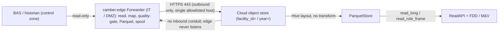

# Edge → cloud deployment (one-way, cybersecure)

`camber.edge` is a **one-way forwarder**: it runs on a small edge device (Raspberry Pi) or the BAS
front-end computer, reads BAS trend data **read-only**, maps point→role, quality-gates locally, and
**store-and-forwards** Parquet batches **outbound-only** to an org cloud data lake — where CAMBER
(cloud-side) organizes and analyzes them. It extends, and does not contradict, the posture in
[SECURITY.md](SECURITY.md).

The half that reads BAS data reuses the existing read-only ingest adapters; the half that lands in
the cloud reuses the existing [`ParquetStore`](SCALE.md) layout and [read API](DEPLOY.md). This
document is written for the IT / network-security team that must approve the edge.

## 1. Reference architecture

```
                    IT / DMZ zone                         │      cloud
  BAS / historian  ───(read-only)──▶  EDGE (Pi / Windows) ──── HTTPS 443, outbound-only ───▶  object store
   (control zone)                       camber.edge                (single allowlisted host)      │
                                     read → map → quality                                         ▼
                                     → Parquet → spool → PUT                         ParquetStore (facility_id=/year=)
                                                                                                  │
                                                                                          existing ReadAPI + FDD/M&V
```

*One-way only: the edge sits in IT/DMZ, reads the BAS read-only, and never listens — the sole conduit is outbound 443 to one host.*



- **Historian-first.** Prefer reading a historian / SQL / Haystack API (`camber.ingest.sql`,
  `camber.ingest.haystack`) — NIST SP 800-82 places historians at a low trust tier reached through a
  one-way conduit. Live protocol polling is the exception.
- **Live BAS only when there is no historian.** `camber.ingest.bacnet` (read services only, incl.
  **BACnet/SC** via `BacnetTarget(secure=True, hub_uri, cert, key, ca)`), `modbus`, `opcua`, or
  `mqtt_stream` — preferably through a **read-only gateway**, never by writing to controllers.
  **BACnet/SC is an option, not an assumption**: sites without it use plain read-only BACnet through
  a gateway.
- **Never on the control VLAN.** The edge sits in IT/DMZ; the only conduit out is outbound-443 to one
  cloud host. There is **no conduit back into the control zone** — the edge never listens.

## 2. Data flow & landing format

Each `poll_once` produces one Parquet part per `year=`, written **directly into the store's Hive
layout** so the cloud reads it with the existing `ParquetStore.read_long` / `read_role_frame` /
`ReadAPI` and **no transform**:

- **Long schema** (the store's native shape): `[ts, equip, equip_class, role, value]`; NaNs dropped
  (observations, not a dense grid). `facility_id` and `year` are encoded in the **object key path**,
  not the file (standard Hive partitioning).
- **Object key**: `facility_id=<id>/year=<yyyy>/part-<sha16>.parquet`, where `<sha16>` is the first
  16 hex of the batch content SHA-256. Re-sending identical content lands the same key → **idempotent**.
- **Per-batch manifest** (sink metadata): facility, window, rows, roles, equips, quality summary,
  full `content_sha256`, `schema_version` — for cloud-side reconciliation and audit.
- **NDJSON** (`wire_format="ndjson"`) is a documented compatibility fallback for endpoints that can't
  accept Parquet PUTs; Parquet is the default (zero cloud transform).

## 3. IT-approval security dossier

### Threat model (from [SECURITY.md](SECURITY.md))
Pivot risk (a host with a route toward controllers), credential/cert exposure, accidental writes,
discovery side-effects, and sensitive data. The forwarder is designed so each is closed by
construction.

### Properties enforced in code (not prose) — with the test that proves each

| Property | How it's enforced | Proven by |
|---|---|---|
| **Read-only toward the BAS** | the edge only calls `load_points` / `point_names` / `units`; no write service is imported | `test_ingest_protocols.py::test_edge_modules_are_readonly_and_one_way` (AST guard) |
| **No inbound listener, ever** | no `socket` / `http.server`; the sink is an outbound `urllib` PUT | same AST guard (forbids `bind`/`listen`/`accept`/`recv`/`socket`/`*HTTPServer`) |
| **TLS always verified** | `ssl.create_default_context()`; `https`-only scheme | same AST guard (forbids `_create_unverified_context`/`CERT_NONE`) + `test_edge_sink.py` |
| **No long-lived cloud creds on the edge (default)** | presigned URL / broker only; no access keys stored | `test_edge_config.py::test_default_sink_needs_only_env_url` |
| **Secrets from environment only** | `load_config` rejects secret-shaped keys / presigned URLs in the file | `test_edge_config.py::test_rejects_secret_key_in_file` |
| **Bounded egress allowlist (one host)** | every resolved URL host must equal the configured host | `test_edge_sink.py::test_presigned_host_allowlist_blocks_redirect` |
| **Tamper-evidence + idempotent landing** | `content_sha256` in the key + `x-camber-content-sha256` header | `test_edge_forwarder.py::test_manifest_carries_audit_fields` |
| **Never lose data offline** | durable spool: atomic enqueue, retry/backoff, backfill after reboot, bounded-disk eviction with a WARNING | `test_edge_spool.py` |
| **Per-batch audit log** | a structured `camber.edge` log record per PUT (host, key, bytes, sha256, status) | `test_edge_sink.py` / operator captures logs |

### Standards mapping
- **NIST SP 800-82r3** — the edge realizes the *one-way conduit / data-diode, push-upward* pattern;
  historian-first keeps the source at the low-trust historian tier; audit logging satisfies the
  OT-footprint requirement.
- **ISA/IEC 62443 (zones & conduits)** — the edge is an IT/DMZ-zone asset; the single conduit is
  outbound-443 to one cloud host; there is no conduit back into the control zone (no listener);
  least privilege = a read-only source account / monitoring-scoped BACnet/SC cert.
- **ANSI/ASHRAE 135 (incl. BACnet/SC)** — when a live source is unavoidable, only read services are
  used (`ReadProperty` / `ReadPropertyMultiple` / `ReadRange`), and `BacnetTarget(secure=True, …)
  .validate()` carries the SC certificate config; SC is used where present, never assumed.

## 4. Install recipes

### Raspberry Pi (arm64) — systemd daemon
The multi-arch image publishes `linux/arm64`. Or install the wheel and run under systemd:

```ini
# /etc/systemd/system/camber-edge.service
[Unit]
Description=CAMBER one-way edge forwarder
After=network-online.target

[Service]
Type=simple
User=camber
EnvironmentFile=/etc/camber/edge.env          # secrets live here (0600, root-owned), NOT in the config
ExecStart=/opt/camber/venv/bin/camber edge run /etc/camber/edge.json
Restart=on-failure
# hardening: no new privileges, read-only root, private tmp
NoNewPrivileges=true
ProtectSystem=strict
ReadWritePaths=/var/lib/camber/spool
PrivateTmp=true

[Install]
WantedBy=multi-user.target
```

`/etc/camber/edge.env` (mode 0600) holds only the secret:
`CAMBER_EDGE_SINK_URL_TEMPLATE=https://<lake-host>/<path>/{key}?<presigned-query>`.

### Windows BAS front-end — Task Scheduler (simplest IT sign-off)
Run **one poll+push on a schedule** — no service, no listener:

```
schtasks /Create /TN "camber-edge" /SC MINUTE /MO 60 ^
  /TR "C:\camber\venv\Scripts\camber.exe edge send-once C:\camber\edge.json"
```

Set the presigned URL template as a machine/user environment variable
(`CAMBER_EDGE_SINK_URL_TEMPLATE`), never in `edge.json`. `edge send-once` reads the window, spools,
and pushes, then exits — nothing stays resident and nothing listens.

## 5. Configuration & secrets

`edge.json` (no secrets — `load_config` rejects any it finds):

```json
{
  "facility_id": "fox-lodge-9f3a1c",
  "source": {"kind": "sql", "note": "inject a read-only DB connection in code, or use a csv_* kind"},
  "sink": {"kind": "presigned", "host": "lake.example.org", "ca_file": "/etc/camber/ca.pem"},
  "mapping": {"aliases": {"AHU_1_SupplyAirTemp": "supply_air_temp"}},
  "resample": "1h",
  "interval": 3600,
  "spool_dir": "/var/lib/camber/spool",
  "spool_max_bytes": 2147483648
}
```

- **Secrets are env-only**: `CAMBER_EDGE_SINK_URL_TEMPLATE` (presigned template), plus any source
  credentials. The config file carries only the **allowlisted host**, CA path, mapping, and cadence.
- **Live protocol sources** (`sql`/`haystack`/`bacnet`/`opcua`/`modbus`/`mqtt`) need a client /
  connection the deployer owns — inject it via `build_forwarder(cfg, source=…)`. File sources
  (`csv_wide`/`csv_long`/`csv_perpoint`) build from config directly.
- **SDK sinks** (`edge-s3` / `edge-azure` / `edge-gcs`) are for sites that mandate direct scoped
  credentials instead of presigned URLs; the default presigned path needs **no cloud SDK and no
  stored keys**.

## 6. Egress-allowlist request for IT

> Please allow **outbound TCP 443 only**, from host `<edge-host>` to **`<lake-host>`** (a single
> destination). No inbound rules are required — the edge never listens. No other egress is needed.
> Protocol: HTTPS (TLS 1.2+), certificate verification enforced. Data direction is **one-way,
> edge→cloud**.

## 7. Audit log

Each delivery emits one `camber.edge` record; ship these to your SIEM:

```
INFO camber.edge edge.sink.put host=lake.example.org key=facility_id=fox-lodge-9f3a1c/year=2024/part-1a2b3c4d5e6f7a8b.parquet bytes=48213 sha256=<64hex> status=200 ok=True
INFO camber.edge edge.forward facility=fox-lodge-9f3a1c rows=2160 parts=1 forwarded=1 spool_remaining=0
```

## 8. Failure modes

- **Offline** → batches accumulate in the durable spool; delivery resumes (oldest-first backfill)
  when the link returns. The spool survives process crashes and reboots (journal-reconstructed).
- **Spool over the disk cap** → the oldest batch is dropped with a logged `WARNING` (explicit,
  audited data loss — never silent corruption).
- **Transient sink error** → the batch is kept, an attempt is recorded, a capped backoff is applied,
  and the next cycle retries. Nothing is acked until a 2xx.
