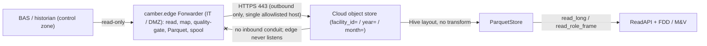

# Edge → cloud deployment (one-way, cybersecure)

`camber.edge` is a **one-way forwarder**: it runs on a small edge device (Raspberry Pi) or the BAS
front-end computer, reads BAS trend data **read-only**, maps point→role, quality-gates locally, and
**store-and-forwards** Parquet batches **outbound-only** to an org cloud data lake — where CAMBER
(cloud-side) organizes and analyzes them. It extends, and does not contradict, the posture in
[SECURITY.md](SECURITY.md).

The half that reads BAS data reuses the existing read-only ingest adapters; the half that lands in
the cloud reuses the existing [`ParquetStore`](SCALE.md) layout and [read API](DEPLOY.md). This
document is written for the IT / network-security team that must approve the edge.

## 1. Reference architecture

```
                    IT / DMZ zone                         │      cloud
  BAS / historian  ───(read-only)──▶  EDGE (Pi / Windows) ──── HTTPS 443, outbound-only ───▶  object store
   (control zone)                       camber.edge                (single allowlisted host)      │
                                     read → map → quality                                         ▼
                                     → Parquet → spool → PUT                         ParquetStore (facility_id=/year=/month=)
                                                                                                  │
                                                                                          existing ReadAPI + FDD/M&V
```

*One-way only: the edge sits in IT/DMZ, reads the BAS read-only, and never listens — the sole conduit is outbound 443 to one host.*


```mermaid
flowchart LR
  bas["BAS / historian (control zone)"] -- "read-only" --> edge["camber.edge Forwarder (IT / DMZ): read, map, quality-gate, Parquet, spool"]
  edge -- "HTTPS 443 (outbound only, single allowlisted host)" --> obj["Cloud object store (facility_id= / year= / month=)"]
  obj -- "Hive layout, no transform" --> ps["ParquetStore"]
  ps -- "read_long / read_role_frame" --> api["ReadAPI + FDD / M&V"]
  obj -- "no inbound conduit; edge never listens" --x edge
```

- **Historian-first.** Prefer reading a historian / SQL / Haystack API (`camber.ingest.sql`,
  `camber.ingest.haystack`) — NIST SP 800-82 places historians at a low trust tier reached through a
  one-way conduit. Live protocol polling is the exception.
- **Live BAS only when there is no historian.** `camber.ingest.bacnet` (read services only, incl.
  **BACnet/SC** via `BacnetTarget(secure=True, hub_uri, cert, key, ca)`), `modbus`, `opcua`, or
  `mqtt_stream` — preferably through a **read-only gateway**, never by writing to controllers.
  **BACnet/SC is an option, not an assumption**: sites without it use plain read-only BACnet through
  a gateway.
- **Never on the control VLAN.** The edge sits in IT/DMZ; the only conduit out is outbound-443 to one
  cloud host. There is **no conduit back into the control zone** — the edge never listens.

## 2. Data flow & landing format

Each `poll_once` produces one Parquet part per `year=/month=` partition, written **directly into
the store's Hive
layout** so the cloud reads it with the existing `ParquetStore.read_long` / `read_role_frame` /
`ReadAPI` and **no transform**:

- **Long schema** (the store's native shape): `[ts, equip, equip_class, role, value]`; NaNs dropped
  (observations, not a dense grid). `facility_id`, `year` and `month` are encoded in the **object
  key path**, not the file (standard Hive partitioning).
- **Object key**: `facility_id=<id>/year=<yyyy>/month=<m>/part-<sha16>.parquet`, where `<sha16>` is
  the first 16 hex of the batch content SHA-256. Re-sending identical content lands the same key →
  **idempotent**. Month keys match the store's layout since 0.95, so retention prunes month by
  month without splitting an edge part. Forwarders before 0.95 wrote year-only keys
  (`facility_id=<id>/year=<yyyy>/part-<sha16>.parquet`); the landing still accepts and reads them,
  and `camber store migrate-partitions` converts them. If an older forwarder re-sends a year-only
  part after its year was migrated, the landing recognises it (same name and sha256 as recorded by
  the migration) and quarantines it as a `duplicate` instead of storing its rows twice.
- **Per-batch manifest** (sink metadata): facility, window, rows, roles, equips, quality summary,
  full `content_sha256`, `schema_version` — for cloud-side reconciliation and audit.
- **NDJSON** (`wire_format="ndjson"`) is a documented compatibility fallback for endpoints that can't
  accept Parquet PUTs; Parquet is the default (zero cloud transform).

## 3. IT-approval security dossier

### Threat model (from [SECURITY.md](SECURITY.md))
Pivot risk (a host with a route toward controllers), credential/cert exposure, accidental writes,
discovery side-effects, and sensitive data. The forwarder is designed so each is closed by
construction.

### Properties enforced in code (not prose) — with the test that proves each

| Property | How it's enforced | Proven by |
|---|---|---|
| **Read-only toward the BAS** | the edge only calls `load_points` / `point_names` / `units`; no write service is imported | `test_ingest_protocols.py::test_edge_modules_are_readonly_and_one_way` (AST guard) |
| **No inbound listener, ever** | no `socket` / `http.server`; the sink is an outbound `urllib` PUT | same AST guard (forbids `bind`/`listen`/`accept`/`recv`/`socket`/`*HTTPServer`) |
| **TLS always verified** | `ssl.create_default_context()`; `https`-only scheme | same AST guard (forbids `_create_unverified_context`/`CERT_NONE`) + `test_edge_sink.py` |
| **No long-lived cloud creds on the edge (default)** | presigned URL / broker only; no access keys stored | `test_edge_config.py::test_default_sink_needs_only_env_url` |
| **Secrets from environment only** | `load_config` rejects secret-shaped keys / presigned URLs in the file | `test_edge_config.py::test_rejects_secret_key_in_file` |
| **Bounded egress allowlist (one host)** | every resolved URL host must equal the configured host | `test_edge_sink.py::test_presigned_host_allowlist_blocks_redirect` |
| **Tamper-evidence + idempotent landing** | `content_sha256` in the key + `x-camber-content-sha256` header | `test_edge_forwarder.py::test_manifest_carries_audit_fields` |
| **Never lose data offline** | durable spool: atomic enqueue, retry/backoff, backfill after reboot, bounded-disk eviction with a WARNING | `test_edge_spool.py` |
| **Per-batch audit log** | a structured `camber.edge` log record per PUT (host, key, bytes, sha256, status) | `test_edge_sink.py` / operator captures logs |
| **Loss-free journal compaction** (0.95) | the compacted journal is read back and compared with the queue before an atomic swap | `test_edge_compact.py` |
| **No retirement with data in flight** (0.95) | `decommission` refuses while any batch is unacknowledged, unless `--force` + reason (refused under a legal hold) | `test_edge_decommission.py` |
| **Nothing lands for a facility that left** (0.95) | uploads of non-accepting or unknown facilities go to quarantine, never the store | `test_edge_quarantine.py` |
| **No cloud API calls from the lifecycle tools** (0.95) | `bucket-rules` only emits JSON; its module imports no SDK or network module | `test_edge_bucket_rules.py::test_never_imports_a_cloud_sdk_or_a_network_module` |

### Standards mapping
- **NIST SP 800-82r3** — the edge realizes the *one-way conduit / data-diode, push-upward* pattern;
  historian-first keeps the source at the low-trust historian tier; audit logging satisfies the
  OT-footprint requirement.
- **ISA/IEC 62443 (zones & conduits)** — the edge is an IT/DMZ-zone asset; the single conduit is
  outbound-443 to one cloud host; there is no conduit back into the control zone (no listener);
  least privilege = a read-only source account / monitoring-scoped BACnet/SC cert.
- **ANSI/ASHRAE 135 (incl. BACnet/SC)** — when a live source is unavoidable, only read services are
  used (`ReadProperty` / `ReadPropertyMultiple` / `ReadRange`), and `BacnetTarget(secure=True, …)
  .validate()` carries the SC certificate config; SC is used where present, never assumed.

## 4. Install recipes

### Raspberry Pi (arm64) — systemd daemon
The multi-arch image publishes `linux/arm64`. Or install the wheel and run under systemd:

```ini
# /etc/systemd/system/camber-edge.service
[Unit]
Description=CAMBER one-way edge forwarder
After=network-online.target

[Service]
Type=simple
User=camber
EnvironmentFile=/etc/camber/edge.env          # secrets live here (0600, root-owned), NOT in the config
ExecStart=/opt/camber/venv/bin/camber edge run /etc/camber/edge.json
Restart=on-failure
# hardening: no new privileges, read-only root, private tmp
NoNewPrivileges=true
ProtectSystem=strict
ReadWritePaths=/var/lib/camber/spool
PrivateTmp=true

[Install]
WantedBy=multi-user.target
```

`/etc/camber/edge.env` (mode 0600) holds only the secret:
`CAMBER_EDGE_SINK_URL_TEMPLATE=https://<lake-host>/<path>/{key}?<presigned-query>`.

### Windows BAS front-end — Task Scheduler (simplest IT sign-off)
Run **one poll+push on a schedule** — no service, no listener:

```
schtasks /Create /TN "camber-edge" /SC MINUTE /MO 60 ^
  /TR "C:\camber\venv\Scripts\camber.exe edge send-once C:\camber\edge.json"
```

Set the presigned URL template as a machine/user environment variable
(`CAMBER_EDGE_SINK_URL_TEMPLATE`), never in `edge.json`. `edge send-once` reads the window, spools,
and pushes, then exits — nothing stays resident and nothing listens.

## 5. Configuration & secrets

`edge.json` (no secrets — `load_config` rejects any it finds):

```json
{
  "facility_id": "fox-lodge-9f3a1c",
  "source": {"kind": "sql", "note": "inject a read-only DB connection in code, or use a csv_* kind"},
  "sink": {"kind": "presigned", "host": "lake.example.org", "ca_file": "/etc/camber/ca.pem"},
  "mapping": {"aliases": {"AHU_1_SupplyAirTemp": "supply_air_temp"}},
  "resample": "1h",
  "interval": 3600,
  "spool_dir": "/var/lib/camber/spool",
  "spool_max_bytes": 2147483648
}
```

- **Secrets are env-only**: `CAMBER_EDGE_SINK_URL_TEMPLATE` (presigned template), plus any source
  credentials. The config file carries only the **allowlisted host**, CA path, mapping, and cadence.
- **Live protocol sources** (`sql`/`haystack`/`bacnet`/`opcua`/`modbus`/`mqtt`) need a client /
  connection the deployer owns — inject it via `build_forwarder(cfg, source=…)`. File sources
  (`csv_wide`/`csv_long`/`csv_perpoint`) build from config directly.
- **SDK sinks** (`edge-s3` / `edge-azure` / `edge-gcs`) are for sites that mandate direct scoped
  credentials instead of presigned URLs; the default presigned path needs **no cloud SDK and no
  stored keys**.

## 6. Egress-allowlist request for IT

> Please allow **outbound TCP 443 only**, from host `<edge-host>` to **`<lake-host>`** (a single
> destination). No inbound rules are required — the edge never listens. No other egress is needed.
> Protocol: HTTPS (TLS 1.2+), certificate verification enforced. Data direction is **one-way,
> edge→cloud**.

## 7. Audit log

Each delivery emits one `camber.edge` record; ship these to your SIEM:

```
INFO camber.edge edge.sink.put host=lake.example.org key=facility_id=fox-lodge-9f3a1c/year=2024/month=7/part-1a2b3c4d5e6f7a8b.parquet bytes=48213 sha256=<64hex> status=200 ok=True
INFO camber.edge edge.forward facility=fox-lodge-9f3a1c rows=2160 parts=1 forwarded=1 spool_remaining=0
```

## 8. Failure modes

- **Offline** → batches accumulate in the durable spool; delivery resumes (oldest-first backfill)
  when the link returns. The spool survives process crashes and reboots (journal-reconstructed).
- **Spool over the disk cap** → the oldest batch is dropped with a logged `WARNING` (explicit,
  audited data loss — never silent corruption).
- **Transient sink error** → the batch is kept, an attempt is recorded, a capped backoff is applied,
  and the next cycle retries. Nothing is acked until a 2xx.
- **Journal growth** → the journal is append-only; `camber edge compact` (0.95) rewrites it to the
  pending batches, loss-free and crash-safe (see §9). A torn last line from a crash is skipped on
  replay, and the next append starts a fresh line.

## 9. Lifecycle: reconciliation, quarantine, decommissioning

*Provisional (0.95, #18 step 5).* These commands keep what lands in the cloud consistent with the
portfolio's facility registry ([PORTFOLIO.md](PORTFOLIO.md)), retire devices without losing data,
and keep the bucket's retention in line with the policy. Lifecycle state is read only through
`camber.portfolio`. A facility **accepts** uploads when it is `provisioning` or `active`; any other
state (`suspended`, `offboarding`, `archived`, or a state this CAMBER does not know) does not. A
purged facility's id is tombstoned, so its uploads read as `unknown_facility` (a retired id) and
are quarantined too. An archived facility's hot data is already gone, and its store refuses writes.

### Reconciliation (central, read-only by default)

`camber edge reconcile` classifies every landed object against the registry:

| Category | Meaning | `--apply` |
|---|---|---|
| `ok` | a store key of a facility that accepts data | - |
| `orphaned` | not a store object key (bad layout, invalid facility id, unknown extension) | reported only |
| `unknown_facility` | a facility id the registry does not know, or a retired (tombstoned) one | quarantined (landing); reported (store) |
| `unregistered` | store data with no registry entry (a pre-portfolio store; reads as active) | reported only |
| `inactive` | a facility that does not accept data | quarantined if it landed after the state change |
| `quarantined` | under the bucket's `_quarantine/` prefix (key listings) | - |
| `duplicate` | a year-only part the store already migrated to month partitions (re-sent by an older forwarder) | quarantined |

It reads the workspace store (the default), a local landing directory (`--landing`, e.g. an inbox
or a mounted bucket) or a key listing exported from the cloud (`--keys`: the JSON of
`aws s3api list-objects-v2`, `gcloud storage objects list --format=json` or
`az storage blob list`, `aws s3 ls --recursive` text, or one key per line). CAMBER never lists or
moves cloud objects itself, so `--apply` works only on local directories.

In the store, an inactive facility's objects that landed **before** its state change are
legitimate history (an offboarding facility's export needs them) and are only reported. Objects
whose file time is **after** the facility's `state_changed_at` are late uploads, and `--apply`
quarantines them. When either time is unknown, the object is reported only.

### Quarantine

Uploads never enter the store for a facility that does not accept data:

- **A landing inbox:** `camber edge land <inbox> --apply --reason R` moves accepted objects into
  the store and the rest into `<workspace>/quarantine/<key>`, beside a `<key>.quarantine.json`
  record (category, facility state, reason, sha256, bytes, times). An object whose content sha256
  does not start with the `part-<sha16>` in its name is quarantined too (`hash_mismatch`).
  Orphaned and NDJSON objects stay in the inbox and are reported.
- **A presigned-URL broker:** call `camber.edge.landing.route_key(portfolio, key)` before signing
  a URL. It returns the key itself, or `_quarantine/<key>` for a facility that does not accept
  data. The leading underscore keeps pyarrow / Hive discovery from reading it as data.

`camber edge quarantine list` shows each object with its status: `held`, or `incomplete` (a
record whose object is missing, left by an interrupted run), or `unrecorded`. `release` moves
objects into the store once the facility accepts data again (resume or restore it first). It
refuses a hash mismatch, a `duplicate` of already-migrated rows, or a store key that already
holds different content. `discard` deletes
objects: it needs `--yes` or `--confirm <facility_id>`, and a legal hold refuses it. Every change
is audited per facility with a `begin` and a `done` record. Records are written before objects
move, and objects are moved before their source is removed, so re-running any interrupted command
finishes it.

### Decommissioning a device

```
camber edge decommission /etc/camber/edge.json                    # dry run
camber edge decommission /etc/camber/edge.json --apply --confirm fox-lodge-9f3a1c \
    --reason "building sold" [--wait 300] [--workspace /srv/portfolio]
```

1. **Flush:** drain the spool through the sink, retrying with backoff for up to `--wait` seconds.
2. **Wait for acknowledgements:** a batch counts only when the landing answers 2xx. If any batch
   is still unacknowledged, the command **refuses** (exit 1) and changes nothing. `--force
   --reason R` retires anyway: the payloads stay on disk and are listed in the receipt. A legal
   hold on the facility refuses `--force`.
3. **Retire:** write `retired.json` (the receipt: facility, device id, OS user, host, reason,
   time, anything unacknowledged) to the spool. From then on the spool refuses new batches,
   `edge run` / `send-once` exit 1, and `edge status` shows `RETIRED`.
4. **Record centrally:** with a reachable workspace (`--workspace` or `$CAMBER_PORTFOLIO`), an
   `edge.decommission` audit line and a note `edge_devices.<device_id>` on the facility's
   registry entry. Otherwise copy `retired.json` to the portfolio host and run
   `camber edge record-retirement retired.json --reason R`. Recording is idempotent.

The device id is the config's `device_id` (or `CAMBER_EDGE_DEVICE_ID`, or `--device`), else the
machine's node name. The spool lock is held through steps 1–3, so a running forwarder cannot
enqueue mid-way. It is released before step 4 takes the portfolio lock (through
`Portfolio.note_edge_device`): the two locks are never held together, so a device's spool lock
never blocks `Portfolio.recover()` or any portfolio command, and a held portfolio lock never
blocks the spool. `recover()` does not touch `retired.json` or the registry note. A re-run after a crash continues where the last run stopped: acks are journalled one by
one, and an already-retired spool skips straight to the central note.

### Spool journal compaction

`camber edge compact <edge.json>` (from cron or Task Scheduler, e.g. weekly) rewrites
`journal.ndjson` to one record per pending batch plus a high-water `mark`, so sequence numbers
are never reused. The new journal is written to a side file, fsynced, read back and checked to
hold exactly the same pending batches (sequence, key, payload, metadata, attempt count). Only then
is it swapped in with an atomic rename. A crash leaves the old journal or the new one, never fewer
pending batches. Payload files that no journal record owns (an enqueue interrupted before its
commit) are reported, never deleted. `--dry-run` reports only.

### Bucket lifecycle rules

`camber edge bucket-rules --provider s3|gcs|azure` turns the retention policy into the provider's
lifecycle JSON. It uses the workspace's policy, facility overrides and legal holds (read through
`camber.portfolio`), or a `--policy FILE`. **It only prints text and never calls a cloud API.**
Review the output, merge it with any existing rules (applying replaces the bucket's whole
lifecycle configuration), then apply it yourself:

```
aws s3api put-bucket-lifecycle-configuration --bucket <bucket> --lifecycle-configuration file://rules.json
gcloud storage buckets update gs://<bucket> --lifecycle-file=rules.json
az storage account management-policy create --account-name <account> --resource-group <group> --policy @rules.json
```

The policy file schema:

```json
{
  "defaults":    {"raw_trends": {"keep_months": 25}, "hourly_rollups": {"keep_years": 7},
                  "daily_rollups": {"keep": "indefinite"}},
  "overrides":   {"fox-lodge-9f3a1c": {"raw_trends": {"keep_months": 36}}},
  "legal_holds": {"elm-court-0b1c2d": {"reason": "litigation"}}
}
```

A rule is `keep_days`, `keep_months` or `keep_years` (a positive whole number), or
`keep: indefinite | forever | equipment_life | legal_hold` (no expiry). A bare defaults object
and the `_portfolio.json` shape are accepted too, and so is the policy document of
`camber retention show --json` (what `--workspace` reads). Bucket data classes and their prefixes
come from each class's `location` in that document. With `--layout store` (the default), `--prefix`
is the store root, where the forwarder lands: `raw_trends` at `facility_id=<id>/`,
`hourly_rollups` at `rollups/hourly/facility_id=<id>/` and `daily_rollups` at
`rollups/daily/facility_id=<id>/`. With `--layout workspace`, `--prefix` mirrors the whole
workspace, so raw trends are at `store/facility_id=<id>/`. A facility prefix covers both the
`year=/month=` keys and legacy year-only keys. Other classes (findings, baselines, reports, the
audit log) are not bucket objects, and `_quarantine/` gets no rule.

- **Conservative ages:** a month counts as 31 days and a year as 366, so a rule never expires an
  object before the policy would. Providers count age from the upload, not the data's timestamps,
  so a backfilled month is kept longer, never shorter.
- **Overrides and holds** cannot be carved out of a bucket-wide rule, because providers apply every
  matching rule. With either, rules are emitted per facility (GCS and Azure group facilities of
  equal age into one rule). A held facility gets no rule: also set the provider's own legal hold
  or retention lock on its prefix. Without a facility list, overrides and holds are refused.
- Provider limits (S3 1000 rules, GCS and Azure 100) are checked. Azure needs `--container`,
  because its prefix filters start with the container name.

