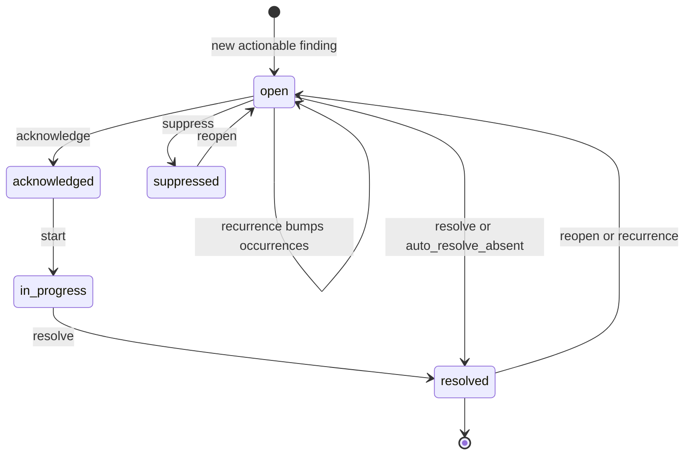

# Fault lifecycle at scale

Detection produces findings every run; at portfolio scale you also need to **track** them — who
owns each open fault, what state it's in, and whether it's been handled in time. `rules.triage`
ranks and groups a single run's findings and `FaultRegister` is a lightweight in-memory
new/ongoing/resolved classifier; `camber.faultlifecycle.FaultLifecycle` is the durable,
operational store on top.

A fault is keyed by a stable **(key, equip, rule) fingerprint**, so the same issue is one
record across runs rather than a new alert each time. Pass `facility_id=` (to `load` or `update`)
and the key is the facility's never-reused id, so renaming the facility keeps its history.
Without one, the key is the `site` string, as before 0.86. Inside a portfolio workspace, config
runs do this for you. The optional `faults` config section folds every run into
`state/<facility_id>/faults.json`. Older site-keyed files are read through a deprecated
compatibility path and moved with `camber portfolio migrate` (see
[PORTFOLIO.md](PORTFOLIO.md#per-facility-state)).

*The durable state machine `FaultLifecycle` tracks: open, acknowledged, in_progress, resolved, plus suppressed.*



## Folding runs

```python
from camber.faultlifecycle import FaultLifecycle

lc = FaultLifecycle.load("faults.json")  # empty if the file doesn't exist yet
res = lc.update(findings, run_id="2026-06-14T06:00", site="HQ")
# res -> {"new": [...], "ongoing": [...], "reopened": [...], "absent": [...], "resolved": [...]}
lc.save()
```

- New actionable findings (`fault`/`warn`) create **open** records; recurring ones bump
  `occurrences` + `last_seen`.
- A previously-**resolved** fault that recurs is **reopened** (toggle with
  `reopen_on_recurrence=False`).
- Open faults **absent** from the run are returned as close candidates — or set
  `auto_resolve_absent=True` to resolve them at `run_id`.

### Which faults a run can close

A run only reports, and with `auto_resolve_absent` only resolves, the faults that share its key.
One store file can hold several sites (or site-keyed and facility-keyed records side by side),
and a run for one of them never looked at the others.

- **With a `facility_id`** (the portfolio `state/<facility_id>/faults.json` path), `absent` covers
  the records whose `facility_id` is that facility.
- **Without one** (the legacy, site-keyed path), `absent` covers the site-keyed records whose
  **fingerprint** is `sha1(site, equip, rule)` for the run's `site`. The fingerprint decides, not
  the stored `site` label. Facility-keyed records and other sites' records are left alone.
  `site=""` is a key like any other: it matches only records written with `site=""`. `aliases`
  (earlier, merged fingerprints) never widen the scope.
- **Unknown site.** A site-keyed record whose fingerprint matches neither the run's `site` nor its
  own stored `site` label cannot be placed: a hand-edited record, or one with no stored `site`
  (it loads with `""`). Such a record is **never auto-resolved**. While it is open, every unbound
  run lists it under an extra `res["unscoped"]` key, which is present only when non-empty. The CLI
  prints a line for it too. Resolve it by hand (`lc.resolve(fp, ...)`), or re-key the file with
  `camber portfolio migrate`.

Before 0.96 (#76), the unbound path treated every open record in the file as absent. A run with
`auto_resolve_absent=True` for one site therefore resolved every other site's open faults. The
in-memory `rules.triage.FaultRegister` had the same flaw and is scoped the same way.

## Workflow

```python
fp = res["new"][0]
lc.assign(fp, "alice")
lc.acknowledge(fp, "2026-06-14T07:00")
lc.start(fp)
lc.resolve(fp, "2026-06-14T11:00", note="replaced HW valve actuator")
# also: lc.suppress(fp), lc.reopen(fp), lc.add_note(fp, "...")
```

States: **open → acknowledged → in_progress → resolved**, plus **suppressed** (known/accepted,
excluded from open work).

## SLA & aging

```python
lc.aging("2026-06-14T12:00")  # {fingerprint: hours_open} for open faults
lc.overdue(
    "2026-06-14T12:00",
    ack_sla_hours={"fault": 4, "warn": 24},
    resolve_sla_hours={"fault": 48, "warn": 168},
)
# -> [(record, "ack"|"resolve", age_hours, sla_hours), ...]
lc.summary()  # {total, open, by_status, open_by_severity}
```

A still-unacknowledged `open` fault older than its **ack** SLA is `"ack"`-overdue; any open fault
older than its **resolve** SLA is `"resolve"`-overdue. SLAs are per severity and caller-supplied.

## Option flags

| call | flag | default | effect |
|---|---|---|---|
| `update` | `actionable` | `{"fault","warn"}` | severities that become tracked records |
| `update` | `reopen_on_recurrence` | `True` | recurrence reopens a resolved fault |
| `update` | `auto_resolve_absent` | `False` | resolve open faults absent from the run |
| `overdue` | `ack_sla_hours` / `resolve_sla_hours` | `{}` | per-severity SLA hours |
| `resolve`/`suppress` | `note` | `None` | append a note when changing state |

## Persistence

State is a single JSON document written atomically (`save`) and reloaded with `load` — no
database. Queries: `records()`, `open_faults()`, `by_status(s)`, `by_assignee(who)`, `get(fp)`.
For very large portfolios the per-site SQL/historian store is the natural backing tier; this JSON
store covers a building-to-campus scale operational workflow without a new dependency.
