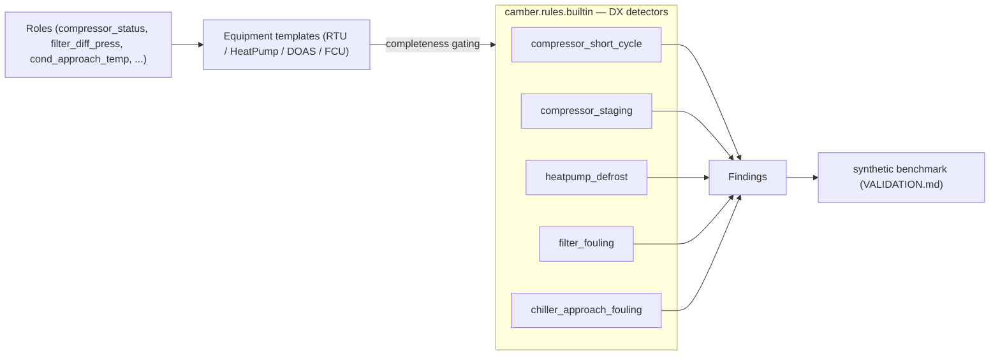

# Packaged / DX equipment FDD

0.5 extends the vendor-neutral rule library beyond built-up AHUs and central plants to the packaged
and refrigerant-side equipment that dominates small–mid commercial stock: **rooftop units (RTU),
heat pumps / VRF, DOAS/ERV, fan-coil units (FCU)**, and **refrigerant-side chiller** degradation. As
always, rules key off `Role`s (not vendor tags), each ships a synthetic fixture, and each is
accuracy-scored in the [synthetic benchmark](VALIDATION.md).

*Role-keyed DX detectors, gated by per-unit completeness, fan into Findings scored by the benchmark.*

## New roles

Status/stage and refrigerant-side signals (all with `PHYSICAL_BOUNDS` + a Haystack hint):

| Role | Meaning |
|------|---------|
| `compressor_status` | DX compressor running (1) / off (0) |
| `compressor_stage` | active DX cooling stage (0,1,2,…) |
| `condenser_fan_status` | condenser/outdoor fan running |
| `heat_stage` | active gas/electric heating stage |
| `reversing_valve_cmd` | heat-pump mode: heating (1) / cooling (0) |
| `filter_diff_press` | differential pressure across the air filter (inH2O) |
| `supply_air_humidity` / `return_air_humidity` | air-side relative humidity (%) |
| `cond_approach_temp` / `evap_approach_temp` | chiller approach temperatures (°F) |

## New equipment templates

`RTU`, `HeatPump` (VRF), `DOAS` (ERV via optional humidity roles), and `FCU` (now a distinct template,
not the VAV alias). Completeness validation gates which rules can run per unit — e.g. `HeatPump`
requires a reversing-valve command; `DOAS` requires outdoor-air flow.

## New rules

- **`compressor_short_cycle`** — DX compressor firing in short bursts (starts/day past a
  min-off-time ceiling). Reuses the generic on/off start counter. Flag: `max_starts_per_day`.
- **`compressor_staging`** — unstable multi-stage DX (excess stage changes/day). Flag:
  `max_changes_per_day`.
- **`heatpump_defrost`** — excess heat-pump defrost / reversing-valve cycling (iced coil or faulty
  defrost termination). Flag: `max_reversals_per_day`.
- **`filter_fouling`** — air filter at/above its change-out differential pressure (wasted fan energy,
  starved airflow). Flag: `change_dp_inwc` (default ~1.0 inH2O).
- **`chiller_approach_fouling`** — condenser/evaporator **approach-temperature** degradation (tube
  fouling / low charge), the refrigerant-side indicator that needs no refrigerant-pressure
  instrumentation. Flags: `cond_design_f`, `evap_design_f`.

Every rule returns `info` (not a false fault) when its required role is absent, is registered in
`camber.rules.builtin`, and runs unchanged across any building once its points are mapped.
