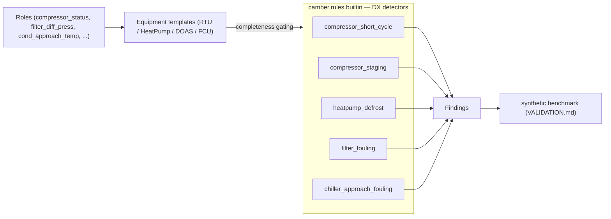

# Packaged / DX equipment FDD

0.5 extends the vendor-neutral rule library beyond built-up AHUs and central plants to the packaged
and refrigerant-side equipment that dominates small–mid commercial stock: **rooftop units (RTU),
heat pumps / VRF, DOAS/ERV, fan-coil units (FCU)**, and **refrigerant-side chiller** degradation. As
always, rules key off `Role`s (not vendor tags), each ships a synthetic fixture, and each is
accuracy-scored in the [synthetic benchmark](VALIDATION.md).

```mermaid
flowchart LR
    roles["Roles (compressor_status, filter_diff_press, cond_approach_temp, ...)"] --> tmpl["Equipment templates (RTU / HeatPump / DOAS / FCU)"]
    tmpl -- "completeness gating" --> rules
    subgraph rules["camber.rules.builtin — DX detectors"]
        r1[compressor_short_cycle]
        r2[compressor_staging]
        r3[heatpump_defrost]
        r4[filter_fouling]
        r5[chiller_approach_fouling]
    end
    r1 --> find[Findings]
    r2 --> find
    r3 --> find
    r4 --> find
    r5 --> find
    find --> bench["synthetic benchmark (VALIDATION.md)"]
```

*Role-keyed DX detectors, gated by per-unit completeness, fan into Findings scored by the benchmark.*

## New roles

Status/stage and refrigerant-side signals (all with `PHYSICAL_BOUNDS` + a Haystack hint):

| Role | Meaning |
|------|---------|
| `compressor_status` | DX compressor running (1) / off (0) |
| `compressor_stage` | active DX cooling stage (0,1,2,…) |
| `condenser_fan_status` | condenser/outdoor fan running |
| `heat_stage` | active gas/electric heating stage |
| `reversing_valve_cmd` | heat-pump mode: heating (1) / cooling (0) |
| `filter_diff_press` | differential pressure across the air filter (inH2O) |
| `supply_air_humidity` / `return_air_humidity` | air-side relative humidity (%) |
| `cond_approach_temp` / `evap_approach_temp` | chiller approach temperatures (°F) |

## New equipment templates

`RTU`, `HeatPump` (VRF), `DOAS` (ERV via optional humidity roles), and `FCU` (now a distinct template,
not the VAV alias). Completeness validation gates which rules can run per unit — e.g. `HeatPump`
requires a reversing-valve command; `DOAS` requires outdoor-air flow.

## New rules

- **`compressor_short_cycle`** — DX compressor firing in short bursts (starts/day past a
  min-off-time ceiling). Reuses the generic on/off start counter. Flag: `max_starts_per_day`.
- **`compressor_staging`** — unstable multi-stage DX (excess stage changes/day). Flag:
  `max_changes_per_day`.
- **`heatpump_defrost`** — excess heat-pump defrost / reversing-valve cycling (iced coil or faulty
  defrost termination). Flag: `max_reversals_per_day`.
- **`filter_fouling`** — air filter at/above its change-out differential pressure (wasted fan energy,
  starved airflow). Flag: `change_dp_inwc` (default ~1.0 inH2O).
- **`chiller_approach_fouling`** — condenser/evaporator **approach-temperature** degradation (tube
  fouling / low charge), the refrigerant-side indicator that needs no refrigerant-pressure
  instrumentation. Flags: `cond_design_f`, `evap_design_f`.

Every rule returns `info` (not a false fault) when its required role is absent, is registered in
`camber.rules.builtin`, and runs unchanged across any building once its points are mapped.

<!-- 0.93 (#40, #6) block (093-refrig) -->
## Refrigerant-side DX and heat-pump rules (0.93)

*Provisional (GitHub issues #40 and #6).* Three detectors read a DX unit's or heat pump's refrigerant
circuit and indoor coil. Each has two modes:

- **Target mode** (`analyze`, the ordinary `camber run`): the unit's median in cooling operation is
  compared with a manufacturer target. Pass `targets={"subcooling_f": 10}`, or per equipment
  `{"RTU-*": {...}}`. Without a target, only wide universal limits apply.
- **Baseline mode** (`analyze_periods`, the new `dx` drift family, `camber drift`): the unit is
  compared with its own frozen fault-free period **at matched conditions**. The normalizer is
  outdoor air plus return air for an air-cooled unit, or load in tons for a water-cooled machine.
  The finding reports the current median residual against both a degF floor and a sigma floor.

Rows count only in cooling operation: compressor on, reversing valve in cooling and supply air
below return, whichever of those points are mapped. The inputs can be controller-reported or
derived from pressures and line temperatures (see [Refrigerant properties](REFRIGERANT.md)).

| Rule | Reads | Verdicts |
|---|---|---|
| `dx_refrigerant_charge` (built-in) | liquid subcooling; superheat as corroboration (`metric="superheat"` for a fixed-orifice unit) | `undercharge`, `overcharge` |
| `dx_indoor_airflow` (built-in) | evaporator temperature split, return minus supply, matched on return air and the return dew point (`return_air_dewpoint_temp`, or computed from return RH) | `airflow_low`, `airflow_high`; a narrowed split with subcooling down is reported as `capacity_low` (charge), not high airflow |
| `discharge_superheat_drift` (`dx` family, #6) | discharge superheat, two-sided, plus the family's CUSUM for a sustained shift | rose: starved compressor (low charge, restriction); fell: liquid reaching it (overcharge, floodback) |

Without targets the universal limits are 2-25 °F of subcooling (below 2 °F the valve is fed flash
gas) and an 8-28 °F split. The magnitude floors are screening-grade and were characterized on the
NIST heat pumps below. They are constructor arguments.

**Equipment classes.** A new `dx` family covers split and packaged AC and condensing units that are
not heat pumps (`DX`, `SPLIT_SYSTEM`, `CONDENSING_UNIT`, `ACCU`, ...). `dx_refrigerant_charge` runs on
`heat_pump`, `dx` and `air_handler` (an RTU's DX section). `dx_indoor_airflow` runs on `heat_pump`
and `dx` only: a chilled-water AHU's split follows its valve, not its airflow.

### Scored on `nist-heatpump-fdd`

The data are 56 scoreable labelled runs: two residential R-410A split heat pumps with TXVs, each on
two line sets, tested in steady state. The 17 mislabelled EF files, the 6 `CF_50` files and the 2
JUNK files are excluded as the catalog documents. Each **test file** (one steady-state test,
269 files) was scored against the fault-free files of the same unit and line set, **leaving the file
itself out** (baseline mode, one averaged row per test point). The rates are Wilson 95% intervals.

| Detector | Target faults | TPR | FPR (fault-free files) | Fires on other faults |
|---|---|---|---|---|
| `dx_refrigerant_charge` | under- / overcharge (incl. doubles) | 86/95 = 91% [83-95] | 7/90 = 8% [4-15] | 34/84 = 40% |
| `dx_indoor_airflow` | low / high indoor airflow (incl. doubles) | 20/93 = 22% [14-31] | 2/90 = 2% [1-8] | 2/86 = 2% |
| `discharge_superheat_drift` | under- / overcharge | 30/95 = 32% [23-41] | 5/90 = 6% [2-12] | 27/84 = 32% |

What the numbers say:

- **Charge.** Every overcharge file (16/16) and 70 of 79 undercharge files are caught. All 34 of
  its firings on other faults are condenser-blockage tests, alone or with an airflow fault, and
  mostly on the 16 SEER unit, whose subcooling falls 4-9 °F with a blocked coil exactly as it does
  with undercharge. A charge verdict is therefore a prompt to check the charge
  **and** the condenser coil. Scored per run, with fault-free runs split into two halves by file,
  it catches 23/24 charge runs at 0/8 false alarms. The run template's **target mode**, with targets
  taken from the fault-free runs and so in-sample, catches 24/24 at 0/4.
- **Indoor airflow.** At 15% or more airflow reduction (EF ≤ 85%) it catches 18/44 files. At 5-14%
  (0/22) and on increased airflow (2/27) the split change sits inside the fault-free scatter. Most
  of the labelled airflow tests are double faults with undercharge or condenser blockage, which pull
  the split the other way. It almost never fires on a non-airflow fault (2%).
- **Discharge superheat (#6).** Weaker than subcooling on these TXV units, confirming #6's original
  finding that it is the less sensitive signal. Undercharge raises it (30/79 files); overcharge
  barely moves it (0/16). Two of its five fault-free false alarms are the two files that run
  with negative suction superheat (`fault-free-points-not-steady-cooling`).

All seven charge false alarms are on the 14 SEER unit. Three are files with essentially no
subcooling: the two 2016-03-15 files in that data issue, and a two-point long-line-set file at
-1.1 °F. The other four sit 3.2-4.3 °F below their reference, just past the 3 °F floor. They are
left as published and count against the rule.

## Water-source heat pumps with three points (0.93)

Water-to-air heat pumps in a school or office are often trended with only discharge air, fan
status and zone temperature: no compressor status, no reversing valve and no refrigerant point.
`rules.heatpump_ops_rule.infer_hp_mode` reads the mode from the discharge air against the zone:
15 °F or more above means heating, 10 °F or more below means cooling. A mapped compressor status
and reversing valve take precedence. Three rules follow, all on the `heat_pump` class:

- **`hp_mode_vs_need`**: occupied hours spent cooling a room already below its heating setpoint,
  or heating one above its cooling setpoint (changeover, thermostat location, setpoints).
- **`hp_capacity_shortfall`**: the room outside its band. When the unit was already working in the
  right mode, the verdict is **capacity** (unit size, airflow, source-loop temperature,
  refrigerant). When the unit was idle, the verdict is **control** (thermostat, setpoint,
  schedule). This is the heat-pump counterpart of the VAV "zone below setpoint with reheat
  saturated" rule, which is for terminal boxes only.
- **`hp_room_imbalance`** (fleet): two or more units serving one room that fight (one heats while
  another cools), split the work very unevenly, or whose zone sensors disagree. Rooms come from the
  rule's `rooms={room: [units]}` or from a topology whose parent of each unit is its room.

Setpoints are the mapped `heat_sp` / `cool_sp`. Otherwise a stated default band of 68-76 °F applies,
with a caveat.

**Source loop.** `source_loop_deltat` (class family `source_loop`: `GEO_LOOP`, `GROUND_LOOP`, ...)
reads a heat-pump loop through the new generic roles `source_loop_supply_temp`,
`source_loop_return_temp`, `source_loop_diff_press` and `source_loop_pump_speed`. These are kept
apart from the chilled-water and tower roles, whose rules would misread such a loop. While the
pumps run, it flags a loop that carries almost no heat. The warn condition is a |ΔT| under 1 °F for
half the pumping time with a 90th percentile below half the ~10 °F design difference; the fault
condition is 80% of the time with a 90th percentile below a quarter of it. That pattern is
overpumping: constant speed, no differential-pressure reset, or heat-pump isolation valves left
open.

The faultlab scenarios for the five new single-equipment rules sit in
`faultlab.PENDING_SCENARIOS` until they are signed off as gated synthetic keys.
<!-- end 0.93 block -->
