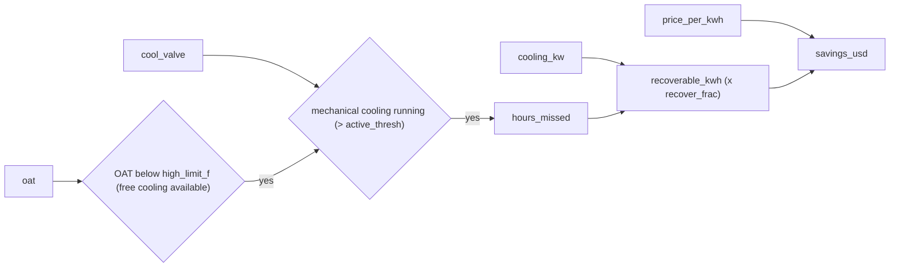

# Free-cooling (economizer) opportunity

`camber.freecooling` quantifies the **opportunity** an economizer fault leaves on the table — the
business case that funds the fix. Where the `outdoor_air_fraction` rule *detects* misbehavior, this
counts how many hours ran mechanical cooling while it was cool enough to cool for free, and (given a
cooling-power series and a price) the recoverable energy and dollars.


*Free-cooling hours are missed when it is cool out yet mechanical cooling runs; power and price value them.*

```python
from camber.freecooling import free_cooling_opportunity

opp = free_cooling_opportunity(
    oat, cool_valve, cooling_kw=chiller_kw, high_limit_f=65, recover_frac=0.7, price_per_kwh=0.15
)
opp.hours_missed, opp.recoverable_kwh, opp.savings_usd  # e.g. 286 h, 10010 kWh, $1502
```

Free cooling is *available* when OAT is below `high_limit_f` and *missed* when it's available yet
mechanical cooling runs (`cooling_signal > active_thresh`). With `cooling_kw` the missed-hours energy
is summed; `recover_frac` is the share an economizer could offset; `price_per_kwh` (caller-supplied)
values it. Without power the result is hours-only; without a price the energy is reported and savings
is NaN — nothing is fabricated. Pairs with `camber.fault_economics` (fault → dollars).
