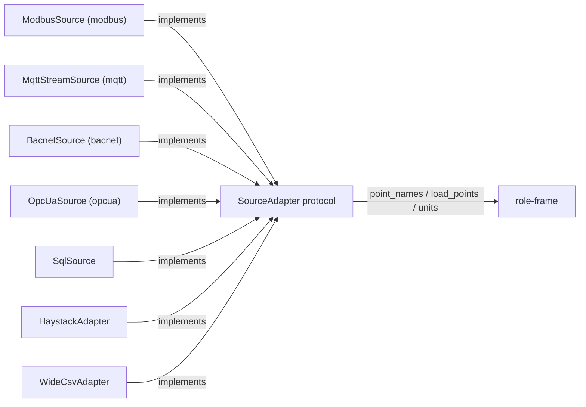

# Network ingest protocols

CAMBER's primary ingest path is the **historian / SQL / Haystack** tier (see
[SECURITY.md](SECURITY.md)). For sites where direct acquisition is required, it also ships
**read-only** network adapters for Modbus, MQTT, and BACnet. Each:

- implements the `SourceAdapter` shape (`point_names()` / `load_points()` / `units()`),
- imports its protocol library **lazily** behind an optional extra (the core stays
  dependency-light), and
- is **read-only by construction** — it references no write/command service (enforced by test).



*Every protocol adapter satisfies the same read-only `SourceAdapter` shape and fans into one role-frame.*

| Protocol | Module | Extra | Library | License | Shape |
|---|---|---|---|---|---|
| Modbus TCP | `camber.ingest.modbus` | `[modbus]` | pymodbus | BSD-3 | snapshot / poll |
| MQTT (+ Sparkplug) | `camber.ingest.mqtt_stream` | `[mqtt]` | paho-mqtt | EDL-1.0 / EPL-2.0 | streaming buffer |
| BACnet (+ SC) | `camber.ingest.bacnet` | `[bacnet]` | bacpypes3 | MIT | Trend-Log / present value |
| OPC-UA | `camber.ingest.opcua` | `[opcua]` | asyncua | **LGPL-3.0** † | history / current value |

† asyncua is LGPL-3.0 — kept as an optional, dynamically-imported dependency only (never
vendored/bundled), so CAMBER's own code stays Apache-2.0.

```
pip install "camber-toolkit[modbus]"   # or [mqtt], [bacnet], [opcua]
```

## Modbus — `camber.ingest.modbus`

Modbus has no history: a read returns the *current* register. `ModbusSource.read_snapshot()`
reads each mapped `ModbusPoint` (holding/input register, slave id, 16- or 32-bit, scale/offset);
`poll()` samples repeatedly into a short series; `load_points()` returns a one-row snapshot. For
long trends use a historian. Modbus has **no authentication or encryption** — keep the host out
of the control VLAN. The client is injectable (pymodbus-style `read_holding_registers` /
`read_input_registers`) for testing.

## MQTT — `camber.ingest.mqtt_stream`

MQTT is *push*. `MqttStreamSource.subscribe()` connects (TLS via `tls=True`), subscribes to the
mapped topics, and routes each message into the pure `ingest()` handler, which parses the payload
(a bare value, or a JSON field via `value_key` — including Sparkplug-B metric fields) and buffers
a timestamped sample. `to_frame()` / `load_points()` shape the buffer into per-point series. The
adapter only subscribes; it never publishes.

## BACnet — `camber.ingest.bacnet`

The analytics-friendly BACnet source is a **Trend Log** object, which already holds timestamped
records; `BacnetSource.read_trend_log()` / `load_points()` shape them into series, and
`read_snapshot()` reads present values. The adapter uses only read services
(`READ_SERVICES = ReadProperty, ReadPropertyMultiple, ReadRange`).

### BACnet/SC (Secure Connect) — experimental, certificate-gated

Legacy BACnet/IP is UDP, cleartext, broadcast-based, and unauthenticated. **BACnet/SC**
(ANSI/ASHRAE Addendum 135-2016bj, now in ASHRAE 135) replaces that datalink with secure
WebSockets (`wss://` over TLS 1.3), a hub-and-spoke topology (no broadcasts), and **mutual X.509
certificate authentication**. `BacnetTarget(secure=True, hub_uri=…, cert=…, key=…, ca=…)` carries
the SC config and `validate()` rejects an incomplete one.

Two honesty caveats, both deliberate:

1. **Joining an SC network requires an operational certificate** issued for that network plus the
   hub URI — there is no IP-only path. This is an administrative onboarding step CAMBER cannot
   ship around.
2. **Production-grade SC mutual-auth in the open-source Python stack (bacpypes3) is still
   maturing.** bacpypes3 (MIT, actively maintained) has SC code and ships `websockets` as an
   extra, but its own docs describe SC as in development. So CAMBER's claim is deliberately
   scoped: *BACnet/SC-capable (experimental)*, not an unqualified "BACnet/SC compatible."

Accordingly, the default BACnet client is **not** auto-constructed: `BacnetSource` expects an
injected client exposing `read_trend_log(object_id)` and `read_present_value(object_id)` (a thin
bacpypes3 wrapper configured per deployment), or — recommended for production — reach BACnet data
through a **historian/gateway that already speaks SC** on the OT side and read it via the SQL or
Haystack adapter.

### Discovery — `camber.ingest.bacnet_discovery`

The read adapter above reads a point list you already have; **discovery builds that list**.
`discover(client)` enumerates a network read-only — Who-Is / I-Am for devices, then ReadProperty
`object-list` and ReadPropertyMultiple of descriptive properties (`object-name`, `units`,
`description`) per object — and returns `DiscoveredDevice` / `DiscoveredObject` records. Its service
and property allowlists (`DISCOVERY_SERVICES`, `DISCOVERY_READ_PROPERTIES`) are asserted read-only by
the same AST guard as the read adapter; there is no write path.

Like `BacnetSource`, the network I/O is an **injected** `DiscoveryClient` (core builds no bacpypes3
app), so discovery is testable without a network. A deployment implements three read methods
(`who_is`, `read_object_list`, `read_object_metadata`) over bacpypes3:

```python
from camber.ingest.bacnet_discovery import discover, discovery_to_points, discovery_to_inventory
from camber.interop.bacnet import mapping_from_bacnet, review_bacnet

devices = discover(my_client)  # read-only enumeration
points = discovery_to_points(devices)  # Trend-Log objects -> BacnetPoint (feed BacnetSource)
rows = discovery_to_inventory(devices)  # a flat per-object inventory

objs = [o for d in devices for o in d.objects]
mapping = mapping_from_bacnet(objs)  # bootstrap a point -> Role mapping
review = review_bacnet(objs, mapping)  # advisory suggestions for the rest
```

The mapping bridges each object's **name**, **object type**, and **engineering units** to a
vendor-neutral `Role`, reusing the assisted-mapping suggester (`camber.mapping_assist`). It is a
bootstrap for operator review, never an unattended remap.

**Vendor proprietary properties (`camber.interop.bacnet_vendor`, `[bacnet-vendor]`).** Real vendor
devices expose proprietary properties (identifiers ≥512) a generic stack can't decode. The optional
bridge to [ace-bacnet-devices](https://github.com/ACE-IoT-Solutions/ace-bacnet-devices) (MIT) supplies
typed decoders: call `install_vendor_decoders()` **when you build the bacpypes3 client** — registration
only affects the app it runs on, so it can't retroactively re-decode an app built without it — and
proprietary reads come back typed. Its catalog also feeds mapping hints (`vendor_hint_tokens` /
`vendor_aliases`), where `vendor_aliases` is deliberately strict so it never silently mis-maps a point.

### Default client (`camber.ingest.bacnet_client`) — bacpypes3, read-only

Rather than hand-write the `DiscoveryClient` / read client, use the bundled bacpypes3-backed default
(the `[bacnet]` extra). It's a **read-only sync facade** — it only ever calls `who_is` /
`read_property` / `read_property_multiple` / `read_range` (asserted by the ingest read-only AST guard)
— and implements **both** roles:

```python
from camber.ingest.bacnet import BacnetSource, BacnetPoint, BacnetTarget
from camber.ingest.bacnet_client import BacnetClientConfig, bacnet_read_client, discover_default

cfg = BacnetClientConfig(local_address="0.0.0.0/24:47808", device_range=(1, 4194303))

devices = discover_default(cfg)  # discover a network -> bootstrap a mapping

target = BacnetTarget(address="10.0.0.5")  # then read a known device's Trend Logs
src = BacnetSource(
    [BacnetPoint("SAT", ("trendLog", 3))], target, client=bacnet_read_client(target, cfg)
)
df = src.load_points(["SAT"])
```

**Configure it three equivalent ways** — the **API** (`BacnetClientConfig(...)`), a **YAML/JSON file**
(`BacnetClientConfig.from_file("bacnet.yml")`), or the **CLI** (`camber bacnet-discover --config
bacnet.yml`). A YAML config:

```yaml
local_address: "0.0.0.0/24:47808"   # interface/IP[:port] to bind (multi-homed host / BBMD)
local_device_id: 599                 # this host's BACnet device instance
local_object_name: camber
vendor_id: 555
timeout: 10.0
device_range: [1, 4194303]           # Who-Is device-instance window
```

**Segmented / cloud networks:** broadcast Who-Is doesn't cross subnets without a BBMD, so set
`known_addresses` (config) / `--device <addr>` (CLI, repeatable) to enumerate specific devices by a
**directed** (unicast) Who-Is instead — `discover_default` uses `discover_addresses` automatically when
addresses are given.

**Caveats (best-effort, by design):** one `Application` per process (it binds the BACnet UDP port); on
a multi-homed host pin `local_address`, and register with a **BBMD** for cross-subnet broadcast Who-Is;
bacpypes3 is upstream **Pre-Alpha (0.0.x)** and **BACnet/SC is experimental**. Only the injected-client
seam is unit-tested — the live client is validated against a simulated device, not in CI — so the
**historian / SQL / Haystack path stays recommended for production**.

## OPC-UA — `camber.ingest.opcua`

The analytics-friendly OPC-UA source is a **historizing node**, whose retained timestamped values
map onto a series; `OpcUaSource.read_history()` / `load_points(start=…, end=…)` shape them, and
`read_snapshot()` (or `load_points()` with no window) reads current values. The adapter uses only
the read services (`READ_SERVICES = Read, HistoryRead`).

OPC-UA is secure-by-design: pass an `OpcUaSecurity` with asyncua's security string (policy, mode,
client cert/key) and/or username/password, and connect to an encrypted, authenticated endpoint —
not a `None`-security one — on a production network. The client is injectable (any object with
`read_value(node_id)` and `read_history(node_id, start, end)`); the default wraps asyncua's
synchronous client and needs a `url`.

**Licensing:** asyncua is **LGPL-3.0**, so it is an optional, dynamically-imported dependency
only — never vendored or statically bundled — which keeps CAMBER's own code Apache-2.0.

## Other protocols considered

- **VOLTTRON** (Eclipse, Apache-2.0) — a full ZMQ/gevent agent platform, not a light library; its
  BACnet driver even needs a separate proxy process. CAMBER treats VOLTTRON as a **data source**
  (point the SQL adapter at its SQLite/PostgreSQL historian, or the MQTT adapter at forwarded
  telemetry) and a design reference — not a dependency. See [ECOSYSTEM.md](ECOSYSTEM.md).

## References

- ASHRAE Addendum 135-2016bj — https://www.ashrae.org/File%20Library/Technical%20Resources/Standards%20and%20Guidelines/Standards%20Addenda/135_2016_bj_20191118.pdf
- BACnet International — BACnet/SC — https://bacnetinternational.org/bacnetsc/
- How Digital Certificates are Used in BACnet/SC — https://www.automatedbuildings.com/2026/02/how-digital-certificates-are-used-in-bacnet-sc/
- bacpypes3 — https://github.com/JoelBender/BACpypes3 · pymodbus — https://www.pymodbus.org/ · paho-mqtt — https://github.com/eclipse-paho/paho.mqtt.python
