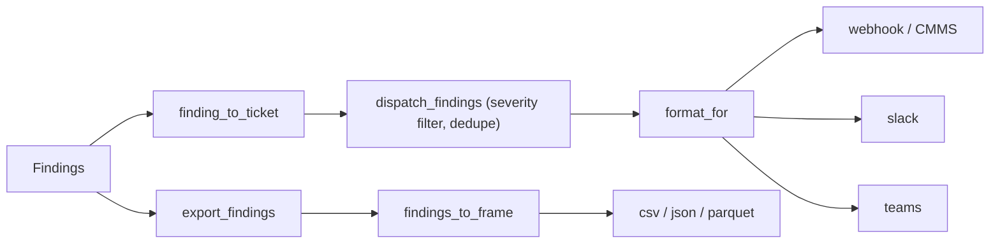

# Outbound integrations

Get findings *out* — to ticketing, chat, email, and BI/warehouse — without coupling to any one
vendor. Everything here operates on the **findings layer** and is read-only toward the BAS: it
pushes results to people and systems, never to a controller.



*Findings render to tickets, then dispatch to chat/CMMS channels or export to a tabular warehouse frame.*

`camber.integrate` provides three layers:

1. **Ticket render** (`tickets.py`) — `finding_to_ticket` / `findings_to_tickets` map a Finding to
   a neutral, JSON-serializable CMMS work-order dict (severity→priority, stable `fingerprint` for
   dedupe). `webhook_transport(url)` and `collect_transport()` (in-memory, for tests/dry-runs).
2. **Channels + dispatch** (`notify.py`).
3. **Tabular export** (`export.py`).

## Dispatch findings to a channel

`dispatch_findings(findings, transport, *, channel, min_severity, site, seen, dedupe, dry_run)`
renders, **filters by severity**, **dedupes**, formats per channel, and sends.

```python
from camber.integrate import dispatch_findings, webhook_transport, email_transport

# Slack incoming webhook, only warn+ , deduped across runs
seen = load_seen()  # a set of fingerprints you persist
dispatch_findings(
    findings,
    webhook_transport(SLACK_URL),
    channel="slack",
    min_severity="warn",
    site="HQ",
    seen=seen,
)
save_seen(seen)

# Email via SMTP (raw ticket -> subject/body)
dispatch_findings(
    findings,
    email_transport(
        "smtp.example.com",
        sender="camber@x.com",
        recipients=["ops@x.com"],
        username="u",
        password="p",
    ),
    channel="webhook",
    min_severity="fault",
)

# CMMS / generic webhook: channel="webhook" posts the raw ticket dict
dispatch_findings(findings, webhook_transport(CMMS_URL), channel="webhook")
```

### Channels — `format_for(channel, ticket)`
- **`webhook`** — the raw ticket dict (for a generic JSON webhook / CMMS adapter / email).
- **`slack`** — `slack_payload`: `{"text": …}` with a priority emoji.
- **`teams`** — `teams_payload`: a Teams MessageCard with color + facts.

### Option flags — `dispatch_findings`
| flag | default | effect |
|---|---|---|
| `channel` | `"webhook"` | payload shape (webhook / slack / teams) |
| `min_severity` | `"warn"` | drop findings below this (ok/info/warn/fault) |
| `seen` | `None` | a fingerprint set you persist; with `dedupe`, only new findings send |
| `dedupe` | `True` | skip findings whose fingerprint is already in `seen` |
| `dry_run` | `False` | format but don't call the transport (returns what *would* send) |
| `site` | `""` | stamped into the ticket / fingerprint |

`email_transport(host, *, port, sender, recipients, use_tls, username, password, _smtp_factory)`
is a transport (subject = ticket title, body = ticket body); `_smtp_factory` is injectable for
tests.

## Export for BI / warehouse

```python
from camber.integrate import export_findings, findings_to_frame

df = findings_to_frame(findings, site="HQ")  # one row per finding, metrics flattened
export_findings(findings, "findings.parquet", site="HQ")  # csv / json / parquet by extension
```

### Option flags — `export_findings` / `findings_to_frame`
| flag | default | effect |
|---|---|---|
| `format` | by extension | `csv` / `json` (records) / `parquet` |
| `flatten_metrics` | `True` | metrics → `metric_<key>` scalar columns |
| `columns` | all | restrict/order the output columns |
| `site` | `""` | site column + fingerprint stamp |
