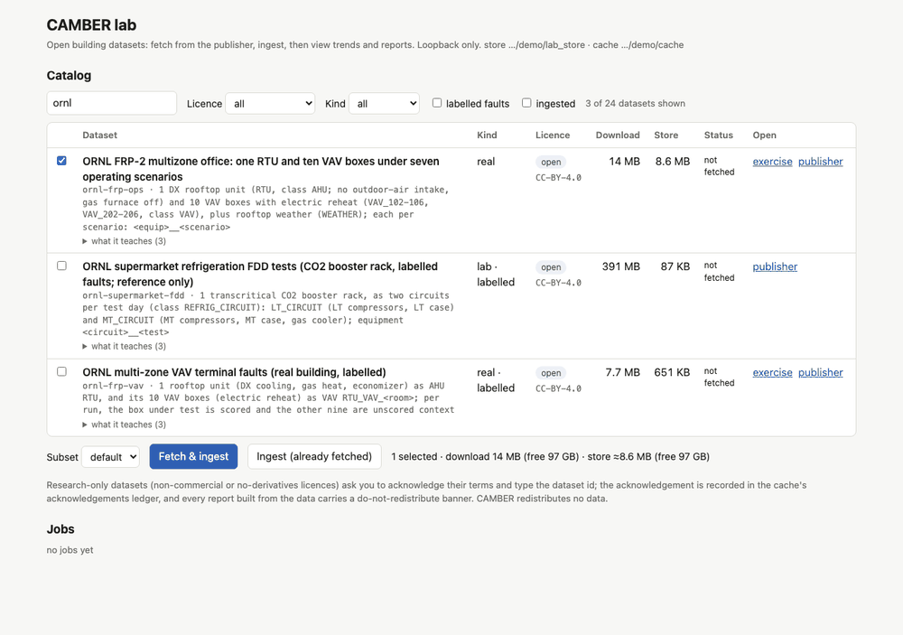
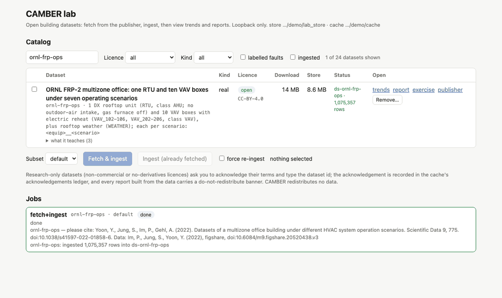
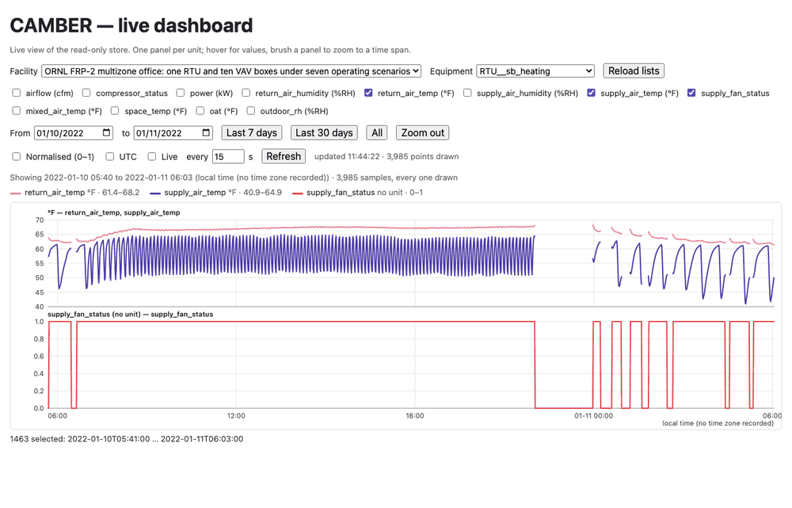
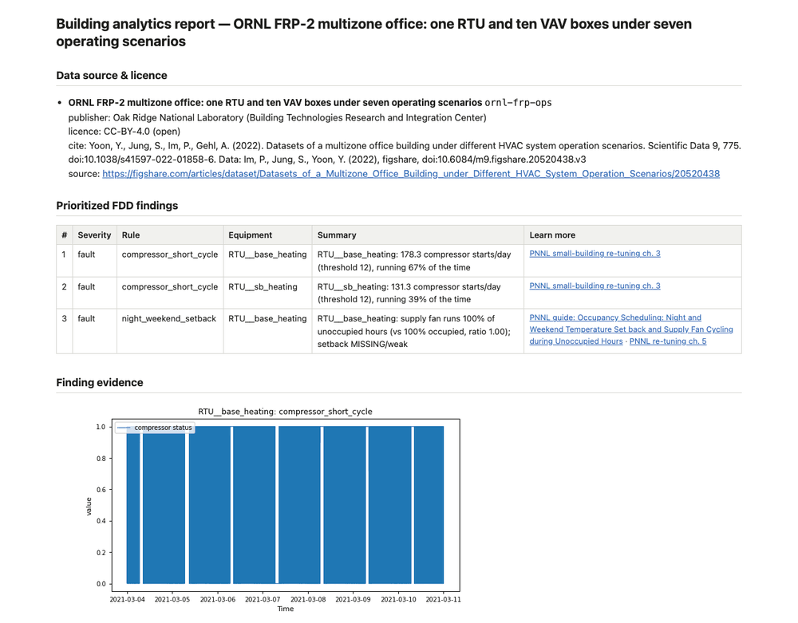
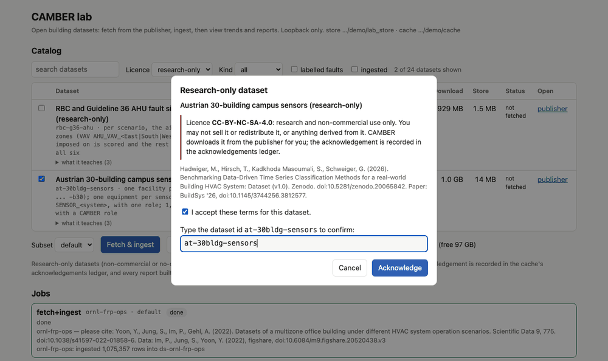

# Using the lab

`camber lab` is a web page on your own computer for CAMBER's catalog of open building datasets.
You pick a dataset, CAMBER downloads it from its publisher and loads it into a local store, and
then you look at its trends, read a report of what CAMBER finds in it, and work through the
[re-tuning workbook](workbook/index.md) exercise that uses it.

This guide takes you through a first session step by step, then explains what each page shows,
where the data goes, how to set the lab up for a class, and what to do when something goes
wrong. The reference pages behind it are [DATASETS.md](DATASETS.md#the-lab-camber-lab),
[CLI.md](CLI.md#the-local-catalog-ui-camber-lab-provisional-096) and
[SECURITY.md](SECURITY.md#11-the-lab-server-camber-lab-provisional-096).

> The lab is **provisional** (0.96): its page and its Python API (`camber.lab`) may still change
> in a minor release. See [API-STABILITY.md](API-STABILITY.md).

## 1. A first session

The walkthrough uses `ornl-frp-ops`: a real two-storey research office measured at one-minute
resolution, with one rooftop unit and ten VAV boxes, run once around the clock and once with a
night setback. It is small (about 14 MB to download), it has an open licence (CC-BY-4.0), and
the workbook's [scheduling exercise](workbook/air-scheduling.md) uses it. Everything below works
the same for any other open dataset in the catalog.

### Step 1: install CAMBER

You need Python 3.10 or newer and a web browser on the same computer.

```
pip install "camber-toolkit[xlsx]"
```

The lab itself needs nothing beyond the core package. The `xlsx` extra (`openpyxl`) lets CAMBER
read the catalog's Excel workbooks: `ornl-frp-vav`, used by the
[`zone-bad-box`](workbook/zone-bad-box.md) exercise, and `nist-heatpump-fdd`. Without it those two
download but do not ingest (see [Troubleshooting](#the-xlsx-extra)). With conda, install
`camber-toolkit` and `openpyxl` from conda-forge instead.

Instructors may prefer a **source checkout** (`pip install -e ".[xlsx]"` in a clone of the
repository): the lab then serves the workbook pages itself, so the exercise links work without a
network connection.

### Step 2: start the lab

Make a folder for the course and start the lab from it:

```
mkdir camber-course
cd camber-course
camber lab
```

It prints a few lines and keeps running:

```
camber lab: store lab_store; dataset cache <the cache's full path>
open this URL in your browser (it carries this run's access token; keep it private):
    http://127.0.0.1:8765/lab?token=<a long random token>
the URL is also saved, readable by you only, in <the launch file's full path>
loopback only; Ctrl-C to stop
```

- **The launch URL** opens the lab. Its `token` is a new random secret each time the lab starts,
  and every page and request of the lab needs it, so keep it to yourself as you would a password.
  The launch file holds the same URL in case you lose the terminal (see
  [The page says 401](#the-page-says-401-open-the-url-from-the-terminal)).
- **The store** is where ingested data goes: `lab_store`, in the folder you started from. Start
  the lab from the same folder next time (or pass `--store`) to find your data again.
- **The dataset cache** is where downloads go, by default `~/.cache/camber/datasets`. See
  [Where the data lives](#3-where-the-data-lives).
- **Ctrl-C** in this terminal stops the lab. Leave the terminal open while you work.

### Step 3: open the page and pick a dataset

Open the launch URL the lab printed, the whole line with its `?token=...`, in your browser:
copy it from the terminal, or Cmd-click / Ctrl-click it if your terminal makes links clickable.
The lab swaps the token for a cookie that lasts until you close the browser, and the address bar
then shows plain `http://127.0.0.1:8765/lab`. Reload it and open the trends and reports from it
as usual while the browser and the lab keep running. The page lists every catalog dataset, one
per row. Type `ornl` in the search box, tick **ornl-frp-ops**, and leave **Subset** at `default`.



*The catalog with one dataset ticked. Under the table, the page adds up the download and the store size of the selection and compares them with the free disk. Data: ORNL FRP-2 operations dataset (Im, Jung, Yoon, 2022), CC-BY-4.0.*

Each row shows:

| Column | What it tells you |
|---|---|
| **Dataset** | Title, catalog id and a one-line description of the equipment. *What it teaches* opens a short list of the lessons in the data. |
| **Kind** | `simulated`, `real` or `lab`, and `labelled` when the dataset has ground-truth fault labels. |
| **Licence** | A green **open** badge or a red **research-only** one, and the licence id. A **manual** badge means you must download the files yourself (see [Manual downloads](#manual-downloads)). |
| **Download** | How much the selected subset downloads. |
| **Store** | An estimate of its size once ingested. |
| **Status** | `not fetched`, `fetched, not ingested`, or the facility it was ingested into and its row count. |
| **Open** | Links: **trends** and **report** once ingested, the workbook **exercise** and the **publisher**'s page. |

Above the table you can search (by id, title, description or what a dataset teaches) and filter
by licence tier, kind, labelled faults or what you have already ingested. The line under the
table sums up your selection: how much it downloads against the free space on the cache's disk,
and how big it gets in the store against the free space on the store's disk.

### Step 4: Fetch & ingest, and watch the job

Press **Fetch & ingest**. A job appears under **Jobs**:

1. It is `queued`, then `running`. While a file downloads, the job shows a progress bar and the
   bytes so far. Each file is checked against the size and SHA-256 the catalog records for it
   before it is used.
2. The ingest follows, with a line per run (`ornl-frp-ops: run 3/24 ...`).
3. When it is `done`, the job shows the dataset's citation (please cite it if you use the data)
   and how many rows it ingested into which facility. The row's status changes to
   `ds-ornl-frp-ops · 1,075,357 rows`, and the **trends** and **report** links appear.



*A finished job. The row now names its facility, `ds-ornl-frp-ops`, and links to its trends and report. Data: ORNL FRP-2 operations dataset (Im, Jung, Yoon, 2022), CC-BY-4.0.*

Jobs run **one at a time**, in the order you queued them. While a job is queued or running it
has a **Cancel** button (see [Cancel and resume](#cancel-and-resume)). The job list lives in the
running lab only: after a restart it is empty, but the downloads and the store are still there.

**Ingest (already fetched)** runs only the second half, for datasets you have already
downloaded, for example after installing a missing extra.

### Step 5: open the trends

In the dataset's row, click **trends**. The trend viewer opens on the facility. Choose the
equipment `RTU__sb_heating` (the night-setback test), tick `supply_fan_status`,
`return_air_temp` and `supply_air_temp`, and untick the rest.



*The trend viewer zoomed to a brushed span: one panel per unit, a legend with each series' range, the span and sample count above the chart, and the brushed samples counted under it. The fan stops in the evening and cycles to hold the setback. Data: ORNL FRP-2 operations dataset (Im, Jung, Yoon, 2022), CC-BY-4.0.*

The viewer opens on the whole test. Drag across a panel to zoom to about a day, as in the
picture: the fan stops for the night and then cycles on and off to hold the space at its setback
temperature. Switch the equipment to
`RTU__base_heating`, the around-the-clock test, and compare. [Reading the
trends](#the-trend-viewer) explains the controls.

### Step 6: open the report and read its top finding

Back in the lab, click **report**. It opens in a new tab. The lab builds it the first time you
open it by running the dataset's default config (a few seconds here; longer for a big dataset),
and keeps it until the data changes or the lab stops.



*The report: its data source and licence block, the findings ranked worst first, the recommended actions and the caveats. Data: ORNL FRP-2 operations dataset (Im, Jung, Yoon, 2022), CC-BY-4.0.*

Read the **Prioritized FDD findings** table from the top. Each row is one finding: its severity,
the rule that raised it, the equipment, a one-line summary with the numbers behind it, and links
to the PNNL guidance on the subject. Here the top finding is `compressor_short_cycle` on the
around-the-clock unit: the summary counts its compressor starts per day against the rule's
threshold of 12 and gives the share of time it ran. Further down, `night_weekend_setback`
reports that the same unit's fan runs through every unoccupied hour: the setback is missing,
which is the subject of the exercise. [Reading the report](#the-report) explains the rest.

### Step 7: do the exercise

Click **exercise** in the row. It opens the workbook's
[scheduling exercise](workbook/air-scheduling.md). From a source checkout the lab serves its own
reading copy of the page (the page's Markdown source, with working links) so it opens offline;
otherwise the link goes to the published docs site. Work through the exercise's steps. Its
first step is the trend view you just opened.

> **The same on the command line.** Every lab action is a `camber datasets` command you can run
> yourself, on the same store and cache:
>
> ```
> camber datasets fetch ornl-frp-ops
> camber datasets ingest ornl-frp-ops --store lab_store
> camber datasets config ornl-frp-ops --store lab_store --out ops.json
> camber run ops.json --out ops_out              # every finding, including the ok ones
> camber report ops.json --out ops.html          # the report the lab shows
> camber serve lab_store                         # the trend viewer at http://127.0.0.1:8080/ui
> ```
>
> The workbook gives both routes for every exercise. See [CLI.md](CLI.md#open-datasets).

## 2. Reading what you see

### The trend viewer

The trend viewer is the live view of the store that `camber serve` also offers (see
[Visualization](VISUALIZATION.md#live-web-ui-072)). The lab serves it at
`/ui?facility_id=<facility>`.

- **Facility and Equipment.** A catalog dataset is one facility, `ds-<id>` (a few, such as
  `bdg2`, have one per site). In most datasets each run or scenario is its own equipment, named
  `<equipment>__<scenario>`: `RTU__base_heating` and `RTU__sb_heating` here, or
  `AHU__fault_free` and `AHU__damper_stuck_075` in a labelled dataset.
- **Choosing points.** There is one tick box per point role in the facility, with its unit. The
  first three are ticked when the page opens. A role the chosen equipment does not have draws
  nothing.
- **Panels and the legend.** Ticked series that share a unit share a panel, with a labelled
  y axis; a series with no unit, such as a fan status, gets its own. The legend gives each
  series' colour, unit and range. Hover over a panel for a readout of every ticked series at that
  moment; inside a gap in the data the readout shows `—`, and the line breaks across gaps.
- **Normalised (0–1).** Scales every series to its own minimum and maximum and draws them on one
  panel. Use it to compare *shapes and timing* (when the fan starts against when the return air
  starts to warm). The hover readout still shows the real values.
- **Time axis and UTC.** The store holds the site's local clock as the publisher wrote it. When
  the catalog knows the site's time zone (for example `bdg2`, `lbnl-b59`, `b4b-windesheim`), the
  axis is labelled `local time (<zone>)` and a **UTC** box converts it to `time (UTC)`. Otherwise
  there is no box and the axis is labelled `local time (no time zone recorded)`: it shows the clock
  as published, which cannot be placed on UTC.
- **What is drawn.** The viewer opens on each series' whole span. A long series is thinned to
  2,000 samples: the span is cut into 1,000 equal slices and each keeps its lowest and highest
  sample, so a one-sample spike or a flat stretch still shows. The line under the controls gives
  the span shown and the sample count, for example `Showing all data, 2022-01-01 00:00 to
  2022-03-31 23:59 (local time (no time zone recorded)) · 4,000 of 259,200 samples drawn`.
- **Choosing dates.** Pick **From** and **to** dates, or press **Last 7 days**, **Last 30 days**
  (counted back from the last sample in the store, not from today) or **All**. A chosen span is
  read at full resolution, up to 20,000 samples per series; a longer one is thinned the same way,
  and the line under the controls says so.
- **Brushing to zoom.** Drag across a panel to zoom to that span. The viewer reads it again at
  full resolution, and the line under the chart counts the samples in it and gives their first
  and last timestamp. **Zoom out** goes back one step; **All** goes back to the whole span.
- **Live refresh.** With **Live** ticked the viewer re-reads the store every 15 seconds (change
  it with **every … s**); **Refresh** re-reads it at once. The text next to it says when it last
  updated and how many points it drew. A facility or equipment ingested after you opened the page
  appears when you open the **Facility** or **Equipment** list, press **Reload lists**, or on the
  next refresh; there is no need to reload the page.
- **Reading the store from Python.** To work with a span's numbers rather than look at them, read
  the store directly, for example:

  ```python
  from camber.store import ParquetStore

  frame = ParquetStore("lab_store").read_role_frame(
      facility_id="ds-ornl-frp-ops", equip="RTU__sb_heating"
  )
  frame.loc["2022-01-11":"2022-01-13", ["return_air_temp", "supply_fan_status"]].plot(subplots=True)
  ```

### The report

The lab's report is CAMBER's audit report for the dataset's default config: the same report
`camber datasets config <id> --store lab_store --out cfg.json` and `camber report cfg.json --out
report.html` write. From the top:

- **Title.** *Building analytics report*, with the dataset's title.
- **Research-only banner.** For a research-only dataset only: a red-bordered box, *NON-COMMERCIAL
  / RESEARCH USE ONLY*, above everything else. The report, and the data behind it, may not be
  sold or redistributed. A dataset CAMBER holds research-only for a stated reason although its
  licence is open (`rbc-g36-ahu`) gives that reason instead.
- **Data source & licence.** The dataset's title and id, its publisher, its licence and tier,
  the citation and DOIs, and a link to its source. For a share-alike licence (`bdg2`), a note on
  what share-alike means. Keep this block with anything you build from the report.
- **Prioritized FDD findings.** The findings that need attention (severity `warn` or `fault`),
  worst first: rank, severity, rule, equipment, summary, and *Learn more* links to the PNNL
  guidance when the rule has some. Findings that passed (`ok`) are left out of the report;
  `camber run` prints them all, and its `findings.json` holds every metric.
- **Recommended actions.** One advisory action per finding, with the target it aims for and the
  standard it cites. The *$/yr* column shows `—` when there is no energy price or load to cost a
  finding with, as in the lab; the heading then says the actions are ranked by severity.
- **Energy Conservation Measures**, when there are any.
- **Caveats.** What the rules had to assume or could not check, for example *no trended
  occupancy: unoccupied = outside the assumed schedule*. Read them before you trust a finding.

The lab's report has no **evidence charts**. For a chart per issue (the samples a rule judged,
shaded where it flags them), write the config and run the RCx layout:

```
camber datasets config ornl-frp-ops --store lab_store --out ops.json
camber report ops.json --out ops-rcx.html --layout rcx
```

See [RCX-REPORT.md](RCX-REPORT.md). A report is a standalone HTML file; the lab serves it in a
sandbox that cannot call the lab or load anything from the network.

## 3. Where the data lives

### The cache and the store

| What | Where | How to change it |
|---|---|---|
| **Dataset cache**: downloads, archive members extracted for ingest, `manifest.json` and `acknowledgements.json` | `--dir`, else `$CAMBER_DATA_DIR`, else `$XDG_CACHE_HOME/camber/datasets`, else `~/.cache/camber/datasets` | `camber lab --dir D`, or set `CAMBER_DATA_DIR` |
| **Store**: the ingested data, one facility per dataset | `--store`, else a portfolio workspace's store (see below), else `./lab_store` in the folder you start from | `camber lab --store S`, or `--workspace W` |

The line under the page's title shows both (shortened); the startup line in the terminal prints
the full paths. Use the same `--dir` and `--store` with `camber datasets` and the lab, and they
see the same data.

Inside the cache, each dataset has its own folder: `<cache>/<id>/downloads/` for the files as
published (plus a `.part` file while one downloads) and `<cache>/<id>/extracted/` for the archive
members an ingest needed.

### Disk use

- The catalog's **Download** column is what a subset downloads. The **Store** column is an
  estimate of the space it takes once ingested; `default` subsets stay under about 100 MB in the
  store.
- For a dataset published as an archive, the members an ingest extracts **stay in the cache**,
  next to the download, and can be larger than it. The page does not count them.
- `camber datasets status --dir D --store S` lists, per dataset, the subsets fetched, the bytes
  on disk in the cache (downloads and extractions) and the facilities ingested.
- The `full` subsets are much bigger than `default`. Pick them only when an exercise asks you
  to.

### Cleaning up

The lab has no delete button. Stop the lab (or wait until no job is running) and use the
command line:

```
camber datasets remove ornl-frp-ops                              # the downloads and extractions
camber datasets remove ornl-frp-ops --store lab_store --purge-store   # and its facilities
```

`remove` deletes the dataset's folder in the cache and its manifest entry, and prints how much it
freed. With `--purge-store` it also drops the dataset's facilities from the store; without it the
ingested data stays and the trends and report keep working. Add `--dir` if your cache is not in
the default place. The acknowledgements ledger is never trimmed: it is the record of which
research-only licences were accepted. You can fetch and ingest the dataset again afterwards.

In a portfolio workspace, retire a dataset facility through its lifecycle instead (offboard,
archive, purge; see [PORTFOLIO.md](PORTFOLIO.md#offboarding-archiving-and-purging)), so the
audit log records it.

## 4. Setting up a class

### Pre-fetching for an offline room

Downloading the same files once per learner is slow, and some rooms have no internet. Fetch once,
on a machine with a connection, into a folder you can copy:

```
camber datasets fetch ornl-frp-ops irish-ahu lbnl-sdahu --dir course-cache
camber datasets fetch --all --dir course-cache       # every open dataset: about 9.4 GB
```

`fetch --all` takes the open tier only (the 20 open datasets that CAMBER downloads itself), and
skips the manual ones. The 15 of them that workbook exercises use come to about 6.9 GB. Then copy
`course-cache` to each learner's machine (a USB drive, a network share) and point the lab at it:

```
camber lab --dir course-cache
```

or set it once for every command: `export CAMBER_DATA_DIR=$PWD/course-cache`. With every file
already in the cache, **Fetch & ingest** verifies the files, downloads nothing and goes straight
to the ingest.

Give each learner **their own writable copy** of the cache. The lab writes to it (the manifest
on every fetch, extracted archive members on ingest, the acknowledgements ledger), and two labs
writing one cache at the same time can get in each other's way.

For the workbook pages offline, run the lab from a source checkout, or point it at a copy of the
repository's `docs/` folder with `camber lab --docs DIR`.

### Manual downloads

Two catalog entries, `lbnl-b59` (used by the [`zone-min-oa`](workbook/zone-min-oa.md) and
[`data-trend-quality`](workbook/data-trend-quality.md) exercises) and `nist-ibal`, come from
publisher portals with terms to accept, so CAMBER never downloads them. Their rows carry a
**manual** badge and cannot be ticked. `camber datasets info lbnl-b59` prints where to get the
files. Download them, then ingest them on the command line into the lab's store and cache:

```
camber datasets ingest lbnl-b59 --from-dir ~/Downloads/b59 --store lab_store
```

`--from-dir` finds each file by its catalog name, checks its size and SHA-256 before using it,
and links (or copies) it into the cache, so it then behaves like a fetched file. Add `--dir` when
the lab uses a cache other than the default. Reload the lab
page and the row shows the facility, with its trends and report. `--from-dir` works for any
dataset whose files you already have, which is another way to set up an offline room. See
[DATASETS.md](DATASETS.md#manual-downloads).

### Running against a portfolio workspace

To keep a record of what was fetched and ingested, run the lab against a
[portfolio workspace](PORTFOLIO.md#the-workspace):

```
camber portfolio init course-ws
camber lab --workspace course-ws
```

The lab also finds a workspace through `$CAMBER_PORTFOLIO`, the current folder, or a `--store`
that belongs to one. Then:

- each dataset's facility, `ds-<id>`, is registered as `provisioning` at its first ingest and
  activated after it;
- the ingest runs under the workspace's single-writer lock;
- every fetch, acknowledgement and ingest adds a `lab.fetch`, `lab.acknowledge` or `lab.ingest`
  line to the audit log: `camber portfolio audit` lists them;
- a dataset facility that is suspended, offboarding or archived is not re-ingested until you
  `camber facility resume` or `restore` it.

### What "loopback only" means for a shared machine

The lab binds `127.0.0.1` only, and has no option to listen anywhere else: no other computer can
reach it. But on a computer that several people are logged in to, each of them can reach
`127.0.0.1`. So, since 0.102, every page and request of the lab needs the access token in the
launch URL, or the cookie the browser gets for it:

- the token is created each time the lab starts and is shown only in the terminal that started
  it and in a launch file only your account can read; the lab never puts it on a command line,
  where other people's process lists would show it;
- without it, every page, the catalog, the jobs, the reports, the trend viewer and its data
  answer *401* and show nothing;
- a change (queueing or cancelling a job, for catalog ids only) must also come from the lab's
  own page, which sends a second token, and the lab answers only requests addressed to
  `127.0.0.1:<port>` or `localhost:<port>`. That keeps other websites open in your browser from
  using it.

The lab still has **no user accounts**: whoever has the launch URL can use it. Your own account
and the computer's administrators (root) can read the terminal and the launch file, so on a
shared computer:

- do not paste the launch URL into a chat, a screenshot or a shared document;
- give each learner their own login, and run one lab per learner;
- do not leave a lab running unattended; stop it with Ctrl-C when you are done;
- to show data to a room, project your screen, or publish a store read-only with
  `camber serve` (it accepts no writes and has no token: see its notes in SECURITY.md). The lab
  cannot be opened from another computer.

The full list of the lab's request checks is in
[SECURITY.md](SECURITY.md#11-the-lab-server-camber-lab-provisional-096).

## 5. Troubleshooting

### The port is in use

```
error: [Errno 48] Address already in use
```

(the number differs between systems). Another program, or a lab you already started, is using
port 8765. Stop the other lab, or pick another port:

```
camber lab --port 8766
```

`--port 0` lets the system pick a free port; the launch URL the lab prints carries it.

### The page says 401: open the URL from the terminal

The page reads *Open the lab from its terminal*, or a trend or report says *401*. The browser has
no valid lab cookie: you typed or bookmarked `http://127.0.0.1:8765/lab` without the token, the
browser was closed (the cookie lasts one browser session), or the lab was restarted (each start
makes a new token, and the old URL and cookie stop working). Open the launch URL again, the whole
line with `?token=...`, from the terminal where `camber lab` is running.

Lost the terminal? The lab also saved the URL in its launch file, `lab-<port>.url`, readable by
your account only:

- on Linux, `$XDG_RUNTIME_DIR/camber/lab-8765.url` (usually `/run/user/<your uid>/camber/`);
- elsewhere, or when `XDG_RUNTIME_DIR` is not set, `~/.config/camber/lab-8765.url` (or
  `$XDG_CONFIG_HOME/camber/` when that is set).

The lab deletes the file when it stops. If the lab printed *warning: launch file not written*,
the folder or an old file there is writable by other accounts, or belongs to another account,
and the lab refused to put the secret in it. Make the folder yours and private (`chmod 700`),
or just use the URL in the terminal.

A *403* that says *That lab token is not valid for this run* means the URL holds an old or
mistyped token: copy it again.

### The page says "host not allowed"

You opened the lab under another name, such as the computer's name or its network address. Use
`http://127.0.0.1:8765/lab` or `http://localhost:8765/lab`, on the computer the lab runs on. The
cookie belongs to the name you first opened, so for `localhost` open the launch URL with
`localhost` in place of `127.0.0.1`.

### Fetch & ingest is greyed out

The button is disabled when nothing is ticked, and when the selection does not fit: the line
next to it turns red when the download is bigger than the free space on the cache's disk, or the
store estimate is bigger than the free space on the store's disk. Untick something, choose the
`default` subset, free some space, or start the lab with `--dir` or `--store` on a bigger disk.

The page's check is a first look. The fetch checks again before it downloads (with a 5 % margin),
and the ingest checks before it extracts an archive; either stops the job with *not enough disk
space at …: need …, only … free*.

### Proxies and firewalls

Every download is HTTPS from the dataset's publisher (`camber datasets info <id>` names the
source). CAMBER downloads with Python's standard library, which uses the proxy named in the
`https_proxy` / `HTTPS_PROXY` environment variable:

```
export HTTPS_PROXY=http://proxy.example.org:3128
camber lab
```

A failed connection stops the job with *download failed for <url>: …*. If the network blocks a
publisher, fetch on another network and copy the cache over (see
[Pre-fetching](#pre-fetching-for-an-offline-room)). A download is never followed to a plain
`http://` address.

### Checksum mismatch: the `.bad` file

A job that fails with *sha256 mismatch* (or *size mismatch*) *… kept as ….bad; the upstream file
may have changed -- not accepted* means the bytes that arrived are not the file the catalog
pins. CAMBER does not use them; it moves them to `<cache>/<id>/downloads/<file>.bad` for you to
inspect. The usual causes are a download damaged on the way, or a proxy that answered with its
own page instead of the file. Press **Fetch & ingest** again: the next try downloads the file
afresh. If it fails the same way again, the publisher has probably changed the file: check
`camber datasets info <id>` and report it. Delete the `.bad` file when you are done
(`camber datasets remove <id>` removes it with the rest).

On the command line the same failure exits with code 2. A file given with `--from-dir` that does
not match is refused and left untouched.

### Cancel and resume

**Cancel** stops a queued job at once, and a running one at its next progress report.

- A **download** stops with its partial `.part` file kept. The next **Fetch & ingest** of the
  same dataset resumes it where it stopped when the publisher allows it, and starts again
  otherwise. Stopping the lab with Ctrl-C mid-download keeps the partial file in the same way.
- An **ingest** stops before its new data replaces the old: the store keeps what it had.

At most 20 jobs can be queued or running at once; the page refuses more until some finish or you
cancel them.

### The xlsx extra

`ornl-frp-vav` and `nist-heatpump-fdd` are Excel workbooks. Without the `xlsx` extra the
download succeeds and the ingest stops with *dataset … (extra 'xlsx') needs the optional package
'openpyxl': pip install "camber-toolkit[xlsx]"*. Install it, stop and restart the lab, tick the
dataset and press **Ingest (already fetched)**.

### A research-only dataset will not fetch

Datasets with a non-commercial or no-derivatives licence (and one held back for a stated
reason) carry the red **research-only** badge. Ticking one and pressing **Fetch & ingest** opens
a dialog with the licence terms and the citation.



*The research-only dialog: tick the terms and type the dataset id; only then does **Acknowledge** queue the fetch. Every fetch asks again.*

**Acknowledge** stays disabled until you tick *I accept these terms* **and** type the dataset id
exactly. **Cancel** queues nothing. The acceptance is recorded in the cache's
`acknowledgements.json`, and every report built from the data carries the do-not-redistribute
banner. Each fetch asks again; **Ingest (already fetched)** does not, once the dataset's current
licence was accepted in this cache.

### A job failed with another message

The job shows the error in red. The ones you may meet:

| Message | What to do |
|---|---|
| *… not fetched yet (…); run `camber datasets fetch …` first* | You pressed **Ingest (already fetched)** for a dataset that is not in the cache. Use **Fetch & ingest**. |
| *… is a manual download: CAMBER does not fetch it* | See [Manual downloads](#manual-downloads). |
| *portfolio is locked by …* | In a workspace, another command holds the lock. Wait for it to finish, then try again. |
| *facility … is suspended: the lab ingests only into provisioning or active facilities* | In a workspace, `camber facility resume` (or `restore`) it first. |
| *report for … failed: …* (in the report's tab) | The report could not be built from the store; the message says why. |
| *lost contact with the lab server* (at the top of the page) | The lab stopped. Start it again and reload the page. |
