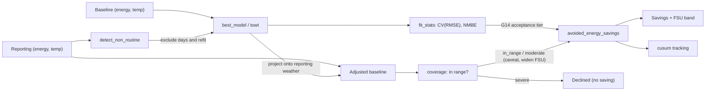

# Measurement & Verification in CAMBER (IPMVP / ASHRAE G14 / CalTRACK)

CAMBER implements whole-building **IPMVP Option-C** savings — equivalently the
**CalTRACK** *normalized metered energy consumption* (NMEC) workflow — from
standard parts: a weather-based baseline model, goodness-of-fit statistics, and
avoided energy use with uncertainty. This page maps CAMBER's API to the
CalTRACK/IPMVP vocabulary and shows how to cross-check against
[OpenEEmeter (eemeter)](https://github.com/openeemeter/eemeter), the reference
open-source CalTRACK implementation.

*IPMVP Option-C / CalTRACK NMEC pipeline: fit a weather baseline, project it onto reporting weather, and report avoided energy with an uncertainty band.*



## Terminology bridge

| IPMVP / CalTRACK term | CAMBER |
|---|---|
| Baseline period / reporting period | the two `(energy, temp)` series you pass in |
| Baseline model | `mandv.models.best_model` (change-point 2P–5P) / `mandv.towt` (hourly) |
| Goodness of fit — CV(RMSE), NMBE | `mandv.stats.fit_stats` |
| Avoided energy use | `mandv.stats.avoided_energy_savings` |
| Fractional savings uncertainty (FSU) | G14 Annex-B, in the same call — `t·1.26·CV·√((n/n′)(1+2/n)/m)/F` |
| Autocorrelation correction | `n′ = n(1−ρ)/(1+ρ)`; ρ from `stats.lag1_autocorrelation`, carried on `FitStats.rho_lag1` |
| Normalized annual savings | drive the models with a typical year (`mandv.weather` TMY/EPW) |
| Live actual weather (any lat/lon) | `weather_source.oat_reference` — NASA POWER fetch, see [WEATHER.md](WEATHER.md) |
| Cumulative savings tracking | `mandv.cusum` |
| Baseline covers the reporting conditions | `mandv.coverage.assess_coverage` → `Coverage` (tier, shares outside, distance beyond) |
| Extrapolation disclosure / refusal | `SavingsResult.coverage`, `.caveats`, `.declined`, `.declined_reason` |
| Uncertainty widening for extrapolation | `SavingsResult.fsu_extrapolation_factor` (`k`, below) |

## Method correspondence

- **CalTRACK Daily** ↔ CAMBER daily change-point: aggregate to daily energy vs
  daily-mean temperature, fit the inverse model, project onto reporting weather.
  This is exactly what `mandv.caltrack.caltrack_savings()` does end-to-end.
- **Hourly NMEC** ↔ `mandv.caltrack.caltrack_savings_hourly`, on a **TOWT** baseline
  (`mandv.towt`, the LBNL Mathieu et al. time-of-week & temperature model).
  **This is not the CalTRACK Hourly specification** — that method is a different estimator:

  | CalTRACK Hourly | CAMBER `mandv.towt` |
  |---|---|
  | per-calendar-month segmented models, weighted | one pooled model over the baseline |
  | six **fixed** temperature bin edges | `n_temp_segments` **quantile-spaced** breakpoints |
  | occupancy from a month × hour-of-week lookup, from a preliminary daily model's residuals | occupancy from bin-mean load vs the median of bin means |
  | 365-day data sufficiency, hard limits enforced | hour count **plus** per-hour-of-week-bin coverage |

  So these are defensible IPMVP Option-C savings on a published baseline model, not
  eemeter-comparable numbers. Same posture as the daily method — see the CalTRACK note below.

  **Expect a band comparable to the daily method, not tighter.** Hourly residuals are strongly
  serially correlated (ρ≈0.85 is ordinary), and the effective-sample-size correction bites: measured
  on a 20-week synthetic, n=3360 hours becomes n_eff=282 and the band widens from 1.6% at ρ=0 to
  9.7% at ρ=0.85. Finer data does not buy proportionally more certainty.
- **Billing/monthly** ↔ change-point on monthly data (looser CV(RMSE) tier); utility bills are
  fitted per bill, weighted by days (see [Billing data](#billing-data)).

## Quick use

```python
from camber.mandv.caltrack import caltrack_savings

res = caltrack_savings(
    baseline_energy, baseline_temp, reporting_energy, reporting_temp
)  # hourly Series in
print(res.model_kind, round(res.baseline_r2, 3))
print(res.savings.savings_pct, "±", res.savings.fractional_uncertainty)  # fractions
print(res.savings.coverage["tier"], res.savings.caveats)  # did the baseline cover it?
```

If the reporting weather lies far outside the baseline's, `res.savings.declined` is `True` and the
savings fields are `None` — see [Extrapolation](#extrapolation-coverage-caveats-and-declining).

### Two uncertainty kernels, and why

Which kernel applies depends on whether the savings difference contains **measured** energy:

- **`measured − projected`** (Option C avoided energy, Option B isolation) carries the reporting
  period's own residual noise, which averages down over the `m` reporting points. This is the G14
  Annex-B form above.
- **`projected − projected`** (normalized annual savings, Option D) contains no measured energy at
  all — only parameter error, shared by every projected period. Its band is therefore **independent
  of how many periods you normalize onto**, and uses `CV·√(p/n)`, the OLS average leverage.

The two have deliberately different provenance: the measured kernel is the published G14 expression,
constant and all; the projected one is textbook regression theory, cited as such rather than
borrowing G14's empirical `1.26` for a case it was never derived for.

Serial correlation widens both, via `n′`. Daily whole-building residuals are routinely correlated,
so an unadjusted band is optimistic — `caltrack_savings` estimates ρ from the baseline residuals
automatically. Strictly the *reporting*-period ρ is wanted, but those residuals contain the saving
itself, so the baseline fit's ρ is the standard substitution.

## Acceptance thresholds — and where we differ from CalTRACK

- CAMBER uses ASHRAE **Guideline 14** acceptance tiers for CV(RMSE)
  (`stats.cv_rmse_max_for`: ~15% monthly, ~30% daily/hourly) and reports NMBE.
- **CalTRACK is stricter and more prescriptive**: it specifies data-sufficiency
  rules (coverage, minimum days), explicit model-selection criteria, and hard
  limits that eemeter enforces. CAMBER leaves those policy choices to the caller —
  so a CAMBER fit is *not* automatically CalTRACK-compliant. Use the thresholds and
  the FSU to judge whether a result is reportable, and apply CalTRACK's data rules
  if compliance is required.

## Extrapolation: coverage, caveats and declining

A baseline is a regression over the conditions it was fitted on. Projected onto a reporting period
it never saw — a spring baseline applied to a summer — its slopes run past the data, and the
avoided energy and FSU describe a model nothing supports. IPMVP and ASHRAE Guideline 14 both expect
the baseline to cover the reporting conditions, or the extrapolation to be disclosed and bounded;
neither is quoted for the numbers below, and CalTRACK prescribes no extrapolation test. **Every
threshold here is a CAMBER policy choice**, set on `mandv.coverage.ExtrapolationPolicy`.

Every savings path — `avoided_energy_savings`, `caltrack_savings`, `caltrack_savings_hourly`,
`isolation_savings`, `normalized_savings`, `isolation_normalized_savings` and the savings chart —
grades the baseline's coverage of the reporting drivers and acts on the tier:

| Tier | When (defaults) | What happens |
|---|---|---|
| `in_range` | ≤ 5% of points **and** ≤ 5% of baseline-projected energy outside the support, and nothing more than 10% of the fitted range beyond it | Numbers exactly as before; `coverage` attached |
| `moderate` | anything short of severe | Caveat with the shares, the support and fitted ranges and the furthest distance; FSU widened by `k` (linear models) |
| `severe` | ≥ 25% of points or energy outside, or > 50% of the fitted range beyond it, or a baseline driver that never varied while the reporting one does | **Declined**: `avoided_energy`, `baseline_projected`, `savings_pct`, `fractional_uncertainty`, `abs_uncertainty` → `None`; `reporting_actual` stays; `declined_reason` says why |
| `not_evaluated` | the model carries no fit range (a duck-typed or constant model), or no finite reporting rows | Numbers unchanged; a caveat says coverage was not checked |

**Support.** At fit time each model records its finite baseline drivers (one private fit record per
model). The *support band* is the 1st–99th percentile order statistics (`support_quantile`), so one
freak day does not stretch the range a whole season is judged against; points within 5% of the
band's width (`edge_tolerance`) count as covered. Shares are counted against the band, distance
beyond the hard `[min, max]` range as a fraction of its width. Both sides count, including a flat
segment of a change-point model — outside the data is outside the data, even where the model's
arithmetic happens to be benign.

**Widening a moderate extrapolation.** For linear-in-parameters baselines (change-point, degree-day,
Option-B driver models), with `A = pinv(X′X)` of the baseline design, `s` the sum of the reporting
design rows and `s_c` the same with each driver clamped into the support band:

- measured kernel (avoided energy): `k = √((m + s′As) / (m + s_c′As_c))`
- projected kernel (normalized savings): `k = √(s′As / s_c′As_c)`

and the reported FSU is `FSU × max(1, k)`, with `k` recorded as `fsu_extrapolation_factor`. It is
the variance of the projected *total* at the actual drivers relative to drivers kept inside the
support — so it is conditional on the fitted change points (treated as known), it equals 1 where
the extrapolated points sit on a flat segment, and it tracks the mean design row: a few
extrapolated points in an otherwise central period barely move it, and the measured-noise term `m`
usually dominates it for avoided energy. It widens for parameter variance only; it cannot bound the
*bias* of a wrong functional form beyond the data, which is why severe extrapolation declines
rather than widens.

**Several drivers.** Each column is checked, and so is leverage: a reporting row with
`h = x A x′` above the largest baseline leverage lies outside the joint region the data spans even
when every column is individually in range — hidden extrapolation (Montgomery, Peck & Vining,
*Introduction to Linear Regression Analysis*). A row outside on either test is outside.

**TOWT (hourly).** The unit is *occupancy mode × temperature cell* (below the fitted range, each of
the model's temperature segments, above it). A reporting hour is unsupported when its cell holds
fewer than 20 baseline hours (`min_cell_obs`) or lies beyond its mode's fitted range; distances
are per mode. Hour-of-week × temperature sparsity is reported in `coverage["info"]` for information
and never changes the tier. TOWT clips its temperature basis at the breakpoints, so it holds its
response **flat** beyond the fitted range: the error there is bias, not parameter variance, so TOWT
is flagged but its FSU is never widened. The unseen hour-of-week check still raises.

**CalTRACK daily** also caveats a baseline shorter than 365 days, which cannot span a weather year.
**Normalized savings** grade both models against the normal year (`coverage_baseline`,
`coverage_reporting`); a TMY colder than the reporting model's fit declines. **Categorical models**
treat a reporting category the baseline never fitted as unsupported (bind a period with
`CategoricalModel.at(cat)`); rows without a finite projection are counted (`coverage["n_used"]` vs
`["n_report"]`) rather than dropped silently.

**Migration.** Severe extrapolation declines by default, so the savings fields are `float | None`.
To keep computing it (with a widened band and a caveat starting "SEVERE extrapolation — not a
defensible saving"), opt out:

```python
from camber.mandv.caltrack import caltrack_savings
from camber.mandv.coverage import ExtrapolationPolicy

res = caltrack_savings(
    baseline_energy,
    baseline_temp,
    reporting_energy,
    reporting_temp,
    extrapolation=ExtrapolationPolicy(decline=False),
)
```

**Config runs.** A config `mv` entry (see [CLI.md](CLI.md)) that names a `reporting_period`
emits one `mv_savings` finding per meter alongside its `mv_baseline`:

```json
{"class": "CHILLEDWATER_METER", "role": "energy_rate",
 "period": ["2016-01-01", "2016-06-30"], "reporting_period": ["2016-09-15", "2016-11-30"],
 "extrapolation": {"decline_share": 0.30}}
```

Its metrics carry `avoided_energy`, `savings_pct`, `fsu`, `fsu_extrapolation_factor` and the
coverage (`coverage_tier`, `share_points_outside`, `share_energy_outside`, `max_beyond_rel`); the
baseline finding records the OAT support it was judged against (`oat_fit_min`, `oat_fit_max`,
`oat_support_lo`, `oat_support_hi`) and its residual `rho`, now estimated because the daily index
is passed to the fit statistics. A severe extrapolation — a winter baseline against a summer — is
an `info` finding with `metrics["declined"]` true, a `declined_reason` and a caveat, never a number.
`extrapolation` takes the `ExtrapolationPolicy` fields; an unknown key is an error.

`assess_coverage(model, drivers)` is direction-agnostic: it grades any fitted model against any
driver set, so the same call checks a reporting model projected back onto baseline conditions.

## Model validity: coefficient p-values and the SEP verdict

`stats.regression_tests(X, y, names=...)` returns coefficient standard errors, t statistics and
two-sided p-values, the overall F-test p-value, adjusted R² and — given a `time_index` — the
residuals' lag-1 ρ and ρ-adjusted p-values (variance × κ, degrees of freedom `n′ − p`).
`model_regression_tests(model, drivers, y)` does the same for a fitted change-point, degree-day
or driver model. The t and F tails are computed in the standard library, through a regularized
incomplete beta evaluated by its continued fraction (DLMF 8.17.22); they are checked against
closed forms and the NIST StRD *Norris* certified regression.

**Change points.** A change point is grid-searched, not solved by least squares. It counts as a
parameter (the F-test is `F(p − 1, n − p)` with the change point in `p`, as `FitStats` does), but
the slope p-values are **conditional on it**: CAMBER treats change points as fixed, the G14
convention as described by BPA/SBW, *Uncertainty Approaches and Analyses for Regression Models
and ECAM* (2017) §2.3.1. The search makes those p-values optimistic, and every result says so
(`conditional_on_change_points`, plus a caveat).

`stats.sep_validity(tests, signs=...)` applies the DOE **SEP 50001 M&V Protocol, 2019 Edition 2,
§6.4.1** (identical in the 2012 *SEP M&V Protocol for Industry*, §3.4.5):

- the overall F-test has p < 0.10;
- every relevant variable has p < 0.20, and at least one has p < 0.10;
- R² ≥ 0.50;
- the coefficients are consistent with a logical understanding of the process.

Relevant variables are the slopes — never the intercept or a change point. `logical_signs(model)`
supplies the signs physics fixes (a heating or cooling arm slopes upward away from its change
point); without `signs` the sign test is skipped, with a caveat. SEP's tests assume independent
residuals, so the verdict is reported as written (`sep_valid`, reproducible against the DOE EnPI
tool) and ρ-adjusted (`sep_valid_rho_adjusted`), with a caveat when they disagree.

This is a **separate verdict** from `FitStats.accept`, the G14-style gate (CV(RMSE), NMBE, R²)
that governs savings claims — which is unchanged.

```python
from camber.mandv.models import fit_model
from camber.mandv.stats import logical_signs, model_regression_tests, sep_validity

m = fit_model(T, y, "3PC", time_index=days)
v = sep_validity(model_regression_tests(m, T, y, time_index=days), signs=logical_signs(m))
v.sep_valid, v.sep_valid_rho_adjusted, v.failures
```

## Backcast savings

`methods.backcast_savings` is the SEP **backcast** (SEP 2019 Ed. 2 §6.2.2, Eq 9): a model fitted
on the *reporting* period, projected back onto the *baseline* period's conditions and subtracted
from measured baseline energy, `S = O_b − P_r|b`. SEP permits it when the baseline conditions fall
within the range of validity of the reporting-period model (SEP 2012 §3.6.3.1) — typically when
the baseline cannot support a valid model but the reporting period can.

- **Coverage** is the reporting model's support graded against the baseline drivers — the
  mirror image of a forecast. A mild-season baseline against a full-year reporting period is a
  severe forecast extrapolation but an in-range backcast.
- **Uncertainty** is the reporting model's: the G14 measured-savings kernel by default, with the
  roles swapped (`m` baseline points, `n` reporting-fit points), or the exact kernel.
- **Labels.** IPMVP 2012 calls a saving stated at baseline conditions *normalized* savings, and
  the IPMVP Core Concepts review draft calls a backcast *avoided energy*; CAMBER claims neither
  and labels the result `method="backcast"`, `basis="baseline-period conditions"`.

```python
from camber.mandv.methods import backcast_savings

res = backcast_savings(
    reporting_model, T_baseline, y_baseline, cv_rmse=st.cv_rmse, n_reporting=st.n, p_reporting=3
)
res.savings, res.savings_pct, res.abs_uncertainty, res.coverage["tier"]
```

## The M&V flow: method, then adjustments, then result

A reported saving is built in three fixed steps, in this order, and each step is recorded on the
result:

1. **Method.** A declared SEP adjustment-model method (below) gives the routine saving:
   forecast, backcast, standard conditions or chaining (or CAMBER's `sequential_chain`), each a
   `MethodResult` with its SEnPI, band and kernel. `select_method` and `"method": "auto"` only
   *propose* one.
2. **Adjustments.** An explicit ledger of non-routine and static-factor adjustments restates the
   method's **baseline side** (`apply_adjustments`, [below](#non-routine-and-static-factor-adjustments)).
   For a chain each entry restates the one link whose dates hold it, and the SEnPI and saving are
   recombined by Eq 6 and Eq 11.
3. **Result.** The unadjusted and the adjusted saving are reported side by side, with the
   ledger, the waterfall and the combined band. Nothing is adjusted implicitly: a detected step
   is only a proposal until an analyst accepts it.

One `validity` setting (`g14`, `sep` or `both`; decision D1 on #21) governs the whole flow: G14
acceptance for the savings claim, SEP §6.4.1 model validity for the SEnPI, and, under `sep` or
`both`, SEP §5.3.2's evidence and approval on every adjustment. The ECM dates and the settle
window after each (`EcmSchedule`, 14 days by default) are declared once and shared by the
confounding guard, the detection proposals and the rebaselining policy
([below](#versioned-baselines-and-rebaselining)).

## SEP methods: forecast, backcast, standard conditions and chaining

`camber.mandv.methods` implements the four adjustment-model methods of the DOE **SEP 50001 M&V
Protocol, 2019 Edition 2**, §6.2, with one result type, `MethodResult`. All of it is provisional.
Every result records its `method`, its `basis` and its uncertainty `kernel`.

- **Forecast** (§6.2.1), `forecast_savings`. The saving is `P_b|r − O_r` (Eq 8) and the SEnPI
  `O_r / P_b|r` (Eq 5). Default kernel: G14.
- **Backcast** (§6.2.2), `backcast_savings`. The saving is `O_b − P_r|b` (Eq 9) and the SEnPI
  `P_r|b / O_b` (Eq 5). Default kernel: G14.
- **Standard conditions** (§6.2.3), `standard_conditions_savings`. The saving is
  `P_b|s − P_r|s` (Eq 10) and the SEnPI `P_r|s / P_b|s` (Eq 5). Default kernel: exact.
- **Chaining** (§6.2.4), `chained_savings`. The saving is `(O_b − P_i|b) + (P_i|r − O_r)`
  (Eq 11) and the SEnPI `(P_i|b / O_b)·(O_r / P_i|r)` (Eq 6). Kernel: exact.

`O` is measured energy and `P_x|y` the model of period `x` applied to the conditions of period
`y`. `savings_pct` is the SEP improvement as a fraction, `1 − SEnPI` (Eq 7 ÷ 100). `sep_terms`
holds the SEP quantities for aggregation.

**Chaining is SEP's method, exactly.** It uses one intermediate period "of the same length of,
and ... in between the baseline and reporting periods" (§6.2.4). Its model is backcast onto the
baseline and forecast onto the reporting period, and it must cover both (SEP 2012 §3.6.5).
`chained_savings` checks the period rule and raises `ValueError` when it fails. CAMBER allows one
day's difference in length, for a leap year; the Protocol states no tolerance. A severe
extrapolation on either side declines the result. The chained SEnPI is a **product** (Eq 6), and
the chained saving a **sum** (Eq 11). EnPI V5 adds cumulative improvement percentages for
pre-model years; that is bookkeeping, and CAMBER follows the Protocol instead.

**`sequential_chain` is a CAMBER extension, not SEP.** It chains any number of consecutive
`MethodResult` links, for example year-over-year forecasts against rebaselined models. The SEnPI
is the product of the links and the saving their sum. Every result carries a caveat saying the
chain is not an SEP method, and it has no `sep_terms`, so it cannot be aggregated into an SEP
SEnPI.

### Uncertainty

SEP says nothing about uncertainty. These bands are CAMBER's. The kernel defaults follow decision
D7 on #21: the G14 kernel for single-model results and the exact kernel for multi-model results.
With `Σ = κ s² A` the model's parameter covariance and `g` the sum of the design rows:

```text
Forecast / backcast:  as avoided_energy_savings / backcast_savings (G14 or exact)
Standard conditions:  Var S = V_param,b(s) + V_param,r(s)                     (IPMVP 2012 B-19)
                      Var ln SEnPI = V_param,r/P_r|s² + V_param,b/P_b|s²      (delta method)
SEP chain:            Var S = (g_r − g_b)′ Σ_i (g_r − g_b) + V_noise,i(b) + V_noise,i(r)
                      Var ln SEnPI ≈ T_b/P_i|b² + T_r/P_i|r² − 2 g_b′ Σ_i g_r /(P_i|b · P_i|r)
                      (T = V_param + V_noise; the noise part taken relative to O_b, O_r)
Sequential chain:     Var S = Σ_k Var S_k (B-19);  Var ln SEnPI = Σ_k Var ln EnPI_k (B-20)
Single-model SEnPI:   band(SEnPI) = SEnPI · band(S) / denominator            (delta method)
```

Both projections of the SEP chain share one `β̂_i`, and their parameter errors enter with opposite
signs. The independence form therefore **over-states** the chain's uncertainty whenever
`g_b′ Σ g_r > 0`, which is typical, because the intercept column dominates. So the chain uses the
exact covariance form and reports the independence variance beside it (`uncertainty_terms`). The
intermediate model's `κ s²` stands in for the noise of both measured periods. The chain always
uses the exact kernel (`kernel="g14"` raises), because the G14 expression has no covariance term.

**Monte Carlo.** The test used synthetic 3P-cooling data with AR(1) residuals, ρ estimated from
the intermediate fit, and 600 seeded runs per ρ. The baseline and reporting climates differed,
and the intermediate year spanned both. The nominal 90% chain band covered the true saving in
**90–92%** of runs at ρ = 0, 0.4 and 0.8, and the SEnPI band did the same. At ρ = 0 the
predicted variance matched the empirical one to within 15%. The independence form's variance was
about **1.5×** the exact one. CI gates coverage at 85–95%. As elsewhere, these results are
conditional on the fitted change points.

The sequential chain's B-19/B-20 combination assumes the links are independent. That holds only
approximately. A link whose model was fitted on a period that another link measures shares that
period's noise, and the result's caveat says so.

### The SEP range rule (secondary)

SEP §6.4.2.1 requires the **mean** of each relevant variable over the application period to fall
within the fitted range, or within three standard deviations of the fit mean.
`sep.sep_range_check` applies it, and every method result reports the outcome as
`sep_range_valid`, with details in `sep_range`. This verdict is **secondary** (decision D2). The
primary guard stays the per-point coverage tier: a mild mean can hide hot extremes on a
change-point slope, and the mean rule passes them. The standard deviation is the sample one
(`ddof = 1`), a CAMBER choice.

### Choosing a method, and the method-shopping guard

`select_method(frame, baseline=..., reporting=...)` follows SEP's order:

1. forecast, if the baseline model is SEP-valid and covers the reporting period (per-point
   coverage not severe, and SEP's mean rule holds);
2. backcast, if the reporting model is valid and covers the baseline;
3. chaining, through the best-ranked valid intermediate window of the baseline's length lying
   between the two periods whose model covers both;
4. standard conditions, if both models are valid and cover the supplied conditions;
5. otherwise, decline (SEP 2012 §3.6.6).

In every period the candidate models are ranked by SEP validity, then adjusted R², as the DOE
EnPI tool does.

**It only proposes.** Valid methods can disagree widely. Chen & Therkelsen (LBNL-2001209, 2019)
found all four SEP methods valid on one facility, with SEnPI ranging from 0.93 to 1.00. So the
proposal has no headline figure. Its `sensitivity` table lists every valid method's saving,
SEnPI and band side by side. A reported saving needs a **declared** method: in a config, set
`mv[].method`. `"method": "auto"` gives an `mv_method_proposal` finding, never an `mv_savings`
one. When no method is declared the run keeps the SEP default, forecast, and the finding says the
method was not declared. Freezing the declared method with a versioned baseline comes in a later
phase of #21.

```json
{"class": "CHILLEDWATER_METER", "role": "energy_rate",
 "period": ["2016-01-01", "2016-12-31"], "reporting_period": ["2018-01-01", "2018-12-31"],
 "method": "chaining", "intermediate_period": ["2017-01-01", "2017-12-31"], "kernel": "exact"}
```

`method` takes `forecast`, `backcast`, `chaining` (with `intermediate_period`),
`standard_conditions` (with `normal_year`, a list of daily mean temperatures) or `auto`. `kernel`
takes `g14` or `exact`, and defaults per D7.

### SEP arithmetic and primary energy (`mandv.sep`)

- `senpi` (Eq 5), `chained_senpi` (Eq 6), `improvement_pct` (Eq 7) and `top_down_savings`
  (Eq 8–11). Golden tests reproduce the SEP 2019 Guidance's Eagleston ratio example (7.38%) and
  Ashton forecast (13.53%, which the Guidance rounds to 14%). The Guidance's range-check example
  is **not** used, because its arithmetic is wrong (see #21).
- `bottom_up_reconciliation` (Eq 12): `RF = ESP_BU / ESP_TD`. Below 0.80, the verified
  improvement is the top-down one times RF. RF is never used to scale an improvement up.
- `primary_energy` (Eq 1) and `ANNEX_B_MULTIPLIERS`: only rows transcribed from the Protocol's
  own **Annex B** (Tables 4A/4B). Examples are grid electricity 3.0, solar, wind and geothermal
  electricity 1.0, fired-boiler steam or hot water 1.33, fired absorption chilled water 1.25,
  engine-driven chilled water 0.83, electric chilled water 0.72, compressed air 3.0, and the
  fuels 1.0. A user table overrides or extends it. A caveat notes that SEP requires Verification
  Body approval for site-specific multipliers. A negative net consumption counts as zero (§5.1.2).
- `aggregate_energy_types`: one `MethodResult` per energy type, all with the **same** method
  (§6.2). Each is converted to primary energy and summed (§6.3.2) before Eq 5–11 are applied.
  The savings bands combine in quadrature (B-19).

## The exact uncertainty kernel

Every savings function takes `kernel="g14"` (the default, as documented above) or
`kernel="exact"`. For a model fitted on `n` points with `p` parameters, residual variance `s²`,
lag-1 residual autocorrelation ρ (`κ = (1+ρ)/(1−ρ)`) and `A = (X′X)⁻¹`, applied to `m` rows whose
design rows sum to `g`:

```text
V_param = κ s² g′Ag        (parameter error of the projected total)
V_noise = κ s² m           (noise of m measured points)
avoided energy / backcast:  band = t(n − p) · √(V_param + V_noise)
normalized:                 band = t(min(n − p)) · √(V_param,b + V_param,r)
```

This is the textbook OLS prediction variance of a sum (BPA/SBW 2017 §3.3); κ inflates both terms,
the conservative choice (CAMBER decision D3 on #21). It **carries the leverage of the application
conditions itself** — a projection far from the fitted mean has a large `g′Ag` — so a band
computed with it is never widened again for extrapolation: `fsu_extrapolation_factor` is 1.0.
Projected onto its own baseline rows it reduces to `CV/√n` of the in-sample total (for a model
with an intercept `g′Ag = 1′H1 = n`), which the conservative `CV·√(p/n)` projected kernel bounds
from above. It needs a CAMBER-fitted model, whose fit record holds `(X′X)⁻¹`, `s²`, `n`, `p` and —
when fitted with a `time_index` — ρ.

**Coverage.** In a seeded Monte Carlo — daily change-point data, AR(1) residuals, ρ estimated
from the baseline fit, 1,000 runs per ρ — the exact kernel's nominal 90% band covered the true
saving **90.2%, 90.0% and 86.6%** of the time at ρ = 0, 0.4 and 0.8; CI gates it to 85–95%. The
G14 kernel covered 86.3%, 85.5% and 82.5% on the same data. Both are conditional on the fitted change
points; the published evidence is that G14 bands under-cover real buildings (Touzani, Granderson,
Jump & Rebello, *Energy & Buildings* 193:216–225, 2019: about 71% at nominal 95% for daily
models), which synthetic data cannot reproduce.

**G14 stays the default, with a caveat on every result** (a maintainer decision on #21). The
Monte Carlo index in `tests/test_mandv_mc_coverage.py` (a year of daily 3PC data per period, AR(1)
residuals at ρ = 0, 0.4 and 0.8, ρ estimated, 400–600 runs per cell) measures every savings path
with a *correct* model:

| Path | G14 kernel at nominal 90% | Exact kernel at nominal 90% |
|---|---|---|
| Forecast (avoided energy) | 82–88% (under-covers) | 87–91% |
| Backcast | 82–88% (under-covers) | 87–91% |
| Standard conditions | 99–100% (conservative) | 87–91% |

G14's `1.26·√(m(1 + 2/n))` factor falls short of the `√(2m)` that parameter error plus reporting
noise need when `m = n`; CAMBER's projected `CV·√(p/n)` kernel for standard conditions errs the
other way. So every result computed with `kernel="g14"` — a `SavingsResult`, a forecast, backcast
or standard-conditions `MethodResult` (and so each link of a sequential chain), and an
`AdjustedResult` whose band is G14's — carries a caveat saying which way its band is miscalibrated
and that `kernel="exact"` is on target: **switch to `kernel="exact"` for calibrated bands**. The
caveat is text only; no band, saving or benchmark metric changes. The default will be revisited at
1.0.

**Unverified.** The ASHRAE text was not consulted. A BPA reproduction of the G14 kernel writes
`(1 + 2/n′)` where CAMBER writes `(1 + 2/n)`; which is G14's is **unverified**, and CAMBER keeps
its current form until it can be checked against Reddy & Claridge (2000). The G14 formula for
normalized savings is likewise **unverified**; `normalized_savings` combines the two models in
quadrature (IPMVP 2012 Appendix B-5, B-19; BPA *Meter-Based Energy Modeling Protocol* 2024 §5.9)
at Student's t on the smaller fit's degrees of freedom, with each model's own ρ.

## Non-routine events (NRE)

Shutdowns, occupancy changes or meter outages are by definition what the weather model can't
explain, and they skew a baseline. CAMBER has three detectors, all on the residuals of a daily
change-point weather model:

- **`detect_non_routine`** — point-wise: days whose residual is a robust (MAD) outlier.
  `caltrack_savings(..., exclude_non_routine=True)` drops those baseline days and refits, so a
  one-off shutdown doesn't distort the savings.
- **`detect_step_change`** — one sustained level shift, by the largest two-sample statistic over
  all splits. Pass `autocorrelation=True` (**recommended**): it divides the statistic by
  `√κ`, `κ = (1+ρ)/(1−ρ)`. Daily whole-building residuals routinely have ρ ≈ 0.6 (the BDG2
  median), which inflates the uncorrected statistic about 2×; on synthetic step-free data at
  ρ = 0.8 the uncorrected default fires on nearly every run. The default is left unchanged so
  existing results do not move. Its residuals come from a model fitted *through* the step, so the
  ρ it estimates is inflated — conservative.
- **`detect_step_changes`** — several steps at once:
    1. fit the weather baseline;
    2. segment the residuals with **PELT** (Killick, Fearnhead & Eckley 2012) using a Gaussian
       mean-change cost whose variance is inflated for serial correlation, `σ²κ` — the variance
       of a segment mean under AR(1) residuals — and an mBIC-style penalty of `3 ln n` per step,
       with segments at least `min_segment_days=28` long and at most `max_steps`;
    3. refit the weather model with **one level indicator per segment**, so a step is not absorbed
       into the temperature slope, and re-estimate `σ` and `ρ` from that fit;
    4. repeat until the step set is stable (at most three refinement rounds).

    The first round segments on a first-difference noise scale, because a step inflates both the
    fit's residual variance and its ρ; the steps reported always come from a later round. Each step
    carries its size (post − pre level) and a ρ-inflated standard error. This is the approach of
    Touzani, Ravache, Crowe & Granderson, *Energy & Buildings* 185:123–136 (2019), applied to the
    model residuals. On synthetic AR(1) sites it placed two planted steps to the day and flagged
    none of 50 step-free runs at ρ = 0, 0.4 and 0.8. `changedetect.detect_level_shifts` (greedy
    binary segmentation, independent-residual statistic) finds the same clear steps but also
    spurious ones: it fired on most step-free runs at ρ = 0.8.

Detection only reports. `adjustments.propose_adjustments` turns detected steps into *proposed*
adjustments, which must be accepted explicitly before they change a saving (next section).
A step against a *frozen* baseline is a rebaselining trigger
([T1, below](#versioned-baselines-and-rebaselining)).

## Non-routine and static-factor adjustments

IPMVP writes savings as `(Baseline − Reporting) ± Routine ± Non-routine` (IPMVP 2012 Vol. I §4.5.3,
Eq 1a). The routine part is the weather model; the non-routine part restates the baseline for what
the model cannot see — a change in a *static factor* (floor area, occupancy type, shifts,
equipment) or a *non-routine event* (a shutdown, a new load). SEP requires the numeric inputs of
such an adjustment to be observed, measured or metered, the method and rationale recorded, and
prior Verification Body approval (SEP 50001 M&V Protocol 2019 Ed. 2 §5.3.2).

`camber.mandv.adjustments` (provisional) keeps every adjustment as an explicit **ledger entry** —
a `NonRoutineAdjustment` or a `StaticFactorAdjustment` — and never adjusts implicitly.
`apply_adjustments(result, ledger, ...)` takes a finished saving (a `SavingsResult` or any
`MethodResult`), restates its **baseline side** entry by entry and returns an `AdjustedResult`:
the adjusted saving, SEnPI and bands, the resolved ledger (each entry with its amount, standard
error, materiality flag and, in a chain, its link) and the waterfall from baseline to reporting
energy. An empty ledger reproduces the method's own saving, SEnPI and bands.

**Sign convention.** An amount is the change to the *baseline side*, in the result's energy units
over the rows it summed: a new load in the reporting period is positive, a partial shutdown
negative.

**Each method's baseline side.**

| Method | Baseline side restated | How an entry is dated |
|---|---|---|
| Forecast | the baseline projection onto the reporting rows | against the reporting rows it summed (`index=`) |
| Backcast | the measured baseline energy | by its share of the reporting model's fit rows (`reporting_index=`), times the rows summed; an indicator dated inside the baseline rows is removed from `O_b` |
| Standard conditions | the baseline model's projection at standard conditions | as for a backcast; the rows are the (undated) standard conditions, so `exclude` is refused, and a baseline-period indicator replaces that projection by its augmented fit with the event absent |
| SEP chain | link 1: the measured baseline; link 2: the intermediate model's forecast | each entry belongs to the one link whose dates hold it: link 1 runs from the baseline start to the day before the intermediate period, link 2 from the day after it to the reporting end |
| Sequential chain | each link's own baseline side | a link's dates are its reporting rows (forecast link) or its model's fit rows (backcast or standard-conditions link), from `links=` |

In a chain an entry restates only its own link; the chained SEnPI is re-multiplied (Eq 6) and the
saving re-summed (Eq 11). The SEP chain carries its shared-model covariance through: with `c₂` the
multiplier a proportional factor applied to link 2's projection,
`Var S = Σ_k (Var B′_k + Var R′_k) − 2 c₂ g_b′Σ_i g_r`, and the SEnPI's delta-method variance loses
`2 c₂ g_b′Σ_i g_r / (P_i|b · B′_2)`. A sequential chain combines its adjusted links as independent
(B-19 / B-20). Three things are refused inside a chain, each with the reason: an entry dated in the
SEP chain's intermediate period (both links share that model, so one link cannot be restated
alone), an `exclude` entry (drop the rows from the chain's inputs and recompute it instead; the
two are the same thing), and a baseline-period indicator refit (refit that link's model and
recompute). For standard conditions the band is split between the two models by their exact-kernel
terms (with the G14 kernel, by assuming equal relative uncertainty, with a caveat).

| Method | What it is | Uncertainty |
|---|---|---|
| `indicator` | The event's effect per row, as the coefficient of an indicator in the weather regression (BPA *Regression for M&V Reference Guide* 2024 §3.1.7; BPA/SBW *Potential Analytics for NRAs* 2018 §3.1), by `estimate_nre_indicator`. Each indicator adds one to `p`. | `fit_period="baseline"`: the indicator is fitted inside the baseline model, whose augmented form **replaces** the projection (indicator 1 on the rows the event covers, 0 elsewhere); the band is `g′Σg + κs²m` of the augmented fit with the **joint** `Σ = κs²(X′X)⁻¹`. `fit_period="reporting"`: a mini pre/post fit inside the reporting period, independent of the baseline, so quadrature — except on a **backcast**, where a fit over the reporting model's own rows *is* that model refitted with the indicator: it replaces the reporting projection the same way (joint `Σ`, `p + 1`). |
| `engineering` | An estimate and its standard error; `evidence` is required (SEP §5.3.2). | Quadrature (IPMVP 2012 App. B-5, B-19). |
| `exclude` | Drop the event's span from both sides — SEP §6.5 treats an anomaly as its own operating mode. | The G14 band rescales as the kernel does (`∝ P²/m`); the exact kernel is recomputed on the kept rows. A caveat gives the rows dropped. |
| `submeter` | The effect measured at a sub-meter, the Option B path IPMVP 2012 §8.2 prefers; `nra_from_isolation` builds one from an `IsolationSavings`. | Quadrature. |

**Static factors.** `proportional` scales the affected share `f` of the baseline by the factor's
ratio `r = s_r/s_b`: `B′ = (1 + (r − 1)f)·B`. There is **no default share** (CAMBER decision D8
on #21): `affected_share` must be stated. The baseline side's standard error scales with the
multiplier — correlated with the projection, not added in quadrature — plus the terms of the
optional standard errors of `r` and `f`. A factor that starts mid-period scales only the rows
after it (weighted by projected energy when the model and drivers are given). `engineering` is an
estimate with a standard error and evidence. A driver that *varies continuously* — occupancy,
production, hours — is a relevant variable, not a static factor (SEP §5.4): model it with a
change-point + driver model (below) instead.

The combined band is at Student's t on the smallest contributing degrees of freedom. The saving's
own band is converted back to a standard error at its confidence and degrees of freedom (the
large-sample t when a `SavingsResult` does not record them, which slightly overstates it).

**A backcast with a reporting-period indicator refits the reporting model** (a maintainer decision
on #21). A backcast's reporting side is the reporting model, fitted *through* the event: the event
inflates that fit's `s²` and `ρ`, and its band came out about 20× the error's standard deviation
in Monte Carlo (100% coverage at nominal 90%). When the indicator was fitted on the reporting
model's own rows, its fit is that model refitted with the indicator, so `apply_adjustments`
projects it onto the baseline rows (event absent there, unless the rows hold it) with the joint
`Σ` and `p + 1`, as a baseline-period indicator does on the other side. The result is on the exact
kernel. In seeded Monte Carlo (a year of daily 3PC data per side, a new load from day 200 of the
reporting year, 600 runs per cell) it covers 86% / 88% / 86% at `ρ` = 0 / 0.4 / 0.8, unbiased,
gated at [0.85, 0.95]; like every indicator band it is conditional on the re-searched change
points. It needs `drivers=` for the baseline rows; without them, inside a chain, with a second
reporting-period indicator, or when the indicator was fitted on another window than
`reporting_index=`, the entry adds in quadrature to the unadjusted band and a caveat says the
band is conservative.

**Guards.**

- **Confounding.** A meter-derived NRA (indicator, exclude) whose start or end is within
  `settle_days` (default 14) of an ECM date raises `ConfoundedAdjustment`: the meter cannot tell the
  event from the measure. IPMVP 2012 §8.2 goes further — "Option C cannot be used to determine
  savings when the facility's energy meter is also used to quantify the impact of changes to static
  factors" — so every meter-derived entry carries that caveat (CAMBER decision D6 on #21 allows it
  with the guard).
- **SEP.** Under `validity="sep"` (or `"both"`) every entry needs `evidence` and `approved_by`.
- **Proposals.** `propose_adjustments(detect_step_changes(...))` returns one `status="proposed"`
  indicator entry per step, with a materiality flag and a caveat when it falls near an ECM date.
  `apply_adjustments` refuses a proposed entry; `entry.accept(approved_by=...)` accepts it. Better:
  re-estimate the declared window with `estimate_nre_indicator` — the detector's step size comes
  from a fit over the whole series.

**Materiality** is CAMBER's rule, by analogy with IPMVP 2012 App. B-1.2 (savings should exceed
twice their standard error): an event is flagged when `|effect| ≥ max(threshold, 2·SE)`
(`is_material`; `materiality_threshold` in energy units over the period).

```python
from camber.mandv.adjustments import (
    NonRoutineAdjustment,
    StaticFactorAdjustment,
    apply_adjustments,
    estimate_nre_indicator,
)

nra = estimate_nre_indicator(
    T_report,
    y_report,
    report_index,
    start="2024-06-01",
    fit_period="reporting",
    model=baseline,
    reason="tenant moved out",
)
wing = StaticFactorAdjustment(
    factor="floor area",
    method="proportional",
    start="2024-01-01",
    reason="new wing",
    baseline_value=10_000,
    reporting_value=12_000,
    affected_share=0.5,
)
adj = apply_adjustments(
    savings,
    [nra, wing],
    index=report_index,
    drivers=T_report,
    measured=y_report,
    model=baseline,
    ecm_dates=["2024-03-01"],
)
adj.savings, adj.abs_uncertainty, adj.ledger, adj.waterfall
```

`camber.charts.adjustment_waterfall(adj)` draws the waterfall: the baseline projection (and, given
`baseline_actual=`, the measured baseline and the routine adjustment), each entry in the order it
was applied, the adjusted baseline, the saving with its band, and the reporting energy; material
entries are starred.

**Coverage.** In seeded Monte Carlo runs — daily 3PC data with AR(1) residuals, the change point
re-searched with the indicator in the design, ρ estimated, 600 runs per case — the indicator's
nominal 90% band covered the planted effect **91.5%, 90.0% and 84.8%** of the time at ρ = 0, 0.4
and 0.8 for a mini pre/post fit in the reporting period, and **90.0%, 86.3% and 85.0%** for a
closure inside the baseline. CI gates these at 85–95%, and at 80–95% for ρ = 0.8, where the
lag-1 estimate of a one-year fit is biased low and κ under-corrects. The adjusted saving after a
baseline-period indicator refit covered **86–89%, 84–86% and 83%** at ρ = 0, 0.4 and 0.8 (400
runs, a winter and a summer closure) — two to three points below the plain exact kernel, the cost
of re-searching the change point on less data. All of these are conditional on the change points.
The adjusted **SEP chain** — a new 30-per-day load planted in the reporting year, estimated by a
reporting-period indicator on link 2, the chain's shared-model covariance carried through —
covered the true saving **89.5%** of 200 seeded runs (the CI gate, 85–95%) and **91.3%** of 600;
the unadjusted chain, biased by the load, covered it in none.

**A caution.** An indicator fitted over a short window soaks up whatever the
weather model misses: on a synthetic autumn window with a smooth, slightly mis-specified cooling
response, an indicator at an arbitrary date came out "material". Prefer a full-year fit window, and
treat an indicator that is not backed by a logged event as a question, not an adjustment.

**Config runs.** An `mv` entry with a `reporting_period` may carry an `adjustments` ledger — the
dict form of the entries (`"kind": "nra"` or `"static"`, plus the dataclass fields). It is applied
after the declared `method`, to that method's result. An `indicator` entry carries no numbers: it
is estimated per meter on the baseline days (`"fit_period": "baseline"`) or the reporting days
(`"reporting"`), by default the period its `start` falls in, against the model the method projects
(the baseline model for a forecast, the reporting model for a backcast, the intermediate model for
a chain). `ecm_dates`, `settle_days`, `validity` and `materiality_threshold` drive the guards. The
`mv_savings` finding then carries `adjusted_savings`, `adjusted_savings_pct`,
`adjusted_abs_uncertainty`, `adjusted_baseline`, `adjusted_enpi` (and, for a chain,
`adjusted_links`), the resolved `adjustments` and the `waterfall`; a refused ledger (confounded,
missing SEP evidence, or an entry a chain cannot take) records `adjustments_refused` and a caveat
and leaves the unadjusted saving standing. With `"method": "auto"` the ledger does not change the
proposal; each sensitivity row gains the `adjusted_*` figures beside its unadjusted ones. A malformed entry (for example a proportional factor without
`affected_share`) is a config error.

```json
{"class": "CHILLEDWATER_METER", "role": "energy_rate",
 "period": ["2016-01-01", "2016-12-31"], "reporting_period": ["2017-01-01", "2017-12-31"],
 "method": "forecast", "validity": "g14", "ecm_dates": ["2017-03-01"], "settle_days": 14,
 "adjustments": [
   {"kind": "nra", "method": "indicator", "start": "2017-05-01", "reason": "server migration",
    "evidence": "work order 123"},
   {"kind": "static", "method": "proportional", "factor": "floor area", "start": "2017-01-01",
    "reason": "new wing", "baseline_value": 10000, "reporting_value": 12000,
    "affected_share": 0.5}]}
```

## Versioned baselines and rebaselining

A saving is only as good as the baseline it is measured against, and a baseline that moves
silently makes every past saving unanswerable. `camber.mandv.rebaseline` (provisional; issue #21
phase 21d) keeps each meter's M&V baselines **frozen and versioned**, and decides only what to
*propose* when one stops holding. **CAMBER never rebaselines automatically.**

### The versioned store

`MVBaselineStore` wraps the drift `BaselineStore` (identity `sha1(facility_id, equip, kind)`,
`kind = "mv_<role>"`, so a new model form stays on the same record). Version 1 is **frozen**
(`freeze_version`, never overwriting one); a later version supersedes it only through the
attributed `rebaseline`, whose window must start after the previous one ends. Superseded versions
stay in the record's `history`: past reported savings depend on them. Inside a portfolio
workspace the file is `state/<fid>/mv_baselines.json`, with a `"schema"` field on disk;
outside one, name it with the config's top-level `"mv_store"`.

Every version carries a **provenance** record (`mv_provenance`): the reason and the trigger ids
(`T1:2018-02-01`), `accepted_by` plus the OS user and host, the data window and a **sha256 of
the fit frame** (so a later re-ingest that changes the data under a frozen baseline is caught and
reported), the model's `as_dict`, its `FitStats`, `RegressionTests` and SEP verdict, the
**declared method** and kernel, the `validity` regime, the policy it was checked against, the
adjustment ledger, the CAMBER version and a `content_sha256` (`MVBaselineStore.verify`). The
ledger is append-only and round-trips losslessly, indicator fits included
(`IndicatorFit.from_dict`). The declared method is frozen with the baseline: changing it later
is a rebaseline-class action (the method-shopping guard, [above](#choosing-a-method-and-the-method-shopping-guard)).

### Triggers and outcomes

`assess_triggers` evaluates six triggers against a version (issue #21 §2.6):

| ID | Trigger | Outcome |
|---|---|---|
| T1 | A material step change the declared ECMs do not explain | indicator NRA, or a rebaseline when the level shift is at least `major_step_frac` (default 20%) of the baseline projection |
| T2 | A declared significant change (`rebaseline.events`) | by its `magnitude`: `static` → engineering NRA, `minor` → indicator NRA, `major` → rebaseline |
| T3 | A tracked static factor changed beyond its tolerance (`rebaseline.static_factors`) | static-factor NRA |
| T4 | The model fails the `validity` regime, or #20 grades the reporting period `severe` | rebaseline |
| T5 | The achievement period exceeds 36 months (SEP 2019 Ed. 2 §4.2) | rebaseline |
| T6 | A new ECM, after the reporting period began, with 12 months of post-ECM data (BPA 2024 §3.1.8) | rebaseline (advisory: savings are not declined) |

Outcomes follow the BPA *Regression for M&V Reference Guide* (2024) taxonomy: static change →
engineering or sub-meter NRA; minor process change → indicator NRA; major process change →
**rebaseline, then chain**. The 20% line between minor and major is CAMBER's choice, not a
standard's. T1 segments the relative deviation of every day since the baseline ended from the
**frozen** projection, `energy / projection − 1`, by PELT with a ρ-inflated variance and a
`3 ln n` penalty (Touzani et al. 2019): a change that scales the load is one level shift whatever
the season. A step within `settle_days` of a declared ECM is the measure itself, and one the event
log already carries is T2. An accepted ledger entry dated within `settle_days` resolves an
NRA-class trigger; a later version resolves every trigger dated before its window. A trigger
dated inside an SEP chain's intermediate period can only be answered by a rebaseline or another
intermediate window: both links share that model.

### The new-baseline window, or a decline

`propose_rebaseline` anchors the new window after the latest unresolved rebaseline-class trigger
**and** any later blocking trigger, so a new baseline never straddles a known step. The window is
the **latest** `min_baseline_days` (365) consecutive days that start at least `settle_days` after
it, overlap no ECM installation window (ECM date ± `settle_days`), miss at most
`max_missing_frac` (10%) of their days, fit a model valid under the entry's `validity`, and
cover the expected conditions (every driver value seen, at a #20 tier short of `severe`).
Otherwise the proposal is **declined** with the days still needed:

```text
unresolved non-routine event on 2018-02-01 (T1:2018-02-01); rebaseline needs 105 more days
(a 365-day window starting 2018-02-15 or later, 14 settle days after it)
```

### The run path is read-only

When a meter has a frozen version, `camber run` and `camber mv run` measure the reporting period
against **the version in force** (the latest whose window ended before the reporting period
starts), never refitting and never writing. Every `MethodResult` and `AdjustedResult` records
the `baseline_version` it used. The version's recorded ledger is applied with the config's.
Triggers become `mv_trigger` findings (`warn` when unresolved and blocking). An unresolved
blocking trigger cuts the saving at its date (`partial`, with a caveat), or declines it when it
precedes the reporting period. A later version cuts the saving where it takes over.

### A chain across versions

`camber mv report` reports each version's segment (from the day after its window to the day
before the next version's trigger) as a forecast against that version, restated by its own
ledger. Between a trigger and the end of the next window nothing is reported. Two or more
segments combine through `sequential_chain`, a **CAMBER extension** (SEP chains through exactly
one intermediate period), with each link dated from the store (`windows=`) so a ledger entry can
be dated against a link without row indexes. The chained CUSUM (`chained_cusum_plot`) draws one
segment per version, continuing from the previous segment's last value (the EnPI V5 tool's
convention for chained model years), with the rebaseline triggers marked and the unreported gaps
shaded.

### Configuration

```json
{"class": "ELEC_METER", "role": "energy_rate", "period": ["2016-01-01", "2016-12-31"],
 "reporting_period": ["2017-01-15", "2019-12-31"], "method": "forecast", "validity": "g14",
 "ecm_dates": ["2017-01-01"], "settle_days": 14,
 "rebaseline": {"detect": true, "min_segment_days": 28, "materiality": 0.0,
                "major_step_frac": 0.20, "min_baseline_days": 365, "max_missing_frac": 0.10,
                "max_achievement_months": 36, "ecm_gap_days": 365,
                "events": [{"date": "2018-02-01", "description": "wing closed", "magnitude": "major"}],
                "static_factors": [{"factor": "floor_area", "baseline_value": 5000,
                                    "value": 6000, "date": "2018-06-01", "tolerance": 0.05}]}}
```

The settle window is `mv[].settle_days`, one value shared with the confounding guard. A
`rebaseline.settle_days` that differs from it is refused, not reconciled. Unknown keys are
errors.

The verbs are in [CLI.md](CLI.md#mv-baselines). The real limits are worth stating: the bands
are model-error only and under-cover in practice (Touzani et al. 2019). A meter whose daily
energy follows occupancy more than weather (weekday/weekend) may never fit a valid daily
change-point model. CAMBER then says so (T4, declined windows) rather than rebaselining onto an
invalid model.

## Change-point + driver models

When energy also follows a continuously varying driver — occupancy, production, operating hours,
a school-day flag — that driver belongs in the model (SEP 2019 Ed. 2 §5.4, and the multivariable
change-point form of §6.3.2 as summarised in the #21 plan). `multivariable.fit_cp_driver_model(T,
drivers, y)` (provisional) fits `E = W(T; change points)·β + D·γ`: one of the usual change-point
shapes plus linear driver terms, with the change points grid-searched **with the drivers in the
design** so a driver that co-varies with season is not absorbed into the temperature slope, and
the kind chosen by BIC with the drivers counted in `p`. The model takes rows `[T, driver_1, ...]`
as one 2-D array and carries the standard fit record, so coverage (per column and by leverage),
both savings kernels, `model_regression_tests` / `sep_validity` and `as_dict` / `from_dict` work on
it unchanged.

**In a config** (0.90), `mv[].model: "cp_driver"` fits this form on every `mv` path — the plain
run, each declared method, the adjustments ledger and the versioned baselines of `camber mv` —
instead of the temperature-only change-point model. `mv[].drivers` lists the driver columns:

- `"weekday"` — 1 Monday to Friday, 0 at the weekend;
- `"occupied_day"` — 1 on `mv[].occupied_weekdays` (default Monday to Friday) except the dates in
  `mv[].holidays`;
- the name of any mapped numeric role, e.g. `"occupancy"`: its daily mean. A day without it is
  left out, and a meter without the role mapped is declined, naming it.

```json
{"class": "METER", "role": "power", "model": "cp_driver", "drivers": ["occupied_day"],
 "holidays": ["2019-07-04", "2019-12-25"], "method": "forecast",
 "period": ["2018-01-01", "2018-12-31"], "reporting_period": ["2019-01-01", "2019-12-31"]}
```

An occupancy-driven building often fails validity with the temperature-only form: the weekly
cycle is left in the residuals as noise, and autocorrelated noise at that. The driver form models
it. The `mv_baseline` finding then carries `model_form`, `drivers` and `driver_coef`. A frozen
driver model reads its own drivers, and the fit-frame sha256 covers the driver columns. Without
`mv[].model` nothing changes. `"method": "auto"` (whose proposal ranks temperature-only models) and
`"standard_conditions"` (whose `normal_year` holds temperatures, not standard driver values) are
refused with this form.

<!-- 092-mv -->
## Billing data

Utility bills are not days. Each bill covers its own service period (28 to 35 days for most
meters, sometimes 8 or 60), and its energy belongs to that period's weather.
`camber.mandv.billing.BillingSeries` (0.90.1) pairs each bill with its own period's mean temperature
and heating and cooling degree-days, and expresses the energy **per day** so bills of different
lengths can be compared. Since 0.92 the rest of the M&V stack treats those rows as bills.

### Fits weighted by days (provisional, 0.92)

A bill's per-day energy is the mean of its `d` daily values, so with independent daily noise its
variance falls as `1/d`. Least squares weighted by `d` is then the efficient fit. It is also exactly
the ordinary fit of the bills expanded to their days: each day carries its bill's mean temperature
and per-day energy. An unweighted fit gives an 8-day bill the same say as a 62-day one.

- `fit_model` / `best_model(..., weights=days)` fit every candidate kind by weighted least squares,
  including the change-point search. The weights are normalised to mean 1. `sse` is the weighted SSE,
  and the fit record keeps `(X'WX)^-1` and the mean bill length as `weight_scale`.
- `fit_stats(..., weights=days)` weights SSE and SST. The mean becomes total energy over total days,
  and NMBE becomes the bias of the bill totals (zero for a model with an intercept). ρ is estimated
  on the standardised residuals `√w·r`. `regression_tests` / `model_regression_tests` and the SEP
  verdict use the same weights, and so does `estimate_nre_indicator` (its rate is per day).
- `days=` on `avoided_energy_savings`, `forecast_savings` and `backcast_savings`, and
  `days_baseline=` / `days_reporting=` on `chained_savings`, sum `days × per-day value`, so every
  total is in energy units. The energy share outside the model's support is weighted the same way.
  The G14 kernel counts `m` bills. In the exact kernel, `g = Σ d_j x_j` and
  `V_noise = κ s² c Σ d_j`, where `c` is the fit's mean bill length (`weight_scale`; 1 for a model
  fitted on daily rows).
- `select_method` weights a frame whose `attrs["billing"]` is set (what `energy_vs_temp` returns),
  or any frame given `days="days"`. A bill counts toward a window only when it both starts and ends
  inside it.
- The non-routine detectors fit their billing baselines with the same weights.

**Equal weights are neutral.** The fit takes the unweighted path byte for byte and only records
`weight_scale`. Daily and hourly callers pass no weights, so their results, and the gated BDG2
benchmarks, do not move.

**Evidence** (synthetic, `tests/test_mandv_billing_wls.py` and a larger scratch run). Bills of
uneven length were drawn from a daily truth with AR(1) noise, and 10% was saved in the reporting
year. Over 1,000 runs:

| | Savings error (RMSE) | Mean error | G14 90% band covers | Exact 90% band covers |
|---|---|---|---|---|
| Unweighted fit | 1,937 | −69 | 93.6% | not usable (see below) |
| Days-weighted fit | 1,907 | +23 | 92.3% | **89.9%** |

The exact kernel scales its noise term by the fit's mean bill length, which only a weighted fit
records. An unweighted fit on bills, projected with `days=`, is treated as if it had been fitted
on daily rows, and its band covered only 65%. Fit bills with their days.

For a linear (2P) truth, the weighted slope's RMSE is 11% lower (0.132 vs 0.149). With a
change-point truth the weighted change-point slope is no better: a long bill that spans the
change point averages a nonlinearity (Jensen's inequality), and weighting gives such bills more say.
The saving, which is what is reported, still improves.

### In a config (provisional, 0.92)

An `mv` entry with `bills` runs the M&V flow on a bills CSV. It needs no trended equipment, and a
config with no `equipment` needs no `source`:

```json
{"site": "Example office", "shared_oat": {"file": "oat.csv"},
 "mv": [{"bills": {"file": "gas_bills.csv", "energy": "therms", "estimated": "read_type"},
         "name": "Gas meter", "period": ["2019-01-01", "2021-12-31"],
         "reporting_period": ["2023-01-01", "2023-12-31"], "method": "forecast",
         "kernel": "exact", "validity": "both"}]}
```

- **`bills`** is a file path, or `{"file", "start", "end", "energy", "estimated", "units",
  "units_column", "end_inclusive", "merge_estimated"}`. The defaults are the columns `start`, `end`
  (the last day served, inclusive), `energy`, `estimated` (optional: `true`/`false`, `yes`/`no`,
  `1`/`0`, `E`/`A`) and `units` (optional; one unit per file). `name` labels the findings (default:
  the file's base name).
- **Estimated reads.** An estimated read is the utility's guess, and the next actual read trues it
  up. `merge_estimated` (default `true`) merges each run of estimated bills into the next actual
  bill: one period, the summed energy. An estimated bill that no contiguous actual read follows (the
  last bill, or one before a missing bill) is dropped. The `mv_baseline` finding reports both
  counts (`estimated_merged`, `estimated_dropped`) with a caveat. With `false` the estimates are kept
  as billed and flagged.
- **Temperature.** The entry's `oat` is `{"file": ..., "timezone": ...}`, or an opt-in fetch
  `{"fetch": "auto" | "isd" | "nasa_power" | "open_meteo", "latitude", "longitude", "tz",
  "cache_dir", "offline"}` (see [WEATHER.md](WEATHER.md)). Without it, the config's `shared_oat` is
  used. `base_f` (65) sets the degree-day base. A bill whose days are less than `min_coverage`
  (0.9) covered by temperature data is dropped and counted (`bills_dropped`).
- **Baseline.** Energy per day against the bill's mean temperature, fitted with the best
  change-point model weighted by days. It is judged at the G14 **monthly** thresholds (CV(RMSE)
  15%) and needs `min_bills` (9) bills wholly inside `period`. A baseline covering fewer than 330
  days is flagged `short_baseline`. The finding carries `n_bills`, `n_days`, `hdd_total` /
  `cdd_total`, `oat_source` and `mean_bill_days`.
- **Savings.** `method` (forecast, backcast, chaining, standard conditions, or `auto` for the SEP
  proposal), `kernel`, `validity`, `extrapolation` and `adjustments` work as for a trended meter.
  Totals are `days × energy per day`, and `n_report_days` counts days of service alongside
  `n_report_bills`. The adjustments ledger sees the bills expanded to their days, so an entry is
  dated to the day it starts, not to its bill. An indicator estimated on bills marks a bill as
  inside the event by its start date.

**Not supported for bills (0.92):**
- `model: "cp_driver"`: bills carry no daily driver values.
- Versioned baselines: `camber mv freeze` / `rebaseline` / `adjust` skip billing entries. The 21d
  store keys meters by equipment and fits daily windows. A stored version with the entry's name is
  ignored, with a caveat.
- `interval`.

With only 12 to 36 bills, rho is often not estimable, and the band is then unadjusted, with a
caveat.
<!-- /092-mv -->

## Cross-checking against eemeter

eemeter pulls heavier dependencies, so install it in a **separate environment**
rather than alongside CAMBER:

```sh
python -m venv .eemeter && . .eemeter/bin/activate
pip install eemeter eeweather
```

Then run the *same* baseline and reporting data through both and compare:

1. CAMBER: `caltrack_savings(...).savings.avoided_energy`.
2. eemeter: fit a CalTRACK daily model on the baseline and compute metered savings
   over the reporting period (see eemeter's docs/notebooks).
3. Expect the avoided-energy figures to agree within CAMBER's reported FSU band.
   Differences usually trace to CalTRACK's data-sufficiency/limit rules (which
   eemeter applies and CAMBER leaves configurable) or to model-selection choices.

This gives a credible, standards-aligned check without making eemeter a CAMBER
dependency. See [docs/ECOSYSTEM.md](ECOSYSTEM.md) for the broader leverage strategy.

## Degree-day baseline (`mandv.degreeday`)

The simplest defensible weather model — a variable-base degree-day regression
`E = base + a·HDD + b·CDD` — for monthly-bill M&V where you have average temperature and energy per
period (a lighter cousin of the change-point models above).

```python
from camber.mandv.degreeday import fit_degree_day

m = fit_degree_day(tavg_per_month, energy_per_month)  # balance point auto-fit by min CV(RMSE)
m.balance_point, m.cooling_slope, m.heating_slope, m.fit.cv_rmse
m.predict(normal_year_tavg)  # normalize / project the baseline
```

`degree_days(tavg, balance_point)` returns the `(HDD, CDD)` arrays. Flags: `balance_point` (fix it
or leave None to search), `balance_range`/`step` (search grid), `kind` (`heating`/`cooling`/`both`).
Fit statistics (R², CV(RMSE), NMBE, G14 acceptance) come from `mandv.stats.fit_stats`.

## IPMVP Option A — key-parameter measurement (`mandv.option_a`)

Measure the parameter that drives the savings and **stipulate** the rest (the classic lighting/motor
retrofit): savings = measured Δparameter × stipulated duty.

```python
from camber.mandv.option_a import option_a_savings, stipulated_annual_hours

r = option_a_savings(
    baseline_kw=100, reporting_kw=60, stipulated_factor=stipulated_annual_hours(hours_per_day=10)
)  # 2600 h
r.savings, r.measured_delta, r.reduction_pct  # 104000 kWh, 40 kW, 0.40
```

Inputs may be scalars or sampled arrays/Series (the mean is taken). The result's `basis` records the
measured-vs-stipulated split for audit; the stipulated portion carries uncertainty this method does
not quantify. Complements Option B (`mandv.retrofit_isolation`) and Option C (`mandv.stats`).

## IPMVP Option D — calibrated simulation (`mandv.rc_model`)

The one remaining IPMVP boundary, now shipped: a dependency-light 1R1C grey-box building model
(`RCModel.predict(oat, schedule)`) calibrated to metered energy (grid `tau` + OLS, gated by the same
ASHRAE G14 acceptance test), then run under an as-corrected control to give a **pre-implementation
modeled saving** with a G14 uncertainty band — the counterfactual the `ecm_savings` upper bound stands
in for. Refuses to claim a saving when the calibration fails the gate. So CAMBER now covers **IPMVP
Options A, B, C, and D**. A **2R2C** thermal-mass variant (`RC2Model`/`calibrate2`), **multi-zone**
stacked-OLS calibration (`calibrate_zones`), and an optional **EnergyPlus** cross-validator
(`interop.energyplus`) add depth on the same grid-τ/OLS/G14 footing. See **[OPTION-D.md](OPTION-D.md)**.
