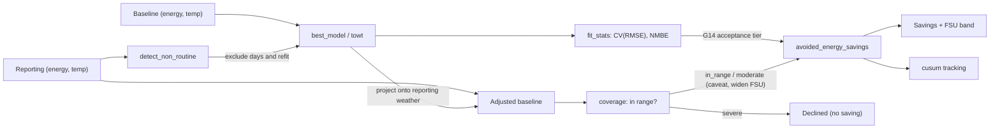

# Measurement & Verification in CAMBER (IPMVP / ASHRAE G14 / CalTRACK)

CAMBER implements whole-building **IPMVP Option-C** savings — equivalently the
**CalTRACK** *normalized metered energy consumption* (NMEC) workflow — from
standard parts: a weather-based baseline model, goodness-of-fit statistics, and
avoided energy use with uncertainty. This page maps CAMBER's API to the
CalTRACK/IPMVP vocabulary and shows how to cross-check against
[OpenEEmeter (eemeter)](https://github.com/openeemeter/eemeter), the reference
open-source CalTRACK implementation.

*IPMVP Option-C / CalTRACK NMEC pipeline: fit a weather baseline, project it onto reporting weather, and report avoided energy with an uncertainty band.*



## Terminology bridge

| IPMVP / CalTRACK term | CAMBER |
|---|---|
| Baseline period / reporting period | the two `(energy, temp)` series you pass in |
| Baseline model | `mandv.models.best_model` (change-point 2P–5P) / `mandv.towt` (hourly) |
| Goodness of fit — CV(RMSE), NMBE | `mandv.stats.fit_stats` |
| Avoided energy use | `mandv.stats.avoided_energy_savings` |
| Fractional savings uncertainty (FSU) | G14 Annex-B, in the same call — `t·1.26·CV·√((n/n′)(1+2/n)/m)/F` |
| Autocorrelation correction | `n′ = n(1−ρ)/(1+ρ)`; ρ from `stats.lag1_autocorrelation`, carried on `FitStats.rho_lag1` |
| Normalized annual savings | drive the models with a typical year (`mandv.weather` TMY/EPW) |
| Live actual weather (any lat/lon) | `weather_source.oat_reference` — NASA POWER fetch, see [WEATHER.md](WEATHER.md) |
| Cumulative savings tracking | `mandv.cusum` |
| Baseline covers the reporting conditions | `mandv.coverage.assess_coverage` → `Coverage` (tier, shares outside, distance beyond) |
| Extrapolation disclosure / refusal | `SavingsResult.coverage`, `.caveats`, `.declined`, `.declined_reason` |
| Uncertainty widening for extrapolation | `SavingsResult.fsu_extrapolation_factor` (`k`, below) |

## Method correspondence

- **CalTRACK Daily** ↔ CAMBER daily change-point: aggregate to daily energy vs
  daily-mean temperature, fit the inverse model, project onto reporting weather.
  This is exactly what `mandv.caltrack.caltrack_savings()` does end-to-end.
- **Hourly NMEC** ↔ `mandv.caltrack.caltrack_savings_hourly`, on a **TOWT** baseline
  (`mandv.towt`, the LBNL Mathieu et al. time-of-week & temperature model).
  **This is not the CalTRACK Hourly specification** — that method is a different estimator:

  | CalTRACK Hourly | CAMBER `mandv.towt` |
  |---|---|
  | per-calendar-month segmented models, weighted | one pooled model over the baseline |
  | six **fixed** temperature bin edges | `n_temp_segments` **quantile-spaced** breakpoints |
  | occupancy from a month × hour-of-week lookup, from a preliminary daily model's residuals | occupancy from bin-mean load vs the median of bin means |
  | 365-day data sufficiency, hard limits enforced | hour count **plus** per-hour-of-week-bin coverage |

  So these are defensible IPMVP Option-C savings on a published baseline model, not
  eemeter-comparable numbers. Same posture as the daily method — see the CalTRACK note below.

  **Expect a band comparable to the daily method, not tighter.** Hourly residuals are strongly
  serially correlated (ρ≈0.85 is ordinary), and the effective-sample-size correction bites: measured
  on a 20-week synthetic, n=3360 hours becomes n_eff=282 and the band widens from 1.6% at ρ=0 to
  9.7% at ρ=0.85. Finer data does not buy proportionally more certainty.
- **Billing/monthly** ↔ change-point on monthly data (looser CV(RMSE) tier).

## Quick use

```python
from camber.mandv.caltrack import caltrack_savings

res = caltrack_savings(
    baseline_energy, baseline_temp, reporting_energy, reporting_temp
)  # hourly Series in
print(res.model_kind, round(res.baseline_r2, 3))
print(res.savings.savings_pct, "±", res.savings.fractional_uncertainty)  # fractions
print(res.savings.coverage["tier"], res.savings.caveats)  # did the baseline cover it?
```

If the reporting weather lies far outside the baseline's, `res.savings.declined` is `True` and the
savings fields are `None` — see [Extrapolation](#extrapolation-coverage-caveats-and-declining).

### Two uncertainty kernels, and why

Which kernel applies depends on whether the savings difference contains **measured** energy:

- **`measured − projected`** (Option C avoided energy, Option B isolation) carries the reporting
  period's own residual noise, which averages down over the `m` reporting points. This is the G14
  Annex-B form above.
- **`projected − projected`** (normalized annual savings, Option D) contains no measured energy at
  all — only parameter error, shared by every projected period. Its band is therefore **independent
  of how many periods you normalize onto**, and uses `CV·√(p/n)`, the OLS average leverage.

The two have deliberately different provenance: the measured kernel is the published G14 expression,
constant and all; the projected one is textbook regression theory, cited as such rather than
borrowing G14's empirical `1.26` for a case it was never derived for.

Serial correlation widens both, via `n′`. Daily whole-building residuals are routinely correlated,
so an unadjusted band is optimistic — `caltrack_savings` estimates ρ from the baseline residuals
automatically. Strictly the *reporting*-period ρ is wanted, but those residuals contain the saving
itself, so the baseline fit's ρ is the standard substitution.

## Acceptance thresholds — and where we differ from CalTRACK

- CAMBER uses ASHRAE **Guideline 14** acceptance tiers for CV(RMSE)
  (`stats.cv_rmse_max_for`: ~15% monthly, ~30% daily/hourly) and reports NMBE.
- **CalTRACK is stricter and more prescriptive**: it specifies data-sufficiency
  rules (coverage, minimum days), explicit model-selection criteria, and hard
  limits that eemeter enforces. CAMBER leaves those policy choices to the caller —
  so a CAMBER fit is *not* automatically CalTRACK-compliant. Use the thresholds and
  the FSU to judge whether a result is reportable, and apply CalTRACK's data rules
  if compliance is required.

## Extrapolation: coverage, caveats and declining

A baseline is a regression over the conditions it was fitted on. Projected onto a reporting period
it never saw — a spring baseline applied to a summer — its slopes run past the data, and the
avoided energy and FSU describe a model nothing supports. IPMVP and ASHRAE Guideline 14 both expect
the baseline to cover the reporting conditions, or the extrapolation to be disclosed and bounded;
neither is quoted for the numbers below, and CalTRACK prescribes no extrapolation test. **Every
threshold here is a CAMBER policy choice**, set on `mandv.coverage.ExtrapolationPolicy`.

Every savings path — `avoided_energy_savings`, `caltrack_savings`, `caltrack_savings_hourly`,
`isolation_savings`, `normalized_savings`, `isolation_normalized_savings` and the savings chart —
grades the baseline's coverage of the reporting drivers and acts on the tier:

| Tier | When (defaults) | What happens |
|---|---|---|
| `in_range` | ≤ 5% of points **and** ≤ 5% of baseline-projected energy outside the support, and nothing more than 10% of the fitted range beyond it | Numbers exactly as before; `coverage` attached |
| `moderate` | anything short of severe | Caveat with the shares, the support and fitted ranges and the furthest distance; FSU widened by `k` (linear models) |
| `severe` | ≥ 25% of points or energy outside, or > 50% of the fitted range beyond it, or a baseline driver that never varied while the reporting one does | **Declined**: `avoided_energy`, `baseline_projected`, `savings_pct`, `fractional_uncertainty`, `abs_uncertainty` → `None`; `reporting_actual` stays; `declined_reason` says why |
| `not_evaluated` | the model carries no fit range (a duck-typed or constant model), or no finite reporting rows | Numbers unchanged; a caveat says coverage was not checked |

**Support.** At fit time each model records its finite baseline drivers (one private fit record per
model). The *support band* is the 1st–99th percentile order statistics (`support_quantile`), so one
freak day does not stretch the range a whole season is judged against; points within 5% of the
band's width (`edge_tolerance`) count as covered. Shares are counted against the band, distance
beyond the hard `[min, max]` range as a fraction of its width. Both sides count, including a flat
segment of a change-point model — outside the data is outside the data, even where the model's
arithmetic happens to be benign.

**Widening a moderate extrapolation.** For linear-in-parameters baselines (change-point, degree-day,
Option-B driver models), with `A = pinv(X′X)` of the baseline design, `s` the sum of the reporting
design rows and `s_c` the same with each driver clamped into the support band:

- measured kernel (avoided energy): `k = √((m + s′As) / (m + s_c′As_c))`
- projected kernel (normalized savings): `k = √(s′As / s_c′As_c)`

and the reported FSU is `FSU × max(1, k)`, with `k` recorded as `fsu_extrapolation_factor`. It is
the variance of the projected *total* at the actual drivers relative to drivers kept inside the
support — so it is conditional on the fitted change points (treated as known), it equals 1 where
the extrapolated points sit on a flat segment, and it tracks the mean design row: a few
extrapolated points in an otherwise central period barely move it, and the measured-noise term `m`
usually dominates it for avoided energy. It widens for parameter variance only; it cannot bound the
*bias* of a wrong functional form beyond the data, which is why severe extrapolation declines
rather than widens.

**Several drivers.** Each column is checked, and so is leverage: a reporting row with
`h = x A x′` above the largest baseline leverage lies outside the joint region the data spans even
when every column is individually in range — hidden extrapolation (Montgomery, Peck & Vining,
*Introduction to Linear Regression Analysis*). A row outside on either test is outside.

**TOWT (hourly).** The unit is *occupancy mode × temperature cell* (below the fitted range, each of
the model's temperature segments, above it). A reporting hour is unsupported when its cell holds
fewer than 20 baseline hours (`min_cell_obs`) or lies beyond its mode's fitted range; distances
are per mode. Hour-of-week × temperature sparsity is reported in `coverage["info"]` for information
and never changes the tier. TOWT clips its temperature basis at the breakpoints, so it holds its
response **flat** beyond the fitted range: the error there is bias, not parameter variance, so TOWT
is flagged but its FSU is never widened. The unseen hour-of-week check still raises.

**CalTRACK daily** also caveats a baseline shorter than 365 days, which cannot span a weather year.
**Normalized savings** grade both models against the normal year (`coverage_baseline`,
`coverage_reporting`); a TMY colder than the reporting model's fit declines. **Categorical models**
treat a reporting category the baseline never fitted as unsupported (bind a period with
`CategoricalModel.at(cat)`); rows without a finite projection are counted (`coverage["n_used"]` vs
`["n_report"]`) rather than dropped silently.

**Migration.** Severe extrapolation declines by default, so the savings fields are `float | None`.
To keep computing it (with a widened band and a caveat starting "SEVERE extrapolation — not a
defensible saving"), opt out:

```python
from camber.mandv.caltrack import caltrack_savings
from camber.mandv.coverage import ExtrapolationPolicy

res = caltrack_savings(
    baseline_energy,
    baseline_temp,
    reporting_energy,
    reporting_temp,
    extrapolation=ExtrapolationPolicy(decline=False),
)
```

**Config runs.** A config `mv` entry (see [CLI.md](CLI.md)) that names a `reporting_period`
emits one `mv_savings` finding per meter alongside its `mv_baseline`:

```json
{"class": "CHILLEDWATER_METER", "role": "energy_rate",
 "period": ["2016-01-01", "2016-06-30"], "reporting_period": ["2016-09-15", "2016-11-30"],
 "extrapolation": {"decline_share": 0.30}}
```

Its metrics carry `avoided_energy`, `savings_pct`, `fsu`, `fsu_extrapolation_factor` and the
coverage (`coverage_tier`, `share_points_outside`, `share_energy_outside`, `max_beyond_rel`); the
baseline finding records the OAT support it was judged against (`oat_fit_min`, `oat_fit_max`,
`oat_support_lo`, `oat_support_hi`) and its residual `rho`, now estimated because the daily index
is passed to the fit statistics. A severe extrapolation — a winter baseline against a summer — is
an `info` finding with `metrics["declined"]` true, a `declined_reason` and a caveat, never a number.
`extrapolation` takes the `ExtrapolationPolicy` fields; an unknown key is an error.

`assess_coverage(model, drivers)` is direction-agnostic: it grades any fitted model against any
driver set, so the same call checks a reporting model projected back onto baseline conditions.

## Model validity: coefficient p-values and the SEP verdict

`stats.regression_tests(X, y, names=...)` returns coefficient standard errors, t statistics and
two-sided p-values, the overall F-test p-value, adjusted R² and — given a `time_index` — the
residuals' lag-1 ρ and ρ-adjusted p-values (variance × κ, degrees of freedom `n′ − p`).
`model_regression_tests(model, drivers, y)` does the same for a fitted change-point, degree-day
or driver model. The t and F tails are computed in the standard library, through a regularized
incomplete beta evaluated by its continued fraction (DLMF 8.17.22); they are checked against
closed forms and the NIST StRD *Norris* certified regression.

**Change points.** A change point is grid-searched, not solved by least squares. It counts as a
parameter (the F-test is `F(p − 1, n − p)` with the change point in `p`, as `FitStats` does), but
the slope p-values are **conditional on it**: CAMBER treats change points as fixed, the G14
convention as described by BPA/SBW, *Uncertainty Approaches and Analyses for Regression Models
and ECAM* (2017) §2.3.1. The search makes those p-values optimistic, and every result says so
(`conditional_on_change_points`, plus a caveat).

`stats.sep_validity(tests, signs=...)` applies the DOE **SEP 50001 M&V Protocol, 2019 Edition 2,
§6.4.1** (identical in the 2012 *SEP M&V Protocol for Industry*, §3.4.5):

- the overall F-test has p < 0.10;
- every relevant variable has p < 0.20, and at least one has p < 0.10;
- R² ≥ 0.50;
- the coefficients are consistent with a logical understanding of the process.

Relevant variables are the slopes — never the intercept or a change point. `logical_signs(model)`
supplies the signs physics fixes (a heating or cooling arm slopes upward away from its change
point); without `signs` the sign test is skipped, with a caveat. SEP's tests assume independent
residuals, so the verdict is reported as written (`sep_valid`, reproducible against the DOE EnPI
tool) and ρ-adjusted (`sep_valid_rho_adjusted`), with a caveat when they disagree.

This is a **separate verdict** from `FitStats.accept`, the G14-style gate (CV(RMSE), NMBE, R²)
that governs savings claims — which is unchanged.

```python
from camber.mandv.models import fit_model
from camber.mandv.stats import logical_signs, model_regression_tests, sep_validity

m = fit_model(T, y, "3PC", time_index=days)
v = sep_validity(model_regression_tests(m, T, y, time_index=days), signs=logical_signs(m))
v.sep_valid, v.sep_valid_rho_adjusted, v.failures
```

## Backcast savings

`methods.backcast_savings` is the SEP **backcast** (SEP 2019 Ed. 2 §6.2.2, Eq 9): a model fitted
on the *reporting* period, projected back onto the *baseline* period's conditions and subtracted
from measured baseline energy, `S = O_b − P_r|b`. SEP permits it when the baseline conditions fall
within the range of validity of the reporting-period model (SEP 2012 §3.6.3.1) — typically when
the baseline cannot support a valid model but the reporting period can.

- **Coverage** is the reporting model's support graded against the baseline drivers — the
  mirror image of a forecast. A mild-season baseline against a full-year reporting period is a
  severe forecast extrapolation but an in-range backcast.
- **Uncertainty** is the reporting model's: the G14 measured-savings kernel by default, with the
  roles swapped (`m` baseline points, `n` reporting-fit points), or the exact kernel.
- **Labels.** IPMVP 2012 calls a saving stated at baseline conditions *normalized* savings, and
  the IPMVP Core Concepts review draft calls a backcast *avoided energy*; CAMBER claims neither
  and labels the result `method="backcast"`, `basis="baseline-period conditions"`.

```python
from camber.mandv.methods import backcast_savings

res = backcast_savings(
    reporting_model, T_baseline, y_baseline, cv_rmse=st.cv_rmse, n_reporting=st.n, p_reporting=3
)
res.savings, res.savings_pct, res.abs_uncertainty, res.coverage["tier"]
```

## SEP methods: forecast, backcast, standard conditions and chaining

`camber.mandv.methods` implements the four adjustment-model methods of the DOE **SEP 50001 M&V
Protocol, 2019 Edition 2**, §6.2, with one result type, `MethodResult`. All of it is provisional.
Every result records its `method`, its `basis` and its uncertainty `kernel`.

- **Forecast** (§6.2.1), `forecast_savings`. The saving is `P_b|r − O_r` (Eq 8) and the SEnPI
  `O_r / P_b|r` (Eq 5). Default kernel: G14.
- **Backcast** (§6.2.2), `backcast_savings`. The saving is `O_b − P_r|b` (Eq 9) and the SEnPI
  `P_r|b / O_b` (Eq 5). Default kernel: G14.
- **Standard conditions** (§6.2.3), `standard_conditions_savings`. The saving is
  `P_b|s − P_r|s` (Eq 10) and the SEnPI `P_r|s / P_b|s` (Eq 5). Default kernel: exact.
- **Chaining** (§6.2.4), `chained_savings`. The saving is `(O_b − P_i|b) + (P_i|r − O_r)`
  (Eq 11) and the SEnPI `(P_i|b / O_b)·(O_r / P_i|r)` (Eq 6). Kernel: exact.

`O` is measured energy and `P_x|y` the model of period `x` applied to the conditions of period
`y`. `savings_pct` is the SEP improvement as a fraction, `1 − SEnPI` (Eq 7 ÷ 100). `sep_terms`
holds the SEP quantities for aggregation.

**Chaining is SEP's method, exactly.** It uses one intermediate period "of the same length of,
and ... in between the baseline and reporting periods" (§6.2.4). Its model is backcast onto the
baseline and forecast onto the reporting period, and it must cover both (SEP 2012 §3.6.5).
`chained_savings` checks the period rule and raises `ValueError` when it fails. CAMBER allows one
day's difference in length, for a leap year; the Protocol states no tolerance. A severe
extrapolation on either side declines the result. The chained SEnPI is a **product** (Eq 6), and
the chained saving a **sum** (Eq 11). EnPI V5 adds cumulative improvement percentages for
pre-model years; that is bookkeeping, and CAMBER follows the Protocol instead.

**`sequential_chain` is a CAMBER extension, not SEP.** It chains any number of consecutive
`MethodResult` links, for example year-over-year forecasts against rebaselined models. The SEnPI
is the product of the links and the saving their sum. Every result carries a caveat saying the
chain is not an SEP method, and it has no `sep_terms`, so it cannot be aggregated into an SEP
SEnPI.

### Uncertainty

SEP says nothing about uncertainty. These bands are CAMBER's. The kernel defaults follow decision
D7 on #21: the G14 kernel for single-model results and the exact kernel for multi-model results.
With `Σ = κ s² A` the model's parameter covariance and `g` the sum of the design rows:

```text
Forecast / backcast:  as avoided_energy_savings / backcast_savings (G14 or exact)
Standard conditions:  Var S = V_param,b(s) + V_param,r(s)                     (IPMVP 2012 B-19)
                      Var ln SEnPI = V_param,r/P_r|s² + V_param,b/P_b|s²      (delta method)
SEP chain:            Var S = (g_r − g_b)′ Σ_i (g_r − g_b) + V_noise,i(b) + V_noise,i(r)
                      Var ln SEnPI ≈ T_b/P_i|b² + T_r/P_i|r² − 2 g_b′ Σ_i g_r /(P_i|b · P_i|r)
                      (T = V_param + V_noise; the noise part taken relative to O_b, O_r)
Sequential chain:     Var S = Σ_k Var S_k (B-19);  Var ln SEnPI = Σ_k Var ln EnPI_k (B-20)
Single-model SEnPI:   band(SEnPI) = SEnPI · band(S) / denominator            (delta method)
```

Both projections of the SEP chain share one `β̂_i`, and their parameter errors enter with opposite
signs. The independence form therefore **over-states** the chain's uncertainty whenever
`g_b′ Σ g_r > 0`, which is typical, because the intercept column dominates. So the chain uses the
exact covariance form and reports the independence variance beside it (`uncertainty_terms`). The
intermediate model's `κ s²` stands in for the noise of both measured periods. The chain always
uses the exact kernel (`kernel="g14"` raises), because the G14 expression has no covariance term.

**Monte Carlo.** The test used synthetic 3P-cooling data with AR(1) residuals, ρ estimated from
the intermediate fit, and 600 seeded runs per ρ. The baseline and reporting climates differed,
and the intermediate year spanned both. The nominal 90% chain band covered the true saving in
**90–92%** of runs at ρ = 0, 0.4 and 0.8, and the SEnPI band did the same. At ρ = 0 the
predicted variance matched the empirical one to within 15%. The independence form's variance was
about **1.5×** the exact one. CI gates coverage at 85–95%. As elsewhere, these results are
conditional on the fitted change points.

The sequential chain's B-19/B-20 combination assumes the links are independent. That holds only
approximately. A link whose model was fitted on a period that another link measures shares that
period's noise, and the result's caveat says so.

### The SEP range rule (secondary)

SEP §6.4.2.1 requires the **mean** of each relevant variable over the application period to fall
within the fitted range, or within three standard deviations of the fit mean.
`sep.sep_range_check` applies it, and every method result reports the outcome as
`sep_range_valid`, with details in `sep_range`. This verdict is **secondary** (decision D2). The
primary guard stays the per-point coverage tier: a mild mean can hide hot extremes on a
change-point slope, and the mean rule passes them. The standard deviation is the sample one
(`ddof = 1`), a CAMBER choice.

### Choosing a method, and the method-shopping guard

`select_method(frame, baseline=..., reporting=...)` follows SEP's order:

1. forecast, if the baseline model is SEP-valid and covers the reporting period (per-point
   coverage not severe, and SEP's mean rule holds);
2. backcast, if the reporting model is valid and covers the baseline;
3. chaining, through the best-ranked valid intermediate window of the baseline's length lying
   between the two periods whose model covers both;
4. standard conditions, if both models are valid and cover the supplied conditions;
5. otherwise, decline (SEP 2012 §3.6.6).

In every period the candidate models are ranked by SEP validity, then adjusted R², as the DOE
EnPI tool does.

**It only proposes.** Valid methods can disagree widely. Chen & Therkelsen (LBNL-2001209, 2019)
found all four SEP methods valid on one facility, with SEnPI ranging from 0.93 to 1.00. So the
proposal has no headline figure. Its `sensitivity` table lists every valid method's saving,
SEnPI and band side by side. A reported saving needs a **declared** method: in a config, set
`mv[].method`. `"method": "auto"` gives an `mv_method_proposal` finding, never an `mv_savings`
one. When no method is declared the run keeps the SEP default, forecast, and the finding says the
method was not declared. Freezing the declared method with a versioned baseline comes in a later
phase of #21.

```json
{"class": "CHILLEDWATER_METER", "role": "energy_rate",
 "period": ["2016-01-01", "2016-12-31"], "reporting_period": ["2018-01-01", "2018-12-31"],
 "method": "chaining", "intermediate_period": ["2017-01-01", "2017-12-31"], "kernel": "exact"}
```

`method` takes `forecast`, `backcast`, `chaining` (with `intermediate_period`),
`standard_conditions` (with `normal_year`, a list of daily mean temperatures) or `auto`. `kernel`
takes `g14` or `exact`, and defaults per D7.

### SEP arithmetic and primary energy (`mandv.sep`)

- `senpi` (Eq 5), `chained_senpi` (Eq 6), `improvement_pct` (Eq 7) and `top_down_savings`
  (Eq 8–11). Golden tests reproduce the SEP 2019 Guidance's Eagleston ratio example (7.38%) and
  Ashton forecast (13.53%, which the Guidance rounds to 14%). The Guidance's range-check example
  is **not** used, because its arithmetic is wrong (see #21).
- `bottom_up_reconciliation` (Eq 12): `RF = ESP_BU / ESP_TD`. Below 0.80, the verified
  improvement is the top-down one times RF. RF is never used to scale an improvement up.
- `primary_energy` (Eq 1) and `ANNEX_B_MULTIPLIERS`: only rows transcribed from the Protocol's
  own **Annex B** (Tables 4A/4B). Examples are grid electricity 3.0, solar, wind and geothermal
  electricity 1.0, fired-boiler steam or hot water 1.33, fired absorption chilled water 1.25,
  engine-driven chilled water 0.83, electric chilled water 0.72, compressed air 3.0, and the
  fuels 1.0. A user table overrides or extends it. A caveat notes that SEP requires Verification
  Body approval for site-specific multipliers. A negative net consumption counts as zero (§5.1.2).
- `aggregate_energy_types`: one `MethodResult` per energy type, all with the **same** method
  (§6.2). Each is converted to primary energy and summed (§6.3.2) before Eq 5–11 are applied.
  The savings bands combine in quadrature (B-19).

## The exact uncertainty kernel

Every savings function takes `kernel="g14"` (the default, as documented above) or
`kernel="exact"`. For a model fitted on `n` points with `p` parameters, residual variance `s²`,
lag-1 residual autocorrelation ρ (`κ = (1+ρ)/(1−ρ)`) and `A = (X′X)⁻¹`, applied to `m` rows whose
design rows sum to `g`:

```text
V_param = κ s² g′Ag        (parameter error of the projected total)
V_noise = κ s² m           (noise of m measured points)
avoided energy / backcast:  band = t(n − p) · √(V_param + V_noise)
normalized:                 band = t(min(n − p)) · √(V_param,b + V_param,r)
```

This is the textbook OLS prediction variance of a sum (BPA/SBW 2017 §3.3); κ inflates both terms,
the conservative choice (CAMBER decision D3 on #21). It **carries the leverage of the application
conditions itself** — a projection far from the fitted mean has a large `g′Ag` — so a band
computed with it is never widened again for extrapolation: `fsu_extrapolation_factor` is 1.0.
Projected onto its own baseline rows it reduces to `CV/√n` of the in-sample total (for a model
with an intercept `g′Ag = 1′H1 = n`), which the conservative `CV·√(p/n)` projected kernel bounds
from above. It needs a CAMBER-fitted model, whose fit record holds `(X′X)⁻¹`, `s²`, `n`, `p` and —
when fitted with a `time_index` — ρ.

**Coverage.** In a seeded Monte Carlo — daily change-point data, AR(1) residuals, ρ estimated
from the baseline fit, 1,000 runs per ρ — the exact kernel's nominal 90% band covered the true
saving **90.2%, 90.0% and 86.6%** of the time at ρ = 0, 0.4 and 0.8; CI gates it to 85–95%. The
G14 kernel covered 86.3%, 85.5% and 82.5% on the same data. Both are conditional on the fitted change
points; the published evidence is that G14 bands under-cover real buildings (Touzani, Granderson,
Jump & Rebello, *Energy & Buildings* 193:216–225, 2019: about 71% at nominal 95% for daily
models), which synthetic data cannot reproduce.

**Unverified.** The ASHRAE text was not consulted. A BPA reproduction of the G14 kernel writes
`(1 + 2/n′)` where CAMBER writes `(1 + 2/n)`; which is G14's is **unverified**, and CAMBER keeps
its current form until it can be checked against Reddy & Claridge (2000). The G14 formula for
normalized savings is likewise **unverified**; `normalized_savings` combines the two models in
quadrature (IPMVP 2012 Appendix B-5, B-19; BPA *Meter-Based Energy Modeling Protocol* 2024 §5.9)
at Student's t on the smaller fit's degrees of freedom, with each model's own ρ.

## Non-routine events (NRE)

Shutdowns, occupancy changes or meter outages are by definition what the weather model can't
explain, and they skew a baseline. CAMBER has three detectors, all on the residuals of a daily
change-point weather model:

- **`detect_non_routine`** — point-wise: days whose residual is a robust (MAD) outlier.
  `caltrack_savings(..., exclude_non_routine=True)` drops those baseline days and refits, so a
  one-off shutdown doesn't distort the savings.
- **`detect_step_change`** — one sustained level shift, by the largest two-sample statistic over
  all splits. Pass `autocorrelation=True` (**recommended**): it divides the statistic by
  `√κ`, `κ = (1+ρ)/(1−ρ)`. Daily whole-building residuals routinely have ρ ≈ 0.6 (the BDG2
  median), which inflates the uncorrected statistic about 2×; on synthetic step-free data at
  ρ = 0.8 the uncorrected default fires on nearly every run. The default is left unchanged so
  existing results do not move. Its residuals come from a model fitted *through* the step, so the
  ρ it estimates is inflated — conservative.
- **`detect_step_changes`** — several steps at once:
    1. fit the weather baseline;
    2. segment the residuals with **PELT** (Killick, Fearnhead & Eckley 2012) using a Gaussian
       mean-change cost whose variance is inflated for serial correlation, `σ²κ` — the variance
       of a segment mean under AR(1) residuals — and an mBIC-style penalty of `3 ln n` per step,
       with segments at least `min_segment_days=28` long and at most `max_steps`;
    3. refit the weather model with **one level indicator per segment**, so a step is not absorbed
       into the temperature slope, and re-estimate `σ` and `ρ` from that fit;
    4. repeat until the step set is stable (at most three refinement rounds).

    The first round segments on a first-difference noise scale, because a step inflates both the
    fit's residual variance and its ρ; the steps reported always come from a later round. Each step
    carries its size (post − pre level) and a ρ-inflated standard error. This is the approach of
    Touzani, Ravache, Crowe & Granderson, *Energy & Buildings* 185:123–136 (2019), applied to the
    model residuals. On synthetic AR(1) sites it placed two planted steps to the day and flagged
    none of 50 step-free runs at ρ = 0, 0.4 and 0.8. `changedetect.detect_level_shifts` (greedy
    binary segmentation, independent-residual statistic) finds the same clear steps but also
    spurious ones: it fired on most step-free runs at ρ = 0.8.

Detection only reports. Adjusting for a detected event (an indicator, an engineering estimate,
excluding the span) and rebaselining are later phases of issue #21.

## Cross-checking against eemeter

eemeter pulls heavier dependencies, so install it in a **separate environment**
rather than alongside CAMBER:

```sh
python -m venv .eemeter && . .eemeter/bin/activate
pip install eemeter eeweather
```

Then run the *same* baseline and reporting data through both and compare:

1. CAMBER: `caltrack_savings(...).savings.avoided_energy`.
2. eemeter: fit a CalTRACK daily model on the baseline and compute metered savings
   over the reporting period (see eemeter's docs/notebooks).
3. Expect the avoided-energy figures to agree within CAMBER's reported FSU band.
   Differences usually trace to CalTRACK's data-sufficiency/limit rules (which
   eemeter applies and CAMBER leaves configurable) or to model-selection choices.

This gives a credible, standards-aligned check without making eemeter a CAMBER
dependency. See [docs/ECOSYSTEM.md](ECOSYSTEM.md) for the broader leverage strategy.

## Degree-day baseline (`mandv.degreeday`)

The simplest defensible weather model — a variable-base degree-day regression
`E = base + a·HDD + b·CDD` — for monthly-bill M&V where you have average temperature and energy per
period (a lighter cousin of the change-point models above).

```python
from camber.mandv.degreeday import fit_degree_day

m = fit_degree_day(tavg_per_month, energy_per_month)  # balance point auto-fit by min CV(RMSE)
m.balance_point, m.cooling_slope, m.heating_slope, m.fit.cv_rmse
m.predict(normal_year_tavg)  # normalize / project the baseline
```

`degree_days(tavg, balance_point)` returns the `(HDD, CDD)` arrays. Flags: `balance_point` (fix it
or leave None to search), `balance_range`/`step` (search grid), `kind` (`heating`/`cooling`/`both`).
Fit statistics (R², CV(RMSE), NMBE, G14 acceptance) come from `mandv.stats.fit_stats`.

## IPMVP Option A — key-parameter measurement (`mandv.option_a`)

Measure the parameter that drives the savings and **stipulate** the rest (the classic lighting/motor
retrofit): savings = measured Δparameter × stipulated duty.

```python
from camber.mandv.option_a import option_a_savings, stipulated_annual_hours

r = option_a_savings(
    baseline_kw=100, reporting_kw=60, stipulated_factor=stipulated_annual_hours(hours_per_day=10)
)  # 2600 h
r.savings, r.measured_delta, r.reduction_pct  # 104000 kWh, 40 kW, 0.40
```

Inputs may be scalars or sampled arrays/Series (the mean is taken). The result's `basis` records the
measured-vs-stipulated split for audit; the stipulated portion carries uncertainty this method does
not quantify. Complements Option B (`mandv.retrofit_isolation`) and Option C (`mandv.stats`).

## IPMVP Option D — calibrated simulation (`mandv.rc_model`)

The one remaining IPMVP boundary, now shipped: a dependency-light 1R1C grey-box building model
(`RCModel.predict(oat, schedule)`) calibrated to metered energy (grid `tau` + OLS, gated by the same
ASHRAE G14 acceptance test), then run under an as-corrected control to give a **pre-implementation
modeled saving** with a G14 uncertainty band — the counterfactual the `ecm_savings` upper bound stands
in for. Refuses to claim a saving when the calibration fails the gate. So CAMBER now covers **IPMVP
Options A, B, C, and D**. A **2R2C** thermal-mass variant (`RC2Model`/`calibrate2`), **multi-zone**
stacked-OLS calibration (`calibrate_zones`), and an optional **EnergyPlus** cross-validator
(`interop.energyplus`) add depth on the same grid-τ/OLS/G14 footing. See **[OPTION-D.md](OPTION-D.md)**.
