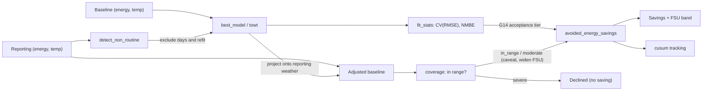

# Measurement & Verification in CAMBER (IPMVP / ASHRAE G14 / CalTRACK)

CAMBER implements whole-building **IPMVP Option-C** savings — equivalently the
**CalTRACK** *normalized metered energy consumption* (NMEC) workflow — from
standard parts: a weather-based baseline model, goodness-of-fit statistics, and
avoided energy use with uncertainty. This page maps CAMBER's API to the
CalTRACK/IPMVP vocabulary and shows how to cross-check against
[OpenEEmeter (eemeter)](https://github.com/openeemeter/eemeter), the reference
open-source CalTRACK implementation.

*IPMVP Option-C / CalTRACK NMEC pipeline: fit a weather baseline, project it onto reporting weather, and report avoided energy with an uncertainty band.*



## Terminology bridge

| IPMVP / CalTRACK term | CAMBER |
|---|---|
| Baseline period / reporting period | the two `(energy, temp)` series you pass in |
| Baseline model | `mandv.models.best_model` (change-point 2P–5P) / `mandv.towt` (hourly) |
| Goodness of fit — CV(RMSE), NMBE | `mandv.stats.fit_stats` |
| Avoided energy use | `mandv.stats.avoided_energy_savings` |
| Fractional savings uncertainty (FSU) | G14 Annex-B, in the same call — `t·1.26·CV·√((n/n′)(1+2/n)/m)/F` |
| Autocorrelation correction | `n′ = n(1−ρ)/(1+ρ)`; ρ from `stats.lag1_autocorrelation`, carried on `FitStats.rho_lag1` |
| Normalized annual savings | drive the models with a typical year (`mandv.weather` TMY/EPW) |
| Live actual weather (any lat/lon) | `weather_source.oat_reference` — NASA POWER fetch, see [WEATHER.md](WEATHER.md) |
| Cumulative savings tracking | `mandv.cusum` |
| Baseline covers the reporting conditions | `mandv.coverage.assess_coverage` → `Coverage` (tier, shares outside, distance beyond) |
| Extrapolation disclosure / refusal | `SavingsResult.coverage`, `.caveats`, `.declined`, `.declined_reason` |
| Uncertainty widening for extrapolation | `SavingsResult.fsu_extrapolation_factor` (`k`, below) |

## Method correspondence

- **CalTRACK Daily** ↔ CAMBER daily change-point: aggregate to daily energy vs
  daily-mean temperature, fit the inverse model, project onto reporting weather.
  This is exactly what `mandv.caltrack.caltrack_savings()` does end-to-end.
- **Hourly NMEC** ↔ `mandv.caltrack.caltrack_savings_hourly`, on a **TOWT** baseline
  (`mandv.towt`, the LBNL Mathieu et al. time-of-week & temperature model).
  **This is not the CalTRACK Hourly specification** — that method is a different estimator:

  | CalTRACK Hourly | CAMBER `mandv.towt` |
  |---|---|
  | per-calendar-month segmented models, weighted | one pooled model over the baseline |
  | six **fixed** temperature bin edges | `n_temp_segments` **quantile-spaced** breakpoints |
  | occupancy from a month × hour-of-week lookup, from a preliminary daily model's residuals | occupancy from bin-mean load vs the median of bin means |
  | 365-day data sufficiency, hard limits enforced | hour count **plus** per-hour-of-week-bin coverage |

  So these are defensible IPMVP Option-C savings on a published baseline model, not
  eemeter-comparable numbers. Same posture as the daily method — see the CalTRACK note below.

  **Expect a band comparable to the daily method, not tighter.** Hourly residuals are strongly
  serially correlated (ρ≈0.85 is ordinary), and the effective-sample-size correction bites: measured
  on a 20-week synthetic, n=3360 hours becomes n_eff=282 and the band widens from 1.6% at ρ=0 to
  9.7% at ρ=0.85. Finer data does not buy proportionally more certainty.
- **Billing/monthly** ↔ change-point on monthly data (looser CV(RMSE) tier).

## Quick use

```python
from camber.mandv.caltrack import caltrack_savings

res = caltrack_savings(
    baseline_energy, baseline_temp, reporting_energy, reporting_temp
)  # hourly Series in
print(res.model_kind, round(res.baseline_r2, 3))
print(res.savings.savings_pct, "±", res.savings.fractional_uncertainty)  # fractions
print(res.savings.coverage["tier"], res.savings.caveats)  # did the baseline cover it?
```

If the reporting weather lies far outside the baseline's, `res.savings.declined` is `True` and the
savings fields are `None` — see [Extrapolation](#extrapolation-coverage-caveats-and-declining).

### Two uncertainty kernels, and why

Which kernel applies depends on whether the savings difference contains **measured** energy:

- **`measured − projected`** (Option C avoided energy, Option B isolation) carries the reporting
  period's own residual noise, which averages down over the `m` reporting points. This is the G14
  Annex-B form above.
- **`projected − projected`** (normalized annual savings, Option D) contains no measured energy at
  all — only parameter error, shared by every projected period. Its band is therefore **independent
  of how many periods you normalize onto**, and uses `CV·√(p/n)`, the OLS average leverage.

The two have deliberately different provenance: the measured kernel is the published G14 expression,
constant and all; the projected one is textbook regression theory, cited as such rather than
borrowing G14's empirical `1.26` for a case it was never derived for.

Serial correlation widens both, via `n′`. Daily whole-building residuals are routinely correlated,
so an unadjusted band is optimistic — `caltrack_savings` estimates ρ from the baseline residuals
automatically. Strictly the *reporting*-period ρ is wanted, but those residuals contain the saving
itself, so the baseline fit's ρ is the standard substitution.

## Acceptance thresholds — and where we differ from CalTRACK

- CAMBER uses ASHRAE **Guideline 14** acceptance tiers for CV(RMSE)
  (`stats.cv_rmse_max_for`: ~15% monthly, ~30% daily/hourly) and reports NMBE.
- **CalTRACK is stricter and more prescriptive**: it specifies data-sufficiency
  rules (coverage, minimum days), explicit model-selection criteria, and hard
  limits that eemeter enforces. CAMBER leaves those policy choices to the caller —
  so a CAMBER fit is *not* automatically CalTRACK-compliant. Use the thresholds and
  the FSU to judge whether a result is reportable, and apply CalTRACK's data rules
  if compliance is required.

## Extrapolation: coverage, caveats and declining

A baseline is a regression over the conditions it was fitted on. Projected onto a reporting period
it never saw — a spring baseline applied to a summer — its slopes run past the data, and the
avoided energy and FSU describe a model nothing supports. IPMVP and ASHRAE Guideline 14 both expect
the baseline to cover the reporting conditions, or the extrapolation to be disclosed and bounded;
neither is quoted for the numbers below, and CalTRACK prescribes no extrapolation test. **Every
threshold here is a CAMBER policy choice**, set on `mandv.coverage.ExtrapolationPolicy`.

Every savings path — `avoided_energy_savings`, `caltrack_savings`, `caltrack_savings_hourly`,
`isolation_savings`, `normalized_savings`, `isolation_normalized_savings` and the savings chart —
grades the baseline's coverage of the reporting drivers and acts on the tier:

| Tier | When (defaults) | What happens |
|---|---|---|
| `in_range` | ≤ 5% of points **and** ≤ 5% of baseline-projected energy outside the support, and nothing more than 10% of the fitted range beyond it | Numbers exactly as before; `coverage` attached |
| `moderate` | anything short of severe | Caveat with the shares, the support and fitted ranges and the furthest distance; FSU widened by `k` (linear models) |
| `severe` | ≥ 25% of points or energy outside, or > 50% of the fitted range beyond it, or a baseline driver that never varied while the reporting one does | **Declined**: `avoided_energy`, `baseline_projected`, `savings_pct`, `fractional_uncertainty`, `abs_uncertainty` → `None`; `reporting_actual` stays; `declined_reason` says why |
| `not_evaluated` | the model carries no fit range (a duck-typed or constant model), or no finite reporting rows | Numbers unchanged; a caveat says coverage was not checked |

**Support.** At fit time each model records its finite baseline drivers (one private fit record per
model). The *support band* is the 1st–99th percentile order statistics (`support_quantile`), so one
freak day does not stretch the range a whole season is judged against; points within 5% of the
band's width (`edge_tolerance`) count as covered. Shares are counted against the band, distance
beyond the hard `[min, max]` range as a fraction of its width. Both sides count, including a flat
segment of a change-point model — outside the data is outside the data, even where the model's
arithmetic happens to be benign.

**Widening a moderate extrapolation.** For linear-in-parameters baselines (change-point, degree-day,
Option-B driver models), with `A = pinv(X′X)` of the baseline design, `s` the sum of the reporting
design rows and `s_c` the same with each driver clamped into the support band:

- measured kernel (avoided energy): `k = √((m + s′As) / (m + s_c′As_c))`
- projected kernel (normalized savings): `k = √(s′As / s_c′As_c)`

and the reported FSU is `FSU × max(1, k)`, with `k` recorded as `fsu_extrapolation_factor`. It is
the variance of the projected *total* at the actual drivers relative to drivers kept inside the
support — so it is conditional on the fitted change points (treated as known), it equals 1 where
the extrapolated points sit on a flat segment, and it tracks the mean design row: a few
extrapolated points in an otherwise central period barely move it, and the measured-noise term `m`
usually dominates it for avoided energy. It widens for parameter variance only; it cannot bound the
*bias* of a wrong functional form beyond the data, which is why severe extrapolation declines
rather than widens.

**Several drivers.** Each column is checked, and so is leverage: a reporting row with
`h = x A x′` above the largest baseline leverage lies outside the joint region the data spans even
when every column is individually in range — hidden extrapolation (Montgomery, Peck & Vining,
*Introduction to Linear Regression Analysis*). A row outside on either test is outside.

**TOWT (hourly).** The unit is *occupancy mode × temperature cell* (below the fitted range, each of
the model's temperature segments, above it). A reporting hour is unsupported when its cell holds
fewer than 20 baseline hours (`min_cell_obs`) or lies beyond its mode's fitted range; distances
are per mode. Hour-of-week × temperature sparsity is reported in `coverage["info"]` for information
and never changes the tier. TOWT clips its temperature basis at the breakpoints, so it holds its
response **flat** beyond the fitted range: the error there is bias, not parameter variance, so TOWT
is flagged but its FSU is never widened. The unseen hour-of-week check still raises.

**CalTRACK daily** also caveats a baseline shorter than 365 days, which cannot span a weather year.
**Normalized savings** grade both models against the normal year (`coverage_baseline`,
`coverage_reporting`); a TMY colder than the reporting model's fit declines. **Categorical models**
treat a reporting category the baseline never fitted as unsupported (bind a period with
`CategoricalModel.at(cat)`); rows without a finite projection are counted (`coverage["n_used"]` vs
`["n_report"]`) rather than dropped silently.

**Migration.** Severe extrapolation declines by default, so the savings fields are `float | None`.
To keep computing it (with a widened band and a caveat starting "SEVERE extrapolation — not a
defensible saving"), opt out:

```python
from camber.mandv.caltrack import caltrack_savings
from camber.mandv.coverage import ExtrapolationPolicy

res = caltrack_savings(
    baseline_energy,
    baseline_temp,
    reporting_energy,
    reporting_temp,
    extrapolation=ExtrapolationPolicy(decline=False),
)
```

`assess_coverage(model, drivers)` is direction-agnostic: it grades any fitted model against any
driver set, so the same call checks a reporting model projected back onto baseline conditions.

## Non-routine events (NRE)

Shutdowns, occupancy changes, or meter outages are by definition what the weather
model can't explain and will skew a baseline. `mandv.nonroutine.detect_non_routine`
flags days whose residual vs the baseline is a robust (MAD) outlier, and
`caltrack_savings(..., exclude_non_routine=True)` drops those baseline days and
refits — so a shutdown doesn't distort the savings. Point-wise today; sustained
step-change detection is on the roadmap.

## Cross-checking against eemeter

eemeter pulls heavier dependencies, so install it in a **separate environment**
rather than alongside CAMBER:

```sh
python -m venv .eemeter && . .eemeter/bin/activate
pip install eemeter eeweather
```

Then run the *same* baseline and reporting data through both and compare:

1. CAMBER: `caltrack_savings(...).savings.avoided_energy`.
2. eemeter: fit a CalTRACK daily model on the baseline and compute metered savings
   over the reporting period (see eemeter's docs/notebooks).
3. Expect the avoided-energy figures to agree within CAMBER's reported FSU band.
   Differences usually trace to CalTRACK's data-sufficiency/limit rules (which
   eemeter applies and CAMBER leaves configurable) or to model-selection choices.

This gives a credible, standards-aligned check without making eemeter a CAMBER
dependency. See [docs/ECOSYSTEM.md](ECOSYSTEM.md) for the broader leverage strategy.

## Degree-day baseline (`mandv.degreeday`)

The simplest defensible weather model — a variable-base degree-day regression
`E = base + a·HDD + b·CDD` — for monthly-bill M&V where you have average temperature and energy per
period (a lighter cousin of the change-point models above).

```python
from camber.mandv.degreeday import fit_degree_day

m = fit_degree_day(tavg_per_month, energy_per_month)  # balance point auto-fit by min CV(RMSE)
m.balance_point, m.cooling_slope, m.heating_slope, m.fit.cv_rmse
m.predict(normal_year_tavg)  # normalize / project the baseline
```

`degree_days(tavg, balance_point)` returns the `(HDD, CDD)` arrays. Flags: `balance_point` (fix it
or leave None to search), `balance_range`/`step` (search grid), `kind` (`heating`/`cooling`/`both`).
Fit statistics (R², CV(RMSE), NMBE, G14 acceptance) come from `mandv.stats.fit_stats`.

## IPMVP Option A — key-parameter measurement (`mandv.option_a`)

Measure the parameter that drives the savings and **stipulate** the rest (the classic lighting/motor
retrofit): savings = measured Δparameter × stipulated duty.

```python
from camber.mandv.option_a import option_a_savings, stipulated_annual_hours

r = option_a_savings(
    baseline_kw=100, reporting_kw=60, stipulated_factor=stipulated_annual_hours(hours_per_day=10)
)  # 2600 h
r.savings, r.measured_delta, r.reduction_pct  # 104000 kWh, 40 kW, 0.40
```

Inputs may be scalars or sampled arrays/Series (the mean is taken). The result's `basis` records the
measured-vs-stipulated split for audit; the stipulated portion carries uncertainty this method does
not quantify. Complements Option B (`mandv.retrofit_isolation`) and Option C (`mandv.stats`).

## IPMVP Option D — calibrated simulation (`mandv.rc_model`)

The one remaining IPMVP boundary, now shipped: a dependency-light 1R1C grey-box building model
(`RCModel.predict(oat, schedule)`) calibrated to metered energy (grid `tau` + OLS, gated by the same
ASHRAE G14 acceptance test), then run under an as-corrected control to give a **pre-implementation
modeled saving** with a G14 uncertainty band — the counterfactual the `ecm_savings` upper bound stands
in for. Refuses to claim a saving when the calibration fails the gate. So CAMBER now covers **IPMVP
Options A, B, C, and D**. A **2R2C** thermal-mass variant (`RC2Model`/`calibrate2`), **multi-zone**
stacked-OLS calibration (`calibrate_zones`), and an optional **EnergyPlus** cross-validator
(`interop.energyplus`) add depth on the same grid-τ/OLS/G14 footing. See **[OPTION-D.md](OPTION-D.md)**.
