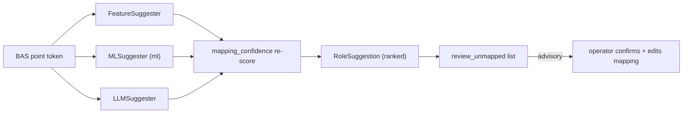

# Assisted point mapping

Getting BAS tags mapped to CAMBER's vendor-neutral `Role` vocabulary is the gate on everything else —
a rule can't run on a point it can't find. `camber.model.mapping.MappingProvider` resolves a tag by
alias or regex, and `camber.mapping_confidence` scores how sure that resolution is. `camber.mapping_assist`
adds the missing piece: when a tag **doesn't** resolve, propose the most likely roles.



*Any suggester proposes; the deterministic `mapping_confidence` re-score arbitrates; the operator applies.*

It is **advisory only, by construction** — it returns a ranked, human-confirmed review list and
**never mutates a `MappingProvider`**. A confirmed suggestion is applied by the operator editing the
mapping spec (`MappingProvider.from_dict`), the same boundary `camber.aso` keeps toward the BAS.

## One interface, three suggesters

Every suggester implements `suggest(token, *, series=None, unit=None, k=3) -> list[RoleSuggestion]`:

| Suggester | Dependency | Signal |
|-----------|------------|--------|
| `FeatureSuggester` | numpy / stdlib (always available) | tag string + unit + physical-range fit |
| `MLSuggester` | `scikit-learn` (`[ml]` extra, lazy) | learned char-n-gram classifier |
| `LLMSuggester` | an injected LLM callable (the [agent](AGENT.md) seam) | model proposal, deterministically re-scored |

A `RoleSuggestion` is `token, role` (always a valid `Role` value), `confidence` (0..1), `basis`
(`initials`/`ngram`/`edit_distance`/`unit`/`range_fit`/`combined`/`ml`/`llm`), `rationale`, and `as_dict()`.

## Baseline — `FeatureSuggester`

Dependency-light and always on. It scores every `Role` from three signals:

- **Whole-token match** — the tag is split into words on `_`/`-`/`.`, camelCase humps and acronym
  boundaries (`ReHeatVlvPos_1` → re heat vlv pos, `HWVlvPos` → hw vlv pos; a split that tore an
  abbreviation apart, like `Ch`+`W`, is re-joined). Each word is rewritten to the concept it names
  through a BAS-abbreviation table (`oa`/`outside` → outdoor, `da`/`sa`/`discharge` → supply,
  `vlv` → valve, `dmpr` → damper, `hw` → hot water + heat, `chw` → chilled water + cool,
  `zone`/`room` → space, `sat`/`mat`/`oat` → the compound, …), and so is each role slug. The score
  is `0.9 × recall × (0.5 + 0.5 × precision)`: *recall* is the share of the role's concepts the tag
  names, *precision* the share of the tag's words the role explains (location words like `zone`
  weigh half, unknown words dilute it, `pos`/`cmd`/`air`/equipment prefixes are noise). A word that
  equals a role's initials (`DSS` → `duct_static_sp`) names all of it; a misspelled long word
  (`Temprature`) still matches (basis `edit_distance`). **Initials only ever match a whole word**
  — earlier releases matched them as substrings of the unsplit name, so `OaTemp` became
  `oa_airflow`, `ReHeatVlvPos` `evap_approach_temp` and `SAT` `sat_reset_requests`; on a published
  16-point AHU list the name-only top suggestion was right for 3 points and is now right for 16.
  An outdoor/return/exhaust/relief/mixed damper is not suggested as the terminal `damper` role.
- **Unit compatibility** — a `ROLE_UNIT` table (degF/degC → temp, `%` → valve/damper/speed, cfm →
  airflow, kW → power, gpm → flow, inH2O → duct static, ppm → CO₂). A compatible unit gives a small
  bump (and on its own a weak ≤ 0.3 suggestion); a **known-incompatible** unit strongly demotes the
  role.
- **Physical-range fit** — if a `series` is given, `sensorhealth.range_violation_frac(series, role)`
  demotes any role whose physical bounds the data violates (a 500 °F "supply air temp" falls away).
  The bounds are in °F; a series declared in **°C (or K) is converted first** — previously every
  correctly named °C temperature failed its bounds and landed on `wetbulb_temp`. The same unit-aware
  check gates `MLSuggester` and `LLMSuggester`.

```python
from camber.mapping_assist import suggest_roles

for s in suggest_roles("AH1_SAT", unit="degF", series=sat_series, k=3):
    print(s.role, round(s.confidence, 2), s.rationale)
# supply_air_temp 0.98  'AH1_SAT' matches the initials of supply_air_temp; unit 'degf' fits ...
```

## Review the unmapped tags — `review_unmapped`

The front door for a whole tag set. It reuses `mapping_confidence.review()` to find the tags that
**don't** resolve, attaches ranked suggestions to each, and returns a human-confirm artifact:

```python
from camber.mapping_assist import review_unmapped

rev = review_unmapped(
    tokens, mapping, series_by_token={"VAV12_DmprPos": damper_series}, units={"VAV12_DmprPos": "%"}
)
rev["n_unmapped"]  # how many didn't resolve
rev["review_list"]  # [{"token", "suggestions": [RoleSuggestion.as_dict(), ...]}, ...]
```

The mapping is **never modified** — you review `rev["review_list"]`, then apply the confirmed roles by
editing your mapping JSON.

## Scale and unit evidence in `mapping_confidence`

`score_token(token, mapping, series, unit=None)` (and `score_mapping` / `review` with
`units={token: unit}`) cross-check a resolved mapping against the data:

- a declared °C / K temperature is converted before the physical-range check;
- a declared `%` under a volumetric-flow role (`airflow`, `oa_airflow`, `airflow_sp`, `chw_flow`,
  `hw_flow`) is flagged `unit_mismatch` (confidence × 0.3);
- with **no unit**, a flow-role series that stays within 0–100 (≥ 99 % of samples in −2…102) is
  flagged `percent_scale` (confidence × 0.5, so an alias drops from "high" 0.95 to "low" 0.475) —
  the signature of a fan-speed or damper % point typed as a cfm/gpm flow, which the airflow bounds
  (−1…1e6) alone accept. A declared `cfm`/`gpm` unit is trusted.

`review()` routes `data_mismatch`, `unit_mismatch` and `percent_scale` to `needs_review`.

## Optional learned backend — `MLSuggester`

Behind the `[ml]` extra (`pip install camber-toolkit[ml]`), imported lazily so the core stays pure. A
character-n-gram `scikit-learn` classifier. It ships **no pretrained weights** (clean-room); you train
it on your own labels or bootstrap from an existing mapping:

```python
from camber.mapping_assist import MLSuggester

ml = MLSuggester.from_mapping(mapping)  # labels from mapping.aliases
# or: MLSuggester().fit([("AH1_SAT", "supply_air_temp"), ("RTU3_OAT", "oat"), ...])
suggest_roles("AH9_SAT", suggester=ml)
```

Learned predictions pass through the **same physical-range gate** as the baseline, so a confident
guess the data contradicts is still demoted. Accuracy scales with how many labels you provide; the
numpy `FeatureSuggester` remains the always-available floor.

## Optional LLM backend — `LLMSuggester`

Reuses the provider-agnostic [agent client](AGENT.md) — **no new dependency, no vendor named**. The
model sees the tag, its unit + bounded sample stats, and the whole `Role` vocabulary, and proposes
roles. Then the deterministic layer disposes:

- every proposal is validated `Role(value)` — out-of-vocab proposals are dropped;
- every surviving proposal is **re-scored** through `mapping_confidence.score_token`, so a
  physically-inconsistent suggestion can't outrank a good one.

```python
from camber.mapping_assist import LLMSuggester
from camber.agent import client_from_callable

client = client_from_callable(lambda p, **o: my_llm.complete(p))  # you own the SDK
suggest_roles("AH1_SAT", suggester=LLMSuggester(client), series=sat_series)
```

The LLM proposes; the deterministic layer is always the arbiter. See [AGENT.md](AGENT.md) for the
seam and its no-vendor/no-network guarantees.
