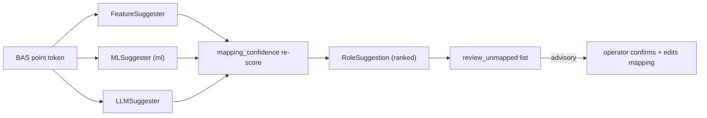

# Assisted point mapping

Getting BAS tags mapped to CAMBER's vendor-neutral `Role` vocabulary is the gate on everything else —
a rule can't run on a point it can't find. `camber.model.mapping.MappingProvider` resolves a tag by
alias or regex, and `camber.mapping_confidence` scores how sure that resolution is. `camber.mapping_assist`
adds the missing piece: when a tag **doesn't** resolve, propose the most likely roles.


```mermaid
flowchart LR
  token["BAS point token"]
  feat["FeatureSuggester"]
  ml["MLSuggester (ml)"]
  llm["LLMSuggester"]
  score["mapping_confidence re-score"]
  sugg["RoleSuggestion (ranked)"]
  review["review_unmapped list"]
  operator["operator confirms + edits mapping"]
  token --> feat
  token --> ml
  token --> llm
  feat --> score
  ml --> score
  llm --> score
  score --> sugg
  sugg --> review
  review -- advisory --> operator
```

*Any suggester proposes; the deterministic `mapping_confidence` re-score arbitrates; the operator applies.*

It is **advisory only, by construction** — it returns a ranked, human-confirmed review list and
**never mutates a `MappingProvider`**. A confirmed suggestion is applied by the operator editing the
mapping spec (`MappingProvider.from_dict`), the same boundary `camber.aso` keeps toward the BAS.

## One interface, three suggesters

Every suggester implements `suggest(token, *, series=None, unit=None, k=3) -> list[RoleSuggestion]`:

| Suggester | Dependency | Signal |
|-----------|------------|--------|
| `FeatureSuggester` | numpy / stdlib (always available) | tag string + unit + physical-range fit; with `use_timeseries=True` also the data's behaviour (0.96) |
| `MLSuggester` | `scikit-learn` (`[ml]` extra, lazy) | learned char-n-gram classifier |
| `LLMSuggester` | an injected LLM callable (the [agent](AGENT.md) seam) | model proposal, deterministically re-scored |

A `RoleSuggestion` is `token, role` (always a valid `Role` value), `confidence` (0..1), `basis`
(`initials`/`ngram`/`edit_distance`/`unit`/`range_fit`/`timeseries`/`combined`/`ml`/`llm`), `rationale`, and `as_dict()`.

## Baseline — `FeatureSuggester`

Dependency-light and always on. It scores every `Role` from three signals:

- **Whole-token match** — the tag is split into words on `_`/`-`/`.`, camelCase humps and acronym
  boundaries (`ReHeatVlvPos_1` → re heat vlv pos, `HWVlvPos` → hw vlv pos; a split that tore an
  abbreviation apart, like `Ch`+`W`, is re-joined). Each word is rewritten to the concept it names
  through a BAS-abbreviation table (`oa`/`outside` → outdoor, `da`/`sa`/`discharge` → supply,
  `vlv` → valve, `dmpr` → damper, `hw` → hot water + heat, `chw` → chilled water + cool,
  `zone`/`room` → space, `sat`/`mat`/`oat` → the compound, …), and so is each role slug. The score
  is `0.9 × recall × (0.5 + 0.5 × precision)`: *recall* is the share of the role's concepts the tag
  names, *precision* the share of the tag's words the role explains (location words like `zone`
  weigh half, unknown words dilute it, `pos`/`cmd`/`air`/equipment prefixes are noise). A word that
  equals a role's initials (`DSS` → `duct_static_sp`) names all of it; a misspelled long word
  (`Temprature`) still matches (basis `edit_distance`). **Initials only ever match a whole word**
  — earlier releases matched them as substrings of the unsplit name, so `OaTemp` became
  `oa_airflow`, `ReHeatVlvPos` `evap_approach_temp` and `SAT` `sat_reset_requests`; on a published
  16-point AHU list the name-only top suggestion was right for 3 points and is now right for 16.
  An outdoor/return/exhaust/relief/mixed damper is not suggested as the terminal `damper` role.
  0.100 (#102) extends the vocabulary and adds context rules; see
  [Vocabulary and context](#vocabulary-and-context-0100) below.
- **Unit compatibility** — a `ROLE_UNIT` table (degF/degC → temp, `%` → valve/damper/speed, cfm →
  airflow, kW → power, gpm → flow, inH2O → duct static, ppm → CO₂). A compatible unit gives a small
  bump (and on its own a weak ≤ 0.3 suggestion); a **known-incompatible** unit strongly demotes the
  role.
- **Physical-range fit** — if a `series` is given, `sensorhealth.range_violation_frac(series, role)`
  demotes any role whose physical bounds the data violates (a 500 °F "supply air temp" falls away).
  The bounds are in °F; a series declared in **°C (or K) is converted first** — previously every
  correctly named °C temperature failed its bounds and landed on `wetbulb_temp`. The same unit-aware
  check gates `MLSuggester` and `LLMSuggester`.

```python
from camber.mapping_assist import suggest_roles

for s in suggest_roles("AH1_SAT", unit="degF", series=sat_series, k=3):
    print(s.role, round(s.confidence, 2), s.rationale)
# supply_air_temp 0.98  'AH1_SAT' matches the initials of supply_air_temp; unit 'degf' fits ...
```

### Vocabulary and context (0.100)

The 0.96 evaluation on real names showed that most misses were vocabulary gaps. 0.100 (#102)
fills them from public conventions: Project Haystack tag names, Brick class names and common BAS
point-naming practice. Nothing in it is dataset-specific.

- **New abbreviations.**
  - `AF` (airflow); `CMH` and `LPS` (flow units used as words).
  - `WH`, `kWh`, `POW`, `MELs` and lighting (`LTG`) for power.
  - `STA`, `Enable` and `SS` (start/stop) for status.
  - `PM` and `PMP` for pump; `CHWP`, `HWP` and `CWP` for the loop pumps.
  - `CT` (cooling tower), `SAF` and `SF` (supply fan), `BOI` (boiler).
  - `SW`, `RW`, `SWT`, `RWT`, `LWT` and `EWT` for supply, return, leaving and entering water.
  - `HWL`, `CHWL` and `CDWL` for the hot-water, chilled-water and condenser-water loops.
  - `HValve` / `CValve` for heating and cooling valves; `HC`, `CC` and `LAT` for coil leaving air.
  - presence, occupant, `PIR` and motion for occupancy.
  - weather, `WX` and meteo for an outdoor (weather-station) point; dry-bulb, wet-bulb and dew
    point name temperatures of their own.
  - Particulate matter (`PM2.5`, `PM10`) is kept whole, so it is never read as a pump.
- **Run-together words** (`OADMPR`, `RMCLGSPT`, `HWL_DPSPT`) are split into known abbreviations.
  Only an unknown word of five letters or more is tried. Every piece must be known, the split
  with the fewest pieces wins, and a trailing `SPT` in such a word is a setpoint. A real word that
  does not split cleanly (`lecture`) is left alone.
- **Vowel-dropped abbreviations** (`Sply` → supply) are read when the word has four letters or
  more and at most one vowel, starts with the long word's first letter, keeps its letters in
  order, and fits only one meaning. A real word such as `core` keeps its vowels and is not
  matched.
- **Water, not air.** A tag that names water (`water`, `SW`, `GPM`, a loop, `HW`/`CHW`/`CW`, or a
  chiller, boiler or tower) does not get an air-side role (`airflow`, `supply_air_temp`, a zone
  setpoint...) or a refrigerant temperature. Such a role is multiplied by `WATER_AIR_PENALTY`
  (0.4). Equipment words add the loop to what the tag covers (`CHL_SW_TEMP` → `chw_supply_temp`)
  but never suggest a role on their own.
- **Unlocated temperatures.** A temperature that names no location and no kind of temperature
  (`air_temperature`, `Temp`) is read as a space temperature, the commonest in a building. Before
  0.100 it became outdoor air only because that role came first. Every other temperature role is
  multiplied by `UNLOCATED_TEMP_PENALTY` (0.6). The same factor separates kinds of temperature: a
  tag that says wet-bulb is not a dry-bulb `oat`. A zone setpoint (`cool_sp`, `heat_sp`) accounts
  for an unlocated temperature word, so `temp_setpoint` → `cool_sp` (then `heat_sp`), not
  `supply_air_temp_sp`.
- **UUIDs name nothing.** A UUID's hex groups (`cc45`, `af12`) are not read as abbreviations.

**This changes the default output.** On a 6,546-case corpus (1,091 point names from the shipped
catalog mappings, the evaluation datasets, BTS's Brick classes and a list of generic BAS names,
each with no unit and with five units), 2,076 cases changed and the top-1 role changed in 854.
The 0.95 golden cases are unchanged. The top-1 changes are names that had no suggestion before
(`AF_VAV_7`, `SF_Enable`, `RMCLGSPT`), unlocated temperatures moving from `oat` to `space_temp`,
setpoints moving from `supply_air_temp_sp` to `cool_sp`, water points leaving air-side roles,
and pump and tower-fan speeds leaving `supply_fan_speed`.

## Time-series evidence — `use_timeseries=True` (0.96)

A name is the best evidence when it is informative, and none at all when the export is anonymised
(UUIDs, `AI_0417`, numeric object ids): the name-only suggester above suggests nothing for such a
point. `FeatureSuggester(use_timeseries=True)` also reads **what the data says**
(`camber.mapping_timeseries`, numpy and pandas only):

- **Profile** (`profile_series(series, oat=None)` → `SeriesProfile`): value quantiles and range;
  cadence and the change-of-value pattern (share of samples that change, run lengths, how much of
  the movement comes in steps); binary (0/1) and two-level values, integer values, the share of
  samples at the series' own extremes (a valve closed, a damper at its minimum position); the
  daily and weekly periodicity; and, given an outdoor-air series of the site, the correlation of
  daily means (a load or a reset responds to the weather) and of hourly means (a sensor *in* the
  outdoor air follows it hour by hour).
- **Role templates** (`ROLE_TEMPLATES`, `template_scores`): 45 hand-written, physically motivated
  templates -- the quantity, the typical level and spread in CAMBER's units (a series is read in
  every plausible unit when none is declared: °C or °F, Pa or inH2O, L/s or cfm...), the kind
  (sensor, setpoint, status, command, stage), the expected response to the weather and how
  common the role is (a building has hundreds of zone points and a few plant points). A
  template whose typical band spans decades (an airflow) is weighed down: it fits almost
  anything. No training is needed.
- **Fitted model** (optional, `ProfileModel`): a numpy Gaussian class model over the profile
  features, fitted on labelled points of other buildings; pass it as `model=` to use it instead
  of the templates.
- **Blend with the name** (`blend`): the data's weight falls from 0.8 when the name says nothing
  to 0.1 once the best lexical score reaches 0.6 (`INFORMATIVE_NAME`), so an informative name
  still dominates and the data only breaks its ties.

```python
from camber.mapping_assist import FeatureSuggester

fs = FeatureSuggester(use_timeseries=True, oat=site_oat_series)
fs.suggest("3dfa2bab_f8f2_485b", series=point_series)
# [RoleSuggestion(role='space_temp', basis='timeseries',
#                 rationale='sensor data at the level of space_temp (read as degC)'), ...]
```

**Opt-in.** Without `use_timeseries=True`, a caller gets the name-only suggestions above: those
of 0.95 until 0.99, and the extended vocabulary from 0.100. With it, the physical-range gate runs
only when a unit is declared -- without one the templates already judged the level in every
plausible unit.

**Weather-station guard (0.100, #102).** A weather-station point is often a different sensor from
the site's outdoor reference, so the hour-by-hour weather features did not make it look
"outdoor" enough. The data alone then read an outdoor temperature as a wet-bulb and an outdoor
humidity as a supply-air humidity. When the name places a point outdoors, the data now ranks
only the outdoor roles. For a weather station (`weather`, `WX`, `meteo`, or the Synoptic /
MesoWest `_set_N` suffix of `air_temp_set_1`), it ranks only the weather quantities (`oat`,
`outdoor_rh`, `outdoor_co2`), not an outdoor damper or airflow. A wet-bulb needs the name to say
so, because outdoor dry- and wet-bulb temperatures behave alike.

### Evaluation

Three evaluations, none of them gated benchmarks. Scripts and details are in
[examples/suggester_eval](https://github.com/yroussev/camber/tree/main/examples/suggester_eval).

1. **Real point names** on open catalog datasets: the honest real-world figures.
2. **BTS with the names hidden**: what the data alone recovers.
3. **Synthetic vendor-style names**: tolerance to naming conventions. These figures are
   synthetic and never mixed with the real ones.

#### Real point names (open catalog datasets)

`real_names.py` scores every point of each dataset below by its **published BMS name**. The
tables in this section are the 0.96 baseline, before the 0.100 vocabulary; the 0.100 figures are
in [0.100: before and after](#0100-before-and-after-102).

- **Labels.** The ground truth is the dataset's catalog mapping: the role CAMBER assigned to each
  published point name when the dataset was catalogued. CAMBER hand-curated these mappings from
  the publisher's documentation and the data. For the `lbnl-b59` rooftop units (16 points), the
  label is the publisher's own Brick class, with CAMBER's overrides.
- **Which points are scored.** Only mapped points are scored. Columns CAMBER derives at ingest
  are skipped, because they are not published names. A point repeated across scenario or fault
  runs is scored once.
- **Leakage.** The 0.9x name tokenizer was written against the `irish-ahu` point list, whose 16
  names are a unit test. Its noise words (`fbk`, `tn`) and a range-check test come from
  `lbnl-b59` names. The lexical figures for those two datasets are therefore in-sample, and the
  **"excluding in-sample names"** rows are the out-of-sample reference.
- **Name variety.** `lbnl-b59` contributes 284 points but only 24 name patterns (for example,
  `zone_<n>_temp` appears 51 times), so it dominates the pooled real figure. The mean over
  datasets counts every dataset once.

| dataset | points (distinct names) | name only top-1 / top-3 % | data only top-1 / top-3 % | name + data top-1 / top-3 % |
|---|---|---|---|---|
| `lbnl-b59` (in-sample names) | 284 (284) | 96.1 / 96.5 | 37.0 / 52.5 | 95.8 / 96.8 |
| `irish-ahu` (in-sample names) | 9 (9) | 77.8 / 77.8 | 33.3 / 66.7 | 77.8 / 77.8 |
| `nuig-ahu101` | 13 (13) | 76.9 / 84.6 | 23.1 / 38.5 | 61.5 / 92.3 |
| `robod` | 46 (11) | 60.9 / 60.9 | 45.7 / 56.5 | 60.9 / 78.3 |
| `b4b-windesheim` | 13 (6) | 61.5 / 61.5 | 76.9 / 92.3 | 84.6 / 84.6 |
| `sdu-ou44` | 9 (9) | 66.7 / 66.7 | 66.7 / 66.7 | 66.7 / 66.7 |
| `ornl-frp-ops` | 48 (48) | 33.3 / 33.3 | 33.3 / 56.2 | 45.8 / 60.4 |
| **real buildings, pooled** | **422** | **82.5 / 82.9** | **38.9 / 54.7** | **83.9 / 89.1** |
| real buildings, mean over 7 datasets | | 67.6 | 45.1 | 70.4 |
| **real, excluding in-sample names, pooled** | **129** | **52.7 / 53.5** | **43.4 / 58.9** | **58.1 / 72.9** |
| real, excluding in-sample names, mean over 5 datasets | | 59.9 | 49.1 | 63.9 |

The LBNL simulated FDD sets are reported apart, because their names are systematic and
simulation-style (`SA_TEMP`, `CHL_SW_TEMP_1`, `HWL_DPSPT`):

| dataset (simulated) | points | name only top-1 / top-3 % | data only top-1 / top-3 % | name + data top-1 / top-3 % |
|---|---|---|---|---|
| `lbnl-sdahu` | 12 | 58.3 / 66.7 | 50.0 / 58.3 | 75.0 / 83.3 |
| `lbnl-fcu` | 12 | 50.0 / 58.3 | 25.0 / 33.3 | 66.7 / 75.0 |
| `lbnl-ddahu` | 10 | 60.0 / 80.0 | 20.0 / 30.0 | 80.0 / 80.0 |
| `lbnl-fpu` | 18 | 66.7 / 66.7 | 33.3 / 61.1 | 66.7 / 66.7 |
| `lbnl-chiller` | 11 | 9.1 / 27.3 | 0.0 / 9.1 | 9.1 / 27.3 |
| `lbnl-boiler` | 9 | 33.3 / 44.4 | 0.0 / 11.1 | 33.3 / 66.7 |
| **simulated, pooled** | **72** | **48.6 / 58.3** | **23.6 / 37.5** | **56.9 / 66.7** |

**Where the data helps and hurts the name.** Adding the data (`use_timeseries=True`) changed the
top-1 result of 16 real-building points: it helped 11 and hurt 5. On the simulated sets it
helped 6 and hurt none.

- **Helped:**
  - Room temperatures whose names never say "zone" or "room" (`..._Lecture_Theatre_3_Avg_Temp`,
    `bms_temp_in__degC` in three rooms). The name alone reads these as outdoor air.
  - Six of the ten `ornl-frp-ops` VAV discharge temperatures (`T_VAV_103`), which the name alone
    cannot place at all.
  - `lbnl-b59`'s `hp_hws_temp`, which the name alone reads as a supply-air temperature.
  - On the simulated sets, cooling valves the name read as heating valves (`CHWC_VLV_DM`),
    unplaced FCU valves, a supply-air setpoint (`SA_TEMPSPT`) and a cold-deck temperature
    (`CSA_TEMP`).
- **Hurt:**
  - Weather-station points, twice: a correctly named outdoor temperature became `wetbulb_temp`,
    and an outdoor humidity became `supply_air_humidity` (`nuig-ahu101`, and `lbnl-b59`'s
    `air_temp_set_1` / `relative_humidity_set_1`). The site's outdoor reference used for the
    weather features is a different sensor, so the point does not look "outdoor" enough.
  - `nuig-ahu101`'s main heating valve became a cooling valve.

**Common confusions.**

- **Name only:**
  - Unknown abbreviations give no suggestion at all: `AF_` (airflow) and `WH_` (power) in
    `ornl-frp-ops`, `PM_STA` (pump status), `occupant_presence`, `SAF_Enable`.
  - A temperature without a location defaults to outdoor air. Examples: `air_temperature`, and
    the simulated plant's `CHL_SW_TEMP` / `HWL_SW_TEMP` (`SW` / `RW` for supply and return water
    are not in the vocabulary).
  - A setpoint without "cool" or "heat" becomes `supply_air_temp_sp` (`temp_setpoint`).
  - Water flows become `airflow`, and pump or tower-fan speeds become `supply_fan_speed`.
  - A generic valve or VAV signal (`vav_room_1`, `bms_valve_frac`) goes to the wrong actuator.
- **Data only:**
  - Fan speeds and valves read as dampers or filter pressure drops.
  - Zone cooling setpoints read as duct-static setpoints, and heating setpoints as supply-air
    setpoints.
  - Airflows read as filter pressure drops, and return-air temperatures as zone temperatures.

**Reading it.**

- **Real naming is much harder than the Brick-class upper bound.** Out of sample, the name alone
  places 53 % of real points first, not 93 %.
- **The data is a modest net gain on real names:** pooled top-1 rises from 52.7 to 58.1 % and
  top-3 from 53.5 to 72.9 %. The largest gain is on names the tokenizer cannot read at all.
- **Where a name is informative, the data rarely matters.** On `lbnl-b59` top-1 moves by
  -0.3 points.
- **The data costs weather-station points.** That is the one systematic loss.
- **Many misses are vocabulary gaps, not data problems** (`AF`, `WH`, `SW` / `RW`, `STA`,
  "presence"). 0.100 extends the abbreviation table (see below); these figures stay the
  baseline.

**Attribution** (as each catalog entry requires; `camber datasets info <id>` gives the full
record):

- `lbnl-b59`: Luo et al. (2022), *Scientific Data* 9:156, doi:10.1038/s41597-022-01257-x, CC BY
  4.0.
- `irish-ahu`: Ahern, O'Sullivan & Bruton (2023), Mendeley Data doi:10.17632/8x62ntvrg7.2 and
  *Data in Brief* 48:109208, CC BY 4.0.
- `nuig-ahu101`: Messervey et al. (2019), HIT2GAP, Zenodo doi:10.5281/zenodo.3406555, CDLA
  Permissive 1.0.
- `robod`: Tekler et al. (2022), *Building Simulation* 15(12):2127-2137,
  doi:10.1007/s12273-022-0925-9, CC BY 4.0.
- `b4b-windesheim`: ter Hofte, van Ravenzwaaij & Nijboer (2023), Brains4Buildings2022 dataset,
  CC BY 4.0.
- `sdu-ou44`: Schwee et al. (2019), *Scientific Data* 6:287, doi:10.1038/s41597-019-0274-4, CC0.
- `ornl-frp-ops`: Yoon, Jung, Im & Gehl (2022), *Scientific Data* 9:775,
  doi:10.1038/s41597-022-01858-6, CC BY 4.0.
- `lbnl-*` simulated sets: Granderson et al. (2022), LBNL Fault Detection and Diagnostics
  Datasets, doi:10.25984/1881324, CC BY 4.0.

#### 0.100: before and after (#102)

The vocabulary additions and the weather-station guard, re-run on the same scripts and inputs.
"Before" is 0.99.1 re-run today. Its figures match the baseline tables above, except where the
catalog has gained points since 0.96: `lbnl-chiller` now has 14 points and `lbnl-fpu` 20.

**Read the real-name rows as in-sample.** The 0.100 vocabulary was chosen from the 0.96 misses
on these names, so the "excluding in-sample names" row is no longer out of sample.
`catalog_names.py` is the out-of-sample name check: it scores the published names of the
catalog mappings that `real_names.py` does not use (223 points, 11 mapping files, name only,
no download).

| evaluation | before top-1 / top-3 % | after top-1 / top-3 % |
|---|---|---|
| real names, pooled (422), name only | 82.5 / 82.9 | 94.3 / 95.0 |
| real names, pooled (422), name + data | 83.9 / 89.1 | 95.3 / 96.9 |
| real, "excluding in-sample names" (129), name only | 52.7 / 53.5 | 86.0 / 88.4 |
| real, "excluding in-sample names" (129), name + data | 58.1 / 72.9 | 89.1 / 93.8 |
| simulated LBNL sets (77), name only | 45.5 / 59.7 | 72.7 / 85.7 |
| simulated LBNL sets (77), name + data | 53.2 / 66.2 | 77.9 / 85.7 |
| **held-out catalog names (223), name only (out of sample)** | **72.2 / 75.3** | **83.0 / 85.2** |
| BTS anonymised (903), name + data, templates | 48.0 / 65.2 | 48.0 / 65.2 |
| BTS Brick-class labels as names (upper bound), name only | 93.0 / 97.2 | 93.2 / 97.2 |
| BTS Brick-class labels as names (upper bound), name + data | 95.2 / 99.9 | 95.5 / 99.9 |

*The data-only rows do not change (38.9 / 54.7 real, 22.1 / 35.1 simulated): the vocabulary is
name-side.*

Synthetic vendor-style names (`messy_names.py`; synthetic, not real-world naming):

| naming style (synthetic) | name only top-1 before → after % | name + data top-1 before → after % |
|---|---|---|
| `AHU1_SAT` | 25.1 → 64.6 | 51.8 → 74.0 |
| `VAV-2-14 DA-T` | 57.4 → 64.7 | 74.0 → 73.9 |
| `B2.L3.FCU07.RmTmp` | 67.9 → 79.4 | 77.6 → 84.4 |
| `ahu_03_supply_temp` | 87.9 → 93.9 | 90.9 → 94.1 |
| `201-AHU3:SA-TMP` | 56.7 → 63.3 | 74.0 → 74.0 |

- **Out of sample, the name alone gains 11 points of top-1** (72.2 → 83.0 % on the held-out
  catalog names). Most of the gain is run-together setpoints (`CLGSP_102`, `HTGSP_102`), wet-bulb
  temperatures and occupant counts.
  - One held-out top-3 hit was lost: a NIST heat-pump temperature (`1500_ODLiqSV_TempF`) now
    reads as a space temperature instead of outdoor air. Both are wrong.
  - The remaining held-out misses are refrigerant-side names (`P-LT-SUC`, `CompSuct_Suph_F`,
    `ch1_sh_rtd`). They are left for a later vocabulary pass, so this set stays out of sample.
- **The weather-station losses are gone.** The data no longer hurts any weather-station point:
  `air_temp_set_1`, `relative_humidity_set_1` and the NUIG weather temperature and humidity keep
  their outdoor roles. The guard alone does not change a top-1 on these sets, because the
  extended names already place them outdoors. It keeps the runners-up on outdoor roles, and it
  decides the case where the name says only "weather" (tested).
- **Where the data still changes top-1 on real names**, it helps 6 points (the `ornl-frp-ops`
  VAV discharge temperatures `T_VAV_*`, whose names give no location) and hurts 2. Before, it
  helped 11 and hurt 5. The 2 losses are one setpoint named `temp_setpoint` in two `robod`
  rooms: the name now says `cool_sp`, but the data, which looks like a room temperature, carries
  it to `space_temp`. The simulated sets: helped 4, hurt 0 (before: helped 6, hurt 0).
- On `dash-space` names the data's top-1 moves by -0.1 point. Every other row rises or holds.

#### BTS: anonymised names

Evaluated on **BTS** (Prabowo et al., NeurIPS 2024 Datasets and Benchmarks,
doi:10.48550/arXiv.2406.08990; CC BY 4.0; catalog id `bts`). BTS covers three real Australian
buildings; 903 points have data and a Brick class that maps cleanly to a CAMBER role (`bts.py`).

- **Anonymised rows** use the published UUID. They are the honest BTS figures.
- **Brick-class rows** use the Brick class text as the name. BTS publishes no BMS point names,
  and that text is effectively the label, so these rows are *Brick-class labels used as names:
  an upper bound, not real-world naming*. They show only whether the data spoils a good name.
  For real names, see the section above.

**Upper-bound rows are marked (Brick-class labels used as names, not real-world naming); the
anonymised rows are the honest BTS figures.**

| method | names | top-1 % | top-3 % | macro top-1 % | site A | site B | site C |
|---|---|---|---|---|---|---|---|
| lexical (0.95 default) | anonymised | 0.0 | 0.0 | 0.0 | 0.0 | 0.0 | 0.0 |
| time series, templates | none | 48.0 | 65.2 | 22.6 | 61.5 | 71.9 | 33.8 |
| time series, fitted (leave one building out) | none | 38.4 | 58.8 | 11.1 | 58.9 | 9.4 | 21.8 |
| combined, templates | anonymised | 48.0 | 65.2 | 22.6 | 61.5 | 71.9 | 33.8 |
| combined, fitted | anonymised | 38.4 | 58.8 | 11.1 | 58.9 | 9.4 | 21.8 |
| lexical (0.95 default) | Brick-class labels used as names (upper bound, not real-world naming) | 93.0 | 97.2 | 81.7 | 92.3 | 84.4 | 94.3 |
| combined, templates | Brick-class labels used as names (upper bound, not real-world naming) | 95.2 | 99.9 | 85.2 | 96.6 | 84.4 | 94.7 |
| combined, fitted | Brick-class labels used as names (upper bound, not real-world naming) | 95.1 | 97.2 | 85.0 | 96.4 | 84.4 | 94.7 |

*Site columns are top-1 on each held-out building (A 416 points, B 32, C 455). Macro top-1
averages the 27 roles equally; 294 of the 903 points are zone temperatures.*

What it shows, and what it does not:

- **Anonymised names:**
  - The name-only suggester has nothing to go on (0 %). The data alone puts the right role
    first for 48 % of the points and in the top 3 for 65 %.
  - It is strong where the physics is distinctive: zone temperatures (92 % top-1), heating
    valves (100 %), filter pressure drops (91 %), outdoor air (75 %) and CO2 (56 %).
  - It is weak where roles share a level and a behaviour. Discharge-air temperatures read as
    zone temperatures (58 of 116), supply-air temperature setpoints as zone cooling setpoints
    (40 of 88), and duct static pressures and airflows as filter pressure drops.
  - Chilled- and hot-water temperatures, humidities and pump statuses are rarely placed first.
- **Brick-class labels as names (upper bound):** adding the data moves top-1 from 93.0 to 95.2 %
  and top-3 from 97.2 to 99.9 %. No point that the name placed first lost its place; the gains
  are pump statuses the name alone gave to the boiler. On real names the gain and the losses
  are different (see above).
- **The fitted model does not beat the templates across buildings.**
  - Trained on two buildings and tested on the third, the numpy model reaches 38 % top-1. A
    random forest on the same features, tried in a scratch run, reached 32-34 %.
  - Each building has its own units, sequences and sensor quality, and three buildings are too
    few to learn that variety.
  - No `[ml]` backend is added for this reason.
- **Caveats:**
  - The templates were adjusted while looking at these results, with five physical changes:
    - fan-gated pressures judged on their 95th percentile;
    - a preference for typical temperature levels;
    - the weight on narrow bands;
    - the prevalence priors;
    - the plateau/movement signature of commands.

    The template rows are therefore optimistic for BTS, and the fitted rows are the
    out-of-sample reference.
  - Site C's data is the dirtiest of the three (zero dropouts, sentinels, negative airflows;
    see the entry's data issues) and scores lowest.
  - BTS units are undocumented, so no unit was passed to the suggester.

#### Synthetic vendor-style names (BTS points)

`messy_names.py` turns each of the 903 BTS points' Brick classes into a vendor-style name, using
a seeded generator in five styles. Each style uses abbreviations, an equipment prefix and
number, and separators. The generator's abbreviation tables were written once and not tuned to
the scores. **These names are synthetic, not real-world naming.**

| naming style (synthetic) | points | name only top-1 / top-3 % | name + data top-1 / top-3 % |
|---|---|---|---|
| `AHU1_SAT` (upper-case, run together) | 903 | 25.1 / 27.0 | 51.8 / 68.4 |
| `VAV-2-14 DA-T` (dashes and a space) | 903 | 57.4 / 69.9 | 74.0 / 84.7 |
| `B2.L3.FCU07.RmTmp` (dotted, camelCase) | 903 | 67.9 / 76.2 | 77.6 / 87.5 |
| `ahu_03_supply_temp` (snake case, long words) | 903 | 87.9 / 97.5 | 90.9 / 98.3 |
| `201-AHU3:SA-TMP` (object id prefix) | 903 | 56.7 / 69.7 | 74.0 / 84.6 |

- Run-together upper-case names (`SUPTMPSTPT`) defeat the tokenizer: the name alone places a
  quarter of them. Single-letter forms (`T` for temperature) are also not recognised.
- On these names the data adds 3 to 27 points of top-1, the most where the name is least
  readable.
- Long-word names come close to the Brick-class upper bound.

**Recommendation (0.100, not made; needs maintainer sign-off).** Switch the time-series path on
by default in `suggest_roles` and `review_unmapped` when a series is passed and no suggester is
given, with a way to opt out. The 0.96 objection, that the data costs weather-station points, is
answered by the 0.100 guard. With the extended vocabulary, the data adds top-1 on every real
and simulated pool (real 94.3 → 95.3 %, simulated 72.7 → 77.9 %) and on all five synthetic
styles. It is what places an anonymised point at all (BTS: 0 → 48 %). The costs:

- It changes those callers' output, including the BACnet review path, whenever they pass series.
- One residual loss: a setpoint named only `temp_setpoint` is read as the room temperature its
  data resembles.
- Without a declared unit, the time-series path skips the physical-range gate and relies on the
  templates instead.

Without a series the two paths agree, so callers that pass no data are unaffected. None of these
numbers is a gated benchmark.

## Review the unmapped tags — `review_unmapped`

The front door for a whole tag set. It reuses `mapping_confidence.review()` to find the tags that
**don't** resolve, attaches ranked suggestions to each, and returns a human-confirm artifact:

```python
from camber.mapping_assist import review_unmapped

rev = review_unmapped(
    tokens, mapping, series_by_token={"VAV12_DmprPos": damper_series}, units={"VAV12_DmprPos": "%"}
)
rev["n_unmapped"]  # how many didn't resolve
rev["review_list"]  # [{"token", "suggestions": [RoleSuggestion.as_dict(), ...]}, ...]
```

The mapping is **never modified** — you review `rev["review_list"]`, then apply the confirmed roles by
editing your mapping JSON.

## Scale and unit evidence in `mapping_confidence`

`score_token(token, mapping, series, unit=None)` (and `score_mapping` / `review` with
`units={token: unit}`) cross-check a resolved mapping against the data:

- a declared °C / K temperature is converted before the physical-range check;
- a declared `%` under a volumetric-flow role (`airflow`, `oa_airflow`, `airflow_sp`, `chw_flow`,
  `hw_flow`) is flagged `unit_mismatch` (confidence × 0.3);
- with **no unit**, a flow-role series that stays within 0–100 (≥ 99 % of samples in −2…102) is
  flagged `percent_scale` (confidence × 0.5, so an alias drops from "high" 0.95 to "low" 0.475) —
  the signature of a fan-speed or damper % point typed as a cfm/gpm flow, which the airflow bounds
  (−1…1e6) alone accept. A declared `cfm`/`gpm` unit is trusted.

`review()` routes `data_mismatch`, `unit_mismatch` and `percent_scale` to `needs_review`.

## Optional learned backend — `MLSuggester`

Behind the `[ml]` extra (`pip install camber-toolkit[ml]`), imported lazily so the core stays pure. A
character-n-gram `scikit-learn` classifier. It ships **no pretrained weights** (clean-room); you train
it on your own labels or bootstrap from an existing mapping:

```python
from camber.mapping_assist import MLSuggester

ml = MLSuggester.from_mapping(mapping)  # labels from mapping.aliases
# or: MLSuggester().fit([("AH1_SAT", "supply_air_temp"), ("RTU3_OAT", "oat"), ...])
suggest_roles("AH9_SAT", suggester=ml)
```

Learned predictions pass through the **same physical-range gate** as the baseline, so a confident
guess the data contradicts is still demoted. Accuracy scales with how many labels you provide; the
numpy `FeatureSuggester` remains the always-available floor.

## Optional LLM backend — `LLMSuggester`

Reuses the provider-agnostic [agent client](AGENT.md) — **no new dependency, no vendor named**. The
model sees the tag, its unit + bounded sample stats, and the whole `Role` vocabulary, and proposes
roles. Then the deterministic layer disposes:

- every proposal is validated `Role(value)` — out-of-vocab proposals are dropped;
- every surviving proposal is **re-scored** through `mapping_confidence.score_token`, so a
  physically-inconsistent suggestion can't outrank a good one.

```python
from camber.mapping_assist import LLMSuggester
from camber.agent import client_from_callable

client = client_from_callable(lambda p, **o: my_llm.complete(p))  # you own the SDK
suggest_roles("AH1_SAT", suggester=LLMSuggester(client), series=sat_series)
```

The LLM proposes; the deterministic layer is always the arbiter. See [AGENT.md](AGENT.md) for the
seam and its no-vendor/no-network guarantees.
