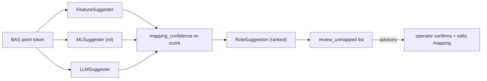

# Assisted point mapping

Getting BAS tags mapped to CAMBER's vendor-neutral `Role` vocabulary is the gate on everything else —
a rule can't run on a point it can't find. `camber.model.mapping.MappingProvider` resolves a tag by
alias or regex, and `camber.mapping_confidence` scores how sure that resolution is. `camber.mapping_assist`
adds the missing piece: when a tag **doesn't** resolve, propose the most likely roles.


```mermaid
flowchart LR
  token["BAS point token"]
  feat["FeatureSuggester"]
  ml["MLSuggester (ml)"]
  llm["LLMSuggester"]
  score["mapping_confidence re-score"]
  sugg["RoleSuggestion (ranked)"]
  review["review_unmapped list"]
  operator["operator confirms + edits mapping"]
  token --> feat
  token --> ml
  token --> llm
  feat --> score
  ml --> score
  llm --> score
  score --> sugg
  sugg --> review
  review -- advisory --> operator
```

*Any suggester proposes; the deterministic `mapping_confidence` re-score arbitrates; the operator applies.*

It is **advisory only, by construction** — it returns a ranked, human-confirmed review list and
**never mutates a `MappingProvider`**. A confirmed suggestion is applied by the operator editing the
mapping spec (`MappingProvider.from_dict`), the same boundary `camber.aso` keeps toward the BAS.

## One interface, three suggesters

Every suggester implements `suggest(token, *, series=None, unit=None, k=3) -> list[RoleSuggestion]`:

| Suggester | Dependency | Signal |
|-----------|------------|--------|
| `FeatureSuggester` | numpy / stdlib (always available) | tag string + unit + physical-range fit; with `use_timeseries=True` also the data's behaviour (0.96) |
| `MLSuggester` | `scikit-learn` (`[ml]` extra, lazy) | learned char-n-gram classifier |
| `LLMSuggester` | an injected LLM callable (the [agent](AGENT.md) seam) | model proposal, deterministically re-scored |

A `RoleSuggestion` is `token, role` (always a valid `Role` value), `confidence` (0..1), `basis`
(`initials`/`ngram`/`edit_distance`/`unit`/`range_fit`/`timeseries`/`combined`/`ml`/`llm`), `rationale`, and `as_dict()`.

## Baseline — `FeatureSuggester`

Dependency-light and always on. It scores every `Role` from three signals:

- **Whole-token match** — the tag is split into words on `_`/`-`/`.`, camelCase humps and acronym
  boundaries (`ReHeatVlvPos_1` → re heat vlv pos, `HWVlvPos` → hw vlv pos; a split that tore an
  abbreviation apart, like `Ch`+`W`, is re-joined). Each word is rewritten to the concept it names
  through a BAS-abbreviation table (`oa`/`outside` → outdoor, `da`/`sa`/`discharge` → supply,
  `vlv` → valve, `dmpr` → damper, `hw` → hot water + heat, `chw` → chilled water + cool,
  `zone`/`room` → space, `sat`/`mat`/`oat` → the compound, …), and so is each role slug. The score
  is `0.9 × recall × (0.5 + 0.5 × precision)`: *recall* is the share of the role's concepts the tag
  names, *precision* the share of the tag's words the role explains (location words like `zone`
  weigh half, unknown words dilute it, `pos`/`cmd`/`air`/equipment prefixes are noise). A word that
  equals a role's initials (`DSS` → `duct_static_sp`) names all of it; a misspelled long word
  (`Temprature`) still matches (basis `edit_distance`). **Initials only ever match a whole word**
  — earlier releases matched them as substrings of the unsplit name, so `OaTemp` became
  `oa_airflow`, `ReHeatVlvPos` `evap_approach_temp` and `SAT` `sat_reset_requests`; on a published
  16-point AHU list the name-only top suggestion was right for 3 points and is now right for 16.
  An outdoor/return/exhaust/relief/mixed damper is not suggested as the terminal `damper` role.
- **Unit compatibility** — a `ROLE_UNIT` table (degF/degC → temp, `%` → valve/damper/speed, cfm →
  airflow, kW → power, gpm → flow, inH2O → duct static, ppm → CO₂). A compatible unit gives a small
  bump (and on its own a weak ≤ 0.3 suggestion); a **known-incompatible** unit strongly demotes the
  role.
- **Physical-range fit** — if a `series` is given, `sensorhealth.range_violation_frac(series, role)`
  demotes any role whose physical bounds the data violates (a 500 °F "supply air temp" falls away).
  The bounds are in °F; a series declared in **°C (or K) is converted first** — previously every
  correctly named °C temperature failed its bounds and landed on `wetbulb_temp`. The same unit-aware
  check gates `MLSuggester` and `LLMSuggester`.

```python
from camber.mapping_assist import suggest_roles

for s in suggest_roles("AH1_SAT", unit="degF", series=sat_series, k=3):
    print(s.role, round(s.confidence, 2), s.rationale)
# supply_air_temp 0.98  'AH1_SAT' matches the initials of supply_air_temp; unit 'degf' fits ...
```

## Time-series evidence — `use_timeseries=True` (0.96)

A name is the best evidence when it is informative, and none at all when the export is anonymised
(UUIDs, `AI_0417`, numeric object ids): the name-only suggester above suggests nothing for such a
point. `FeatureSuggester(use_timeseries=True)` also reads **what the data says**
(`camber.mapping_timeseries`, numpy and pandas only):

- **Profile** (`profile_series(series, oat=None)` → `SeriesProfile`): value quantiles and range;
  cadence and the change-of-value pattern (share of samples that change, run lengths, how much of
  the movement comes in steps); binary (0/1) and two-level values, integer values, the share of
  samples at the series' own extremes (a valve closed, a damper at its minimum position); the
  daily and weekly periodicity; and, given an outdoor-air series of the site, the correlation of
  daily means (a load or a reset responds to the weather) and of hourly means (a sensor *in* the
  outdoor air follows it hour by hour).
- **Role templates** (`ROLE_TEMPLATES`, `template_scores`): 45 hand-written, physically motivated
  templates -- the quantity, the typical level and spread in CAMBER's units (a series is read in
  every plausible unit when none is declared: °C or °F, Pa or inH2O, L/s or cfm...), the kind
  (sensor, setpoint, status, command, stage), the expected response to the weather and how
  common the role is (a building has hundreds of zone points and a few plant points). A
  template whose typical band spans decades (an airflow) is weighed down: it fits almost
  anything. No training is needed.
- **Fitted model** (optional, `ProfileModel`): a numpy Gaussian class model over the profile
  features, fitted on labelled points of other buildings; pass it as `model=` to use it instead
  of the templates.
- **Blend with the name** (`blend`): the data's weight falls from 0.8 when the name says nothing
  to 0.1 once the best lexical score reaches 0.6 (`INFORMATIVE_NAME`), so an informative name
  still dominates and the data only breaks its ties.

```python
from camber.mapping_assist import FeatureSuggester

fs = FeatureSuggester(use_timeseries=True, oat=site_oat_series)
fs.suggest("3dfa2bab_f8f2_485b", series=point_series)
# [RoleSuggestion(role='space_temp', basis='timeseries',
#                 rationale='sensor data at the level of space_temp (read as degC)'), ...]
```

**Opt-in; the default is unchanged.** Without `use_timeseries=True` every existing caller gets
exactly the suggestions of 0.95 (checked on 3,948 token × series × unit cases, and by golden
tests). With it, the physical-range gate runs only when a unit is declared -- without one the
templates already judged the level in every plausible unit.

### Time-series evidence on BTS

Evaluated on **BTS** (Prabowo et al., NeurIPS 2024 Datasets and Benchmarks,
doi:10.48550/arXiv.2406.08990; CC BY 4.0; catalog id `bts`): three real Australian buildings,
903 points with data whose Brick class maps cleanly to a CAMBER role. Script and details:
[examples/bts_suggester](https://github.com/yroussev/camber/tree/main/examples/bts_suggester).
BTS has no BMS point names, so the *named* rows use the Brick class text as the name (an
upper-bound stand-in for a well-named point) and the *anonymised* rows the published UUID.

| method | names | top-1 % | top-3 % | macro top-1 % | site A | site B | site C |
|---|---|---|---|---|---|---|---|
| lexical (0.95 default) | named | 93.0 | 97.2 | 81.7 | 92.3 | 84.4 | 94.3 |
| lexical (0.95 default) | anonymised | 0.0 | 0.0 | 0.0 | 0.0 | 0.0 | 0.0 |
| time series, templates | none | 48.0 | 65.2 | 22.6 | 61.5 | 71.9 | 33.8 |
| time series, fitted (leave one building out) | none | 38.4 | 58.8 | 11.1 | 58.9 | 9.4 | 21.8 |
| combined, templates | named | 95.2 | 99.9 | 85.2 | 96.6 | 84.4 | 94.7 |
| combined, templates | anonymised | 48.0 | 65.2 | 22.6 | 61.5 | 71.9 | 33.8 |
| combined, fitted | named | 95.1 | 97.2 | 85.0 | 96.4 | 84.4 | 94.7 |
| combined, fitted | anonymised | 38.4 | 58.8 | 11.1 | 58.9 | 9.4 | 21.8 |

*Site columns are top-1 on each held-out building (A 416 points, B 32, C 455). Macro top-1
averages the 27 roles equally; 294 of the 903 points are zone temperatures.*

What it shows, and what it does not:

- **Anonymised names:** the name-only suggester has nothing to go on (0 %); the data alone puts
  the right role first for 48 % of the points and in the top 3 for 65 %. It is strong where the
  physics is distinctive -- zone temperatures (92 % top-1), heating valves (100 %), filter
  pressure drops (91 %), outdoor air (75 %), CO2 (56 %) -- and weak where roles share a level and
  a behaviour: discharge-air temperatures read as zone temperatures (58 of 116), supply-air
  temperature setpoints as zone cooling setpoints (40 of 88), duct static pressures and airflows
  as filter pressure drops. Chilled- and hot-water temperatures, humidities and pump statuses are
  rarely placed first.
- **Informative names still dominate:** with the Brick class as the name, adding the data moves
  top-1 from 93.0 to 95.2 % and top-3 from 97.2 to 99.9 %; no point that the name placed first
  lost its place (the gains are pump statuses the name alone gave to the boiler).
- **The fitted model does not beat the templates across buildings.** Trained on two buildings and
  tested on the third, the numpy model reaches 38 % top-1 (a random forest on the same features,
  tried in a scratch run, reached 32-34 %): each building has its own units, sequences and sensor
  quality, and three buildings are too few to learn that variety. No `[ml]` backend is added for
  this reason.
- **Caveats.** The templates were adjusted while looking at these results (five physical changes:
  fan-gated pressures judged on their 95th percentile, a preference for typical temperature levels,
  the weight on narrow bands, the prevalence priors, and the plateau/movement signature of
  commands), so the template rows are optimistic for BTS; the fitted rows are the out-of-sample
  reference. Site C's data is the dirtiest of the three (zero dropouts, sentinels, negative
  airflows; see the entry's data issues) and scores lowest. BTS units are undocumented; no unit
  was passed to the suggester.

**Proposal (not made):** `review_unmapped(..., series_by_token=...)` could switch the time-series
path on by default whenever series are given, since it never lowers a clearly named point's rank
on this evaluation. It would change existing callers' output, so it is left for a maintainer
decision. The BTS numbers are **not** a gated benchmark.

## Review the unmapped tags — `review_unmapped`

The front door for a whole tag set. It reuses `mapping_confidence.review()` to find the tags that
**don't** resolve, attaches ranked suggestions to each, and returns a human-confirm artifact:

```python
from camber.mapping_assist import review_unmapped

rev = review_unmapped(
    tokens, mapping, series_by_token={"VAV12_DmprPos": damper_series}, units={"VAV12_DmprPos": "%"}
)
rev["n_unmapped"]  # how many didn't resolve
rev["review_list"]  # [{"token", "suggestions": [RoleSuggestion.as_dict(), ...]}, ...]
```

The mapping is **never modified** — you review `rev["review_list"]`, then apply the confirmed roles by
editing your mapping JSON.

## Scale and unit evidence in `mapping_confidence`

`score_token(token, mapping, series, unit=None)` (and `score_mapping` / `review` with
`units={token: unit}`) cross-check a resolved mapping against the data:

- a declared °C / K temperature is converted before the physical-range check;
- a declared `%` under a volumetric-flow role (`airflow`, `oa_airflow`, `airflow_sp`, `chw_flow`,
  `hw_flow`) is flagged `unit_mismatch` (confidence × 0.3);
- with **no unit**, a flow-role series that stays within 0–100 (≥ 99 % of samples in −2…102) is
  flagged `percent_scale` (confidence × 0.5, so an alias drops from "high" 0.95 to "low" 0.475) —
  the signature of a fan-speed or damper % point typed as a cfm/gpm flow, which the airflow bounds
  (−1…1e6) alone accept. A declared `cfm`/`gpm` unit is trusted.

`review()` routes `data_mismatch`, `unit_mismatch` and `percent_scale` to `needs_review`.

## Optional learned backend — `MLSuggester`

Behind the `[ml]` extra (`pip install camber-toolkit[ml]`), imported lazily so the core stays pure. A
character-n-gram `scikit-learn` classifier. It ships **no pretrained weights** (clean-room); you train
it on your own labels or bootstrap from an existing mapping:

```python
from camber.mapping_assist import MLSuggester

ml = MLSuggester.from_mapping(mapping)  # labels from mapping.aliases
# or: MLSuggester().fit([("AH1_SAT", "supply_air_temp"), ("RTU3_OAT", "oat"), ...])
suggest_roles("AH9_SAT", suggester=ml)
```

Learned predictions pass through the **same physical-range gate** as the baseline, so a confident
guess the data contradicts is still demoted. Accuracy scales with how many labels you provide; the
numpy `FeatureSuggester` remains the always-available floor.

## Optional LLM backend — `LLMSuggester`

Reuses the provider-agnostic [agent client](AGENT.md) — **no new dependency, no vendor named**. The
model sees the tag, its unit + bounded sample stats, and the whole `Role` vocabulary, and proposes
roles. Then the deterministic layer disposes:

- every proposal is validated `Role(value)` — out-of-vocab proposals are dropped;
- every surviving proposal is **re-scored** through `mapping_confidence.score_token`, so a
  physically-inconsistent suggestion can't outrank a good one.

```python
from camber.mapping_assist import LLMSuggester
from camber.agent import client_from_callable

client = client_from_callable(lambda p, **o: my_llm.complete(p))  # you own the SDK
suggest_roles("AH1_SAT", suggester=LLMSuggester(client), series=sat_series)
```

The LLM proposes; the deterministic layer is always the arbiter. See [AGENT.md](AGENT.md) for the
seam and its no-vendor/no-network guarantees.
