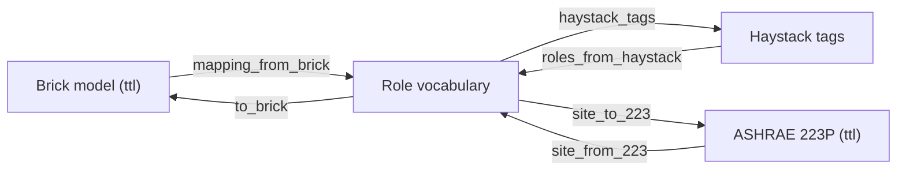

# Ontology interop — Brick & ASHRAE 223P

CAMBER's `Role` vocabulary is the hub; `camber.interop` maps it to and from the building-ontology
models other tools share, so an already-tagged building needs no hand-written mapping and CAMBER's
model can be exported for downstream use.



*The `Role` vocabulary is the hub: `camber.interop` imports from and exports to each ontology.*

## Brick

- **Import** — `mapping_from_brick` / `roles_from_brick` derive `Role` mappings from a Brick model
  (point classes + `hasPoint`/`hasPart` relationships). See `camber/interop/brick.py`. **45 of 64
  roles** can come from a Brick model: air-side temperatures, pressures, flows, humidity, CO₂ and
  setpoints; the hot-/chilled-/condenser-water plant (supply/return temperatures, CHW supply
  setpoint, loop DP and DP setpoint, water flow); and, from the owning equipment's class, coil
  valves, the outdoor-air damper, supply-fan / hot- and chilled-water-pump / tower-fan speed,
  supply-fan and pump status, boiler run status, equipment power, and zone heating/cooling
  setpoints. The other 19 (refrigerant-side temperatures and pressures, DX stages and statuses,
  mode flags, reset-request counts, the terminal damper, thermal energy rate, pump head) have no
  Brick class CAMBER maps yet.
- **Import review — `brick_mapping_report(ttl)`** — the same import, per point: `mapped` (a
  standard class), `alias` (a non-standard class accepted with a caveat), `ambiguous` (a role is
  plausible but the model does not pin it down — **not** mapped, with the reason) or `unmapped`
  (no CAMBER role). `report.summary()` prints the review; `report.roles` is what `roles_from_brick`
  returns. Rules it applies, all generic (no building is special-cased):
  - **Obvious non-standard classes are accepted with a caveat** (`ALIAS_CLASS_TO_ROLE`):
    `Outdoor_Air_Flow_Rate` → `oa_airflow`, an `Outdoor_Air_Damper` *equipment* class used as a
    point type → `oa_damper`, `Supply_Air_Fan_Speed` → `supply_fan_speed`,
    `Hot_/Chilled_Water_Supply_Flow_Rate` → `hw_flow` / `chw_flow`, and the `Outdoor_` spelling of
    any `Outside_` class. Classes with no CAMBER meaning (e.g. `Economizer_Setpoint`) are listed,
    never guessed.
  - **A flow class on a point named like a speed/percent is never mapped** — a
    `Supply_Air_Flow_Sensor` called `…_fan_spd` is `ambiguous`, so a 0–100 % series never reaches
    a cfm rule. (`mapping_confidence` catches the same thing from the data; see
    [MAPPING-ASSIST.md](MAPPING-ASSIST.md).)
  - **An enable is never a running status.** `Run_Status` on a boiler → `boiler_status`; a
    boiler's `On_Off_Status` (in published models often the plant *enable*, on all season) and
    any `Enable_Status` / `Enable_Command` are `ambiguous`. Mapping an all-season enable as firing
    status reads every enabled-but-idle hour as firing — e.g. a summer-lockout fault on every day.
  - **Component power is not equipment power.** `Electrical_Power_Sensor` → `power` on a pump,
    chiller, boiler, tower or packaged unit; on a fan inside an air handler it is `ambiguous`.
  - **Leaving/entering water is plant supply/return only on a boiler, chiller or loop** (a coil's
    leaving water is its return). `Hot_/Chilled_Water_Temperature_Sensor` with no supply/return,
    a pump speed whose loop the pump class does not state, and `Occupant_Count` (a head count, not
    binary occupancy) are `ambiguous`.
  - **Commands are a fallback.** `Valve_Command` / `Damper_Position_Command` / `Speed_Command`
    map (through the same owner context) only when the owner has no position/speed feedback.

  On the published LBNL boiler-plant model this maps 17 of 22 points (previously 1: the plant
  classes were missing), with both boiler on/off statuses reported `ambiguous` and gas meters /
  heating demand listed as unmapped.
- **Export** — `to_brick(equip_id, equip_class, roles)` emits Brick Turtle for **39 of 64 roles**
  (every direct class the importer knows, plus the coil-valve / OA-damper / supply-fan part
  context). Export and import are exact inverses: a test enumerates every role the exporter can
  emit and re-imports it on both parsers (the CO₂, outdoor-air flow, outdoor CO₂/RH and airflow
  setpoint classes the exporter emitted were previously dropped on re-import, so DCV roles could
  never come from a Brick model).
- **Whole-site round-trip** — `site_to_ttl` / `site_from_ttl` round-trip a Site→Equip→Point model
  (with relationships); minimal parser by default, rdflib used when the `[brick]` extra is present.
- **Served-by topology** — `topology_from_brick(ttl)` builds a `Topology` (see
  [TOPOLOGY.md](TOPOLOGY.md)) from `brick:feeds` / `isFedBy`; `site_from_ttl` auto-populates
  `Site.topology` from those relations.

## Project Haystack

- **Export** — `haystack_tags(role)` / `equip_haystack_tags(roles)` emit a role's marker-tag set (from
  `HAYSTACK_HINT`). `camber/interop/export.py`.
- **Import (0.6)** — `role_from_tags(tags)` / `roles_from_haystack(points)` / `mapping_from_haystack`
  recover roles from a point's marker tags, closing the round-trip to Brick-level parity. A role matches
  when its hint tag-set is a subset of the point's tags; the **most specific** hint wins ties (so
  `…temp sp` beats `…temp sensor`). Accepts `(name, tags)` pairs or Haystack tag dicts. All 54 roles
  round-trip export→import. `camber/interop/haystack_semantic.py`.
- **Served-by topology** — `topology_from_haystack(entities)` builds a `Topology` from `ahuRef` /
  `equipRef` reference tags (see [TOPOLOGY.md](TOPOLOGY.md)).

## ASHRAE 223P (minimal profile)

ASHRAE Standard 223P is an RDF/SHACL semantic model for building systems — equipment, connections,
media, and the physical properties they observe. The full standard is large, SHACL-validated, and
still maturing, so `camber.interop.semantic223` exports/round-trips a deliberately **minimal
profile**: equipment, their observable properties, and each property's QUDT **quantity-kind** +
**medium** derived from the role.

```python
from camber.interop import site_to_223, site_from_223

ttl = site_to_223(site, profile="minimal", include_relations=True)
site2 = site_from_223(ttl)  # round-trips equip_class + the points' roles
```

Mapping coverage was broadened in **0.6** from 21 to **44 of 54 roles** — the full plant/hydronic side
(CHW/HW/CW temps, loop pressures, pump/tower speeds), power/thermal energy, ambient/humidity, and the
refrigerant-side approach temps; the vocabulary has since grown, and today **51 of 64 roles** map. The
remaining 13 roles are binary/enumerated **status & command**
signals and counts (`*_status`, `*_stage`, `reversing_valve_cmd`, `econ_cmd`, warm-up/cool-down, the G36
reset-request counts) that carry no QUDT
quantity-kind; they are listed in `_NO_223_QUANTITY` and intentionally omitted from the quantity map
(223P models them as enumerated states). A test asserts the mapped + unmapped sets partition every role,
so a newly-added role can't be silently forgotten.

Mapping (`ROLE_TO_223`, `role_223_quantity`): e.g. `SUPPLY_AIR_TEMP → (Temperature, Air)`,
`OA_AIRFLOW → (VolumeFlowRate, Air)`, `CHW_FLOW → (VolumeFlowRate, Water)`, valves/dampers →
`PositionRatio`. The emitted Turtle types each equipment as `s223:Equipment` (with the CAMBER
`equip_class` as `rdfs:label`) and each point as `s223:Property` with `s223:hasQuantityKind` and
`s223:ofMedium`, linked by `s223:hasProperty`.

### Option flags — `site_to_223`
| flag | default | effect |
|---|---|---|
| `profile` | `"minimal"` | `minimal` emits only role-mapped properties; `full` also emits unmapped roles as a generic dimensionless property |
| `include_relations` | `True` | emit the equip→property `s223:hasProperty` edges |

### Scope & honesty

This is a **profile, not a conformance claim.** It captures the equipment/property/quantity layer
of 223P that maps cleanly from CAMBER's model; it does not assert full Standard-223 conformance
(which requires validation against the published SHACL shapes and richer connection/medium
modeling). Serialization is plain Turtle and the reader is a string parser, so no new dependency
is required.

**Served-by topology from 223P is deferred.** 223P models flow as a multi-hop connection graph
(`Equipment → ConnectionPoint → Connection → ConnectionPoint → Equipment`, medium-typed) rather than
a single parent reference, and CAMBER emits none of it, so extracting a served-by `Topology` from
223P is left to a later release — Brick `feeds` (above) covers the authoritative-semantic layer today.
