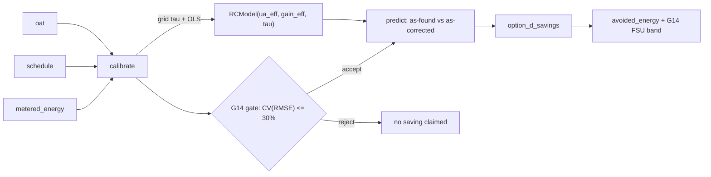

# IPMVP Option D — calibrated simulation

CAMBER's other M&V options are **inverse** models: they regress measured energy on temperature
(change-point, TOWT, degree-day) and can only report savings *after* a measure is implemented. **Option
D** answers the *counterfactual* — "what would this building use if we fixed the control?" — with a
**forward** building model calibrated to metered data, then run under the corrected control. `camber.mandv.rc_model`
is a dependency-light, clean-room implementation (numpy only; ISO 13790 simple-hourly / ASHRAE
inverse-modeling lineage). It completes the IPMVP set: **A, B, C, and now D** all ship.

*Calibrate a forward 1R1C model to metered energy, gate it on G14, then re-run the same model under as-found vs as-corrected control for a modeled saving.*



## The model — a 1R1C grey box

`RCModel(ua_eff, gain_eff, tau)` is a single-zone, single-time-constant thermal model:

- `ua_eff` — effective conductance (metered energy per °F of setpoint–OAT gap per hour),
- `gain_eff` — effective internal + solar gain offset (metered energy per conditioned hour),
- `tau` — the free-float / recovery time-constant (hours).

`model.predict(oat, schedule)` returns the **hourly HVAC energy** under a control schedule. During
conditioned hours the zone is held at setpoint (energy ∝ `ua_eff·(setpoint − OAT) − gain_eff`); during
setback it free-floats toward outdoor air with time-constant `tau`, and re-entry adds recovery
degree-hours. Because it takes a *schedule* as input, the same calibrated model can be re-run under a
different (as-corrected) control — that's the Option-D capability the inverse models lack.

Build a schedule with `daily_schedule(index, occ_setpoint=…, setback_setpoint=…, occ_start=…, occ_end=…)`
(or pass your own `{"setpoint": …, "conditioned": …}` arrays).

**Identifiability:** energy alone can't separate conductance from HVAC efficiency, so the calibrated
parameters are the **effective** combinations — enough for the counterfactual, which only re-runs the
schedule.

## Calibration — grid τ, OLS the rest, gate on G14

```python
from camber.mandv.rc_model import calibrate

cal = calibrate(oat, schedule, metered_energy)  # -> Calibration(model, fit, accept)
cal.accept  # met the ASHRAE Guideline 14 acceptance gate?
cal.fit.cv_rmse  # hourly CV(RMSE)
```

Calibration mirrors the change-point fitter (`camber.mandv.models`): the single nonlinear parameter
`tau` is **grid-searched** (coarse then refined), and for each `tau` the linear `ua_eff`/`gain_eff` are
solved by **OLS** — no scipy. Acceptance is the existing G14 gate (`stats.fit_stats` +
`cv_rmse_max_for("hourly")` = CV(RMSE) ≤ 30%). Calibration is deterministic
(`validation.check_determinism`).

## Modeled savings — as-found vs as-corrected

```python
from camber.mandv.rc_model import option_d_savings

sv = option_d_savings(cal, oat, as_found_schedule, as_corrected_schedule)
sv.avoided_energy  # modeled avoided energy (None if the calibration failed the gate)
sv.fractional_savings  # avoided / as-found
sv.frac_savings_uncertainty  # ASHRAE G14 Annex-B fractional savings uncertainty
sv.basis  # "IPMVP Option D (calibrated simulation)"  |  a not-claimed note
sv.valid  # calibration met the G14 gate
```

The savings are the difference of the calibrated model's annual profiles under the two schedules, with a
G14 Annex-B uncertainty band from the calibration CV(RMSE). **If the calibration fails the acceptance
gate, no saving is claimed** (`valid=False`, `avoided_energy=None`) — the same refuse-to-fabricate
posture as `fault_economics` (`costed`) and `ecm_savings`'s upper bound. `mandv.ecm_savings.modeled_savings`
is the same call, framed as the pre-implementation counterpart to that upper bound.

## Depth — 2R2C, multi-zone, and an EnergyPlus cross-check

The 1R1C model above is the minimal, citable core. Three depth options build on it, each preserving
the same honesty invariant (**grid the nonlinear time-constant(s), OLS the linear conductances/gains,
gate on G14, no scipy**) and reusing `option_d_savings` unchanged.

### 2R2C — a second thermal-mass state

`RC2Model(ua_env, uc_mass, gain_eff, tau_air, tau_mass, w)` adds a slow **thermal-mass** node coupled
to the air node. A mass-dominated building keeps *drawing recovery energy for hours after re-entry* as
its mass recharges — a slow tail a single `tau` cannot fit. Two time-constants (`tau_air` fast,
`tau_mass` slow) plus an air-exposure weight `w` are the only nonlinear params; the energy stays linear
in `(ua_env, uc_mass, gain_eff)` given them, so `calibrate2(oat, schedule, metered_energy)` grids the
taus + `w` and OLS-fits the rest, with `p=6` in the G14 gate (the extra params are honestly penalized).
On mass-dominated data 2R2C beats 1R1C on CV(RMSE) — that gain is the test that earns its complexity.

### Multi-zone — stacked OLS

`calibrate_zones(oat, schedules, metered_energy, *, order=1|2)` calibrates several zones whose hourly
predictions **sum** to the whole-building meter. `schedules` is `{zone_name: {"setpoint",
"conditioned"}}`; each zone's basis columns are **stacked** into one design matrix and a single
least-squares fit recovers every zone's linear params, given one shared gridded time-constant set. It
returns a `MultiZoneModel` that flows through `option_d_savings` unchanged when the as-found /
as-corrected arguments are per-zone schedule dicts. **Identifiability:** whole-building energy
under-determines the *split* of conductance across zones — it's recoverable only when the zones'
schedules differ (which breaks the column collinearity) or when each zone is sub-metered (calibrate
each zone with `calibrate`/`calibrate2`). The values are effective, and the docs say so plainly.

### EnergyPlus cross-validator (`[energyplus]`)

`camber.interop.energyplus.compare_option_d(...)` runs a user-supplied IDF under the as-found and
as-corrected control (via `eppy`), differences the two annual totals, and compares that avoided energy
to the grey-box `option_d_savings` on the same calibration — the "own it, then cross-check" pattern of
the pvlib/BETTER bridges. It returns an `agreement` block (percent difference, within-tolerance, both
engines agree the measure saves). `eppy` is pip-installable behind the `[energyplus]` extra, but
*running* an IDF also needs an installed EnergyPlus engine — so the runner is **injectable**
(`compare_option_d(..., runner=...)`) and the comparison logic is fully tested without the engine; the
real E+ run is the residual external-validity step, available where E+ is installed.

## Honest limitations

- **Grey-box, effective parameters.** 1R1C/2R2C recover *effective* combinations (energy per °F·h),
  not separately-identified physical conductances and efficiencies — enough for the counterfactual,
  which only re-runs the schedule, but not a physics claim. Multi-zone splits under-determine without
  differing schedules or sub-metering (above).
- **Needs metered energy + weather + a control schedule.** Real-building accuracy depends on data
  quality and **must pass the G14 gate** — a model that doesn't is reported as such and claims nothing.
- The synthetic-fixture tests prove the *method* (they recover a known model exactly); they are not a
  claim about any particular building's fit.
