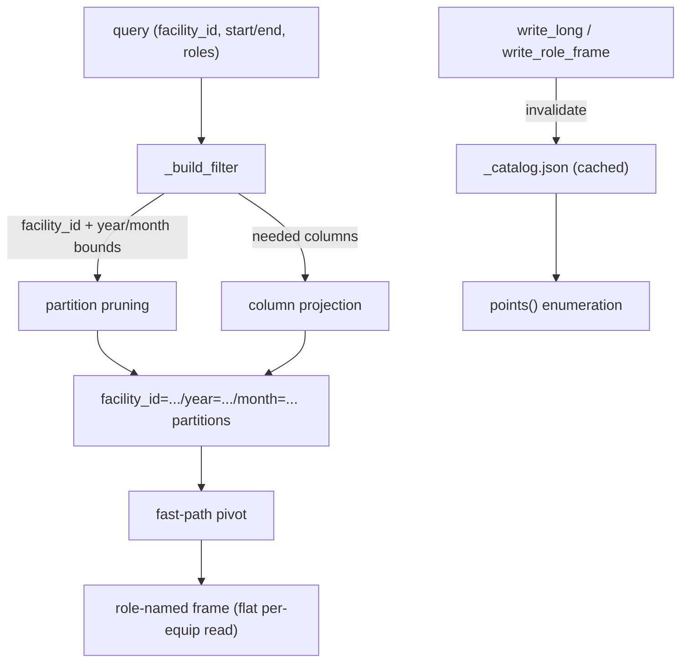

# Store performance at portfolio scale

The Parquet store (`camber.store.ParquetStore`) is designed so a portfolio of hundreds of
buildings over years of interval data lives under one root and a query touches only the data it
needs. This note explains the three mechanisms that keep reads fast, how to measure them, and
the one cost that does grow with portfolio size.


```mermaid
flowchart TD
  q["query (facility_id, start/end, roles)"] --> flt["_build_filter"]
  flt -- facility_id + year/month bounds --> prune["partition pruning"]
  flt -- needed columns --> proj["column projection"]
  prune --> part["facility_id=.../year=.../month=... partitions"]
  proj --> part
  part --> pivot["fast-path pivot"]
  pivot --> frame["role-named frame (flat per-equip read)"]
  write["write_long / write_role_frame"] -- invalidate --> cat["_catalog.json (cached)"]
  cat --> points["points() enumeration"]
```

*A per-equipment read opens one building's one-year partition regardless of portfolio size.*

## Layout

One tidy long-form dataset, hive-partitioned by `facility_id`, then `year`, then `month` (since
0.95):

```
<root>/facility_id=fox-lodge-9f3a1c/year=2024/month=7/part-*.parquet
<root>/_facilities.json     {"fox-lodge-9f3a1c": {"name": "Fox Lodge", ...}}
```

A query for one facility reads only that facility's directory; a query for one month reads only
that month's subdirectory. Stores written before 0.95 have `year=` partitions only
(`year=2024/part-*.parquet`). They are read unchanged, a store may hold both layouts (a legacy
file reads with `month` null and is never skipped by a month bound), and `camber store
migrate-partitions STORE` converts them (a dry run unless `--apply --yes`; crash-safe and
idempotent). Month partitions are what month-level retention prunes: see
[PORTFOLIO.md](PORTFOLIO.md#retention).

## Reproducible part files

Since 0.103 every part the store writes is in one canonical layout, so the same rows give the same
bytes. That holds for `write_long` (and `write_role_frame`, `write_rollup` and every dataset
ingest), `migrate-partitions` and the retention rollups. Each part:

- has its rows sorted by `(ts, equip, role, equip_class, value)`, whatever order the source
  frame, the archive members or the wide frame's columns came in;
- is written single-threaded as one row group (up to 1,048,576 rows), with fixed writer options:
  snappy, dictionary encoding, statistics, format 2.6, data page v1;
- carries no pandas metadata, which records the pandas and pyarrow versions, and instead the
  key-value marker `camber.layout = "1"`. A retention rollup also keeps its
  `camber.rollup.covers` key.

Part names were already deterministic (`part-<seq>-<i>.parquet`, with `<seq>` counting the
facility's earlier writes).

**What is guaranteed.** The same inputs with the same CAMBER version and the *exact same* pyarrow
version give byte-identical part files, with the same names. Across pyarrow (or pandas) versions,
only the content is guaranteed: the same rows in the same order with the same types. The bytes may
differ, because the Parquet footer's `created_by` names the full pyarrow version and the encoder
can change. CAMBER does not overwrite `created_by`. The tests check both: a content digest that
holds on every pyarrow version, and a byte golden pinned to one pyarrow release.

**Older stores.** Parts written before 0.103 (pandas metadata, a large part in about ten row groups,
rows in thread order) read back exactly like canonical ones, and a store may mix both. Nothing needs re-ingesting.
The ingest content hash is unchanged, so an already-ingested dataset is still skipped;
`camber datasets ingest <id> --force` rewrites it in the canonical layout. Sorted rows in one row
group also make large ingests smaller on disk: 2 to 3.4 times smaller for the LBNL simulation
archives, `irish-ahu` and `nuig-ahu101`, and 1.8 times smaller across all the workbook's dataset stores
(537 MB to 291 MB).

The edge forwarder's parts are content-addressed but not canonicalised: see
[EDGE-DEPLOY.md](EDGE-DEPLOY.md#2-data-flow-landing-format).

## Facility identity (why an id, not a name)

Each facility is keyed by a **stable, path-safe `facility_id`**, decoupled from its human display
name — which, with any metadata, lives in a sibling `_facilities.json` registry
(`camber.store.FacilityRegistry`). This is what makes a portfolio scale safely: a raw name used as
the partition directory would collide when two facilities share a name, orphan history on a rename,
and — worst — a space/unicode name would URL-encode the written directory while the writer's part
counter looked for the un-encoded path, silently overwriting earlier data. `write_long`/
`write_role_frame` validate the id up front (`require_facility_id`), so those failures can't happen.

Supply your own stable id (an external building id), or derive one from a name with
`camber.store.make_facility_id("Fox Lodge") -> "fox-lodge-9f3a1c"` (a slug + short hash; pass a
more-specific seed when display names repeat). An older `site=<name>` store converts in place with
`camber.store.migrate_site_to_facility(root)`. The read API addresses facilities by `facility_id`
(the legacy `site=` argument and `/sites` endpoint remain as deprecated aliases).

Since 0.86 each registry entry also carries a lifecycle `state`, dates, an editable `display_name`,
an owner and tags (registry v2; older entries read as `active`). Removed ids are tombstoned in
`_tombstones.json` and never reused, and a new id that differs from a known one only by letter
case is refused. See [PORTFOLIO.md](PORTFOLIO.md).

## The three scale mechanisms

1. **Partition pruning on `site` and `year`.** Filters on `site` skip other buildings'
   directories. Crucially, a `start`/`end` time range is translated into bounds on the `year`
   and `month` *partition* fields as well as the `ts` data column (`_build_filter`), so a
   one-month query across a multi-year store opens only the relevant month partition(s) instead
   of scanning every year. Proven in `tests/test_store_scale.py` via `dataset.get_fragments(filter=…)`.

2. **Column projection.** Reads pull only the columns they need from Parquet. `points()`
   (catalog enumeration) projects just `site`/`equip`/`role` and never reads the `ts`/`value`
   payload; `read_role_frame` projects `ts`/`role`/`value` for the one equipment requested.

3. **Fast-path pivot.** `read_role_frame` uses a plain `pivot` when each `(ts, role)` is unique
   and only falls back to the slower mean-aggregating `pivot_table` when the store actually holds
   duplicate observations.

4. **Cached catalog.** `points()` enumerates distinct `(site, equip, role)` keys from a small
   `_catalog.json` written alongside the dataset, so it needs no partition scan. Writes
   *invalidate* the catalog (an O(1) file removal — they never rewrite it, so bulk ingestion
   stays cheap); the first `points()` after a write burst rebuilds it once with a projected
   scan and caches the result. (Arrow's dataset discovery ignores leading-`_` paths, so the
   file is invisible to reads. `rebuild_catalog()` materializes it for a store that predates
   the cache.)

## Measuring it

A synthetic generator + benchmark ships in the package:

```sh
python -m camber.store.bench --facilities 50 --equips 10 --days 30 --freq 1h
```

It builds a portfolio and times the hot paths (`points`, single-equipment read, time-ranged
read, rollup). `benchmark()` / `synth_portfolio()` are importable for custom runs.

## Measured behaviour

On a developer laptop (numbers are illustrative, not a guarantee):

| portfolio | rows | write | single-equip read | time-ranged read | `points()` cold → warm |
|---|---:|---:|---:|---:|---:|
| 150 sites × 10 equips × 4 roles × 30 d hourly | 4.32 M | ~8.8 s | ~36 ms | ~240 ms | ~3.5 s → ~22 ms |

**The headline property:** a **single-equipment read stays roughly flat as the portfolio grows**
(tens of ms) — partition pruning + projection mean it opens one building's data regardless of how
many other buildings exist. This is the access pattern the rules/resolve layer uses, so
per-equipment analytics scale.

**Catalog enumeration** (`points()`) is served from the cached catalog in ~tens of ms once warm.
The first call after a write burst rebuilds it once (a projected scan — ~3.5 s here); writes
themselves stay cheap because they only invalidate the catalog, never rewrite it (an earlier
rewrite-on-every-write design made a bulk load ~5× slower — the invalidate-on-write design keeps
write throughput intact). Further mitigations if even the cold rebuild matters: scope it with
`points(facility_id=…)`, or roll up + prune (`rollup` / `write_rollup` / `prune`) so old partitions are
smaller.
