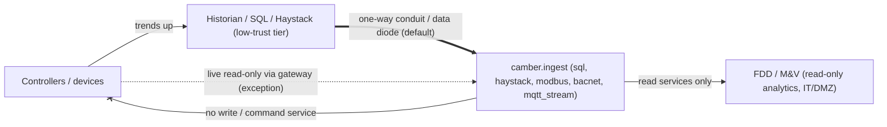

# Security posture

CAMBER is a **read-only** building-analytics tool: it ingests time-series trend data and runs
fault detection / M&V. It does not — and by construction *cannot* — actuate equipment. This
document states the threat model, the design rules that follow from it, and how those rules are
enforced in the network ingest adapters.

It is written against the OT-security guidance that governs building automation systems:
**NIST SP 800-82r3** (*Guide to Operational Technology Security*), **ISA/IEC 62443** (the
ICS zones-and-conduits lifecycle), the **NIST Cybersecurity Framework**, and **ANSI/ASHRAE 135**
including BACnet/SC.

## Threat model

A read-only analytics tool that *touches* an OT/BAS network still introduces real risk:

1. **Pivot risk.** A host with a route into the control VLAN is a bridge from IT (or the
   internet) toward controllers. Compromise of the analytics host = a foothold next to OT.
2. **Credential / certificate exposure.** Historian passwords, Haystack tokens, and BACnet/SC
   operational certificates + private keys are exfiltration targets if stored on the host.
3. **Accidental writes.** Any library that exposes a write/command service can fire one through
   a bug or misuse. On OT, an unintended write can move equipment.
4. **Discovery side-effects.** Legacy BACnet `Who-Is` broadcasts and Modbus scans can flood
   segments or upset fragile devices.
5. **Sensitive data.** Occupancy, schedules and setpoint telemetry carry physical-security and
   privacy implications even though they are "just trends."

*Trust boundaries: trends flow up through a one-way conduit; the read-only adapters import no write service, so no path leads back to the controllers.*

## Design rules

### 1. Prefer the historian / SQL / Haystack tier — this is the default posture

NIST SP 800-82 places historians at a low trust level reached through **one-way** conduits
(data diodes), pushing data *upward*. For an analytics tool operating on trends, pulling from a
**historian, SQL database, or Haystack API** (`camber.ingest.sql`, `camber.ingest.haystack`) is
almost always the right source: it matches the one-way architecture, the data is already trended,
and it avoids both discovery-broadcast load and the certificate burden of joining a live network.
This is the **recommended and default** ingest path. Live protocol polling is the exception.

Direct live polling (Modbus/BACnet) is justified only when there is no historian, it lacks the
needed points/resolution, or for commissioning/discovery — and even then, prefer reading through
a read-only gateway or protocol-to-historian bridge rather than polling controllers directly.

### 2. Read-only by construction, not by convention

The network adapters (`camber.ingest.modbus`, `mqtt_stream`, `bacnet`) only ever call read
services — Modbus `read_holding_registers` / `read_input_registers`, MQTT subscribe, BACnet
`ReadProperty` / `ReadPropertyMultiple` / Trend-Log reads. They **do not import or wrap any
write/command service at all**, so no code path can actuate equipment. This is enforced by a
unit test (`tests/test_ingest_protocols.py::test_adapters_reference_no_write_services`) that
parses each adapter's AST and fails if it references `WriteProperty`, any `write_*register/coil`,
or MQTT `publish`.

### 3. Network segmentation & least privilege

Run CAMBER in IT/DMZ, never inside the control VLAN; cross the boundary through a jump host or
data diode. Use read-only DB accounts, monitoring-scoped BACnet/SC certificates, and read-only
Modbus register maps where the gateway supports them.

The **read-only HTTP API + live `/ui` dashboard** (`camber serve` / `camber.api.server`) is GET-only:
every other method, `HEAD` and `OPTIONS` included, is 405, and it answers no CORS preflight. It
binds `127.0.0.1` by default; the `/ui` HTML is served with a strict same-origin
`Content-Security-Policy` and loads no external asset. Its request checks (0.103, #128):

- **Host allowlist, always on (DNS rebinding).** A web page on another site can point its own DNS
  name at 127.0.0.1 (or at the server's LAN address) and then read the answers through a visitor's
  browser as a same-origin request. Such a request still carries the attacker's name in `Host`, so
  every request whose `Host` is not allowed is refused with 403 before any route runs. Allowed:
  `127.0.0.1`, `localhost` and `[::1]` at the bound port when bound to loopback (or to every
  interface); the bound host at the bound port; and each `--allow-host NAME` /
  `CAMBER_API_ALLOWED_HOSTS` entry (a bare name on any port, `NAME:PORT` exactly). Binding
  `0.0.0.0` or `::` refuses to start without an explicit allowlist. `--allow-host '*'` answers any
  `Host`; it turns this defence off and is meant only behind a proxy that checks `Host` itself.
- **Token auth, opt-in (`--auth token`).** The same model as `camber lab` (§11, shared code in
  `camber._access`): a random 256-bit access token per run (or `CAMBER_API_TOKEN`, 16+ characters,
  from the environment, never argv); a launch URL `http://127.0.0.1:<port>/ui?token=...` printed
  to the terminal and saved in a 0600 launch file `serve-<port>.url` in a 0700 folder; a GET with a
  valid `?token=` gets a session cookie `camber-serve-<port>` (`HttpOnly; SameSite=Strict;
  Path=/`) and a 303 to the same URL without the token; scripts send `Authorization: Bearer`.
  Every route needs the cookie or the token (401 without, 403 for a wrong one), except that a bare
  `GET /health` answers `{"ok": true}` and nothing else, for container health checks. Secrets are
  compared with `hmac.compare_digest`.
- **Default off in 0.103.** Without `--auth token` the server has **no authentication**: on a
  computer shared by several accounts, any local user can read every facility, point and history
  it serves, and bound to another interface, anyone who can reach that address can. It prints a
  warning when bound to anything but loopback without `--auth token`. A later release may make
  token auth the default on loopback.

Residual risks: the server speaks plain HTTP (no TLS), so the token and the cookie cross the
network in clear text when it is bound beyond loopback; terminate TLS at a proxy. The cookie has no
`Secure` flag for the same reason. A token is per process, so several replicas behind a load
balancer do not share one; use an authenticating ingress there. There are no user accounts, roles
or per-facility permissions: whoever holds the token reads everything. A bare `--allow-host`
name matches any port. The Host check does not stop a client that can reach the port directly and
sends an allowed `Host` itself; it stops browsers being used as a proxy. Binding beyond loopback
(`--host` / `CAMBER_API_HOST`) remains your decision; put it behind your own authenticating
reverse proxy and network controls. The container image binds `0.0.0.0` with
`CAMBER_API_ALLOWED_HOSTS=localhost,127.0.0.1` (see DOCKER.md and DEPLOY.md). The catalog UI,
`camber lab`, is a separate loopback-only server with its own request checks (§11); it does not
add a write route to `camber serve`.

### 4. Secrets and TLS

No secrets in the repository — credentials come from environment variables or a secret manager
(e.g. `OPENEI_API_KEY`), and TLS private keys stay off source control and shared volumes. Use
TLS everywhere it exists: `wss://` + TLS 1.3 for BACnet/SC, TLS for MQTT (`tls=True`), and
OPC-UA security policies. Validate peer certificates; never disable verification.

### 5. Certificate management for BACnet/SC

BACnet/SC requires an **operational certificate** issued for the target network plus the hub
URI; there is no IP-only shortcut. Treat these certs as managed assets with a renewal/revocation
lifecycle. See [INGEST-PROTOCOLS.md](INGEST-PROTOCOLS.md) for how the config is plumbed and why
SC support is currently labelled experimental.

### 6. Audit logging

Log every connection and every point/property read with source and timestamp so the tool's
footprint on the OT network is auditable.

### 7. Outbound downloads (the dataset catalog)

`camber datasets fetch` (and `camber.datasets.fetch`) is the one place CAMBER downloads files from
the internet. It never runs on its own -- only when a user names a dataset -- and it never talks to
building networks. Its guarantees:

- **HTTPS only**, including after redirects: the opener refuses any redirect to a non-`https` URL
  and the final URL is re-checked. Catalog validation rejects any non-`https` URL at review time.
- **Pinned content**: every catalog file carries its size and SHA-256. A download that does not
  match is moved to `<file>.bad` and the fetch fails (exit code 2) -- a changed upstream file is
  never silently accepted. An unpinned file is downloaded with a warning and its hash recorded.
- **Atomic, resumable writes**: bytes stream to `<file>.part` (with an ETag sidecar for
  `Range`/`If-Range` resume), are `fsync`ed, verified, then `os.replace`d into place.
- **Disk pre-check**: free space is checked before a download or an extraction starts
  (exit code 4), with the numbers.
- **Safe extraction**: archives are validated member-by-member *before* anything is written --
  absolute paths, `..` traversal (zip-slip), symlinks, hardlinks and device files are refused, and
  file-count, total-size and compression-ratio caps stop decompression bombs. Members are written
  to a temporary name and renamed, so an interrupted extract leaves no truncated file.
- **Licence gate (the research-only tier)**: a dataset whose licence is non-commercial (NC) or
  no-derivatives (ND) is `access: "research_only"` -- the catalog validator enforces that the two
  always agree. It is refused unless the user passes `--accept-noncommercial`
  (`accept_noncommercial=True`) **on every fetch**; there is deliberately no environment-variable
  bypass, and `fetch --all` covers the open tier only (research-only needs `--licence all` *and*
  the flag; without it the command is refused before anything downloads). Each acceptance is
  appended to the append-only `acknowledgements.json` ledger and the manifest *before* the first
  byte is downloaded (`remove` never trims the ledger). `ingest` of research-only data needs an
  acknowledgement of the entry's *current* licence (a changed licence must be accepted again).
  The ingested facility records `redistribution: "prohibited"`, and every report built from the
  data -- audit, RCx, drift, site report, dashboard -- carries the non-commercial /
  do-not-redistribute banner; store reads stamp the provenance on the frame, so a report built
  directly from store frames carries it too. Exit code 3 when the gate refuses. CAMBER never
  redistributes the data; the ledger records that the *user* accepted the licence terms.
- **Manual downloads and local files**: a `manual: true` entry (a publisher portal with terms)
  is never fetched by CAMBER. `ingest <id> --from-dir DIR` takes files the user downloaded; every
  pinned file is verified (size + SHA-256) before anything is placed in the cache, a mismatch is
  refused (exit code 2) and the user's file is left untouched, and unpinned files are hashed with a
  warning. The research-only gate applies before any file is placed.
- **Workbooks**: `.xlsx` files are parsed only with the optional `xlsx` extra (`openpyxl`,
  imported lazily when a workbook is read), and only after the file has passed its pin check.
  Legacy `.xls` (`xlrd`) is not part of the extra.
<!-- 096-bts (#75) -->
- **Pickled series (`bts`)**: one publisher ships its series as Python pickles of numpy arrays.
  A pickle can run code while loading, so these files are read only after their archive passed
  its pin check, and only through a restricted unpickler that resolves numpy's array globals
  (`ndarray`, `dtype`, `_reconstruct`, `_frombuffer`) and refuses every other global; the result
  must be a name, a datetime array and a numeric array. Members are read from the verified zip in
  memory (nothing is extracted), and archiver by-products (`__MACOSX/`, `._*`) are skipped.
<!-- /096-bts -->
- **Link check**: `scripts/datasets_linkcheck.py` (weekly, advisory, CI only) sends `HEAD` /
  one-byte ranged `GET` requests to the catalog's own HTTPS URLs and licence pages; it downloads
  no data, and its workflow has a read-only token.
- **Stdlib only**: `urllib`, `zipfile`/`tarfile`, `hashlib` -- no new dependency, a descriptive
  `User-Agent`, an explicit timeout.

The cache lives in `$CAMBER_DATA_DIR`, else `$XDG_CACHE_HOME/camber/datasets`, else
`~/.cache/camber/datasets`. CAMBER redistributes none of the data (see `NOTICE`).

### 8. Portfolio administration

CAMBER has no authentication yet, so **filesystem write access to the portfolio root is admin**.
Anyone who can write to the workspace directory (`_portfolio.json`, `_audit.ndjson`, `_lock`,
`store/`) can add, suspend, resume and rename facilities, and can edit or delete the files
directly. Protect the root with ordinary operating-system permissions: a dedicated service
account or group, no world-writable modes, and backups that include `_audit.ndjson`.

Every lifecycle action is audited with the OS user (`getpass.getuser()`), the host and a
mandatory `--reason`. Each line is `fsync`ed to the append-only `_audit.ndjson`. This is an
attribution record, not tamper-proofing: the user name is whatever the process runs as, and
someone with write access can alter the file. Ship the log to a write-once store if you need
stronger guarantees.

The same applies to per-facility state under `state/<fid>/` (fault history, frozen drift
and M&V baselines, the manifest). Inside a workspace, `camber portfolio migrate --apply`, `camber
drift freeze`, `camber drift accept`, `camber mv freeze`, `camber mv rebaseline` and `camber mv
adjust` are audited admin actions with a mandatory reason. The three `mv` writers are dry runs
unless `--apply` is given, and no run path writes an M&V baseline. Each M&V baseline version
also records who accepted it, the OS user and host that wrote it, a sha256 of the data it was
fitted on and a `content_sha256` over its provenance (`camber mv list` flags a mismatch). Like
the audit log, these are attribution records, not tamper-proofing. The
manifest's sha256 values record what CAMBER last wrote. They let you detect an edit or a missing
file, but they do not prevent one: anyone with write access can rewrite the manifest too.
Migration never deletes a legacy file's records. It keeps the originals under
`state/<fid>/migrated/` and leaves a redirect stub with the original file's sha256.

A single-writer lock (`_lock`) serializes admin changes. `camber serve` stays GET-only: it
*shows* each facility's lifecycle state but cannot change it. Real roles arrive with the
multi-tenant roadmap item. See [PORTFOLIO.md](PORTFOLIO.md).

<!-- 095-edge (#18 step 5) -->
**Edge landing and devices (0.95).** The same admin model covers the central edge commands:
`camber edge land`, `reconcile --apply` and `quarantine release | discard` are audited with the OS
user, host and a mandatory reason, take the workspace lock, and are dry runs without `--apply`.
`discard` deletes data, so it also needs `--yes` or the typed facility id, and a legal hold
refuses it. Uploads for a facility that is not `active` or `provisioning` (or is unknown, or whose
content fails the hash in its key) never enter the store; they wait in `quarantine/` with a record
of why. On a device, `camber edge decommission` refuses to retire while any batch is
unacknowledged unless `--force` is given with a reason, and a forced retirement keeps the payloads
on disk. The device's receipt names the OS user who ran it. `camber edge bucket-rules` only prints
JSON: CAMBER never calls a cloud API to change a bucket, and the admin applies the rules with
the provider's own tool and credentials. See
[EDGE-DEPLOY.md](EDGE-DEPLOY.md#9-lifecycle-reconciliation-quarantine-decommissioning).
<!-- /095-edge -->

### 9. Data deletion and retention

<!-- 095-lifecycle (#18 steps 3-4) -->
CAMBER deletes facility data only through audited admin commands, and only after a copy exists:

- **Offboarding** exports a verified bundle (`archive/<fid>/`, every file with its sha256) before
  anything else, and deletes nothing. **Archiving** deletes the hot data only after the bundle is
  verified against the current data; **purging** deletes the bundles and the facility's
  quarantined edge uploads too, leaving the tombstone
  (id, names, dates, reason) and the audit log. A purge cannot be undone. Take a copy of the
  bundle first if the data must outlive it (a bundle is a plain directory).
- Every deleting command is a dry run unless `--apply`, needs `--reason` and a confirmation
  (`--yes` or the typed facility id; a purge only the typed id), takes the portfolio lock, and is
  audited with the OS user and host. A **legal hold** blocks archive and purge.
- Archive deletes external **report** files only if they are unchanged since CAMBER wrote them.
  It never deletes other files outside the workspace (a config-chosen fault or baseline store may
  be shared), and the plan lists what it leaves.
- The audit log (`_audit.ndjson`) is never deleted by CAMBER, and it names what was deleted, when,
  by whom and why. It may therefore still hold a purged facility's id and names. Weather caches
  and downloaded datasets are shared, not per facility, and are not touched by a purge.
- Deletion is ordinary file removal. CAMBER does not overwrite or shred the freed blocks, and it
  cannot reach backups, snapshots or copies made outside the workspace. Apply your storage's
  own controls (encrypted volumes, snapshot expiry) where erasure must be guaranteed.
- A crash mid-deletion leaves `_trash-*` or `_swap-*` entries, which the next command finishes or
  rolls back. Readers never see a half-deleted partition.
- **Retention** (`camber retention apply`) deletes by the policy in `_portfolio.json`: raw trends
  after 25 months, hourly rollups after 7 years, closed faults after 7 years, superseded drift
  baseline versions beyond 10, reports beyond the last 12, by default. It deletes a raw partition
  only after its hourly and daily rollups are written and verified against the raw row count. It
  is a dry run unless `--apply` with `--reason` and `--yes`, takes the lock, audits each facility
  before acting, and skips facilities under a legal hold. Precedence: legal hold > facility
  override > portfolio default. The audit log is never deleted, and its rule cannot be changed.
  Shortening a rule is itself audited (`retention.set`, `retention.override`), and anyone with
  write access to the workspace can change the policy: protect it like the rest of the root.
<!-- /095-lifecycle -->

### 10. What CAMBER sends to weather and price services

A few features fetch public reference data. They are all opt-in, and nothing is fetched unless a
config or a call asks for it. Each request is one of these (0.94, #73):

| Service | Request | Carries | Under `coarse` | Under `offline` |
|---|---|---|---|---|
| NOAA ISD catalogue | `GET www.ncei.noaa.gov/.../isd-history.csv` | nothing (a fixed URL) | the same | not sent |
| NOAA ISD data | `GET .../isd-lite/<year>/<usaf>-<wban>-<year>.gz` | a station id and a year | the same: the station is chosen locally | not sent |
| NASA POWER | `GET power.larc.nasa.gov/api/temporal/hourly/point?...` | a latitude, a longitude, dates, the variable | the POWER grid-cell centre (0.5° × 0.625°) | not sent |
| Open-Meteo | `GET archive-api.open-meteo.com/v1/archive?...` | a latitude, a longitude, dates, the variable | rounded to `precision_deg` (0.1°, about 11 km) | not sent |
| OpenStreetMap Nominatim | `GET nominatim.openstreetmap.org/search?q=...` | the address you geocode (only when you call `geocode`) | **refused** | **refused** |
| EIA API v2 | `GET api.eia.gov/v2/...` | a U.S. state code, months, the fuel's route, your API key | the same (a state is already coarse) | cache only |
| OpenEI URDB | `GET api.openei.org/utility_rates?...` | a rate label and your API key | the same | **refused** (use the rate JSON as a file) |
| Dataset catalog | `GET` of a pinned publisher URL | the file's URL from the bundled catalog | not affected | not affected |

**Never sent**, in any mode:

- addresses (unless you call `geocode` yourself), building or site names, facility ids;
- account numbers, meter ids, user names or email addresses;
- any part of the energy, trend or billing data.

The only identifier that leaves is an API key you configured for EIA or OpenEI, which those
services require. It identifies the key holder to that service. It is never written to a cache key
or to the audit log. Requests use Python's default `User-Agent`, except Nominatim and the dataset
fetcher, which send a fixed `camber-toolkit` string, and EIA, which gets `camber`. None of them
names the user or the site.

**Before 0.94**, NASA POWER and Open-Meteo requests carried the coordinates as configured, often to
five decimals. The ISD blend already snapped POWER to its cell. **Since 0.94**, a facility marked
private sends nothing until the user opts in to `coarse`. Under `coarse`, every request passes one
coarsening function and a send-time check that refuses anything finer than the policy (see
[WEATHER.md](WEATHER.md#privacy-weather-for-non-public-sites-provisional-094)). Every request,
cache hits included, is logged to `state/<facility_id>/weather_audit.ndjson` in a workspace, or
next to the cache outside one. `camber weather audit` prints the log.

Some outbound connections go only to endpoints the user configures, and they carry the user's own
data by design. They are outside this table: Haystack ingest (`ingest.haystack`), the edge
forwarder's push sink, and ticket webhooks (`integrate.tickets`). Point them only at systems you
control.

<!-- 096-lab (#77) -->
### 11. The lab server (`camber lab`, provisional, 0.96)

`camber serve` stays GET-only (§2). `camber lab` is a **separate** local server for the dataset
catalog: it downloads datasets (§7) and writes them into a store, so it is the one CAMBER server
that accepts writes. It is built for one person on their own machine:

- **Loopback only.** It binds `127.0.0.1` and has no `--host` option; `make_lab_server` refuses
  any other address with an error. Use `camber serve` to publish a read-only API on another
  interface.
- **DNS-rebinding guard.** Every request's `Host` header must be `127.0.0.1:<port>` or
  `localhost:<port>`, else 403. A page on another domain that re-points its name at 127.0.0.1
  therefore gets nothing.
- **Origin allowlist.** A request that carries an `Origin` must come from one of those two
  origins, and every POST must carry one. A browser's `Sec-Fetch-Site` other than `same-origin` or
  `none` is refused. The lab answers no CORS preflight (`OPTIONS` is 405), so no other origin can
  send it a JSON POST.
- **Access token on every route (0.102, #127).** Loopback is not private on a computer that
  several accounts use at once: any local user can connect to `127.0.0.1:<port>`. So each run
  creates a random 256-bit **access token**, separate from the CSRF token below, and every
  request needs it, GET or POST, including the lab page, the catalog and job JSON, reports,
  workbook pages and the delegated `/ui`, `/facilities`, `/points` and `/history`:
  - `camber lab` prints the launch URL `http://127.0.0.1:<port>/lab?token=<access token>` to its
    terminal. A GET with a valid `?token=` gets a session cookie `camber-lab-<port>` (a separate
    random session id, `HttpOnly; SameSite=Strict; Path=/`, no expiry, so it ends with the
    browser session) and a 303 to the same URL without the token, so the secret does not stay
    in the address bar or the history. The redirect never leaves the lab's origin.
  - Every other request needs that cookie, or `Authorization: Bearer <access token>` for a
    script. Without either the answer is 401 with a short page (or JSON error) that says to open
    the URL from the terminal; a wrong `?token=` or bearer token is 403. Only a valid token sets
    the cookie. Every secret comparison is `hmac.compare_digest` on bytes.
  - The URL is also written to a **launch file**, `lab-<port>.url`, in `$XDG_RUNTIME_DIR/camber`
    (else `$XDG_CONFIG_HOME/camber` or `~/.config/camber`). The folder is made 0700 and the file
    0600, written to a fresh `O_EXCL` temporary file and renamed into place. A folder or an
    existing file owned by another account, or writable by group or others, is refused: the lab
    then prints a warning, writes nothing and still runs. The file is deleted when the lab stops.
  - The lab opens no browser, so the token is never on a command line that `ps` shows to other
    users, and there is no CLI option that takes it. `LabApp(access_token=...)` sets it
    explicitly for tests and scripts (at least 16 characters, and not the CSRF token).
- **CSRF token.** Each run also generates a random CSRF token, held only in the lab page (which
  another origin cannot read, and which itself needs the session). Every POST must send it in
  `X-Camber-Lab-Token` as well as the session cookie (or bearer token); it is compared with
  `hmac.compare_digest`. A POST never accepts `?token=`.
- **Narrow writes.** POST accepts only `application/json` (else 415) with a body of at most
  16 KiB (else 413, decided on the declared length before the body is read; chunked bodies are
  refused). Unknown fields are refused, and a flag must be a JSON boolean. The only writes are
  queueing a job and cancelling one, for **catalog ids only**: no URL or file name is ever taken
  from a request, and the one path (below) is only read. Manual-download entries are not
  fetched. The POST routes are:
  - `/lab/jobs/fetch` and `/lab/jobs/ingest` (`ids`, `subset`, `ingest` / `force`,
    `acknowledge`);
  - `/lab/jobs/remove` (0.103, #123: `id`, `confirm`, `purge_store`). It deletes the dataset's
    cache folder and, with `purge_store`, its facilities in the store, as `camber datasets remove
    [--purge-store]` does. `confirm` must equal the id (the page's dialog has it typed), else 400.
    In a workspace a purge is refused (409, with the reason) while any of the dataset's
    facilities is under a legal hold or is suspended, offboarding or archived, and it is checked
    again under the workspace lock when the job runs. The lab never bypasses the lifecycle.
  - `/lab/jobs/from-dir` (0.103, #123: `id`, `dir`, `subset`, `force`, `acknowledge`), for a
    `manual: true` entry only. `dir` is untrusted input: a string of at most 4096 characters
    with no control character, an absolute path (`~` is expanded), resolved with `realpath`,
    that must be an existing directory the lab can read, else 400. The lab looks up only the
    catalog's own file names in it, as `ingest --from-dir` does, and refuses a file that
    resolves (through a symbolic link) outside the folder. It only reads the folder: pinned
    files are verified (size + SHA-256) before they are copied or hard-linked into the cache,
    and nothing in the folder is written or served back. The authenticated user can name any
    folder their own account can read; the check keeps the request to that folder.
  - `/lab/jobs/<id>/cancel` (`{}`).
- **Pre-flight checks (0.103, #123).** Before a fetch or ingest job is queued, the server
  refuses it when an optional extra the entry needs is not installed (409, with the install
  command) or when its download, archive extraction and store estimate, with the fetch's own
  5 % headroom, do not fit on the disk (507). Nothing is downloaded first.
- **Licence gate.** A research-only (NC / ND) dataset is refused with 403 unless the request
  carries the acknowledgement the modal collects (the user ticks the terms and types the dataset
  id). As on the CLI, every fetch needs it again. The acceptance goes to the same
  `acknowledgements.json` ledger, with `via: "lab fetch"`, and reports built from the data carry
  the do-not-redistribute banner.
- **Strict CSP.** The lab page allows only its own inline script and stylesheet, pinned by
  SHA-256 (no `'unsafe-inline'`, no `eval`), and same-origin `fetch`. It has no inline event
  handlers or `style` attributes, and it sets catalog text only as text, never as HTML. Reports
  are served **sandboxed** (an opaque origin with no network), so a report cannot call the lab
  API. Every response carries `nosniff`, `no-referrer`, `no-store` and `frame-ancestors 'none'`.
- **Workbook pages (0.97).** `GET /lab/docs/workbook/<page>.md` serves a workbook exercise page
  from the local docs tree, read-only. Only names matching `workbook/<lowercase-id>.md` are
  served, and the resolved path must stay inside `<docs>/workbook/`, so `..`, encoded dots,
  symlinks out of the folder and the page template are 404. The page is escaped Markdown with
  its links made clickable, under a CSP that allows no script at all.
- **One worker.** Jobs run one at a time on a single worker thread; at most 20 can be pending
  (429). Cancelling is safe by construction: a download keeps its `.part` file for a resume, and
  an ingest stops before its staged data is swapped in.
- **Workspace.** In a portfolio workspace the dataset facilities follow the lifecycle: they are
  registered `provisioning`, ingested under the single-writer lock, then activated. Suspended,
  offboarding and archived facilities are not written or purged, nor is one under a legal hold.
  Every fetch, acknowledgement, ingest, ingest from a folder, removal and purge appends a
  `lab.*` line to the audit log. The actor is the OS user running the lab (§8).
- **No OT code.** `camber.lab` and `camber.datasets` import no BACnet, Modbus, OPC-UA, MQTT,
  OpenADR or edge module, directly or through anything they import. A static test
  (`tests/test_lab.py`) enforces this.

**Residual risks.** The lab has no user accounts: whoever holds the launch URL or the session
cookie can use it until it stops.

- **Your own account and root.** Anything that runs as you, or as root, can read the terminal,
  the launch file, the browser's cookie store or the lab process's memory. It could equally run
  `camber datasets` against your cache and store itself, so the token adds no barrier there.
- **No TLS on loopback.** The token and the cookie travel in clear over `127.0.0.1`. Reading
  loopback traffic needs root (a packet capture), which is already covered above; there is no
  `Secure` cookie flag because there is no HTTPS.
- **Cookies are not per-port.** Browsers send a `127.0.0.1` cookie to every port on that host.
  The cookie is `HttpOnly` and named per port, but if you open in the same browser a page that
  another local user serves on another `127.0.0.1` port, that server receives your lab cookie
  and could replay it while your lab runs. `SameSite=Strict` does not help, since every port of
  one host is the same site. Do not browse other people's local servers while a lab runs, or
  use a separate browser profile for the lab.
- **Copies you make.** A launch URL pasted into a chat, a screenshot, a shell history or a
  shared document gives its reader the lab until it stops. Each start makes a new token.
- **Windows.** The launch file's owner and mode checks are POSIX; on Windows the file inherits
  the folder's ACL.
<!-- /096-lab -->

## References

- NIST SP 800-82r3 — Guide to OT Security — https://csrc.nist.gov/News/2023/nist-publishes-sp-800-82-revision-3
- ISA/IEC 62443 (ICS security, zones & conduits)
- NIST Cybersecurity Framework (CSF)
- ANSI/ASHRAE 135 incl. Addendum 135-2016bj (BACnet/SC) — https://bacnetinternational.org/bacnetsc/
