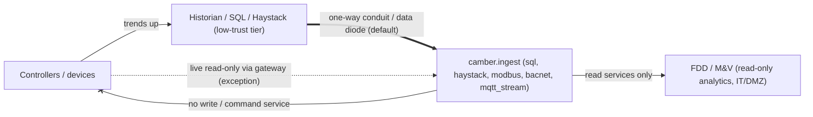

# Security posture

CAMBER is a **read-only** building-analytics tool: it ingests time-series trend data and runs
fault detection / M&V. It does not — and by construction *cannot* — actuate equipment. This
document states the threat model, the design rules that follow from it, and how those rules are
enforced in the network ingest adapters.

It is written against the OT-security guidance that governs building automation systems:
**NIST SP 800-82r3** (*Guide to Operational Technology Security*), **ISA/IEC 62443** (the
ICS zones-and-conduits lifecycle), the **NIST Cybersecurity Framework**, and **ANSI/ASHRAE 135**
including BACnet/SC.

## Threat model

A read-only analytics tool that *touches* an OT/BAS network still introduces real risk:

1. **Pivot risk.** A host with a route into the control VLAN is a bridge from IT (or the
   internet) toward controllers. Compromise of the analytics host = a foothold next to OT.
2. **Credential / certificate exposure.** Historian passwords, Haystack tokens, and BACnet/SC
   operational certificates + private keys are exfiltration targets if stored on the host.
3. **Accidental writes.** Any library that exposes a write/command service can fire one through
   a bug or misuse. On OT, an unintended write can move equipment.
4. **Discovery side-effects.** Legacy BACnet `Who-Is` broadcasts and Modbus scans can flood
   segments or upset fragile devices.
5. **Sensitive data.** Occupancy, schedules and setpoint telemetry carry physical-security and
   privacy implications even though they are "just trends."

*Trust boundaries: trends flow up through a one-way conduit; the read-only adapters import no write service, so no path leads back to the controllers.*

## Design rules

### 1. Prefer the historian / SQL / Haystack tier — this is the default posture

NIST SP 800-82 places historians at a low trust level reached through **one-way** conduits
(data diodes), pushing data *upward*. For an analytics tool operating on trends, pulling from a
**historian, SQL database, or Haystack API** (`camber.ingest.sql`, `camber.ingest.haystack`) is
almost always the right source: it matches the one-way architecture, the data is already trended,
and it avoids both discovery-broadcast load and the certificate burden of joining a live network.
This is the **recommended and default** ingest path. Live protocol polling is the exception.

Direct live polling (Modbus/BACnet) is justified only when there is no historian, it lacks the
needed points/resolution, or for commissioning/discovery — and even then, prefer reading through
a read-only gateway or protocol-to-historian bridge rather than polling controllers directly.

### 2. Read-only by construction, not by convention

The network adapters (`camber.ingest.modbus`, `mqtt_stream`, `bacnet`) only ever call read
services — Modbus `read_holding_registers` / `read_input_registers`, MQTT subscribe, BACnet
`ReadProperty` / `ReadPropertyMultiple` / Trend-Log reads. They **do not import or wrap any
write/command service at all**, so no code path can actuate equipment. This is enforced by a
unit test (`tests/test_ingest_protocols.py::test_adapters_reference_no_write_services`) that
parses each adapter's AST and fails if it references `WriteProperty`, any `write_*register/coil`,
or MQTT `publish`.

### 3. Network segmentation & least privilege

Run CAMBER in IT/DMZ, never inside the control VLAN; cross the boundary through a jump host or
data diode. Use read-only DB accounts, monitoring-scoped BACnet/SC certificates, and read-only
Modbus register maps where the gateway supports them.

The **read-only HTTP API + live `/ui` dashboard** (`camber serve` / `camber.api.server`) is GET-only
(no write endpoints) and binds `127.0.0.1` by default; the `/ui` HTML is served with a strict
same-origin `Content-Security-Policy` and loads no external asset. It ships **no authentication** —
binding it to a non-localhost interface (`--host` / `CAMBER_API_HOST`) is your decision, and if you
do, put it behind your own authenticating reverse proxy / network controls.

### 4. Secrets and TLS

No secrets in the repository — credentials come from environment variables or a secret manager
(e.g. `OPENEI_API_KEY`), and TLS private keys stay off source control and shared volumes. Use
TLS everywhere it exists: `wss://` + TLS 1.3 for BACnet/SC, TLS for MQTT (`tls=True`), and
OPC-UA security policies. Validate peer certificates; never disable verification.

### 5. Certificate management for BACnet/SC

BACnet/SC requires an **operational certificate** issued for the target network plus the hub
URI; there is no IP-only shortcut. Treat these certs as managed assets with a renewal/revocation
lifecycle. See [INGEST-PROTOCOLS.md](INGEST-PROTOCOLS.md) for how the config is plumbed and why
SC support is currently labelled experimental.

### 6. Audit logging

Log every connection and every point/property read with source and timestamp so the tool's
footprint on the OT network is auditable.

### 7. Outbound downloads (the dataset catalog)

`camber datasets fetch` (and `camber.datasets.fetch`) is the one place CAMBER downloads files from
the internet. It never runs on its own -- only when a user names a dataset -- and it never talks to
building networks. Its guarantees:

- **HTTPS only**, including after redirects: the opener refuses any redirect to a non-`https` URL
  and the final URL is re-checked. Catalog validation rejects any non-`https` URL at review time.
- **Pinned content**: every catalog file carries its size and SHA-256. A download that does not
  match is moved to `<file>.bad` and the fetch fails (exit code 2) -- a changed upstream file is
  never silently accepted. An unpinned file is downloaded with a warning and its hash recorded.
- **Atomic, resumable writes**: bytes stream to `<file>.part` (with an ETag sidecar for
  `Range`/`If-Range` resume), are `fsync`ed, verified, then `os.replace`d into place.
- **Disk pre-check**: free space is checked before a download or an extraction starts
  (exit code 4), with the numbers.
- **Safe extraction**: archives are validated member-by-member *before* anything is written --
  absolute paths, `..` traversal (zip-slip), symlinks, hardlinks and device files are refused, and
  file-count, total-size and compression-ratio caps stop decompression bombs. Members are written
  to a temporary name and renamed, so an interrupted extract leaves no truncated file.
- **Licence gate (the research-only tier)**: a dataset whose licence is non-commercial (NC) or
  no-derivatives (ND) is `access: "research_only"` -- the catalog validator enforces that the two
  always agree. It is refused unless the user passes `--accept-noncommercial`
  (`accept_noncommercial=True`) **on every fetch**; there is deliberately no environment-variable
  bypass, and `fetch --all` covers the open tier only (research-only needs `--licence all` *and*
  the flag; without it the command is refused before anything downloads). Each acceptance is
  appended to the append-only `acknowledgements.json` ledger and the manifest *before* the first
  byte is downloaded (`remove` never trims the ledger). `ingest` of research-only data needs an
  acknowledgement of the entry's *current* licence (a changed licence must be accepted again).
  The ingested facility records `redistribution: "prohibited"`, and every report built from the
  data -- audit, RCx, drift, site report, dashboard -- carries the non-commercial /
  do-not-redistribute banner; store reads stamp the provenance on the frame, so a report built
  directly from store frames carries it too. Exit code 3 when the gate refuses. CAMBER never
  redistributes the data; the ledger records that the *user* accepted the licence terms.
- **Manual downloads and local files**: a `manual: true` entry (a publisher portal with terms)
  is never fetched by CAMBER. `ingest <id> --from-dir DIR` takes files the user downloaded; every
  pinned file is verified (size + SHA-256) before anything is placed in the cache, a mismatch is
  refused (exit code 2) and the user's file is left untouched, and unpinned files are hashed with a
  warning. The research-only gate applies before any file is placed.
- **Workbooks**: `.xlsx` files are parsed only with the optional `xlsx` extra (`openpyxl`,
  imported lazily when a workbook is read), and only after the file has passed its pin check.
  Legacy `.xls` (`xlrd`) is not part of the extra.
- **Link check**: `scripts/datasets_linkcheck.py` (weekly, advisory, CI only) sends `HEAD` /
  one-byte ranged `GET` requests to the catalog's own HTTPS URLs and licence pages; it downloads
  no data, and its workflow has a read-only token.
- **Stdlib only**: `urllib`, `zipfile`/`tarfile`, `hashlib` -- no new dependency, a descriptive
  `User-Agent`, an explicit timeout.

The cache lives in `$CAMBER_DATA_DIR`, else `$XDG_CACHE_HOME/camber/datasets`, else
`~/.cache/camber/datasets`. CAMBER redistributes none of the data (see `NOTICE`).

### 8. Portfolio administration

CAMBER has no authentication yet, so **filesystem write access to the portfolio root is admin**.
Anyone who can write to the workspace directory (`_portfolio.json`, `_audit.ndjson`, `_lock`,
`store/`) can add, suspend, resume and rename facilities, and can edit or delete the files
directly. Protect the root with ordinary operating-system permissions: a dedicated service
account or group, no world-writable modes, and backups that include `_audit.ndjson`.

Every lifecycle action is audited with the OS user (`getpass.getuser()`), the host and a
mandatory `--reason`. Each line is `fsync`ed to the append-only `_audit.ndjson`. This is an
attribution record, not tamper-proofing: the user name is whatever the process runs as, and
someone with write access can alter the file. Ship the log to a write-once store if you need
stronger guarantees.

The same applies to per-facility state under `state/<fid>/` (fault history, frozen drift
and M&V baselines, the manifest). Inside a workspace, `camber portfolio migrate --apply`, `camber
drift freeze`, `camber drift accept`, `camber mv freeze`, `camber mv rebaseline` and `camber mv
adjust` are audited admin actions with a mandatory reason. The three `mv` writers are dry runs
unless `--apply` is given, and no run path writes an M&V baseline. Each M&V baseline version
also records who accepted it, the OS user and host that wrote it, a sha256 of the data it was
fitted on and a `content_sha256` over its provenance (`camber mv list` flags a mismatch). Like
the audit log, these are attribution records, not tamper-proofing. The
manifest's sha256 values record what CAMBER last wrote. They let you detect an edit or a missing
file, but they do not prevent one: anyone with write access can rewrite the manifest too.
Migration never deletes a legacy file's records. It keeps the originals under
`state/<fid>/migrated/` and leaves a redirect stub with the original file's sha256.

A single-writer lock (`_lock`) serializes admin changes. `camber serve` stays GET-only: it
*shows* each facility's lifecycle state but cannot change it. Real roles arrive with the
multi-tenant roadmap item. See [PORTFOLIO.md](PORTFOLIO.md).

### 9. Data deletion and retention

<!-- 095-lifecycle (#18 steps 3-4) -->
CAMBER deletes facility data only through audited admin commands, and only after a copy exists:

- **Offboarding** exports a verified bundle (`archive/<fid>/`, every file with its sha256) before
  anything else, and deletes nothing. **Archiving** deletes the hot data only after the bundle is
  verified against the current data; **purging** deletes the bundles too, leaving the tombstone
  (id, names, dates, reason) and the audit log. A purge cannot be undone. Take a copy of the
  bundle first if the data must outlive it (a bundle is a plain directory).
- Every deleting command is a dry run unless `--apply`, needs `--reason` and a confirmation
  (`--yes` or the typed facility id; a purge only the typed id), takes the portfolio lock, and is
  audited with the OS user and host. A **legal hold** blocks archive and purge.
- Archive deletes external **report** files only if they are unchanged since CAMBER wrote them.
  It never deletes other files outside the workspace (a config-chosen fault or baseline store may
  be shared), and the plan lists what it leaves.
- The audit log (`_audit.ndjson`) is never deleted by CAMBER, and it names what was deleted, when,
  by whom and why. It may therefore still hold a purged facility's id and names. Weather caches
  and downloaded datasets are shared, not per facility, and are not touched by a purge.
- Deletion is ordinary file removal. CAMBER does not overwrite or shred the freed blocks, and it
  cannot reach backups, snapshots or copies made outside the workspace. Apply your storage's
  own controls (encrypted volumes, snapshot expiry) where erasure must be guaranteed.
- A crash mid-deletion leaves `_trash-*` or `_swap-*` entries, which the next command finishes or
  rolls back. Readers never see a half-deleted partition.
<!-- /095-lifecycle -->

### 9. What CAMBER sends to weather and price services

A few features fetch public reference data. They are all opt-in, and nothing is fetched unless a
config or a call asks for it. Each request is one of these (0.94, #73):

| Service | Request | Carries | Under `coarse` | Under `offline` |
|---|---|---|---|---|
| NOAA ISD catalogue | `GET www.ncei.noaa.gov/.../isd-history.csv` | nothing (a fixed URL) | the same | not sent |
| NOAA ISD data | `GET .../isd-lite/<year>/<usaf>-<wban>-<year>.gz` | a station id and a year | the same: the station is chosen locally | not sent |
| NASA POWER | `GET power.larc.nasa.gov/api/temporal/hourly/point?...` | a latitude, a longitude, dates, the variable | the POWER grid-cell centre (0.5° × 0.625°) | not sent |
| Open-Meteo | `GET archive-api.open-meteo.com/v1/archive?...` | a latitude, a longitude, dates, the variable | rounded to `precision_deg` (0.1°, about 11 km) | not sent |
| OpenStreetMap Nominatim | `GET nominatim.openstreetmap.org/search?q=...` | the address you geocode (only when you call `geocode`) | **refused** | **refused** |
| EIA API v2 | `GET api.eia.gov/v2/...` | a U.S. state code, months, the fuel's route, your API key | the same (a state is already coarse) | cache only |
| OpenEI URDB | `GET api.openei.org/utility_rates?...` | a rate label and your API key | the same | **refused** (use the rate JSON as a file) |
| Dataset catalog | `GET` of a pinned publisher URL | the file's URL from the bundled catalog | not affected | not affected |

**Never sent**, in any mode:

- addresses (unless you call `geocode` yourself), building or site names, facility ids;
- account numbers, meter ids, user names or email addresses;
- any part of the energy, trend or billing data.

The only identifier that leaves is an API key you configured for EIA or OpenEI, which those
services require. It identifies the key holder to that service. It is never written to a cache key
or to the audit log. Requests use Python's default `User-Agent`, except Nominatim and the dataset
fetcher, which send a fixed `camber-toolkit` string, and EIA, which gets `camber`. None of them
names the user or the site.

**Before 0.94**, NASA POWER and Open-Meteo requests carried the coordinates as configured, often to
five decimals. The ISD blend already snapped POWER to its cell. **Since 0.94**, a facility marked
private sends nothing until the user opts in to `coarse`. Under `coarse`, every request passes one
coarsening function and a send-time check that refuses anything finer than the policy (see
[WEATHER.md](WEATHER.md#privacy-weather-for-non-public-sites-provisional-094)). Every request,
cache hits included, is logged to `state/<facility_id>/weather_audit.ndjson` in a workspace, or
next to the cache outside one. `camber weather audit` prints the log.

Some outbound connections go only to endpoints the user configures, and they carry the user's own
data by design. They are outside this table: Haystack ingest (`ingest.haystack`), the edge
forwarder's push sink, and ticket webhooks (`integrate.tickets`). Point them only at systems you
control.

## References

- NIST SP 800-82r3 — Guide to OT Security — https://csrc.nist.gov/News/2023/nist-publishes-sp-800-82-revision-3
- ISA/IEC 62443 (ICS security, zones & conduits)
- NIST Cybersecurity Framework (CSF)
- ANSI/ASHRAE 135 incl. Addendum 135-2016bj (BACnet/SC) — https://bacnetinternational.org/bacnetsc/
