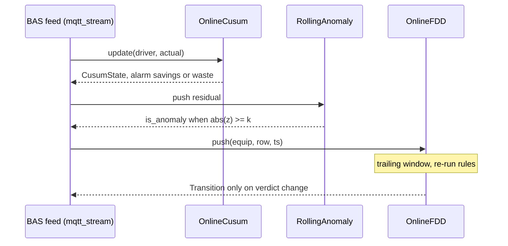

# Streaming / online analytics

Batch analytics score a finished period; a live BAS feed wants the same signals updated as data
arrives. These monitors are incremental (bounded state, O(1)–O(window) per sample) and pair with
the read-only streaming ingest (`camber.ingest.mqtt_stream`).

*Each sample folds into the online monitors; alarms and rule transitions emit only on a sustained shift, not every sample.*



## Online M&V — `camber.mandv.online`

- **`OnlineCusum(predict, *, limit, slack)`** — running CUSUM of *(baseline-predicted − actual)*.
  `predict` maps a driver to expected consumption (a scalar fn or `model.predict`). Each `update`
  folds one `(driver, actual)` sample and returns a `CusumState` (residual, cumulative, one-sided
  high/low accumulators). With `limit`/`slack` it's a two-sided **tabular** CUSUM raising
  `alarm="savings"|"waste"` on a sustained shift — savings erosion caught as an FDD signal.

  ```python
  from camber.mandv.online import OnlineCusum

  mon = OnlineCusum(baseline_model.predict, limit=200, slack=2)
  for driver, actual in feed:
      st = mon.update(driver, actual)
      if st.alarm:
          alert(st)
  ```

- **`RollingAnomaly(window, k, min_samples)`** — robust (median/MAD) z-score over a trailing
  window; flags `is_anomaly` when `|z| ≥ k` once warm. Run on a residual stream (actual − forecast)
  for online "learned-normal" deviation.

## Online FDD — `camber.rules.online`

`OnlineFDD(rules, window, eval_every, min_samples, emit_ok)` keeps a **trailing per-equipment
role-frame window** and re-runs the rules as samples arrive, emitting a `Transition` **only when a
rule's verdict changes** — so a sustained fault alerts once, not every sample.

```python
from camber.rules.online import OnlineFDD
from camber.rules.builtin import builtin_registry

reg = builtin_registry()
fdd = OnlineFDD([reg.get(n) for n in reg.names()], window=240, eval_every=4)
for equip, row, ts in stream:  # row: {Role|str: value}
    for tr in fdd.push(equip, row, ts=ts):
        notify(tr.rule, tr.from_severity, "->", tr.to_severity, tr.finding)
```

Any object with `name` / `roles_required` / `analyze(equip, frame)` is a rule (same duck-typed
protocol as the batch registry). `extend(equip, frame)` replays a whole frame; `window_frame(equip)`
inspects the current buffer; `state()` returns the current severity per (equip, rule).

### Option flags — `OnlineFDD`
| flag | default | effect |
|---|---|---|
| `window` | `240` | trailing samples retained per equipment (older age out) |
| `eval_every` | `1` | evaluate after this many pushes (batch to reduce compute) |
| `min_samples` | `12` | don't evaluate a window smaller than this |
| `emit_ok` | `False` | also emit transitions back to ok/info (recoveries) |

### Note on the trailing window

Verdicts reflect the **whole window**, so a fault clears only once the offending samples age out
(`window`). Size the window to the shortest fault you want to see recover: too large and recoveries
lag; too small and transient noise flaps.
