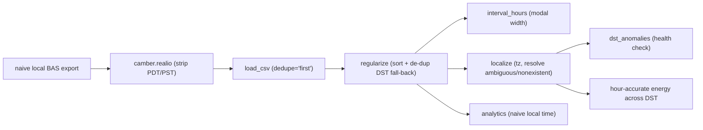

# Time handling & DST

BAS trend exports arrive as **naive local time** (`camber.realio` strips the `PDT`/`PST`
abbreviation), so daylight-saving transitions leave two artifacts: the **fall-back** hour repeats
(duplicate timestamps) and the **spring-forward** hour is missing (a gap). Concatenated overlapping
exports duplicate timestamps too. `camber.timegrid` centralizes robust handling.



*Duplicate/gap DST artifacts are collapsed on ingest; timezone is attached only when hour-accurate energy needs it.*

```python
from camber.timegrid import interval_hours, regularize, localize, dst_anomalies

interval_hours(series.index)  # modal width, ignores 0/duplicate gaps
clean = regularize(
    df, dedupe="first"
)  # sort + collapse duplicate timestamps ("first"/"last"/"mean")
aware = localize(
    idx, "America/Los_Angeles"
)  # tz-localize, resolving DST ambiguous/nonexistent times
dst_anomalies(
    idx, "America/Los_Angeles"
)  # {"duplicate_timestamps", "fallback_ambiguous", "springforward_nonexistent"}
```

- **`interval_hours`** uses the median of strictly-positive gaps, so a duplicate (0-gap) timestamp
  can't collapse the interval to zero (which would zero out any energy computed from it).
- **`regularize`** sorts and de-duplicates — `"first"`/`"last"` keep one row, `"mean"` averages the
  repeated hour, `None` leaves duplicates.
- **`localize`** attaches a timezone to naive local data, mapping the fall-back repeated hour to
  PDT→PST and shifting the spring-forward skipped hour forward (rather than raising).
- **`dst_anomalies`** counts duplicates and, given a timezone, the fall-back/spring-forward
  transitions — a DST health check for a series.

**Wired into ingest:** `camber.io.load_csv(..., dedupe="first")` now collapses duplicate timestamps
by default, and `camber.ingest.quality.assess` reports `n_duplicate_ts`. The robust outlier detector
also no longer crashes on a non-unique (duplicate-timestamp) index.

**Still local time:** analytics operate on naive local time (correct for occupancy/schedule logic).
For hour-accurate energy across a DST-transition day, `localize` to a tz first, or note the ~1-hour
difference on those two days a year.
