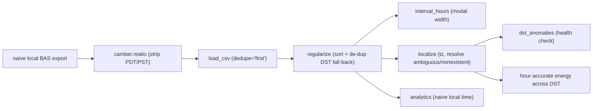

# Time handling & DST

BAS trend exports arrive as **naive local time** (`camber.realio` strips the `PDT`/`PST`
abbreviation), so daylight-saving transitions leave two artifacts: the **fall-back** hour repeats
(duplicate timestamps) and the **spring-forward** hour is missing (a gap). Concatenated overlapping
exports duplicate timestamps too. `camber.timegrid` centralizes robust handling.


```mermaid
flowchart LR
  raw["naive local BAS export"] --> realio["camber.realio (strip PDT/PST)"]
  realio --> load["load_csv (dedupe='first')"]
  load --> reg["regularize (sort + de-dup DST fall-back)"]
  reg --> iv["interval_hours (modal width)"]
  reg --> loc["localize (tz, resolve ambiguous/nonexistent)"]
  loc --> anom["dst_anomalies (health check)"]
  reg --> analytics["analytics (naive local time)"]
  loc --> energy["hour-accurate energy across DST"]
```

*Duplicate/gap DST artifacts are collapsed on ingest; timezone is attached only when hour-accurate energy needs it.*

```python
from camber.timegrid import interval_hours, regularize, localize, dst_anomalies

interval_hours(series.index)  # modal width, ignores 0/duplicate gaps
clean = regularize(
    df, dedupe="first"
)  # sort + collapse duplicate timestamps ("first"/"last"/"mean")
aware = localize(
    idx, "America/Los_Angeles"
)  # tz-localize, resolving DST ambiguous/nonexistent times
dst_anomalies(
    idx, "America/Los_Angeles"
)  # {"duplicate_timestamps", "fallback_ambiguous", "springforward_nonexistent"}
```

- **`interval_hours`** uses the median of strictly-positive gaps, so a duplicate (0-gap) timestamp
  can't collapse the interval to zero (which would zero out any energy computed from it).
- **`regularize`** sorts and de-duplicates — `"first"`/`"last"` keep one row, `"mean"` averages the
  repeated hour, `None` leaves duplicates.
- **`localize`** attaches a timezone to naive local data, mapping the fall-back repeated hour to
  PDT→PST and shifting the spring-forward skipped hour forward (rather than raising).
- **`dst_anomalies`** counts duplicates and, given a timezone, the fall-back/spring-forward
  transitions — a DST health check for a series.

**Wired into ingest:** `camber.io.load_csv(..., dedupe="first")` now collapses duplicate timestamps
by default, and `camber.ingest.quality.assess` reports `n_duplicate_ts`. The robust outlier detector
also no longer crashes on a non-unique (duplicate-timestamp) index.

**Order matters for the two-regime read.** `assess`'s temporal-coherence gate measures run lengths
**in index order**, so an unsorted export can make a real duty cycle look like scatter (and be
scored pooled, the conservative direction). Run `timegrid.regularize` — sort + de-duplicate —
before `assess` on any export whose ordering you don't control.

**Still local time:** analytics operate on naive local time (correct for occupancy/schedule logic).
For hour-accurate energy across a DST-transition day, `localize` to a tz first, or note the ~1-hour
difference on those two days a year.

## Stamps that name an instant: the site time zone

Some exports stamp **instants** instead of local wall-clock readings: ISO 8601 with a `Z` or
`+hh:mm` offset (an open-data package's `timestamp_utc`, an OPC-UA `SourceTimestamp`), a trailing
`UTC` / `GMT`, or epoch seconds. CAMBER's analytics run on local time, so such stamps must be
converted to the site's zone first. Before 0.90.1 the offset was dropped without converting: at a
US Central site a fan that ran 07:00-16:00 appeared to run 12:00-21:00.

Pass the site's IANA zone to the parser, a loader or an adapter, or set it once in a config:

```python
from camber.io import load_csv

df = load_csv("export.csv", timezone="America/Chicago")  # Z / offset / epoch -> Chicago wall clock
```

```json
{"source": {"kind": "perpoint_csv", "folder": "trends/", "timezone": "America/Chicago"}}
```

- Offset-bearing and epoch stamps are converted to the site's wall clock and then made naive.
  Mixed offsets (a `-06:00` / `-05:00` export across a DST switch) parse as the instants they are.
- Naive stamps are taken to be local already (or in `assume_tz`, and converted from it).
- After conversion the DST fall-back hour repeats and the spring-forward hour is absent, exactly
  as in a naive local export: `regularize` (the loaders' `dedupe`) collapses the repeat.
- **Without a zone** the clock is kept as written (UTC for `Z`), for back-compat, and a
  `camber.tsparse.TimezoneWarning` says that schedule, occupancy and hour-of-day rules will be
  shifted. `strict_timezone=True` (config `source.strict_timezone`) refuses such data instead.
- A store facility ingested from the dataset catalog is already on the site's clock (the entry's
  `source_timezone` / `local_timezone`). There `source.timezone` defaults to that zone and applies
  only to a `shared_oat` CSV file, and a different zone warns.
