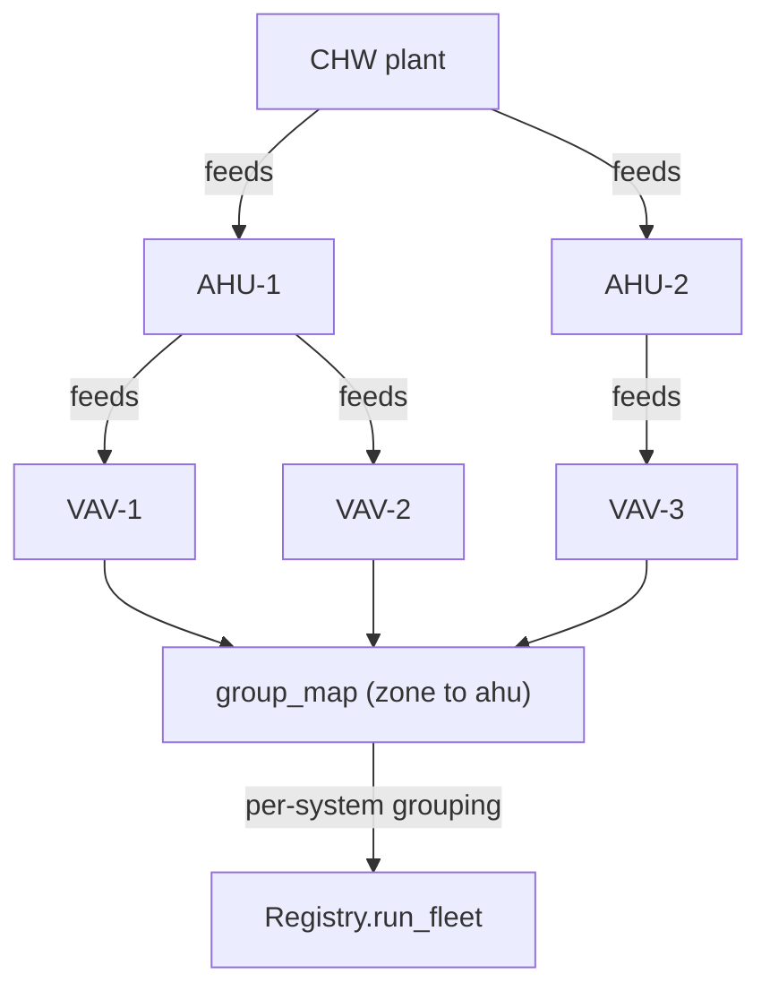

# Served-by topology

`camber.model.entities` says *what* equipment a building has and what points roll onto it. The
**topology** (`camber.model.topology.Topology`) says how that equipment is **connected** — which
plant serves which air handler, which air handler serves which zones. It is the missing piece that
lets fleet analytics stop treating a building as one flat pool of equipment and start reasoning per
system: *"which of **AHU-1's** zones is dragging its reset?"* rather than *"which zone building-wide?"*



*The served-by graph resolves each terminal's nearest system; `group_map` feeds that grouping to `run_fleet`.*

## The model

A `Topology` is a directed graph over **equipment-id strings**. An edge `(parent, child)` means
"parent serves / feeds child" (upstream → downstream), so a chilled-water plant → air handler → zone
system is three ids and two edges. The layers are **not** hard-coded: plant / AHU / zone are just
positions in the graph (roots are the most-upstream sources, leaves the terminals), so the same type
models `plant → AHU → zone`, `AHU → zone → reheat-terminal`, or any depth.

It is deliberately **id-only** — no dependency on the `Equip` entity — so it never introduces an
import cycle and stays agnostic about equipment classes. Questions that *are* class-aware ("the
**AHU** above this zone") are answered by passing a predicate, never by baking classes into the graph.

```python
from camber.model.topology import Topology

topo = Topology.from_parent_map(
    {
        "VAV-1": "AHU-1",
        "VAV-2": "AHU-1",  # zones served by AHU-1
        "VAV-3": "AHU-2",  # a zone served by AHU-2
        "AHU-1": "CHW",
        "AHU-2": "CHW",  # both AHUs served by the chilled-water plant
    }
)

topo.zones_of("AHU-1")  # ('VAV-1', 'VAV-2')  -- an AHU's terminal zones
topo.zones_of("CHW")  # ('VAV-1', 'VAV-2', 'VAV-3')  -- transitive leaves
topo.ancestors("VAV-1")  # frozenset({'AHU-1', 'CHW'})
topo.group_map(
    ["VAV-1", "VAV-2", "VAV-3"]
)  # {'VAV-1': 'AHU-1', 'VAV-2': 'AHU-1', 'VAV-3': 'AHU-2'}
```

## Construction

- `Topology.from_parent_map({child: parent})` — the common shape; `{zone: ahu}` and `{ahu: plant}`
  maps merge into one graph. This is the exact inverse of the `{zone: ahu}` grouping a fleet analytic
  consumes.
- `Topology.from_edges([(parent, child), ...])` — the primitive.
- `Topology.from_site(site)` — the graph a `Site` carries (a new defaulted `Site.topology` field), or
  the empty graph.

## Automatic population

Beyond the explicit builders, a topology can be **derived** from a building's existing semantic model
or, failing that, its naming conventions. Each builder stamps a `provenance` so a consumer knows how
much to trust the result:

| Builder | Source | Provenance |
|---|---|---|
| `camber.interop.topology_from_brick(ttl)` | Brick `feeds` / `isFedBy` relations | `semantic` |
| `camber.interop.topology_from_haystack(entities)` | Haystack `ahuRef` / `equipRef` refs | `semantic` |
| `camber.topology_infer.topology_from_naming(equips)` | equipment id-prefix / shared space label | `heuristic` |
| ASHRAE 223P `connects` | — | *deferred* (see below) |

- **Brick** reads `brick:feeds` (edge parent→child) and `brick:isFedBy` (inverted); containment
  (`hasPart`) is deliberately *not* treated as served-by. `site_from_ttl` now **auto-populates**
  `Site.topology` from these relations, so a Brick building with `feeds` needs no extra call.
- **Haystack** reads `ahuRef` (a terminal served by an air handler) and `equipRef` (equipment nested
  under a parent). A *point's* `equipRef` is point ownership, not served-by, so `equipRef` is only
  followed for entities carrying the `equip` marker. `siteRef` / `spaceRef` are ignored (a site is
  not served-by equipment).
- **Naming/space heuristic** is the **screening-grade fallback of last resort** — a shared space
  label or an `AHU_1_VAV_3`-style id prefix is a *guess*, not a verified edge. It emits an edge only
  when exactly one air handler matches (ambiguous or unmatched terminals are skipped), and it stamps
  `provenance="heuristic"` so a consumer can attach a screening caveat. Its real-world yield is modest
  (equipment `space` is often unset), which is expected for a last-resort inference.
- **ASHRAE 223P** connection modeling (`s223:connects` / connection-points, medium-typed) is a
  multi-hop graph heavier than a single parent reference, and CAMBER does not yet emit it, so
  topology extraction from 223P is **deferred** to a later release; Brick `feeds` covers the
  authoritative-semantic layer today.

## Queries

| Method | Returns |
|---|---|
| `children_of(id)` / `parents_of(id)` | direct downstream / upstream ids (`()` if unknown) |
| `descendants(id)` / `ancestors(id)` | everything transitively below / above |
| `roots()` / `leaves()` | most-upstream sources / terminals |
| `zones_of(id)` | the terminal (leaf) descendants of `id` — e.g. an AHU's zones |
| `nearest_ancestor(id, pred)` | closest upstream id satisfying `pred` (the class-aware primitive) |
| `group_of(id, pred=…)` | the grouping key for one terminal (its nearest matching ancestor) |
| `group_map(ids, pred=…)` | `{id: group}`, **omitting** ids with no resolvable group |

## Consumed by fleet analytics

The `{zone: ahu}` grouping from `group_map` is what turns a building-wide fleet analytic into a
per-system one. `Registry.run_fleet` hands the topology to grouping-aware fleet rules: the
**rogue-zone census** ([TR-RESET.md](TR-RESET.md)) uses it to scope per air handler. `provenance`
drives how much the result is trusted — a `semantic` grouping drops the census's confound caveat,
a `heuristic` one keeps a softened screening caveat. When no topology is passed, `run_fleet`
auto-builds a naming-heuristic one from the equipment ids so the census still auto-scopes.

## Honesty is built into the type

Topology is often incomplete, so the type degrades rather than guesses:

- **Partial graph** — an id the graph doesn't know returns empty from every query, and `group_map`
  simply **omits** it. A consumer can therefore measure coverage and keep its honest building-wide
  fallback for the uncovered remainder instead of inventing an edge.
- **Cyclic input** — a malformed source with a cycle is broken into a best-effort DAG; the removed
  edges are recorded in `dropped_cycle_edges` (queryable), so a bad graph **never hangs or crashes**,
  it degrades and tells you what it dropped.
- **Provenance** — `provenance` records whether the graph is `"explicit"`, `"semantic"` (an
  authoritative source like Brick `feeds`), or `"heuristic"` (a naming/space guess), so a downstream
  analytic can attach a screening caveat when it groups on a heuristic graph — the same
  honest-degradation register the rest of CAMBER uses.
