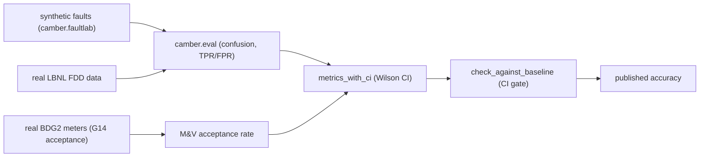
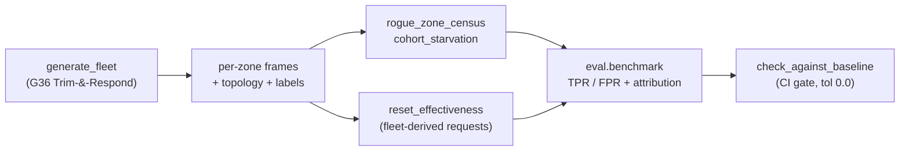

# Validation & methods

How CAMBER's results are kept honest and checkable. The project's promise is
*defensible, citable* analytics, so every layer is validated against a public standard,
an independent implementation, or labeled ground truth — and uncertainty is reported,
not hidden.



*Synthetic and real (LBNL, BDG2) benchmarks flow through the eval framework into CI-reported accuracy with confidence intervals and a baseline gate.*

## Principles

- **Clean-room & citable.** Every method cites a public standard (ASHRAE G36/G14/Std-55/
  Std-211, IPMVP, PNNL Building Re-tuning, NIST APAR, CalTRACK); no proprietary code or
  text. Each rule ships a synthetic fixture that proves detection.
- **Honest results.** Report uncertainty and limitations; never overstate a fit or a saving.
- **Reproducible.** Deterministic synthetic fixtures; `camber.validation.check_determinism`
  asserts a function returns identical output across runs; CI runs the suite on Python
  3.10 and 3.11.

## FDD accuracy — labeled public datasets

`camber.eval` implements the LBNL FDD performance-evaluation framework (confusion matrix,
TPR/FPR/accuracy, correct-diagnosis rate). `examples/lbnl_fdd/benchmark.py` scores the
detector suite across **three LBNL equipment families** (single-duct AHU, fan-coil unit,
dual-duct AHU — CC-BY labeled data) and now reports each rate with a **95% Wilson score
confidence interval** (`camber.validation.metrics_with_ci`), because per-family samples
are small and a bare percentage would overstate certainty.

Representative result (OA-fraction detector vs stuck dampers):

| Set | TPR (95% CI) | FPR | n |
|---|---|---:|---:|
| SDAHU | 100% [51–100%] | 0% | 6 |
| FCU | 100% [44–100%] | 0% | 4 |
| DDAHU | 50% [9–91%] | 100% | 3 |
| **Pooled** | **89% [56–98%]** | 25% | 13 |

The honest read the CIs force: OA-fraction transfers cleanly to single-duct AHUs and
FCUs but **degrades on dual-duct AHUs** (mixing-box + mild-weather OAF noise), and the
modulating-valve **leak detector under-fires** — gaps the benchmark *measures* rather
than hides. The pooled interval is the defensible headline; the small-n per-family
numbers are reported with their uncertainty.

### Drift-family real-data validation (which detectors the data can honestly test)

The newer **drift** and **Trim-and-Respond reset** families are only partly validatable on the
public datasets we have, and `examples/lbnl_fdd/benchmark.py` now scores exactly what the LBNL SDAHU
data can support (via `camber.driftvalidation.evaluate`: baseline = fault-free run, current = a
labeled fault run):

| Detector | On LBNL SDAHU | Why |
|---|---|---|
| `coil_valve_drift` | **real TPR** (target = coil-valve leak) | all required points mapped; the clean case |
| `economizer_damper_drift` | **real TPR, with a caveat** (target = stuck damper) | fires cleanly only if `OA_DMPR` is the *command* — if it's the stuck actual position, it reduces to the level check `outdoor_air_fraction` already covers |
| `duct_static_drift` | **specificity only** | no labeled duct-static fault in the fetched set → false-positive rate only |
| `fan_efficiency_drift`, `filter_loading_drift` | **synthetic-only** | need `POWER` / `FILTER_DIFF_PRESS` points the SDAHU simulation does not export |
| `vav_airflow_drift`, `vav_reheat_valve_drift` | **real TPR on the LBNL FPU subset** | the fan-power-unit subset carries per-box damper / airflow+setpoint / reheat-valve / discharge-temp — airflow drift targets the damper-stuck + airflow-sensor-bias faults, reheat-valve drift the reheat-valve leak/stuck + coil-fouling faults (baseline = fault-free run, current = the West-zone faulted run) |
| `chiller_efficiency`, `cooling_tower_approach` | **real TPR on the LBNL chiller-plant subset** (baseline-calibrated) | the plant subset carries chiller power + CHW loop and tower supply-temp + wet-bulb; each detector's absolute design ceiling is calibrated from the fault-free run (commissioning-style), then scored against the labeled physical faults — tower fouling / PID for the tower approach, plus three-way-bypass leak/stuck for chiller kW/ton |
| refrigerant-side chiller drift (`*_approach_*`, subcooling, superheat), pump drift | **synthetic-only** | the LBNL chiller-plant subset is *water-side only* — it exports **no** refrigerant-side points (evaporator/condenser approach, subcooling, superheat) and no pump-head/flow trends, so those detectors can't be scored on it |
| `*_reset_effectiveness` | **scored on a generated fleet** (TPR + failure-mode attribution) | the per-cycle reset-**request** point is *generated* from the fleet via G36 Trim-&-Respond, not downloaded; scored on all four failure modes (stuck / not-responding / not-trimming / diverges) for both SAT and static — see `camber.fleetlab` below |
| `*_rogue_zone_census`, `*_cohort_starvation` | **scored on a generated labeled fleet** (TPR/FPR + correct zone/AHU attribution) | a clean-room G36 T&R fleet generator (`camber.fleetlab`) emits per-zone role-frames + served-by topology + ground-truth labels; no public multi-zone-fleet dataset is vendorable, so the fleet is *generated* from the public ASHRAE G36 §5.14.8 request logic, not downloaded |

These are honest boundaries, not oversights: where the data can't support a real-fault score, the
family is validated on the synthetic whole-suite harness below (`camber.faultlab`) and said so here.

**BDG2 is meter-level** — whole-building energy + weather with no component point trends — so it
validates the **M&V / forecast / anomaly** track (below), *not* component FDD; the drift/reset
detectors' required roles (approach, valve %, damper, requests) simply don't exist in it.

**Sibling subsets — wired.** The **VAV fan-power-unit (FPU)** subset is wired (`fetch.py --fpu` +
`mapping_fpu.json`), scoring `vav_airflow_drift` and `vav_reheat_valve_drift` on its labeled per-box
faults. The **chiller-plant** subset is now wired too (`fetch.py --chiller` + `mapping_chiller.json`)
— the open, *simulated* chiller FDD source that validates the **plant-level** chiller detectors and
sidesteps a licence-encumbered ASHRAE chiller-FDD dataset. It is **water-side only** (no refrigerant
points), so it scores `chiller_efficiency` and `cooling_tower_approach` but not the refrigerant-side
chiller-drift family. Because the simulated chiller/tower design curves aren't published, each
detector's absolute design ceiling is **calibrated from the plant's own fault-free run** (commissioning
practice) rather than guessed, so the informative number is the TPR on the labeled physical faults;
sensor-bias runs act as genuine negatives (the plant is healthy, only a sensor lies). RTU/DDAHU/FCU
remain available too.

The tempting real-BMS AHU/VAV sets are, on inspection, **not usable for a commercial toolkit's
committed benchmark**: the only publicly-downloadable version of the widely-cited Korean large-office
AHU set is a reduced sample (all-faulted, two coarse labels, no supply-air setpoint, stacked AHUs —
no fault-free baseline to score against), and the richer modern real-labeled AHU/VAV datasets
(multi-building office/auditorium/hospital; the RBC/G36 collection with fault-free baselines; the ORNL
multi-zone VAV fleet) are all **CC-BY-NC-ND** — research-only, not vendorable. So no *real* labeled
multi-zone VAV fleet is committable — which is why the reset/fleet family is validated on a
**generated** fleet (next section) rather than downloaded, exactly as the G36 authors intend the
public Trim-&-Respond logic to be reused.

### Multi-zone fleet + reset validation (generated — `camber.fleetlab`)

The rogue-zone census, cohort-starvation, and reset-effectiveness detectors need something no
vendorable public dataset provides — a *fleet* of zones with per-zone reset **requests** and a
served-by topology. So `camber.fleetlab` **generates** it from the public ASHRAE Guideline 36
Trim-&-Respond logic itself (§5.1.14 / §5.14.8), never copying any encumbered simulation. The fleet is
physically coherent: each zone's per-cycle requests come from the same G36 request rules the detectors
consume, are aggregated per air handler, and the healthy reset setpoint is literally
`g36_reset.tr_simulate` of that aggregate — so the reset a detector scores is the true T&R response to
the fleet's own demand. One fault is then injected per fleet (a rogue zone, a starved cohort, or an
inert reset in one of four G36 failure modes), and `examples/fleet_fdd/benchmark.py` scores all six
detectors (3 detectors × SAT + static) with `camber.eval.benchmark`, CI-gated at `tol 0.0`.



Crucially the score is more than a fire/no-fire bit: an **attribution** rate checks each detector
named the *right* zone (`worst_zone`), the *right* air handler (`worst_group`), or the *right* reset
failure mode (`reason`) — the guard against a generator so easy that firing is meaningless — and each
detector carries genuine negatives (the fault-free fleet plus the cross-archetypes: a rogue fleet is a
cohort/​reset negative and vice-versa) so FPR is actually measured, not assumed. This is
**internal-validity** accuracy (does the detector correctly identify the G36 pattern it claims to);
external validity rests on the citation of the public G36 standard, not on real data — stated plainly
because no real labeled fleet is vendorable.

**Future external validity.** The open **Modelica Buildings Library** G36 sequences (revised BSD-3 —
license-clean) could cross-check the generated reset-request signal, but executing them needs a
Modelica toolchain (OpenModelica/Dymola) outside this project's dependency-light envelope, so it is
deferred; the generator instead cites the G36 standard directly.

## FDD accuracy — synthetic whole-suite harness

LBNL's public data labels only a handful of AHU fault modes, so it can accuracy-score only a few
detectors. To measure the **rest** of the suite, `camber.faultlab` injects each rule's target fault
into a role-frame (a labeled positive) and a matching fault-free frame (a negative), and
`examples/synthetic_fdd/benchmark.py` scores the whole registry with the same `camber.eval` framework —
deterministically, with no download, gated in CI against a committed baseline
(`tests/test_faultlab.py`).

Current coverage (0.6): **all 33 single-equipment rules** are accuracy-scored (100% TPR / 0% FPR on
their injected faults) — the fixture-only list is now empty; the 5 fleet rules are scored separately. A
companion harness scores the **G36 FC1–FC15 engine** over 6 representative fault conditions. The runner
prints a scored-vs-fixture coverage table so the credibility story is explicit rather than implied. This
complements — does not replace — the real-data LBNL benchmark above (external validity on real equipment),
which 0.6 broadened with a **cooling-coil-valve leakage severity sweep** (010–100%) to characterize the
leak detector that the pooled result showed under-firing.

## M&V accuracy — real-data acceptance on BDG2

The M&V analogue of the LBNL FDD accuracy benchmark: `examples/bdg2/benchmark.py` scores the **ASHRAE
Guideline 14 baseline-model acceptance rate** on **real** whole-building meters (Building Data Genome 2,
CC-BY, ~2,000 meters). For each building it fits the daily change-point inverse model of energy vs
outdoor temperature and asks whether the fit meets the G14 gate (CV(RMSE) ≤ 30% daily); the headline is
the fraction that pass, with a Wilson CI. Committed baseline, gated in the benchmark CI job.

Representative result (2016, ~2,044 buildings):

| Meter | Acceptance (95% CI) | Median CV(RMSE) | n |
|---|---|---:|---:|
| Chilled water (cooling) | 36% [32–40%] | 32% | 518 |
| Electricity | 8% [7–10%] | 21% | 1,526 |
| **Pooled** | **15% [14–17%]** | 24% | 2,044 |

The honest read: weather-driven **chilled-water** energy is baseline-able at a **meaningfully higher**
rate than schedule/plug-driven **electricity** (~4.5×) — CAMBER reproduces the expected physics — but
real whole-building energy is messy, and half the chilled-water buildings sit near the 30% daily
CV(RMSE) line. Reporting *both* meter types (not just the flattering one) with confidence intervals is
the point. The runner also rolls the portfolio up by EUI at real scale (validating the fleet percentile
path on a real distribution).

## Cross-validation vs an independent implementation

The ASHRAE G36 fault-condition equations (FC1–FC15) are cross-validated against the
open-source **open-fdd** project — they agree to 0.00 pts on every shared, runnable fault
condition (one ≤2.3-pt mixed-air-bounds edge case). Details and the operating-state vs
single-signal gating convention are in [ECOSYSTEM.md](ECOSYSTEM.md).

## M&V

Change-point / TOWT models report ASHRAE Guideline 14 fit statistics (CV(RMSE), NMBE) and
**fractional savings uncertainty** with every saving. The CalTRACK alignment and an
**eemeter cross-check recipe** (no dependency added) are documented in [MANDV.md](MANDV.md).

## Tariffs & finance

The native tariff engine is cross-checkable against **NREL PySAM `UtilityRate5`** (the
optional `[tariff]` extra) for full URDB fidelity, and `validate_bill` reconciles a
recomputed bill against actual invoices. The ECM finance metrics (NPV/IRR/SIR) are the
textbook definitions; IRR is a bisection solver verified against hand-worked cases in
`tests/test_finance.py`.

## Uncertainty & reproducibility toolkit (`camber.validation`)

- `wilson_interval(k, n)` / `rate_ci` — binomial confidence intervals for any rate.
- `metrics_with_ci(confusion)` — TPR/FPR/accuracy each with a Wilson CI.
- `check_determinism(fn, ...)` — reproducibility guard (identical output across runs).

## Robustness / adversarial hardening (pre-1.0)

A dependency-light stress pass (seeded generators + parametrize, no `hypothesis`) exercises the core
entry points on degenerate/adversarial input, and each real bug it found is fixed and regression-locked:

- **`io.load_csv`** — empty / header-only / unparseable-timestamp / text-in-numeric CSVs now raise a
  clear error or coerce cleanly (a stray text cell no longer silently poisons a column to `object`).
- **Every registered rule** on empty / 1-row / all-NaN / all-equal / duplicate-index frames returns a
  `Finding` and never raises (a 191-case parametrized sweep) — two plant rules were hardened.
- **M&V calibration** degrades to `accept=False` (never a `ValueError`) on thin/degenerate energy.
- **Fleet rollup** percentile is O(N log N) (was O(N²)); scale-tested to N=500.
- **Mapping** rejects catastrophic-backtracking (ReDoS) regex patterns at config load.
- **Determinism sweep** — `check_determinism` now nets `calibrate` / `best_model` / `detect_level_shifts`
  / cohort / `faultlab`, not just two spots.
- **Analytics entry points (0.9.6)** — `forecast` / `disaggregate` / `tariff` reject a non-timestamp
  index up front (they used to coerce a numeric index into nanosecond dates and return a plausible
  wrong answer); `EnergyPrice` rejects a negative/NaN rate; `build_scorecard` rejects `None`. Empty
  input stays graceful (empty in → empty out).
- **Untrusted parsers (0.9.6)** — the hand-rolled Brick reader and the rdflib/Haystack/223P paths now
  degrade on malformed input to a clear `ValueError` (or a partial result), never a raw `IndexError` /
  rdflib `BadSyntax` / `AssertionError`: a triple missing its terminator, a predicate list with no
  object, a literal containing the split characters, and a malformed tag set are all fuzzed and locked.
- **Tariff billing (0.9.6)** — a malformed rate structure (empty `energy_rates`, or a schedule naming a
  period with no rate) raises a clear error naming the period, instead of an `IndexError` mid-bill.

## Continuous benchmarking in CI

Accuracy is gated against a committed baseline so it can't silently drift. The cross-equipment
runner emits a flat metrics dict and compares it to a baseline:

```sh
# seed a baseline once (after a known-good run), commit it:
python examples/lbnl_fdd/benchmark.py --update-baseline examples/lbnl_fdd/benchmark-baseline.json
# thereafter, gate (CI fails on a regression beyond tolerance):
python examples/lbnl_fdd/benchmark.py --gate examples/lbnl_fdd/benchmark-baseline.json --tol 0.05
```

`camber.eval.check_against_baseline(current, baseline, *, tol, metrics)` is the reusable gate:
a higher-is-better metric (TPR, accuracy, correct-diagnosis) **regresses** when it falls past
`tol`; a lower-is-better one (FPR, error) regresses when it **rises** past `tol`; a baseline
metric missing from the current run fails too (a detector was removed/renamed). It returns a
`BaselineCheck` (`passed`, `regressions`, `improvements`, `unchanged`, `missing`).

`.github/workflows/benchmark.yml` runs this weekly, on demand, and on PRs that touch the rules
or the benchmark — fetching the CC-BY datasets (cached), gating against the committed baseline
(or seeding one if absent), and uploading the metrics artifact.

> Remaining: capture a packaged "published accuracy" run as a versioned release artifact.
