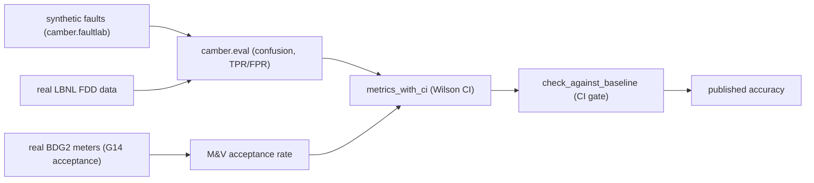
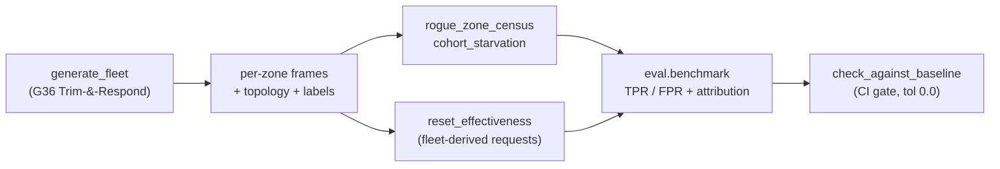

# Validation & methods

How CAMBER's results are kept honest and checkable. The project's promise is
*defensible, citable* analytics, so every layer is validated against a public standard,
an independent implementation, or labeled ground truth — and uncertainty is reported,
not hidden.


```mermaid
flowchart LR
    synth["synthetic faults (camber.faultlab)"] --> ev["camber.eval (confusion, TPR/FPR)"]
    lbnl["real LBNL FDD data"] --> ev
    bdg2["real BDG2 meters (G14 acceptance)"] --> mv["M&V acceptance rate"]
    ev --> ci["metrics_with_ci (Wilson CI)"]
    mv --> ci
    ci --> gate["check_against_baseline (CI gate)"]
    gate --> report["published accuracy"]
```

*Synthetic and real (LBNL, BDG2) benchmarks flow through the eval framework into CI-reported accuracy with confidence intervals and a baseline gate.*

## Principles

- **Clean-room & citable.** Every method cites a public standard (ASHRAE G36/G14/Std-55/
  Std-211, IPMVP, PNNL Building Re-tuning, NIST APAR, CalTRACK); no proprietary code or
  text. Each rule ships a synthetic fixture that proves detection.
- **Honest results.** Report uncertainty and limitations; never overstate a fit or a saving.
- **Reproducible.** Deterministic synthetic fixtures; `camber.validation.check_determinism`
  asserts a function returns identical output across runs; CI runs the suite on Python
  3.10 and 3.11.

## FDD accuracy — labeled public datasets

`camber.eval` implements the LBNL FDD performance-evaluation framework (confusion matrix,
TPR/FPR/accuracy, correct-diagnosis rate). `examples/lbnl_fdd/benchmark.py` scores the
detector suite across **three LBNL equipment families** (single-duct AHU, fan-coil unit,
dual-duct AHU — CC-BY labeled data) and now reports each rate with a **95% Wilson score
confidence interval** (`camber.validation.metrics_with_ci`), because per-family samples
are small and a bare percentage would overstate certainty.

Representative result (OA-fraction detector vs stuck dampers):

| Set | TPR (95% CI) | FPR | n |
|---|---|---:|---:|
| SDAHU | 50% [15–85%] | 0% | 6 |
| FCU | 100% [44–100%] | 0% | 4 |
| DDAHU | 100% [34–100%] | 0% | 3 |
| **Pooled** | **78% [45–94%]** | 0% | 13 |

The honest read the CIs force: judged on fan-on, occupied samples against each unit's own design
minimum, OA-fraction catches every stuck damper on the fan-coil and dual-duct units with no false
alarm, but on the single-duct AHU it catches only the dampers stuck well open (75 %, 100 %). A
damper stuck at that unit's 10 % minimum, or at 25 % (4.4 % OA against a 1.6 % minimum), looks like
normal ventilation outside economizer weather; its real symptom is the missed economizer, which
`economizer_damper_drift` catches (below). `leaking_valve` **catches the dataset's one leak run** — a 10 % leak (the valve sits at 0.10
whenever it is commanded shut; the published 010/025/040/050 "severities" are one file) — since
0.98 (#84), but only with a fan heat calibrated on this unit: see the circularity note below. The
benchmark *measures* these gaps rather than hides them. The pooled interval is the defensible headline; the
small-n per-family numbers are reported with their uncertainty.

> **These figures moved in 0.86 (#30).** The 0.85 table read SDAHU 100 %, DDAHU 50 % with an FPR
> of 100 %, and pooled 89 % [56–98 %] with an FPR of 25 %. The 0.86 catalog audit (#24–#29) found
> that those figures rested on CAMBER's own wrong assumptions: a 20 % minimum OA for a single-duct
> unit whose design minimum is a 10 % damper position (a **1.6 %** OA fraction — its "ok" held only
> because fan-off samples were judged), a flat 20 % for a dual-duct unit whose minimum is
> **seasonal** (11.9 % Jun–Aug, 31.8 % otherwise — the source of its FPR of 1.0), and mis-mapped
> fan and occupancy points. With the fixes, `outdoor_air_fraction` judges fan-on, occupied samples
> against each unit's own minimum, so the SDAHU TPR fell and the dual-duct FPR fell to 0. The
> gated baseline (`examples/lbnl_fdd/benchmark-baseline.json`) was refreshed with the
> maintainer's sign-off; the CHANGELOG lists every gated metric that moved. Every published-data
> problem is listed with its evidence in
> [DATASETS.md](DATASETS.md#data-issues-and-how-camber-handles-them).
>
> **The FCU result is fragile.** Its OA-damper leak runs give 12.7 / 15.4 / 17.4 % OA (20 / 50 /
> 80 % leakage) against the rule's 15 % excess line (the unit's 10 % minimum + 5 %): the leak-50
> detection the benchmark scores rests on a 0.4-point margin.

### Drift-family real-data validation (which detectors the data can honestly test)

The newer **drift** and **Trim-and-Respond reset** families are only partly validatable on the
public datasets we have, and `examples/lbnl_fdd/benchmark.py` now scores exactly what the LBNL SDAHU
data can support (via `camber.driftvalidation.evaluate`: baseline = fault-free run, current = a
labeled fault run):

Declined cases (the detector could not test its claim) are excluded from the score and counted
separately — `DetectorScore.n_declined`; scoring them would credit a specificity the detector never
demonstrated. A detector's positives are the faults its **documented physics** says it sees; the
one-sided drift detectors do not claim opposite-direction faults (a leak lowers the valve demand),
so those score as cross-negatives. Valves and dampers are read from the dataset's controller-demand
columns (`*_DM`), which is how CAMBER's rules interpret those roles. The SDAHU numbers are gated in
CI by `examples/lbnl_fdd/benchmark-baseline.json`.

| Detector | On LBNL SDAHU | Why |
|---|---|---|
| `coil_valve_drift` | **specificity only — 1 false alarm in 6** | one-sided **up** (fouling / waterside starvation / authority loss), none of which the SDAHU set labels; its coil-valve *leak* is the opposite direction (the leak delivers cooling the controller didn't ask for, so the demand falls) and is `leaking_valve`'s job, so it scores as a cross-negative. The false alarm is the damper stuck at 100%: hot outdoor air adds latent coil load a sensible air-ΔT cannot see (+9%, 2.6σ) — the documented latent confound |
| `economizer_damper_drift` | **recall 4/4, 0 false positives in 2** (11–17σ) | read against the damper *command* (`OA_DMPR_DM`). Against the measured position — what this benchmark mapped until 0.82.0 — a stuck damper's OA fraction matches its (stuck) position and the fault is invisible: recall 0/4 |
| `duct_static_drift` | **not measured** — declines all 6 cases | no labeled duct-static fault in the fetched set, *and* the baseline period will not support a static-vs-airflow fit, so there is no specificity number either. Until 0.82.0 those declines were booked as true negatives and reported as FPR 0.0 |
| `fan_efficiency_drift`, `filter_loading_drift` | **synthetic-only** | need `POWER` / `FILTER_DIFF_PRESS` points the SDAHU simulation does not export |
| `vav_airflow_drift`, `vav_reheat_valve_drift` | **measured on the LBNL FPU subset, parallel boxes (PFPU)** (opt-in `fetch.py --fpu`, not gated in CI): airflow **recall 5/5, 0 false positives in 24**; reheat valve **recall 2/8, 0 false positives in 17, 3 declined** | the faults are imposed on the **South** box (`_S`); until 0.82.0 the mapping pointed at the healthy West box and both detectors scored 0. The target lists follow each rule's documented physics (revised in 0.92.0; before, airflow scored 4/6 and reheat 1/7 on older lists). Both rules are one-sided **up**. Airflow targets the dampers stuck at 50 / 80 / 100 % and the low-reading (−200 / −400 CFM) flow sensor, and catches all five. The dampers stuck at 0 % and 20 % drift *down* (56σ and 4σ), outside its one-sided claim, so they are **excluded** rather than scored either way. Its cross-negatives, where it rightly stays silent, are the high-reading sensor (+200 / +400 CFM), damper instability, fan restriction, the room-temperature faults and every reheat fault. Reheat targets the valve stuck at 0 % and 20 % (read from the valve *demand* `RH_VLV_DM_S`) and all six air- and water-side coil-fouling runs. It catches both stuck valves and misses every fouling run (within 0.03σ): fouling leaves no trace in the box's trended points, since valve demand, discharge temperature and HW flow medians are identical to the fault-free run. Its cross-negatives are the valves stuck at 50–100 % or leaking (they over-deliver, so the demand falls), the stuck dampers and the airflow and room-temperature sensor biases. It declines the high-reading airflow-sensor runs and the damper stuck at 0 %. The instability and fan-restriction runs are excluded, because the rule's physics predicts nothing for them. The counts come from `examples/lbnl_fdd/optin-measured.json` (the last opt-in run), which a test checks this row against |
| series-box (SFPU) `vav_airflow_drift`, `vav_reheat_valve_drift` | **measured on the LBNL FPU subset, series boxes (SFPU)** (opt-in, not gated; scored since 0.92.0 against `SFPU_FaultFree`, same target lists): airflow **recall 5/5, 4 false positives in 24**; reheat valve **recall 2/8, 4 false positives in 14, 6 declined** | before 0.92.0 no series run was scored at all. In a series box the fan pulls primary and plenum air through the reheat coil, so the reheat duty reads the fan *discharge* flow (`VAV_DA_CFM_S`) instead of the primary flow; the airflow rule still reads the damper against the primary-flow command. Airflow's four false alarms are the reheat valves leaking at 50 % / 80 % and stuck at 80 % / 100 %: the overheated room drives the primary-flow command far above anything in the baseline (up to 1,000 cfm against a fault-free p95 of about 450), so the damper is judged by extrapolation. Physically the damper is healthy there, so they are counted as false positives. Reheat catches the valves stuck at 0 % and 20 % and misses all six fouling runs, as on the parallel box. Its false alarms are the room-temperature biases +2 / +4 °C and the dampers stuck at 80 % / 100 %. The coil's entering air is a primary/plenum mix that no point measures (the AHU supply temperature is the proxy), so a warmer room or a changed primary share reads as creep. With the primary flow as the duty instead, reheat scores 2/8 with 3 false positives in 11 (the damper stuck at 20 % instead of 80 / 100 %), and declines 9 runs. The discharge flow is kept because it is the coil's physical airflow, not because of the score. Counts from `examples/lbnl_fdd/optin-measured.json` |
| `chiller_efficiency`, `cooling_tower_approach` | **measured on the LBNL chiller-plant subset** (opt-in `fetch.py --chiller`, not gated in CI): `chiller_efficiency` **TPR 6/11, FPR 2/13**; `cooling_tower_approach` **TPR 0/3, FPR 0/14, 7 declined** | kW/ton catches every condenser-bypass-valve fault and the severe chiller fouling (065, 2.36 kW/ton against the 1.44 calibration; the archive's undocumented chiller-fouling runs are positives since 0.86) and misses tower fouling / PI mistuning (≤ 7% kW/ton change) and the mild chiller fouling (095, 1.53); its false alarms are the two positive chiller sensor-bias runs, whose biased temperature corrupts the tonnage. Since 0.92.0 the three sensor-bias families (chiller and tower leaving water ±1 / ±2 °C, secondary-loop DP ±10 / ±20 %) are *listed* as negatives for both rules, and so are the chiller-fouling and bypass runs for the tower rule; a run on no list is excluded, where before every non-target run was a negative by default. No count moved. The tower rule never ran before 0.82.0 (a 0–1 fan speed was never rescaled; the exported wet-bulb and dry-bulb columns are swapped — see the `lbnl-chiller` catalog entry's `fix` quirk and `camber/datasets/mappings/lbnl_chiller.json`). It now judges approach only at **high fan effort (≥ 90%)**: the plant holds a 60 °F minimum condenser-water temperature, so in cold weather a healthy tower sits far above wet-bulb + design with its fan idling — which fired the rule on all five bypass-valve runs (a leaking bypass keeps the tower running all winter). Those, and the PI run, now decline: the tower is never pushed hard, so there is nothing to judge. The −2 °F tower-sensor-bias run declines too: only 8 samples at ≥ 90 % fan pass the plausibility checks. Fouling is visible at high fan (20% / 7% / 0% of hours above design + 3 °F at 65% / 80% / 95% capacity, vs 0% healthy; 3.3× the high-fan hours at 65%) but the rule's severity is the *median* approach, which moves only 8.1 → 9.4 °F — so it stays `ok`. The fan working harder for the same approach is the stronger fouling signature, and is not yet a detector. The counts come from `examples/lbnl_fdd/optin-measured.json`, which a test checks this row against |
| sensor bias vs physical fault on the chiller plant (`camber.sensordrift.compare_to_reference`) | **measured on the LBNL chiller-plant subset** (opt-in, not gated; since 0.92.0): chiller leaving water **TPR 2/4, FPR 0/20**; tower leaving water **TPR 2/4, FPR 5/20** | Each sensor is compared with a reference it must equal while the plant's physics holds. Chiller 1's leaving water (`CHL_SW_TEMP_1`) must equal the primary supply (`CWL_PRI_SW_TEMP`) while chiller 1 runs alone. Tower 1's leaving water (`CT_SW_TEMP_1`) must equal the condenser supply (`CDWL_SW_TEMP`) while tower 1 runs alone with the bypass valve commanded shut. At the documented 2.0 °F warn threshold the ±2 °C biases read exactly ±3.6 °F and are caught; the ±1 °C biases read ±1.8 °F and are missed (a threshold question, left at the default). The fault-free, fouling, PI and DP-bias runs read 0.00 / −0.05 °F. The tower pair's five false alarms are the bypass-valve runs (−37 to −47 °F). A leaking or stuck valve does not obey its *command*, so condenser water mixes past the tower while the command reads shut. The reference condition cannot be verified from the command alone. This is the complement of `chiller_efficiency`, which fires on the chiller-bias runs: the pair separates a lying sensor from a real fault that the kW/ton rule cannot. Counts from `examples/lbnl_fdd/optin-measured.json` |
| refrigerant-side chiller drift (`*_approach_*`, subcooling, superheat), pump drift | **synthetic-only** | the LBNL chiller-plant subset is *water-side only* — it exports **no** refrigerant-side points (evaporator/condenser approach, subcooling, superheat) and no pump-head/flow trends, so those detectors can't be scored on it |
| refrigerant-side chiller drift on **open lab / field data** (not vendored, not CI-gated; measured 0.82.0) | **NIST residential heat-pump FDD lab data** (151 labeled cases: 107 faults — under/overcharge, condenser & evaporator airflow, liquid-line restriction — and 44 held-out no-fault files; loads as-is, 0.7–4.3 t): before **all six detectors declined 151/151**; after, 0 declined — recall / FPR: subcooling 0.34 / 0.00, superheat 0.22 / 0.00, head pressure 0.32 / 0.00 (0.01 load-only), suction pressure 0.00 / 0.00, approach 0.52 / 0.02, approach CUSUM 0.64 / 0.23 (the lab files are steady-state test points on a synthetic time index, so the temporal claim is weak there). **NIST IBAL 5-ton chiller, normal operation** (22 days after a 5-day baseline): before 100% declined; after, **0 period false alarms** on every detector; sustained-alarm false alarms 5-min / 1-min: approach CUSUM 0.59→0.05 / 0.75→0.15, subcooling 0.50→0.00 / 0.90→0.05, suction 0.00 / 0.40→0.05. A mid-run injected step is caught by the period rule / CUSUM at: head +44 psi 100% / 100%, suction −15 psi 64% (5% load-only) / 100%, superheat +8 °F 45% / 100%, subcooling −3 °F 9% / 82%, condenser approach +3 °F 95%. **ORNL CO₂ (R744) supermarket rack** (5 fault / negative-control pairs): before all declined (gas-cooler pressures above the 700 psig ceiling; small loads); after all scored with 0 false alarms; the low-temp EEV failure is a superheat fault (+36.7 °F, 7.2σ); the gas-cooler air blockage is **not** detected — its day was hotter than any baseline day (caveated as extrapolated) and compressor kW, the only load proxy, rises with the blockage itself | size-relative load gates + flat-level fallback, physical per-metric ranges, refrigerant-neutral pressure ceilings, a heat-sink / leaving-CHW regressor for head / suction pressure, and a serial-correlation-corrected CUSUM (see [CHILLER-DRIFT.md](CHILLER-DRIFT.md#the-load-normalized-baseline)). IBAL's second chiller has no evaporator-entering sensor, so compressor kW stands in for load; its period statistics stay specific (0 false alarms) but its CUSUM still flags 33–62% of summer days, when kW ran outside the spring baseline's envelope — a real sustained shift below the period floor, i.e. a tuning question for the provisional CUSUM parameters, documented rather than tuned |
| hydronic loop / pump drift on the **LBNL boiler-plant FDD set** (not vendored) | `loop_dp_drift` **now scores** (was 4/4 declined); `pump_power_drift` names the missing metric; `hw_pump_dp_reset` evaluates the DP-setpoint reset | the loop DP is trended in inH₂O (480.5 setpoint), which the former psi-only 0–100 band rejected sample by sample while the caveat blamed "too few loaded samples"; the band is now scaled to the loop's own median. Five runs export pump power as `"NAN"` strings — the decline now says the power column has no numeric values. The HW pump speed is a 0–1 fraction; the rule rescales it and reports the (flat) DP setpoint it previously claimed but never read. No detection claim is made on the boiler faults |
| `cooling_tower_approach` on a **pilot wet cooling tower** (CIEMAT, ~500 m) | message + elevation only | only 5 samples reached ≥ 90% fan; the decline said the fan "never reached 90%" and now says what happened. The site is ~500 m up: a derived wet-bulb now takes `elevation_ft` (median approach 29.1 → 30.0 °F) and a sea-level derivation is caveated |
| `*_reset_effectiveness` | **scored on a generated fleet** (TPR + failure-mode attribution) | the per-cycle reset-**request** point is *generated* from the fleet via G36 Trim-&-Respond, not downloaded; scored on all four failure modes (stuck / not-responding / not-trimming / diverges) for both SAT and static — see `camber.fleetlab` below |
| `*_rogue_zone_census`, `*_cohort_starvation` | **scored on a generated labeled fleet** (TPR/FPR + correct zone/AHU attribution) | a clean-room G36 T&R fleet generator (`camber.fleetlab`) emits per-zone role-frames + served-by topology + ground-truth labels; no public multi-zone-fleet dataset is vendorable, so the fleet is *generated* from the public ASHRAE G36 §5.14.8 request logic, not downloaded |
| `dcv_verification`, `dcv_system_verification` | **real data + physics-simulated** | a lab room with a known DCV law reads `functioning` on CO₂, count and presence; three office rooms read `functioning` on camera counts; an office building with no DCV reads `insufficient` on every unit (never a false `functioning`), its 11 CO₂ zones attribute through the Brick chain, and its OA flow sits below the assumed floor in 2–4 % of occupied hours (fan-off days, named "supply fan off while scheduled occupied" since 0.98; the 2020 smoke-mode weeks held OA above it), `info` under the 10 % fault share; a lecture theatre's 110 fan-off hours at 2000 ppm are a fault; a schedule-driven valve is not credited as DCV. Datasets (all licence-clean, cited by DOI, not vendored) and numbers in [VENTILATION.md](VENTILATION.md#validation-and-limits); the synthetic scenario is `faultlab.dcv_sim`. No labeled DCV-fault dataset exists, so TPR is established on the one known-law room, not a sample |

These are honest boundaries, not oversights: where the data can't support a real-fault score, the
family is validated on the synthetic whole-suite harness below (`camber.faultlab`) and said so here.

**BDG2 is meter-level** — whole-building energy + weather with no component point trends — so it
validates the **M&V / forecast / anomaly** track (below), *not* component FDD; the drift/reset
detectors' required roles (approach, valve %, damper, requests) simply don't exist in it.

**Sibling subsets — wired.** The **VAV fan-power-unit (FPU)** subset is wired (`fetch.py --fpu` +
`camber/datasets/mappings/lbnl_fpu.json`), scoring `vav_airflow_drift` and `vav_reheat_valve_drift` on its labeled per-box
faults. The **chiller-plant** subset is now wired too (`fetch.py --chiller` + `camber/datasets/mappings/lbnl_chiller.json`)
— the open, *simulated* chiller FDD source that validates the **plant-level** chiller detectors and
sidesteps a licence-encumbered ASHRAE chiller-FDD dataset. It is **water-side only** (no refrigerant
points), so it scores `chiller_efficiency` and `cooling_tower_approach` but not the refrigerant-side
chiller-drift family. Because the simulated chiller/tower design curves aren't published, each
detector's absolute design ceiling is **calibrated from the plant's own fault-free run** (commissioning
practice) rather than guessed, so the informative number is the TPR on the labeled physical faults;
sensor-bias runs act as genuine negatives (the plant is healthy, only a sensor lies). RTU/DDAHU/FCU
remain available too.

The other real-BMS AHU/VAV sets are, on inspection, **not usable for a commercial toolkit's
committed benchmark**: the only publicly-downloadable version of the widely-cited Korean large-office
AHU set is a reduced sample (all-faulted, two coarse labels, no supply-air setpoint, stacked AHUs —
no fault-free baseline to score against), and the multi-building office/auditorium/hospital set is
not in the catalog. The simulated RBC/G36 AHU collection (`rbc-g36-ahu`) is in the catalog but
**research-only** (its archive bundles a third-party folder whose open licence CAMBER cannot vouch
for), so its results are not published here. One real, labelled multi-zone VAV cohort is open —
ORNL's (below) — but it is small and scores zone symptoms, not the Trim-&-Respond resets, which is
why the reset/fleet family is still validated on a **generated** fleet (next section), exactly as
the G36 authors intend the public Trim-&-Respond logic to be reused.

### 0.92 plant detectors on the LBNL plants

`examples/lbnl_fdd/plant_detectors.py` scores the three [plant detectors](PLANT-DETECTORS.md) on the
labelled LBNL boiler plant (17 runs) and chiller plant (24 runs). Each detector's target faults
are the positives; the fault-free year, every other physical fault and every sensor bias are
negatives. The drift rules freeze their baseline from the fault-free year and score each run as the
current period; the bypass rule scores each run on its own. A detection is a warn or fault. These are
**measured, not gated** results (the subsets are opt-in downloads), and with three to five
positives the 95 % Wilson intervals are wide: they bound the detectors, they do not rank them.

| Detector | Target runs | TPR (95 % CI) | FPR (95 % CI) | Notes |
|---|---|---:|---:|---|
| `boiler_efficiency_drift` | boiler fouling 065 / 080 / 095 | 3/3 (0.44-1.00) | 0/14 (0.00-0.21) | ratio +54 % / +25 % / +5.1 %: the 95 % run clears the 5 % warn floor by 0.1 point. The +2 / +4 F hot-water temperature-bias runs raise the ratio 11 % / 25 % with gas at matched OAT up only 3-5 %, so they are reported as heat-metering problems (`info`), not fouling |
| `cooling_tower_fan_effort_drift` | tower fouling 065 / 080 / 095 | 2/3 (0.21-0.94) | 0/21 (0.00-0.15) | fan +17.8 / +10.9 / +3.3 %-points at matched range and wet-bulb; the 95 % run stays under the 5-point floor. The +1 / +2 F tower-sensor-bias runs drive the fans harder than 65 % fouling (+29 / +48 points) and are caught by the leaving-water vs condenser-entering cross-check (+1.6 / +3.5 F shifts) and reported as sensor offsets |
| `cooling_tower_approach_drift` (for comparison) | tower fouling | 0/3 (0.00-0.56) | 0/21 (0.00-0.15) | the controller holds the approach, as #14 found |
| `condenser_bypass_leak` | bypass leakage 25 / 50 / 75 %, stuck 50 / 75 % | 5/5 (0.57-1.00) | 0/19 (0.00-0.17) | medians 42-62 F with the valve commanded shut vs 0.0-0.04 F on every healthy run. The -2 / +2 F tower-sensor-bias runs (3.6 / -3.1 F) are flat across the condenser range and reported as sensor offsets |

The chiller-plant mapping gained `CDWL_SW_TEMP` -> `cond_entering_water_temp` and `TWV_CTRL` ->
`cw_bypass_valve`, the boiler mapping `BOI_GAS_CSUM_1` -> `gas_input_rate`; the catalog entries
carry the evidence. The simulated RBC/G36 collection's plant faults were also run locally as a
research check; as for every research-only set, its numbers are not published.

<!-- 0.98 (#86 items 1 and 5, 098-plant-reference) begin -->
**The same numbers through a config (0.98).** The table above comes from the example script,
which freezes each drift baseline from the fault-free year by hand. Since 0.98 a drift family can
declare that run as its reference (`drift.families[].reference`, fitted in memory on every run and
never stored; see [the CLI guide](CLI.md#a-declared-reference)), so the `lbnl-chiller` and
`lbnl-boiler` templates score `cooling_tower_fan_effort_drift` and `boiler_efficiency_drift` with
a plain `camber run`. The verdicts match the script on every run (checked by
`tests/test_drift_reference_098.py` when the data is present), and the two rules are now the
entries' declared targets for `camber datasets score`: TPR 2/3 and 3/3, no false alarm. The
fault-free run declines as the reference, but the scorer still counts it as a correct negative,
so its FPR denominators are the 21 and 14 above.
<!-- 0.98 (#86 items 1 and 5, 098-plant-reference) end -->

### Real labelled multi-zone VAV cohort — ORNL FRP (`ornl-frp-vav`, CC-BY-4.0)

CAMBER's **first result on real, labelled, multi-zone VAV data** (0.89): the ORNL Flexible Research
Platform, a two-storey test building with one rooftop unit and ten VAV boxes, where a box damper was
held stuck at 0 / 20 / 40 / 60 / 80 / 100 % for one day each in three rooms (106 and 104 in August
2023, 205 in December 2023), plus a fault-free day per set, and room 205's airflow reading was biased
±20 / 40 % over two sets of April 2024 days (Im, Jung & Yoon 2025, *Sci Data*,
doi:10.1038/s41597-025-05063-z). Every box is logged, so each test day is a real zone cohort: the box
under test is scored and its nine neighbours are unscored context.

<!-- 0.98 (#85 items 1-2, #89 item 3, 098-terminal-stuck) begin -->
Since 0.98 the catalog template declares **`actuator_stuck`** as the detector for the stuck dampers:
it judges each stretch where a box's damper holds one position against what the room asked for
(shut through occupied hours, part open while the room runs warm, fully open while it is satisfied:
a fault; held all day while the room temperature moves: a warning, which the score counts as a
detection). Until 0.97 it declared **`unmet_setpoint_hours`**, the comfort symptom, which stays in
the template as context. The other 13 days -- five fault-free days and eight airflow-bias days,
which neither rule targets -- are the negatives. On the `full` subset (31 days, `camber datasets
score ornl-frp-vav` on a `--subset full` ingest, or `scripts/catalog_sweep.py --only ornl-frp-vav`):

| Detector | Positives caught (TPR, 95% Wilson CI) | False alarms (FPR, 95% Wilson CI) |
|---|---|---|
| `actuator_stuck` → stuck box damper (declared since 0.98) | **17 of 18** — 94% [74–99%] | **0 of 13** — 0% [0–23%] |
| `unmet_setpoint_hours` → stuck box damper (declared until 0.97) | **10 of 18** — 56% [34–75%] | **1 of 13** — 8% [1–33%] |

The default subset (set 3 only): `actuator_stuck` 6 of 6, 0 of 1 (TPR 100% [61–100%]);
`unmet_setpoint_hours` 2 of 6, 1 of 1.

By room, `actuator_stuck`: 104 caught 6 of 6, 205 caught 6 of 6, 106 caught 5 of 6. It misses room
106 stuck at 100 % (set 1): the room ran warm that day, so a fully open damper was what the room
asked for, and a box stuck where the load would have put it anyway cannot be told from a working
one. Seven of the 17 detections are warnings: the days (room 205 at 60 / 80 %, room 104 at 60 /
100 %, room 106 at 40 / 60 / 80 %) where nothing in the room contradicted the position. The nine neighbouring boxes are not scored; on the
31 days one neighbour is flagged, room 205 in set 1 at 80 %, fully open while its room sat below
setpoint on a duct-static-collapse day, when the air handler starved every box (data issue
`duct-static-collapse-in-damper-runs`).

By room, `unmet_setpoint_hours`: 104 caught 5 of 6 (misses 60 %), 106 caught 3 of 6 (misses 40 / 60 /
80 %), 205 caught 2 of 6 (20 % and 40 %; misses 0 / 60 / 80 / 100 %). Its one false alarm is room
205's set-3 fault-free day (2023-12-14): the room overheated in the afternoon from solar gain through
its south and west windows (too hot 22 % of occupied hours), which the data descriptor's technical
validation reports -- real weather, not a fault.

Caveats, stated because the intervals are wide:

- **Calibrated on the same building.** `actuator_stuck`'s `min_flat_hours` and `whole_day_share`
  defaults were set from the set-3 boxes, which are also scored here: the healthy boxes' longest
  flat run covers at most 70 % of a day there, and at most 95 % on the full subset (room 102 on an
  airflow-test day), against 100 % for every stuck box. The 0.98 whole-day bar sits in that narrow
  gap, so the result is not an independent test.
- **A symptom rule is not a damper detector.** A damper stuck near the flow the room needs that day
  leaves no comfort symptom, so `unmet_setpoint_hours` misses mid-range positions; whether a stuck
  position is caught depends on the day's weather and load as much as on the fault.
- **Small n, one building, one day per case.** 18 positives in three rooms and 13 negatives; the
  per-room splits are anecdote, not rates.
- **Not a CI-gated benchmark** and not in the dossier (`camber validate`): the number comes from the
  catalog data, and is published here so it can be reproduced and re-checked.
- **Nothing else is scored on it.** The airflow-bias days are emulated by moving the box's minimum
  airflow setpoint (the logged flow is true -- data issue `airflow-bias-emulated-by-setpoint`), and
  no CAMBER rule targets them; the rogue-zone and cohort-starvation censuses run per test day as
  context. A cohort comparison does not replace the per-box rule: grouped per day, neither the raw
  mean airflow nor the share of each box's peak airflow isolates the stuck box
  (`camber.rules.cohort`).
<!-- 0.98 (#85 items 1-2, #89 item 3, 098-terminal-stuck) end -->

<!-- 0.93 rules1 (#42, #43, #44) -->
### 0.93 air-side checks on real, unlabelled data (setback, leaking valve, reheat capacity)

Three rules changed or added in 0.93 were checked on the open catalog data that showed the problem.
None of these sets labels the fault, so these are before/after readings, not rates.

**`night_weekend_setback` on `ornl-frp-ops` (#43).** The catalog template (occupied 07-22 every day,
the tests' own schedule, with the descriptor's 15.6 / 29.4 °C unoccupied setpoints) at 1-minute
resolution:

| Test | Unoccupied fan runtime | 0.92 verdict | 0.93 verdict |
|---|---:|---|---|
| Heating baseline (24/7 by design) | 100 % | MISSING | MISSING |
| Heating setback | 56 % | MISSING | **effective (fan cycling to hold)**: 71 % duty in the night hours it runs, return air 63.0 °F vs 67.3 °F occupied, against a 60.1 °F setback |
| Pre-heat (on 10:00-05:00 by design) | 100 % | MISSING | MISSING |
| Cooling baseline (24/7) | 100 % | MISSING | MISSING |
| Cooling setback | 6.3 % | effective | effective |
| Free float, heating and cooling | 0 % | effective (floor) | effective (floor) |

The verdicts are the same at 1-minute, 15-minute and hourly resampling. The RTU has no zone
temperature, so the return air read while the fan runs stands in for the zones (the finding says
so). `ornl-frp-vav`'s rooftop units, whose fans are off at night, are unchanged.

**`leaking_valve` on `irish-ahu` and `lbnl-sdahu` (#42).** On the Irish AHU the supply-air check read
a heating-leak signature in 34 % of both-valves-closed hours before the documented 2022-05-01 valve
replacement (fault) and 0.2 % after. Most of that sits downstream of the coils: the supply air reads
2.6 °F above the cooling coil's leaving air in the median closed hour before the date and -0.7 °F
after. With the coils' own leaving-air temperatures mapped, the heating coil rises more than 3 °F
above the mixed air in 11 % of closed hours before the replacement (warn; mostly the cold 2020/21
100 %-outdoor-air winter) and 0 % after (ok); the whole record reads ok. On the LBNL single-duct AHU
the scored runs keep their verdicts (fault-free and the damper runs quiet), and with the default
parameters the one leak run (`coi_leakage_010`) is still missed: with the fan running and the valve
commanded shut, its supply air sits a median 0.1 °F below the mixed air against +1.0 °F on the
fault-free run. That is a 1 °F shift, well inside the 3 °F threshold.

**`leaking_valve` with a measured fan heat on `lbnl-sdahu` (0.98, #84).** The default cooling-leak
test credits no fan heat, so a leak that only cancels the fan's rise goes unseen. The `lbnl-sdahu`
template now sets `measured_fan_heat_f: 1.0` (the fault-free run's median supply-minus-mixed rise,
1.06 °F over 1,400 occupied, fan-on, valve-shut hours), `cool_delta_thr_f: 1.0` (a leak takes the
supply air below the mixed air) and `occupied_only: true` (unoccupied fan cycling put 24.2 % of the
fault-free run's valve-shut hours below that line, against 2.4 % occupied). Hourly, the leak run
reads 60.5 % of its valve-shut hours below the line (**fault**, was ok), the fault-free run 2.4 %
and the damper runs under 2 % (ok). The LBNL benchmark reads the same template, so SDAHU overall
TPR moves 40 % → 60 % (accuracy 50 % → 67 %) and the pooled TPR 70 % → 80 % (accuracy 77 % → 85 %),
with FPR still 0 %.

> **Circularity.** The 1.0 °F was calibrated on `AHU__fault_free`, and that run is also a scored
> negative in `camber datasets score` and the benchmark, so its clean verdict here is in-sample,
> not a held-out result. A half-year split is the honest check: calibrated on January-June
> (median 1.0 °F) and judged on July-December, the fault-free run reads 2.4 % (ok) and the leak
> 54.3 % (fault); calibrated on July-December (1.1 °F) and judged on January-June, 2.7 % (ok) and
> 77.2 % (fault). Both halves are the same simulated unit, so this shows the value is stable over
> the year, not that it transfers to another building: measure your own unit's fan heat
> ([TUNING.md](TUNING.md#a-known-circularity-lbnl-sdahu-leaking_valve)). On the dual-duct unit
> the rule is not run: its mapped supply air is the cold deck, which the hot-deck heating coil
> never touches (`judge_heating_on_supply_air: false` leaves that coil unjudged).

**`reheat_capacity_shortfall` on `lbnl-b59` (#44).** Of the 35 underfloor terminals with a heating
setpoint and a reheat valve, zone 051 (RTU01) sits more than 1.5 °F below its 72 °F setpoint with
its valve at 90 % or more in 35.8 % of occupied hours (1,586 h over three years, median 2.9 °F
below): a fault. Nine more read warn at 5-18 %, and 25 read ok. On `ornl-frp-vav` the rule declines:
its electric reheat is logged as energy, not as a valve or command.

### Multi-zone fleet + reset validation (generated — `camber.fleetlab`)

The rogue-zone census, cohort-starvation, and reset-effectiveness detectors need something no
vendorable public dataset provides — a *fleet* of zones with per-zone reset **requests** and a
served-by topology. So `camber.fleetlab` **generates** it from the public ASHRAE Guideline 36
Trim-&-Respond logic itself (§5.1.14 / §5.14.8), never copying any encumbered simulation. The fleet is
physically coherent: each zone's per-cycle requests come from the same G36 request rules the detectors
consume, are aggregated per air handler, and the healthy reset setpoint is literally
`g36_reset.tr_simulate` of that aggregate — so the reset a detector scores is the true T&R response to
the fleet's own demand. One fault is then injected per fleet (a rogue zone, a starved cohort, or an
inert reset in one of four G36 failure modes), and `examples/fleet_fdd/benchmark.py` scores all six
detectors (3 detectors × SAT + static) with `camber.eval.benchmark`, CI-gated at `tol 0.0`.


```mermaid
flowchart LR
    gen["generate_fleet<br/>(G36 Trim-&-Respond)"] --> zf["per-zone frames<br/>+ topology + labels"]
    zf --> census["rogue_zone_census<br/>cohort_starvation"]
    zf --> reset["reset_effectiveness<br/>(fleet-derived requests)"]
    census --> ev["eval.benchmark<br/>TPR / FPR + attribution"]
    reset --> ev
    ev --> gate["check_against_baseline<br/>(CI gate, tol 0.0)"]
```

Crucially the score is more than a fire/no-fire bit: an **attribution** rate checks each detector
named the *right* zone (`worst_zone`), the *right* air handler (`worst_group`), or the *right* reset
failure mode (`reason`) — the guard against a generator so easy that firing is meaningless — and each
detector carries genuine negatives (the fault-free fleet plus the cross-archetypes: a rogue fleet is a
cohort/​reset negative and vice-versa) so FPR is actually measured, not assumed. This is
**internal-validity** accuracy (does the detector correctly identify the G36 pattern it claims to);
external validity rests on the citation of the public G36 standard, not on real data — stated plainly
because no real labeled fleet is vendorable.

**Future external validity.** The open **Modelica Buildings Library** G36 sequences (revised BSD-3 —
license-clean) could cross-check the generated reset-request signal, but executing them needs a
Modelica toolchain (OpenModelica/Dymola) outside this project's dependency-light envelope, so it is
deferred; the generator instead cites the G36 standard directly.

## FDD accuracy — synthetic whole-suite harness

LBNL's public data labels only a handful of AHU fault modes, so it can accuracy-score only a few
detectors. To measure the **rest** of the suite, `camber.faultlab` injects each rule's target fault
into a role-frame (a labeled positive) and a matching fault-free frame (a negative), and
`examples/synthetic_fdd/benchmark.py` scores the whole registry with the same `camber.eval` framework —
deterministically, with no download, gated in CI against a committed baseline
(`tests/test_faultlab.py`).

Current coverage (0.98): **all 46 single-equipment rules** are accuracy-scored (100% TPR / 0% FPR on
their injected faults) — the fixture-only list is empty; the fleet rules are scored separately. A
companion harness scores the **G36 FC1–FC15 engine** over 6 representative fault conditions. The runner
prints a scored-vs-fixture coverage table so the credibility story is explicit rather than implied. This
complements — does not replace — the real-data LBNL benchmark above (external validity on real equipment),
which 0.6 set out to broaden with a cooling-coil-valve leakage **severity sweep**. That sweep does not
exist: the published SDAHU zip's `coi_leakage_010/025/040/050` files are byte-identical (one simulation
under four labels) and there is no 100 % file, so the benchmark scores the single leak run once — as
`coi_leakage_010`, the label that matches the data (a 10 % leak). (The four `oa_bias_*` files are likewise
one run, and carry no OA-temperature bias at all; the FCU set's cooling / heating "airside minor fouling"
files are identical.)

**Baseline refresh, 0.91 (maintainer sign-off).** The committed synthetic baseline
(`examples/synthetic_fdd/benchmark-baseline.json`) was refreshed once for 0.91, to add the two rules
that release registers, each with a `faultlab` scenario: `g36_afdd` (the G36 engine as a rule; the
scenario is FC13, supply air 10 °F over setpoint in full cooling) and `chw_supply_tracking` (a plant
supplying 48 °F against a 40 °F setpoint while its chiller runs). New keys: `g36_afdd.tpr` 1.0,
`g36_afdd.fpr` 0.0, `chw_supply_tracking.tpr` 1.0, `chw_supply_tracking.fpr` 0.0;
`coverage.n_scored` and `coverage.n_single` went from 36 to 38. Every other synthetic key is
byte-identical to 0.90.1 (the G36 engine harness keys `g36.*` included), and the fleet, LBNL, BDG2
and BDG2 savings baselines did not move.

**Baseline refresh, 0.92 (maintainer sign-off).** Refreshed once more for 0.92, to add the
condenser-water tower-bypass leak rule (#15), whose `faultlab` scenario (`condenser_bypass_leak`:
a running plant with the bypass commanded shut and 60% of the condenser return mixed back in) was
held in `faultlab.PENDING_SCENARIOS` until the sign-off and is now in `SCENARIOS`. New keys:
`condenser_bypass_leak.tpr` 1.0 and `condenser_bypass_leak.fpr` 0.0; `coverage.n_scored` and
`coverage.n_single` went from 38 to 39. Every other synthetic key is byte-identical to 0.91.0, and
the fleet, LBNL, BDG2 and BDG2 savings baselines did not move.

**Baseline refresh, 0.93 (maintainer sign-off).** Refreshed for 0.93 to add the six new
single-equipment rules, whose `faultlab` scenarios were held in `faultlab.PENDING_SCENARIOS` (now
empty) until the sign-off and are now in `SCENARIOS`: `reheat_capacity_shortfall` (#44: a VAV box
with its reheat pinned at 100 % and the zone 3 °F below its 70 °F setpoint), and from #40
`dx_refrigerant_charge` (a running split system with 0.8 °F of liquid subcooling),
`dx_indoor_airflow` (a 32 °F evaporator split), `hp_mode_vs_need` (a water-to-air heat pump
cooling a 64 °F room every morning), `hp_capacity_shortfall` (heating all occupied day with the
room still at 64 °F) and `source_loop_deltat` (a ground loop pumped around the clock with ~0.2 °F
across it). New keys: each rule's `.tpr` 1.0 and `.fpr` 0.0 (12 keys); `coverage.n_scored` and
`coverage.n_single` went from 39 to 45. The other new 0.93 rules are not single-equipment rules
with a scenario: `co2_ventilation_system` and `hp_room_imbalance` are fleet rules and
`discharge_superheat_drift` is a drift detector. Every other synthetic key is byte-identical to
the 0.92 baseline, and the fleet, LBNL, BDG2 and BDG2 savings baselines did not move. The
harness's cross-fire diagnostic (reported, not gated) shows three co-detections on the new faulty
frames: `unmet_setpoint_hours` on the reheat scenario (the zone is below its setpoint),
`supply_air_reset` on the DX-airflow one (44 °F supply air) and `hp_capacity_shortfall` on the
heat-pump mode one (it calls the cold room with the unit cooling a *control* problem, which is
what it is).

## M&V accuracy — real-data acceptance on BDG2

The M&V analogue of the LBNL FDD accuracy benchmark: `examples/bdg2/benchmark.py` scores the **ASHRAE
Guideline 14 baseline-model acceptance rate** on **real** whole-building meters (Building Data Genome 2,
CC-BY-SA 4.0, ~2,000 meters). For each building it fits the daily change-point inverse model of energy vs
outdoor temperature and asks whether the fit meets the G14 gate (CV(RMSE) ≤ 30% daily); the headline is
the fraction that pass, with a Wilson CI. Committed baseline, gated in the benchmark CI job.

Representative result (2016 cleaned meters, whole days only, ~2,011 buildings):

| Meter | Acceptance (95% CI) | Median CV(RMSE) | n |
|---|---|---:|---:|
| Chilled water (cooling) | 36% [32–41%] | 31% | 514 |
| Electricity | 10% [8–11%] | 17% | 1,497 |
| **Pooled** | **17% [15–18%]** | 20% | 2,011 |

The honest read: weather-driven **chilled-water** energy is baseline-able at a **meaningfully higher**
rate than schedule/plug-driven **electricity** (~3.7×) — CAMBER reproduces the expected physics — but
real whole-building energy is messy, and half the chilled-water buildings sit near the 30% daily
CV(RMSE) line. Reporting *both* meter types (not just the flattering one) with confidence intervals is
the point. The runner also rolls the portfolio up by EUI at real scale (validating the fleet percentile
path on a real distribution).

## M&V savings — placebo and injection on BDG2

The acceptance benchmark above asks whether a baseline *fits*. `examples/bdg2/savings_benchmark.py`
asks whether the **savings and their bands** hold up on the same real meters (issue #21 phase 21e).
The baseline year is 2016 and the reporting year 2017. It uses the publisher's cleaned meters and
whole days only, as above, and a meter enters when it has at least 328 whole days in *each* year: at
most 37 of 365 missing, the CalTRACK 2.0 §2.2.1.2 data-sufficiency rule. A meter that reads one
constant value all year (a dead meter) is left out. The data are fetched, never redistributed, and
every random draw is seeded.

It runs four experiments:

1. **Placebo.** Nothing is injected, and no building is known to have had a measure, so every
   saving is error. The benchmark uses the two metrics of Touzani, Granderson, Jump & Rebello,
   *Energy & Buildings* 193:216–225 (2019):
   - the error-uncertainty ratio `EUR = (actual − predicted) / band` (their Eq 15);
   - the uncertainty-interval coverage factor `UICF`, the share of buildings with `|EUR| ≤ 1`
     (their Eq 16).

   It scores forecast and backcast with both kernels (G14 and exact) and standard conditions with
   the exact kernel, at nominal 90%. It also scores the G14 forecast at 95%, for comparison with
   Touzani et al., who found about 71% for G14 at 95% on daily linear models of 69 buildings chosen
   to have no anomalous changes. **Under-coverage is expected.** A band carries model error only,
   and a real building's year-to-year change lies outside it, so the gate is on *regression against
   the committed baseline*, never on the nominal rate.
2. **Injected savings of 5, 10 and 20%.** Every reporting-year reading is multiplied by `1 − s`, so
   the true SEnPI is `1 − s` on every basis. For each method the benchmark reports:
   - the error of `savings_pct` against `s` (median and 90th percentile of its absolute value, and
     its signed median);
   - how often the SEnPI band covers `1 − s`;
   - how often the band lies wholly below 1, a saving it can tell from none.

   Forecast recovery is exact by construction (its error *is* the placebo error), so it is asserted
   as an identity rather than measured. Backcast and standard conditions are the methods under test.
   Standard conditions uses a two-year day-of-year normal of the site's own temperatures.
3. **Injected steps.** The benchmark plants one step (10% or 20% of the meter's mean daily energy)
   or two steps (20% each), with random sign and date, in the reporting year. It scores:
   - `detect_step_changes`: the share of planted steps found within 7 days, the date error, and
     detections that are neither planted nor present in the un-injected series;
   - the indicator NRA fitted at the true date (`estimate_nre_indicator`): its recovery of the
     planted effect δ, and whether its 90% interval covers δ;
   - whether the detector's own step band covers δ.

   The real series keeps its own level shifts; they are part of the noise the detector must work
   through.
4. **Injected static-factor change.** A floor-area ratio `r = 1.25` affects a stated share `f = 0.6`
   of the load, from the start of the reporting year or from 1 July. The benchmark scores the
   proportional `StaticFactorAdjustment`'s recovery of the placebo saving, and how often the band
   covers the true zero saving with and without the adjustment.

**Sampling.** Placebo and injected savings run on every eligible meter. Steps and static factors run
on a deterministic subsample of 150 meters per type (`--sample`), drawn with a fixed seed from the
sorted eligible list. Each building's draws use a seed derived from its id, so they do not depend on
which other buildings were sampled or on how many worker processes ran (`--jobs`).

**The gate.** The gated metrics live in their own file, `examples/bdg2/savings-benchmark-baseline.json`.
`benchmark-baseline.json` and its keys are untouched, and the benchmark CI job gates each file
separately at `--tol 0.05`. A regression is a fall in coverage, detection or significance rates, or
a rise in an error, `|EUR|` quantile, spurious-detection or decline rate. Signed quantities (the
median EUR, the median savings bias) are written under `info.` keys and are not gated, since
neither direction is better. `camber validate` carries the placebo UICF of the forecast kernels as
the cited track `bdg2_mv_savings`, and `tests/test_dossier.py` checks it exactly against the
committed baseline.

Representative result (2016 baseline, 2017 reporting; 1,023 electricity and 334 chilled-water
meters). With nothing injected, the nominal-90% forecast band covers zero for 33% of electricity
and 52% of chilled-water meters (G14 kernel; exact kernel 36% / 54%). At nominal 95% the G14
figures are 38% / 57%, against the ~71% Touzani et al. found on 69 buildings screened for anomalous
changes (Touzani, Granderson, Jump & Rebello, *Energy & Buildings* 193:216–225, 2019). BDG2 is not
screened: a real building's year-to-year change lies outside a band that carries model error only.
An injected 10% saving is recovered with a median absolute error of about 5 points (electricity)
and 7 points (chilled water) by every method; the band tells it from zero in 82–84% / 68–75% of
meters. `detect_step_changes` finds 47% of planted 20% steps on electricity (39% on chilled water)
with a median date error of 0 days, and 0.27 / 0.33 spurious detections per series. The
proportional static-factor adjustment restores the placebo saving exactly for a change at the start
of the period, and to a median error of 0.2 points (electricity) and 0.3 points (chilled water)
for a mid-year change.

Every G14 figure above carries the kernel's caveat: in simulation, with a correct model, the G14
band under-covers (about 82–88% at nominal 90%) while `kernel="exact"` is on target (next section;
[MANDV](MANDV.md#the-exact-uncertainty-kernel)). `tests/test_dossier.py` checks each percentage in
this paragraph against the committed baseline.

### Monte Carlo coverage of every kernel

`tests/test_mandv_mc_coverage.py` is the index. For every savings path it names the seeded Monte
Carlo that checks the band: synthetic daily 3PC data with AR(1) residuals at ρ ∈ {0, 0.4, 0.8}, ρ
estimated from the fit, and a known true saving. Cells tested elsewhere are referenced rather than
repeated, and a registry test fails if a referenced test disappears:
- forecast, exact kernel;
- the SEP chain;
- the indicator NRA band;
- the adjusted forecast and the adjusted SEP chain;
- the step detector.

The new cells are:
- forecast and backcast with the G14 kernel;
- backcast and standard conditions with the exact kernel;
- standard conditions with the G14 kernel;
- the sequential chain;
- a proportional static factor on a forecast (both kernels);
- a backcast adjusted for a reporting-period indicator.

The gates:
- every exact-kernel cell at [0.85, 0.95];
- the G14 cells at [0.78, 0.95], because the G14 kernel falls short of nominal on a year of daily
  data even when the model is right;
- the conservative constructions (G14 standard conditions, the sequential chain's independence sum)
  at a floor.

An adjusted backcast whose reporting period holds an indicator NRA refits the reporting model with
the indicator (joint Σ, `p + 1`). Its exact band covers 86% / 88% / 86% at ρ = 0 / 0.4 / 0.8 (600
runs each), unbiased, and is gated at [0.85, 0.95]. Before that change the band was the reporting
model's fitted through the event, about 20× too wide; that band survives, with a caveat, only where
nothing can be refitted, and a test pins it at a floor.

## M&V savings — SEP chaining on real meters (`valladolid-uva`)

The published real-data chaining case (issue #50). The case planned in 0.90, `lbnl-b59`
2018→2019→2020, is not publishable: its meters need a column remap, dropout fills and a
metering-boundary annotation before any saving means anything (see
[DATASETS.md](DATASETS.md)), so it stays a data-issues teaching case with no published savings.
`examples/valladolid/chaining.py` runs the chain on two buildings of the University of Valladolid
instead (Mendeley Data doi:10.17632/mzkyh37mtr.2; buildings described in Mariano-Hernández et al.,
*Energy Science & Engineering* 10:4694–4707, 2022, doi:10.1002/ese3.1298). Building 1 (file A)
is stable across the years and is the control. Building 2 (file B) had equipment replaced and
on-site renewable generation added, which its meter nets out, so a saving measured on it includes
that generation.

The analysis is declared in the script before any saving is read:
- stamps moved from the end to the start of each hour, whole days only;
- working days only (the publisher's academic calendar, 2016–2019), one row per month, weighted
  by its working days (the 0.92 days-weighted fits);
- hourly OAT from CAMBER's weather source (the nearest ISD station with the NASA POWER and
  Open-Meteo fallbacks), with the file's daily NASA POWER temperature as a sensitivity;
- baseline 2016, reporting 2019, calendar-year intermediates 2017 and 2018, plus
  `select_method`'s own proposal; 2020 (the COVID-19 closure) is outside every period.

**Result** (2016 baseline, 2019 reporting, working days, 90% bands). Every yearly model of
Building 1 is SEP-valid and passes G14 (4P, R² 0.91–0.95, CV(RMSE) 4.3–6.2%, 10–11 monthly rows of
177–188 working days). Building 2's are SEP-valid in every year but pass G14 only in 2018 and 2019
(3PH, R² 0.88 / 0.83; 2016 and 2017 reach R² 0.66 / 0.64). The chain through the 2018
intermediate, whose model is valid under both SEP and G14 for both buildings, gives:
- **Building 2:** SEnPI 0.838 ± 0.037, a 16.2% saving (76,500 kWh of 2019 working-day
  electricity). The saving includes the on-site generation behind the meter; the data cannot
  separate it from the equipment replacement.
- **Building 1 (the control):** SEnPI 1.022 ± 0.046, no change distinguishable from zero.

Through the 2017 intermediate the chains agree (0.836 ± 0.077 and 1.001 ± 0.050); Building 2's
band is wider because its 2017 model is the weaker one. `select_method` proposes forecast for both
buildings, the first valid method in SEP's order. Its three valid methods agree on Building 2
(SEnPI 0.838–0.839) but spread on Building 1: forecast 1.066 ± 0.036, backcast 1.049 ± 0.049,
chaining 1.024 ± 0.046. This is the spread between valid methods that Chen & Therkelsen (2019)
describe, and the reason the proposal carries no headline figure. With the file's NASA POWER daily
temperature in place of the station series, Building 2's 2018 chain reads 0.829 ± 0.040 and
Building 1's 1.002 ± 0.049. Building 1's forecast moves from 1.066 to 1.028, so on that building the
forecast depends on the weather source and the chain does not.

<!-- 096-bts (#45) -->
## Point-role suggestion: real point names, anonymised names, synthetic names

The scripts are in `examples/suggester_eval/`. None of these figures is a gated benchmark.

**Real BMS point names** (`real_names.py`). Every mapped point of seven open real-building
catalog datasets is scored by its published name:

- `lbnl-b59` (Luo et al. 2022)
- `irish-ahu` (Ahern et al. 2023)
- `nuig-ahu101` (Messervey et al. 2019)
- `robod` (Tekler et al. 2022)
- `b4b-windesheim` (ter Hofte et al. 2023)
- `sdu-ou44` (Schwee et al. 2019)
- `ornl-frp-ops` (Yoon et al. 2022)

The labels are each dataset's catalog mapping, hand-curated by CAMBER. The name tokenizer was
written against the `irish-ahu` names and partly the `lbnl-b59` ones, so those two are
in-sample for the name.

| real buildings | points | name only top-1 / top-3 % | data only top-1 / top-3 % | name + data top-1 / top-3 % |
|---|---|---|---|---|
| pooled, all seven | 422 | 82.5 / 82.9 | 38.9 / 54.7 | 83.9 / 89.1 |
| pooled, excluding the in-sample two | 129 | 52.7 / 53.5 | 43.4 / 58.9 | 58.1 / 72.9 |
| LBNL simulated FDD sets (reported apart) | 72 | 48.6 / 58.3 | 23.6 / 37.5 | 56.9 / 66.7 |

On real names, adding the data changed the top-1 result of 16 points: it helped 11 (room
temperatures whose names read as outdoor, unreadable VAV discharge temperatures) and hurt 5
(weather-station outdoor temperature and humidity, one heating valve).

**BTS, anonymised names** (`bts.py`; Prabowo et al., NeurIPS 2024 Datasets and Benchmarks,
doi:10.48550/arXiv.2406.08990; three Australian buildings, 903 points, leave one building out).
The rows marked *Brick-class labels used as names* are an **upper bound, not real-world naming**:
BTS publishes no point names, and the Brick class text is effectively the label.

| method | names | top-1 % | top-3 % |
|---|---|---|---|
| name only (0.95 default) | anonymised | 0.0 | 0.0 |
| data only, role templates | anonymised | 48.0 | 65.2 |
| data only, fitted on the other two buildings | anonymised | 38.4 | 58.8 |
| name only (0.95 default) | Brick-class labels used as names (upper bound, not real-world naming) | 93.0 | 97.2 |
| name + data (`use_timeseries=True`) | Brick-class labels used as names (upper bound, not real-world naming) | 95.2 | 99.9 |

The template rows are optimistic, because the templates were adjusted while looking at these
results. The fitted rows are the out-of-sample reference.

**Synthetic vendor-style names** (`messy_names.py`). A seeded generator names the BTS points in
five styles, from `AHU1_SAT` to `ahu_03_supply_temp`. The name alone places 25-88 % first, and
the name with the data places 52-91 % first. These figures are synthetic and are never pooled
with the real ones.

Per-dataset tables, confusions, leakage notes and attribution:
[MAPPING-ASSIST.md](MAPPING-ASSIST.md#evaluation).
<!-- /096-bts -->

## Cross-validation vs an independent implementation

The ASHRAE G36 fault-condition equations (FC1–FC15) are cross-validated against the
open-source **open-fdd** project **as of its 0.1.5 release** — they agree to 0.00 pts on
every shared, runnable fault condition (one ≤2.3-pt mixed-air-bounds edge case). Current
open-fdd is a different engine. It was re-compared in 2026-09 (PyPI 4.4.9 and the SQL engine
`fdd_cli`, both from commit `32a6d44`): each engine at its own defaults and at G36 tolerances, on
the labelled LBNL AHU runs, with per-engine detection rates and Wilson intervals. The harness is
`examples/openfdd_crosscheck`. The results, the FCs not evaluated and why, the causes of the
differences, and where the 0.1.5 result no longer applies are in [ECOSYSTEM.md](ECOSYSTEM.md).

## M&V

Change-point / TOWT models report ASHRAE Guideline 14 fit statistics (CV(RMSE), NMBE) and
**fractional savings uncertainty** with every saving. (True of TOWT only since 0.81.0 — before that
no code path could produce an FSU from a TOWT model at all, because its `predict` takes an index as
well as temperatures and every savings consumer passes one array.) The CalTRACK alignment and an
**eemeter cross-check recipe** (no dependency added) are documented in [MANDV.md](MANDV.md).

**The FSU kernel was wrong until 0.80.0** and is now checked two ways. The bracket had `n′` where
the published form has `n/n′`, which made every band a factor of `√n` too wide — 19× for a year of
daily data — and made the autocorrelation correction move it the *wrong way*. The corrected form was
verified against Reddy & Claridge (2000) as reproduced in the public BPA/LBNL/NYSERDA M&V guides
(the ASHRAE text is paywalled and was not consulted, consistent with the clean-room rule), and
independently against a Monte Carlo of AR(1)-residual fits. Honesty runs in both directions here: a
19× band overstates nothing, but it makes a defensible saving look unusable, and the ρ hook
understated. The `examples/bdg2` harness now also reports the **measured** lag-1 residual
autocorrelation across real meters, so the correction rests on CAMBER's own number rather than a
literature range.

**Extrapolation is checked, not assumed (issue #20).** Until this release no savings path asked
whether the reporting period's drivers lay inside the range the baseline was fitted on, so a spring
baseline projected onto a summer reported a saving and a band as if the model held there. Every
savings path now grades coverage (`mandv.coverage`): in-range results are **byte-identical** to
before (a golden test freezes them from the prior release), moderate extrapolation is disclosed and
widens the band, and severe extrapolation is declined by default. The BDG2 benchmark above fits
and scores each baseline **in sample**, so its numbers do not move; an out-of-sample extrapolation
sub-benchmark is follow-up work. The tiers and thresholds are CAMBER policy choices, documented in
[MANDV.md](MANDV.md#extrapolation-coverage-caveats-and-declining).

## Tariffs & finance

The native tariff engine is cross-checkable against **NREL PySAM `UtilityRate5`** (the
optional `[tariff]` extra) for full URDB fidelity, and `validate_bill` reconciles a
recomputed bill against actual invoices. The ECM finance metrics (NPV/IRR/SIR) are the
textbook definitions; IRR is a bisection solver verified against hand-worked cases in
`tests/test_finance.py`.

## Uncertainty & reproducibility toolkit (`camber.validation`)

- `wilson_interval(k, n)` / `rate_ci` — binomial confidence intervals for any rate.
- `metrics_with_ci(confusion)` — TPR/FPR/accuracy each with a Wilson CI.
- `check_determinism(fn, ...)` — reproducibility guard (identical output across runs).

## Robustness / adversarial hardening (pre-1.0)

A dependency-light stress pass (seeded generators + parametrize, no `hypothesis`) exercises the core
entry points on degenerate/adversarial input, and each real bug it found is fixed and regression-locked:

- **`io.load_csv`** — empty / header-only / unparseable-timestamp / text-in-numeric CSVs now raise a
  clear error or coerce cleanly (a stray text cell no longer silently poisons a column to `object`).
- **Every registered rule** on empty / 1-row / all-NaN / all-equal / duplicate-index frames returns a
  `Finding` and never raises (a 191-case parametrized sweep) — two plant rules were hardened.
- **M&V calibration** degrades to `accept=False` (never a `ValueError`) on thin/degenerate energy.
- **Fleet rollup** percentile is O(N log N) (was O(N²)); scale-tested to N=500.
- **Mapping** rejects catastrophic-backtracking (ReDoS) regex patterns at config load.
- **Determinism sweep** — `check_determinism` now nets `calibrate` / `best_model` / `detect_level_shifts`
  / cohort / `faultlab`, not just two spots.
- **Analytics entry points (0.9.6)** — `forecast` / `disaggregate` / `tariff` reject a non-timestamp
  index up front (they used to coerce a numeric index into nanosecond dates and return a plausible
  wrong answer); `EnergyPrice` rejects a negative/NaN rate; `build_scorecard` rejects `None`. Empty
  input stays graceful (empty in → empty out).
- **Untrusted parsers (0.9.6)** — the hand-rolled Brick reader and the rdflib/Haystack/223P paths now
  degrade on malformed input to a clear `ValueError` (or a partial result), never a raw `IndexError` /
  rdflib `BadSyntax` / `AssertionError`: a triple missing its terminator, a predicate list with no
  object, a literal containing the split characters, and a malformed tag set are all fuzzed and locked.
- **Tariff billing (0.9.6)** — a malformed rate structure (empty `energy_rates`, or a schedule naming a
  period with no rate) raises a clear error naming the period, instead of an `IndexError` mid-bill.

## Continuous benchmarking in CI

Accuracy is gated against a committed baseline so it can't silently drift. The cross-equipment
runner emits a flat metrics dict and compares it to a baseline:

```sh
# seed a baseline once (after a known-good run), commit it:
python examples/lbnl_fdd/benchmark.py --update-baseline examples/lbnl_fdd/benchmark-baseline.json
# thereafter, gate (CI fails on a regression beyond tolerance):
python examples/lbnl_fdd/benchmark.py --gate examples/lbnl_fdd/benchmark-baseline.json --tol 0.05
```

`camber.eval.check_against_baseline(current, baseline, *, tol, metrics)` is the reusable gate:
a higher-is-better metric (TPR, accuracy, correct-diagnosis) **regresses** when it falls past
`tol`; a lower-is-better one (FPR, error) regresses when it **rises** past `tol`; a baseline
metric missing from the current run fails too (a detector was removed/renamed). It returns a
`BaselineCheck` (`passed`, `regressions`, `improvements`, `unchanged`, `missing`).

`.github/workflows/benchmark.yml` runs this weekly, on demand, and on PRs that touch the rules
or the benchmark — fetching the CC-BY datasets (cached), gating against the committed baseline
(or seeding one if absent), and uploading the metrics artifact.

## The unified dossier — `camber validate`

`camber validate` (module `camber.dossier`) pulls all five tracks into one artifact — text, a
self-contained HTML page, or JSON — so the whole credibility story is legible in one place:

```sh
camber validate                       # print the text summary
camber validate --html dossier.html   # write the self-contained HTML dossier
camber validate --json dossier.json   # machine-readable, for release attachment
camber validate --full                # add per-detector / per-family breakdown metrics
```

It **live-recomputes** the two pure tracks (synthetic `faultlab` + generated `fleetlab`) on every
run — no download, deterministic — and **cites** the three real-data tracks (LBNL FDD, BDG2 M&V
acceptance, BDG2 M&V savings) from
committed reference figures with provenance and a reproduce command, because they need large
datasets. The distinction is shown explicitly (a LIVE vs CITED tag on each track), rates carry their
95% Wilson intervals, and each track states its coverage and honest boundary. The dossier embeds no
timestamp — it is anchored on the package version, so two builds are byte-identical (a diff-able
release artifact).

The cited figures can't silently rot: `tests/test_dossier.py` cross-checks the BDG2 numbers **exactly**
against the committed `examples/bdg2/benchmark-baseline.json` and
`examples/bdg2/savings-benchmark-baseline.json`, and the LBNL numbers against the pooled
OA-fraction row in this document — a drift fails CI.

Every tagged release **attaches the dossier** (`dossier.html` + `dossier.json`) as a GitHub Release
asset, generated from the packaged version — so each release ships its own version-anchored
credibility artifact (site-neutrality-gated alongside the release notes).
