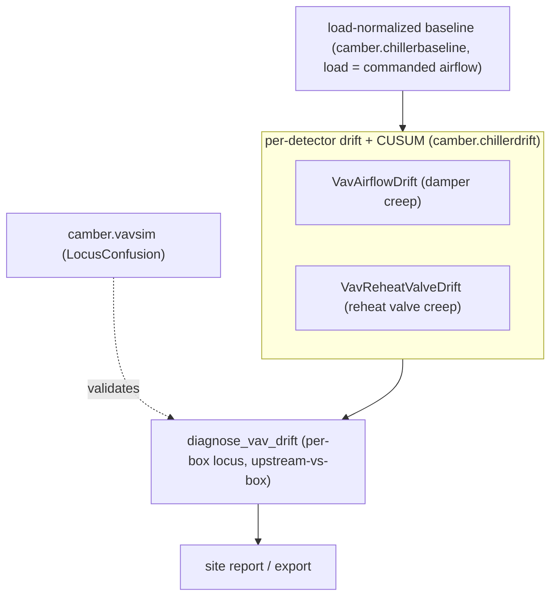

# VAV / zone-terminal drift detection

The chiller ([CHILLER-DRIFT.md](CHILLER-DRIFT.md)), pump ([PUMP-DRIFT.md](PUMP-DRIFT.md)), and AHU
([AHU-DRIFT.md](AHU-DRIFT.md)) families watch the plant and the air handler. The VAV family asks the
same "is this slowly getting worse than it used to be, at matched load?" question of the **zone
terminal** — the VAV box's damper, airflow tracking, and reheat coil — reusing the exact same
load-normalized frozen-baseline engine (`camber.chillerbaseline`, `camber.chillerdrift`), with the
box's own **commanded airflow** as the load normalizer.



*Command-normalized baselines feed the damper- and reheat-valve creep detectors; co-movement rolls up per-box, with vavsim as the physics check.*

Like the other families, each detector is a **period rule** (`Registry.run_periods`), freezes a
load-normalized baseline into a `BaselineStore` on first use, reports a period statistic **and** a
sustained-shift CUSUM alarm, labels its thresholds *screening-grade* / *provisional-untuned*, and
**declines loudly** (never reads healthy) when an instrumented point is missing. They are the
**leading** indicators to the existing instantaneous zone rules (`airflow_tracking`, `reheat_penalty`,
`reheat_minimization_g36`, `overcooling_min_flow`, `unmet_setpoint_hours`) the way the chiller drift
rules lead the static approach check.

## The detector family

| Detector | Signal | Normalizer | Sided | Catches |
|---|---|---|---|---|
| `VavAirflowDrift` | damper position | commanded airflow (cfm) | up | flow-authority loss — a slipping/worn actuator, a stuck linkage, or rising upstream duct-static starvation: the damper **creeps open** to hold the same commanded flow, weeks before `airflow_tracking` sees an undershoot |
| `VavReheatValveDrift` | reheat valve position | reheat duty ≈ airflow × ΔT (cfm·°F) | up | reheat-coil heat-transfer loss — waterside fouling/scale, low HW flow/ΔT, air bypass, or valve-authority loss: the reheat valve **creeps open** to deliver the same reheat, weeks before the box misses setpoint and `reheat_penalty` / `reheat_minimization_g36` see it |

**Airflow tracking is the leading indicator to `airflow_tracking`.** A healthy box drives its damper
to make measured airflow track the commanded airflow setpoint. As the actuator/linkage wears or the
box is starved of upstream static, it spends its **reserve damper authority** — the damper creeps
further open while flow still tracks — so the instantaneous `airflow_tracking` undershoot check sees
nothing until the damper saturates near 100%. `VavAirflowDrift` freezes a `damper ~ f(commanded
airflow)` baseline and scores the current period's damper residual **at matched command**: a creep is
authority loss. It is **one-sided up** (needing *less* damper is an authority gain, not a fault), and
it is the terminal-box analog of the coil-valve-creep → SAT-control relationship.

**The airflow-setpoint confound is neutralized by construction.** A VAV setpoint moves constantly
(Guideline-36 dual-max, zone demand, reset) — but the setpoint **is the load axis** here, so normal
setpoint motion just walks the box along the same frozen curve and scores ~0 residual. (Unlike
`duct_static_drift`, where the confounder is in the metric's own unit and a residual subtraction is
right, here the confounder is the x-axis and the matched-command geometry does the work.)

**Upstream starvation is surfaced, not blamed.** A damper can creep because its own actuator is
failing **or** because upstream duct static is low (an AHU/fan problem). When a building-level
`DUCT_STATIC` point is mapped (via the runner's `shared` channel), the rule reports the concurrent
static shift and caveats a creep that co-moves with a static *fall* (`vav_upstream_starvation_suspected`),
so it never silently blames the box for a plant problem. Reuses only existing roles
(`DAMPER` / `AIRFLOW_SP`; `load_role=AIRFLOW` is a constructor option for boxes without a mapped
setpoint). Freezes under model kind `vav_damper`.

**Reheat-valve creep is the leading indicator to `reheat_penalty` / `reheat_minimization_g36`.** A
box's hot-water reheat coil losing heat-transfer capacity (waterside fouling/scale, low HW flow or
ΔT, air bypass, valve-authority loss) opens its valve **further** to deliver the same reheat — weeks
before it runs out of valve and misses setpoint. `VavReheatValveDrift` freezes a `valve ~ f(reheat
duty)` baseline and scores the current period's valve residual **at matched duty**, one-sided up (a
valve fall is a capacity gain, not a fault). The load is the **reheat duty ≈ airflow × ΔT**, not ΔT
alone: unlike an AHU coil at fixed design airflow, a VAV box's airflow varies (`Q ∝ airflow × ΔT`),
and — contrary to the tempting "G36 pins reheat at min flow" simplification — flow rises toward
heating-max in the high heating loop (exactly the regime `reheat_minimization_g36` flags), so duty is
correct across both regimes while ΔT-alone is confounded. The box's **entering primary air is mapped
to `MIXED_AIR_TEMP`** (the coil-valve heating convention: `warm = SUPPLY_AIR_TEMP` discharge, `cool =
MIXED_AIR_TEMP` entering, ΔT = warm − cool) since the box's own discharge already owns
`SUPPLY_AIR_TEMP`; no new role. A colder **HW-supply reset** is caveated (it needs more valve for the
same reheat), not subtracted. `load_basis="deltat"` is a constructor option for boxes without a
mapped flow. Freezes under model kind `vav_reheat_valve`.

## One per-box verdict

The two detectors fail *independently* (a failing damper actuator and a fouling reheat coil are
different faults) but corroborate when a box is broadly degrading.
`camber.vavdrift.diagnose_vav_drift(findings)` reads them and returns one localized
`VavDriftDiagnosis` — naming each cause, flagging **corroboration** when both agree, and running the
**upstream-vs-box disambiguation** that no single signal can settle (the terminal-box twin of
`diagnose_ahu_drift`'s fan-power disambiguation):

- damper creep **with** `vav_upstream_starvation_suspected` (the creep co-moves with an upstream
  duct-static fall) → the drift is a **plant** symptom — the AHU can't hold static, so the box damper
  creeps open; locus `upstream`, "fix the plant, not the box";
- damper creep **without** it → the box's own flow-authority loss; locus `airflow`;
- reheat-valve creep → reheat coil fouling / HW starvation / valve-authority loss; locus `reheat`
  (a co-moving HW-supply fall is caveated as a possible waterside-reset effect).

It splits the box into an **airflow** (damper authority) and a **reheat** (coil) subsystem, reports a
`locus` (steady · airflow · reheat · upstream · box-wide) with a `box_wide` flag. An `upstream`
verdict is a **plant symptom and is deliberately excluded from `box_wide`** — an AHU static problem
must not read as a broadly-failing box, so `upstream + reheat` resolves to locus `reheat` (with an
upstream caveat), and only `airflow + reheat` (two real box faults) is `box-wide`. Screening-grade;
pure over Findings.

**Surfacing the verdict.** The per-box verdicts flow downstream like the chiller, condenser,
evaporator, pump, and AHU ones: `camber.integrate.export.vav_diagnoses_to_frame` /
`export_vav_diagnoses` write one row per box (locus · severity · box_wide · corroborated · causes ·
caveat count · fingerprint) to CSV/JSON/Parquet, and `camber.report.vav_diagnosis_table` renders a
worst-first HTML table. `build_site_report(..., vav_diagnoses=[...])` splices that table into the
owner-facing site report, alongside the plant, pump, and AHU verdict tables.

## Calibration

Thresholds are constructor arguments (screening-grade); the CUSUM parameters are provisional-untuned.
As with the other families, `camber.driftvalidation` tunes them once labelled VAV-fault periods
exist, and the physics generator `camber.vavsim` characterizes the family end-to-end without a
dataset. Because the diagnosis returns a `locus`, it scores a **`LocusConfusion`** over the five loci
(steady · airflow · reheat · upstream · box-wide) — like `ahusim`/`pumpsim`, not the `CauseConfusion`
of the condenser/evaporator sims.

The generator models a **single two-regime diurnal box**: occupied-daytime cooling (a swept command
+ modulating damper + closed reheat) feeds `VavAirflowDrift`, and night/morning heating (minimum
airflow + a modulating reheat valve) feeds `VavReheatValveDrift` — each detector's gating carves out
its own regime. The **upstream-vs-box disambiguation is directly measured**: `damper_authority_loss →
airflow` and `upstream_starvation → upstream` inject the *same* damper creep, and only the latter also
drops the upstream `DUCT_STATIC` (tripping `vav_upstream_starvation_suspected`); `box_wide → box-wide`.
On clear faults the diagnosis localizes at ~100% with no false alarms on healthy boxes.

**One honest asymmetry:** the airflow detector cleanly re-routes an upstream cause to a distinct
locus, but the reheat detector only *caveats* a hot-water-reset creep (its HW confound is a caveat,
not a locus demotion). So the generator carries a *mild* `hw_reset` as a `steady` negative, and the
fire-with-caveat behavior of a *strong* HW reset is covered by a dedicated test.

```python
from camber.vavsim import make_cases, locus_confusion

lc = locus_confusion(make_cases(), min_severity=3)
print(lc.accuracy, lc.as_dict()["matrix"])
```
