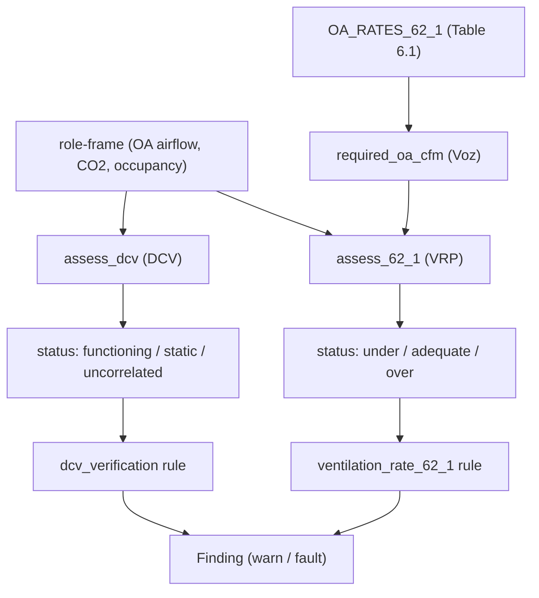

# Ventilation verification — ASHRAE 62.1 VRP & DCV

`camber.ventilation` does the explicit **code-rate** ventilation check that complements the CO₂
*proxy* in [`camber.iaq`](../camber/iaq.py) and the OA-fraction diagnostic in `camber.oafraction`.

- **Ventilation Rate Procedure (VRP)** — is the *delivered* outdoor air at least the ASHRAE 62.1
  requirement for the zone?
- **Demand-Controlled Ventilation (DCV)** — does the outdoor air actually *modulate* with
  occupancy/CO₂, or is it static (DCV not working)?


*Two independent checks: is enough OA delivered (VRP), and does OA modulate with demand (DCV).*

## The VRP requirement

ASHRAE 62.1 sets the zone outdoor-air requirement as

```
Vbz = Rp·Pz + Ra·Az          (people term + area term)
Voz = Vbz / Ez               (corrected for air-distribution effectiveness)
```

`required_oa_cfm(area_sqft, population, *, rp, ra, ez=1.0)` computes `Voz`. The `Rp`/`Ra` rates
come from `OA_RATES_62_1` (62.1 Table 6.1, a public-standard subset) via `oa_rates_for(space_type)`,
or you pass them explicitly.

```python
from camber.ventilation import assess_62_1

# a 2,000 ft² office for 10 people, metering ~120 cfm OA over occupied hours
r = assess_62_1(
    oa_cfm_series,
    area_sqft=2000,
    population=10,
    space_type="office",
    occupied_mask=occ,
    aggregate="median",
)
r.required_cfm  # 170.0   (5·10 + 0.06·2000)
r.status  # "under" -> deficit 50 cfm
```

`measured_oa_cfm` may be a scalar or a time series; a series is filtered by `occupied_mask` and
reduced by `aggregate`. Status is **under** (`ratio < under_tol`), **over** (`ratio > over_factor`,
an energy penalty), or **adequate**.

### Option flags — `assess_62_1`

| flag | default | effect |
|---|---|---|
| `space_type` | — | look up `Rp`/`Ra` from the 62.1 table |
| `rp`, `ra` | from table | override the people / area rates |
| `ez` | `1.0` | zone air-distribution effectiveness (raises the requirement when < 1) |
| `aggregate` | `"median"` | reduce a series: `median`/`mean`/`min`/`p05`/`p95` |
| `occupied_mask` | `None` | restrict a series to occupied hours |
| `under_tol` | `0.9` | flag **under** below this fraction of required |
| `over_factor` | `1.5` | flag **over** above this multiple of required |

## DCV verification

```python
from camber.ventilation import assess_dcv

res = assess_dcv(oa_signal, co2_series, occupied_mask=occ, co2_setpoint=1000)
res.status  # "functioning" | "static" | "uncorrelated" | "insufficient"
res.modulation  # (max-min)/max of the OA signal
res.correlation  # OA vs demand (DCV -> positive)
```

`oa_signal` can be OA flow, OA fraction, or OA-damper position; `demand_signal` is CO₂ or
occupancy. **static** = OA doesn't modulate (fixed OA / DCV off); **uncorrelated** = it modulates
but not with demand. With a `co2_setpoint`, `co2_breach_at_min_pct` reports under-ventilation that
persists while OA is pinned at its minimum.

### Option flags — `assess_dcv`

| flag | default | effect |
|---|---|---|
| `min_corr` | `0.3` | min OA↔demand correlation to call DCV "functioning" |
| `min_modulation` | `0.1` | min OA range `(max-min)/max`; below ⇒ "static" |
| `co2_setpoint` | `None` | also flag CO₂ breaching this while OA is at minimum |
| `occupied_mask` | `None` | restrict to occupied hours |

## Rules

- **`dcv_verification`** (`DemandControlledVentilation`) — config-free, **auto-registered**.
  Uses OA airflow (`Role.OA_AIRFLOW`) or OA-damper position, and CO₂ or occupancy as demand;
  `warn` on static/uncorrelated, `fault` when CO₂ breaches setpoint at minimum OA. Construction
  flags: `min_corr`, `min_modulation`, `co2_setpoint`, `occupied_only`.
- **`ventilation_rate_62_1`** (`VentilationRateProcedure`) — needs the zone's design inputs, so
  it's instantiated explicitly (not auto-registered):

  ```python
  from camber.rules.ventilation_rule import VentilationRateProcedure

  rule = VentilationRateProcedure(area_sqft=2000, population=10, space_type="office")
  finding = rule.analyze("AHU-1", role_frame)  # fault on under-ventilation
  ```

## Scope

This verifies the *rate* from trends; it is not a substitute for a stamped 62.1 ventilation
calculation. The Table 6.1 defaults are a convenience — confirm the zone's category and design
population against the project's mechanical schedule.
