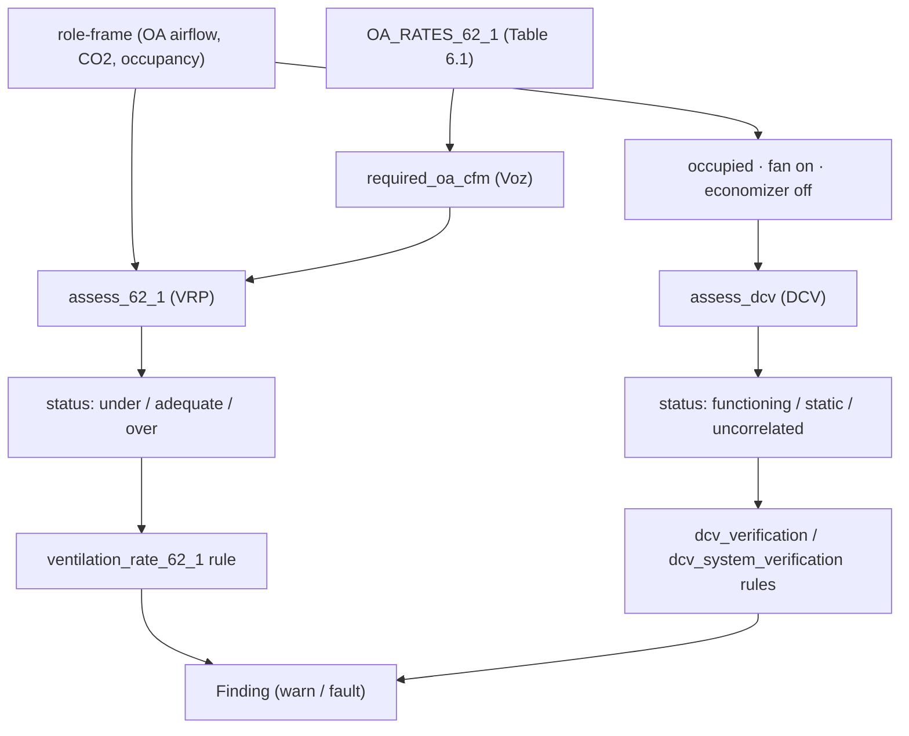

# Ventilation verification — ASHRAE 62.1 VRP & DCV

`camber.ventilation` does the explicit **code-rate** ventilation check that complements the CO₂
*proxy* in [`camber.iaq`](https://github.com/yroussev/camber/blob/main/camber/iaq.py) and the OA-fraction diagnostic in `camber.oafraction`.

- **Ventilation Rate Procedure (VRP)** — is the *delivered* outdoor air at least the ASHRAE 62.1
  requirement for the zone?
- **Demand-Controlled Ventilation (DCV)** — is outdoor air actually *raised* when CO₂ (or
  occupancy) rises, or is it static (DCV not working)?


*Two independent checks: is enough OA delivered (VRP), and does OA modulate with demand (DCV).*

## The VRP requirement

ASHRAE 62.1 sets the zone outdoor-air requirement as

```
Vbz = Rp·Pz + Ra·Az          (people term + area term)
Voz = Vbz / Ez               (corrected for air-distribution effectiveness)
```

`required_oa_cfm(area_sqft, population, *, rp, ra, ez=1.0)` computes `Voz`. The `Rp`/`Ra` rates
come from `OA_RATES_62_1` (62.1 Table 6.1, a public-standard subset) via `oa_rates_for(space_type)`,
or you pass them explicitly.

```python
from camber.ventilation import assess_62_1

# a 2,000 ft² office for 10 people, metering ~120 cfm OA over occupied hours
r = assess_62_1(
    oa_cfm_series,
    area_sqft=2000,
    population=10,
    space_type="office",
    occupied_mask=occ,
    aggregate="median",
)
r.required_cfm  # 170.0   (5·10 + 0.06·2000)
r.status  # "under" -> deficit 50 cfm
```

`measured_oa_cfm` may be a scalar or a time series; a series is filtered by `occupied_mask` and
reduced by `aggregate`. Status is **under** (`ratio < under_tol`), **over** (`ratio > over_factor`,
an energy penalty), or **adequate**.

### Option flags — `assess_62_1`

| flag | default | effect |
|---|---|---|
| `space_type` | — | look up `Rp`/`Ra` from the 62.1 table |
| `rp`, `ra` | from table | override the people / area rates |
| `ez` | `1.0` | zone air-distribution effectiveness (raises the requirement when < 1) |
| `aggregate` | `"median"` | reduce a series: `median`/`mean`/`min`/`p05`/`p95` |
| `occupied_mask` | `None` | restrict a series to occupied hours |
| `under_tol` | `0.9` | flag **under** below this fraction of required |
| `over_factor` | `1.5` | flag **over** above this multiple of required |

## DCV verification

```python
from camber.ventilation import assess_dcv, economizer_active_mask

econ, basis = economizer_active_mask(idx, econ_cmd=econ_cmd)  # or oat= + heat_valve=
res = assess_dcv(
    oa_signal, co2_series, occupied_mask=occ, economizer_mask=econ, co2_setpoint=1000, oa_floor=720
)
res.status  # "functioning" | "static" | "uncorrelated" | "insufficient"
res.reason  # why "insufficient" (see the table below)
res.demand_lift  # CO₂ when OA was raised minus CO₂ when OA sat at its floor
```

`oa_signal` can be OA flow, OA fraction, or OA-damper position. `demand_signal` is one of three
kinds, detected automatically (`demand_kind="auto"`) or stated:

| kind | what it is | lift threshold |
|---|---|---|
| `co2` | zone CO₂, ppm | `min_lift_ppm` (50 ppm) |
| `presence` | anything within 0..1 — an occupancy point, or its hourly mean | `min_lift_occupancy` (0.2) |
| `count` | occupant count: non-negative, below any plausible CO₂ | `min_lift_people` (1 person) |

Until 0.82.0 anything not strictly 0/1 was read as CO₂, so an occupant count, or a presence point
averaged to 10-minute means, was filtered out as implausible CO₂ and the verdict came back
`too_few_samples` with no hint why.

### Which samples are judged

DCV is only responsible for OA some of the time, so the rest is excluded before anything is judged:

- **Unoccupied** — outside `occupied_mask`. The rules build it from the schedule AND-ed with a
  trended `OCCUPANCY` point, minus `WARMUP` / `COOLDOWN`.
- **Fan off or in transition** — `SUPPLY_FAN_STATUS` below 0.95 (an hourly mean below 1 is a
  partial hour whose OA mean is diluted).
- **Economizing** — an air handler's OA damper follows `max(economizer, DCV minimum)`, so while it
  economizes OA tracks outdoor temperature, not CO₂. `economizer_active_mask` finds those samples
  from the best evidence available: a trended `ECON_CMD` (any nonzero hourly mean counts); else
  `OAT` + `HEAT_VALVE` (a sequenced SAT loop holds OA at minimum while heating, and the high limit
  locks the economizer out above 75 °F — the top of the ASHRAE 90.1 fixed dry-bulb range, so it
  excludes *more* hours when unsure); else `OAT` alone; else nothing, which the rule caveats.
- **OA closed** — at or below 2% of its 95th percentile. DCV never shuts OA fully while a space is
  occupied (62.1 keeps an area-based floor), so a closed damper inside the occupied window is
  warm-up, a fan transition or a fault. Left in, an un-flagged morning warm-up closure made a
  stuck DCV look like it responded. Reported as `closed_pct`.

### The verdict

A DCV controller maps demand to OA: a proportional reset raises OA as CO₂ climbs past its engage
level; an integral loop raises OA only once CO₂ reaches setpoint and holds it there. Either way,
**the samples where OA is raised are the samples where demand is high**. So `assess_dcv` compares
CO₂ when OA is raised (above 25% of its robust p5–p95 range) with CO₂ when OA sits at its floor
(within 5%) — `demand_lift`.

Conditioning on OA rather than on CO₂ matters for integral control: a PI loop holds CO₂ just under
setpoint with OA at its floor much of the time, so "OA when CO₂ is high" is mostly the floor, while
"CO₂ when OA was raised" stays high. The comparison is median-based, so a few outliers do not move
it, and it reads in ppm. The Pearson correlation the check used before is still reported as
`correlation`, as a diagnostic only. An integral loop weakens it (0.48–0.66 in simulation, against
0.92–0.99 for a proportional reset) without breaking it; what actually broke the old check was the
economizer, closed-damper samples and outliers, described above.

| status | when |
|---|---|
| **insufficient** | too few samples; demand never varied; CO₂ never reached the engage level (`co2_setpoint − 200`, else 800 ppm) where DCV should respond; or OA was raised too rarely to compare. Not evidence either way — a lightly occupied building is not a broken DCV |
| **static** | demand reached the DCV range and OA did not move (robust modulation < `min_modulation`) |
| **functioning** | `demand_lift` ≥ `min_lift_ppm` (occupancy: ≥ `min_lift_occupancy`) |
| **uncorrelated** | OA modulates, but not upward with demand |

**Occupancy demand is judged within each hour of day** (weekdays and weekends apart). Occupancy
follows the clock, and so does a valve on a time clock or a damper doing thermal duty, so a plain
comparison credits a schedule with "responding to occupancy". Only outdoor air that is higher on
busier days *at the same hour* counts. Outdoor air that is never both raised and at its floor
within one hour reads `insufficient` with `reason="schedule_confounded"`. `raised_when_vacant_pct`
reports how often OA was raised with the space empty. An occupancy-based verdict is still weaker
than a CO₂ one: a supply that rises with occupants' heat gain in a 100% outdoor-air system
genuinely ventilates more per person, and occupancy data alone cannot say whether a thermostat
or a DCV loop did it.

Sub-checks, each `None` when it cannot be evaluated:

- `co2_breach_at_min_pct` (needs `co2_setpoint`) — share of judged samples with CO₂ above setpoint
  while OA is at its floor: under-ventilation the DCV is not answering.
- `below_floor_pct` (needs `oa_floor`, same units as the OA signal) — OA below the floor, over
  **every** occupied sample: it is measured before the economizer and closed-damper exclusions,
  because an economizer only raises OA and a damper shut while occupied is the deepest
  below-floor case there is. (Until 0.82.0's real-data pass it ran after them, and a wildfire
  damper closure vanished into "not judged".) For 62.1 dynamic reset the floor is the area
  component `Ra·Az` (§6.2.7; numbering varies by edition). For a multiple-zone system the true
  intake floor is higher than `ΣRa·Az`, so this under-flags — the safe direction.
- `excess_at_low_demand_pct` (needs `oa_floor`) — share of low-CO₂ samples with OA held above the
  floor: DCV installed but not saving energy, the reason it exists (ASHRAE 90.1 §6.4.3.8).

### Option flags — `assess_dcv`

| flag | default | effect |
|---|---|---|
| `occupied_mask` | `None` | restrict to occupied samples |
| `economizer_mask` | `None` | exclude (possibly) economizing samples — see `economizer_active_mask` |
| `co2_setpoint` | `None` | sets the engage level and enables the breach sub-check |
| `dcv_engage_ppm` | setpoint − 200, else 800 | CO₂ by which DCV should already be raising OA |
| `min_modulation` | `0.1` | min robust OA range `(p95−p5)/p95`; below ⇒ "static" |
| `min_lift_ppm` | `50` | min `demand_lift` (CO₂) for "functioning" |
| `min_lift_occupancy` | `0.2` | min `demand_lift` (presence fraction) for "functioning" |
| `min_lift_people` | `1.0` | min `demand_lift` (occupant count) for "functioning" |
| `demand_kind` | `"auto"` | `co2` / `presence` / `count`, or detect |
| `min_demand_span` | `150` | min CO₂ p90−p10 to judge at all |
| `oa_floor`, `floor_tol` | `None`, `0.10` | floor for the floor sub-checks |
| `min_samples`, `min_bin` | `24`, `6` | sample gates for the verdict and each bin |
| `closed_frac` | `0.02` | OA at or below this share of its p95 is "closed" |
| `min_corr` | — | **deprecated** (0.82), ignored; warns |

## Rules

- **`dcv_verification`** (`DemandControlledVentilation`) — config-free, **auto-registered**. Runs
  on equipment carrying both an OA signal (`OA_AIRFLOW`, else `OA_DAMPER`) and CO₂ — an air handler
  with a return-air CO₂ sensor, or a single-zone unit. A VAV zone's frame (CO₂, no OA) returns
  nothing; the fleet rule covers it. Severity: `ok` functioning; `warn` static, or uncorrelated
  with the economizer excluded; `info` insufficient, or uncorrelated when the economizer could not
  be excluded (OA may be following outdoor temperature); `warn` when OA sits above the floor on
  ≥ `excess_warn_pct` of low-demand samples; `fault` when the breach or below-floor share reaches
  `breach_fault_pct` / `below_floor_fault_pct`. Flags: `co2_setpoint`, `dcv_engage_ppm`,
  `min_modulation`, `min_lift_ppm`, `econ_high_limit_f`, `oa_floor_cfm` (a number, or
  `{equip: cfm}`), the three thresholds, `occupied_only`.

  **Occupied hours:** a trended `OCCUPANCY` point *replaces* the schedule (so a 24/7 space isn't
  cut to a weekday window); otherwise `start_hour` / `end_hour` / `occupied_days` (default
  Mon–Fri 07–18). **Unventilated while occupied:** samples inside the occupied hours with CO₂ ≥
  `unventilated_co2_ppm` (default `co2_setpoint`, else 1100 ppm) and the fan off or the OA shut
  are reported as `unventilated_high_co2_hours` / `_pct`, and are a `fault` once they add up to
  `unventilated_fault_hours` (4 h). The verdict itself judges modulation, not outages, so without
  this a lecture theatre at its CO₂ sensor's full scale with the fan off read "not judged".
  CAMBER temperatures are °F: when the economizer is inferred from OAT and nearly every sample is
  excluded, the finding says an OAT in °C would do that.
- **`dcv_system_verification`** (`DcvSystemVerification`) — the fleet twin, **auto-registered**.
  Most buildings put CO₂ on the zones and OA on the air handler, so no single frame has both. This
  groups zones to their serving air handler through the served-by topology — each zone's
  *nearest ancestor that carries an OA signal*, so a Brick chain air handler → VAV → zone works
  (semantic, or the naming heuristic `run_fleet` builds — which caps severity at `warn`), drops zone CO₂ that is implausible,
  stuck flat, or stays more than 300 ppm above outdoor when unoccupied, takes the per-timestamp
  **maximum** (the critical zone should drive the reset; `agg="mean"` is available) and judges each
  air handler as above. With no usable grouping and exactly one OA source, all zones join it, with
  a caveat; with several, unattributed zones are declined rather than guessed. One finding, with a
  `per_ahu` breakdown.
- **`ventilation_rate_62_1`** (`VentilationRateProcedure`) — needs the zone's design inputs, so
  it's instantiated explicitly (not auto-registered):

  ```python
  from camber.rules.ventilation_rule import VentilationRateProcedure

  rule = VentilationRateProcedure(area_sqft=2000, population=10, space_type="office")
  finding = rule.analyze("AHU-1", role_frame)  # fault on under-ventilation
  ```

## Validation and limits

The verdict logic is tested against `camber.faultlab.dcv_sim`, a well-mixed zone CO₂ mass balance
(`V·dC/dt = N·G − Q·(C − C_out)`) under proportional, integral and static DCV with an economizer,
warm-up closures and a fan schedule — and, since 0.82.0, against open real-building data
(licence-clean, not vendored; datasets cited by DOI):

| Data | What it establishes |
|---|---|
| Lab room running a known DCV law, 3 + 6 L/s per person (Zenodo 10.5281/zenodo.18299691, CC BY) | `functioning` on CO₂ (lift 392 ppm), on the occupant count and on the controller's own occupancy estimate. The CO₂ mass balance closes at 5.3–5.8 mL/s per person, close to the 5.0 mL/s (0.0105 cfm) the simulator assumes for a sedentary adult |
| Three office rooms, camera counts + VAV damper (data descriptor doi:10.1038/s41597-019-0274-4, CC0) | `functioning` on counts in all three (lift 2–20 people within the hour); on CO₂ one room, the other two never reached the engage level |
| Office building with no DCV, 4 rooftop units, 11 CO₂ zones, Brick model (Dryad 10.7941/D1N33Q) | `insufficient` on every unit — never a false `functioning` (specificity); all 11 zones attributed through the Brick air handler → VAV → zone chain; the 2020 wildfire damper closure is a below-floor `fault` on the two units that fell under the 62.1 requirement and not on the two that stayed above it |
| Lecture theatre, fan speed + two CO₂ sensors (Zenodo 10.5281/zenodo.3406555, CDLA-Permissive) | `fault`: 110 occupied hours with the fan off and CO₂ at the sensor's 2000 ppm full scale |
| Rooms with a schedule-driven ventilation valve (github energietransitie/b4b-windesheim, CC BY) | not `functioning` on presence once the lift is taken within the hour — a time clock is not DCV |

- Without `ECON_CMD` the economizer state is inferred, and the OAT-only fallback discards all mild
  weather — expect `insufficient` more often. That is the honest answer, not a defect.
- Damper position is not OA flow; the floor sub-checks need `OA_AIRFLOW` in cfm.
- Return-air CO₂ averages the zones and dilutes the critical one.
- A fixed OA damper on a variable-speed supply fan moves OA flow with fan speed, and fan speed
  tends to follow occupancy through cooling load — that can mimic DCV. Not detected.
- The fleet rule's `max` aggregation follows the worst trusted zone sensor; the plausibility, stuck
  and unoccupied-offset guards remove the obvious bad ones, not all.

## Scope

This verifies the *rate* from trends; it is not a substitute for a stamped 62.1 ventilation
calculation. The Table 6.1 defaults are a convenience — confirm the zone's category and design
population against the project's mechanical schedule.
