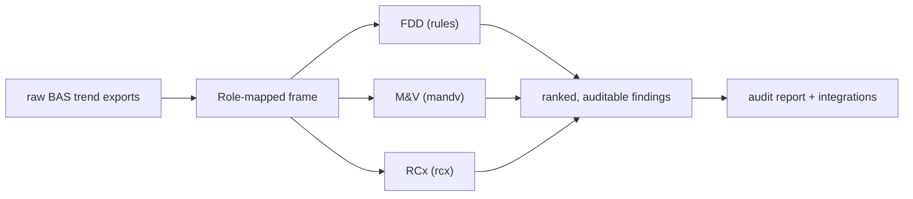

# CAMBER

**Vendor-neutral building-automation-system trend analysis — fault detection & diagnostics (FDD),
measurement & verification (M&V), and retro-commissioning (RCx).**

CAMBER turns raw BAS trend exports into ranked, auditable findings. It is vendor-neutral (every
diagnostic runs on a `Role`-mapped frame, not vendor tags), clean-room (each method cites a public
standard; every rule ships a synthetic fixture), dependency-light (stdlib + numpy / pandas / pyarrow
/ matplotlib), and **read-only toward the BAS/OT**.

*One `Role`-mapped frame feeds every diagnostic; findings are ranked, cited, and exportable.*

- **New here?** Start with the **[Capabilities reference](CAPABILITIES.md)** — every capability, its
  key API, the option flags that tune it, and the standard it cites, grouped by layer.
- **How it fits together:** the **[Architecture](ARCHITECTURE.md)** and the
  **[Ecosystem](ECOSYSTEM.md)** (fork-vs-depend) pages.
- **Install:** `pip install camber-toolkit` (imports as `camber`); a multi-arch container image is
  at `ghcr.io/yroussev/camber`.

## By layer

- **Analytics** — [M&V](MANDV.md) · [Streaming / online](STREAMING.md) · [Forecasting](FORECAST.md)
  · [Grid-interactive (GEB)](GEB.md) · [Carbon](CARBON.md) · [Ventilation](VENTILATION.md) ·
  [Visualization](VISUALIZATION.md)
- **Platform** — [Ingest protocols](INGEST-PROTOCOLS.md) · [Ontology / interop](ONTOLOGY.md) ·
  [Integrations](INTEGRATIONS.md) · [Plugins](PLUGINS.md) · [Fault lifecycle](FAULT-LIFECYCLE.md) ·
  [Scale](SCALE.md) · [Deployment](DEPLOY.md) · [Security](SECURITY.md) · [Validation](VALIDATION.md)

See the [roadmap](https://github.com/yroussev/camber/blob/main/ROADMAP.md) for what's planned.
