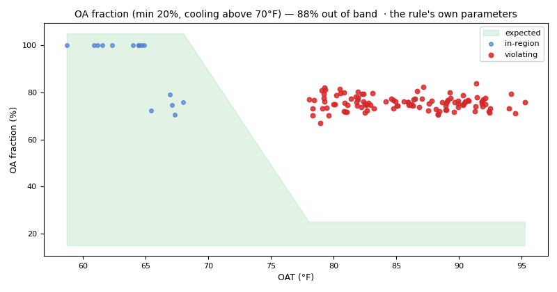

# Economizer: a stuck outdoor-air damper and missed free cooling

*Workbook exercise `air-economizer` · PNNL re-tuning chapter 6 · about 45 minutes*

## Goal

Find the air handlers whose outdoor-air damper is stuck, tell a damper stuck **open** from one
stuck **closed**, and see what each costs: too much outdoor air in hot weather, or free cooling
lost in cool weather. Then score CAMBER against the dataset's published fault labels, and read
the same rules on a real air handler whose history you know.

## Learn more

Read these first (PNNL, free):

- [Air-Side Economizer Operation][pnnl-guide-economizer], the re-tuning guide: its two
  questions, whether the outdoor-air damper is open when outdoor conditions are not favorable
  and whether the cooling coil runs during economizer mode, are the two halves of this exercise.
  Read it with the unit's own sequence in mind: "favorable" is whatever the sequence says it is,
  including the outdoor temperature below which it locks the economizer out (step 5).
- [Chapter 6: Economizer Operations][pnnl-retuning-ch6] of the re-tuning training.
- [AHU Minimum Outdoor-Air Operation][pnnl-guide-min-oa], for why the unit's own design minimum
  matters.

[pnnl-guide-economizer]: https://www.pnnl.gov/sites/default/files/media/file/pnnl_sa_86706.pdf "Building Re-Tuning Training Guide: Air-Side Economizer Operation (PNNL-SA-86706)"
[pnnl-retuning-ch6]: https://www.pnnl.gov/sites/default/files/media/file/ch6_economizer.pdf "Large Commercial Buildings: Re-tuning for Efficiency, chapter 6: Economizer Operations: Pre-Re-Tuning and Re-Tuning (PNNL-SA-85063)"
[pnnl-guide-min-oa]: https://www.pnnl.gov/sites/default/files/media/file/pnnl_sa_88958.pdf "Building Re-Tuning Training Guide: AHU Minimum Outdoor-Air Operation (PNNL-SA-88958)"

## Datasets and licence

- **`lbnl-sdahu`**: LBNL's simulated single-duct VAV air handler (cooling coil, dry-bulb
  economizer), a year at one-minute resolution, as a fault-free run plus labelled faulted runs.
  Licence **CC-BY-4.0** (open; cite it). Its default subset is about 600 MB to download.
  The catalog lists the problems found in the published data and how CAMBER handles each:
  see [its data issues](../DATASETS.md#lbnl-sdahu-lbnl-simulated-single-duct-ahu-labelled-faults).

- **`irish-ahu`**: five and a half years of 15-minute BMS trends from one real mixing-box air
  handler at an industrial site in Ireland, with no fault labels but two documented events: its
  outdoor-air damper was held 100 % open as a COVID-19 precaution until 2021-12-02, and both
  coil valves were replaced on 2022-05-01. Licence **CC-BY-4.0** (open; cite it). About 22 MB.
  See [its data issues](../DATASETS.md#irish-ahu-irish-industrial-ahu-real-bms-trends-unlabelled).

Each LBNL run becomes one piece of equipment, `AHU__<run>`, in the facility `ds-lbnl-sdahu`:
`AHU__fault_free`, the damper stuck at 10, 25, 75 and 100 % (`AHU__damper_stuck_010` ...
`AHU__damper_stuck_100_short`), and a cooling-coil valve leak (`AHU__coi_leakage_010`). The
Irish unit is `AHU__ahu` in `ds-irish-ahu`.

## Setup

### In the lab

1. Run `camber lab` and open `http://127.0.0.1:8765/lab`.
2. Tick `lbnl-sdahu` and `irish-ahu` and press **Fetch & ingest**.
3. When the job is done, the row links to **trends** (the trend viewer) and **report** (the
   dataset's default config). This exercise uses its own config: use the command line for step 2
   of the steps below, and the lab's trend viewer to look at the data. The `irish-ahu` row's
   **report** runs that dataset's default config, which step 7 uses.

### On the command line

```
camber datasets fetch lbnl-sdahu
camber datasets ingest lbnl-sdahu --store lab_store
camber datasets config lbnl-sdahu --exercise air-economizer --store lab_store --out econ.json
camber run econ.json --out econ_out
camber datasets score lbnl-sdahu --store lab_store --findings econ_out/findings.json
camber datasets fetch irish-ahu
camber datasets ingest irish-ahu --store lab_store
camber datasets config irish-ahu --store lab_store --out irish.json
camber run irish.json --out irish_out
```

The exercise's config (`--exercise air-economizer`) runs three rules: `outdoor_air_fraction`,
`economizer_high_limit` and `free_cooling_missed`, with this unit's own design minimum (a 1.6 %
outdoor-air fraction) and its fixed 60 °F dry-bulb high limit. It leaves out one more setting
of the unit's sequence on purpose: step 5 has you find it. `camber report econ.json --out
econ.html` gives the same findings as a report with evidence charts.

The Irish unit's default config (`irish.json`) runs the same three economizer rules with a
minimum calibrated from the unit's own minimum-position months (a 4.1 % outdoor-air fraction)
and a differential dry-bulb changeover, plus its coil rules; the unit trends no fan status, so
the rules judge every sample.

## Steps

1. **Look before you judge.** In the trend viewer, open `AHU__fault_free` and
   `AHU__damper_stuck_075`. Compare the outdoor-air damper command with the mixed-air
   temperature on a hot afternoon and on a cold morning.
2. **Run the exercise's config** (the commands above) and read the findings `camber run` prints.
3. **Stuck open.** For each run, find the `outdoor_air_fraction` finding: the median
   outdoor-air fraction in cooling weather, and the share of cooling hours above the minimum.
   Then find `economizer_high_limit`: is the unit locked out to minimum above 60 °F?
4. **Stuck closed.** Find `free_cooling_missed` for each run: the share of free-cooling hours
   (outdoor air below 60 °F, supply fan running) in which the cooling coil ran anyway. Hours
   with the fan off are not judged: `n_masked_fan_off` counts them.
5. **The fault-free unit's fault.** `free_cooling_missed` also reports a **fault** on
   `AHU__fault_free`, the healthy unit. Before you write it up, find out when those hours
   happen:
   - In the trend viewer, open `AHU__fault_free` on a cold weekday in January. Read the outdoor
     air temperature, the outdoor-air damper command and the cooling valve together while the
     fan runs. Then do the same on a mild spring morning.
   - In the finding, read `missed_cause` and `missed_damper_cmd_median_pct`: where was the damper
     commanded during the missed hours?
   - Read the unit's sequence: `camber datasets info lbnl-sdahu` lists, under its known issues,
     the outdoor temperatures between which the dataset's inventory says the economizer runs.

   Below its low limit the sequence holds the damper at its minimum by design (typically to keep
   freezing air off the coils), so those hours are not free-cooling weather. Add the lockout to
   the rule in `econ.json`, `"low_limit_f": 33.8` in `free_cooling_missed`'s `params`, re-run
   with a new `--out` folder, and read the fault-free unit and the stuck dampers again: the
   healthy unit should now read clean.
   `low_limit_excluded_hours` counts the hours the rule set aside, and `low_limit_cooling_hours`
   how many of them had the coil running.
6. **Score.** Run `camber datasets score` on the findings and read the per-detector rates.
7. **A real unit.** Run the Irish config and read `outdoor_air_fraction`,
   `economizer_high_limit` and `free_cooling_missed` on `AHU__ahu`. In the trend viewer, find
   the months when the damper was held fully open.

## Questions

1. Which runs does CAMBER flag for too much outdoor air, and how much outdoor air do they bring
   in during cooling weather?
2. What outdoor-air fraction does the fault-free unit run at in cooling weather? Its annual
   median is much higher. Why is that not a fault?
3. Which stuck dampers do the outdoor-air-fraction rules miss, and why?
4. Where do those dampers show up instead? Compare them with the fault-free unit.
5. Why does `free_cooling_missed` report a fault on the fault-free unit? What share of its missed hours
   fall below the economizer's low limit, what does the rule read with `low_limit_f` set, and
   are the stuck dampers still caught?
6. What true- and false-positive rates does the label score give `outdoor_air_fraction`, and
   what does the overall score count as missed?
7. What do the three economizer rules say about the Irish unit? Which of it would you raise as
   a fault, and which as a question for the site?
8. Is the Irish unit's excess outdoor air explained by the documented 100 % outdoor-air period?
   How would you check with CAMBER?

## What CAMBER shows

- **Findings.** `camber run` prints one line per finding with its severity (`fault`, `warn`,
  `ok`); `econ_out/findings.json` holds every metric, e.g. `median_oaf_cooling` and
  `excess_oa_pct` for `outdoor_air_fraction`, `not_locked_out_pct` for `economizer_high_limit`,
  `missed_pct` and `missed_cause` for `free_cooling_missed`. With `low_limit_f` set,
  `free_cooling_missed` also reports `low_limit_excluded_hours` and `low_limit_cooling_hours`,
  and its summary line says how many hours below the lockout it did not judge.
- **Evidence.** In the report, the `outdoor_air_fraction` finding carries a chart of the
  outdoor-air fraction against the outdoor temperature, drawn from the samples the rule judged,
  with the band it judges them against.
- **Score.** `camber datasets score` prints the true- and false-positive rates, with 95 %
  intervals, for the dataset's declared detectors, and which rules fired on each labelled run.



*Synthetic illustration, not this exercise's dataset: the `outdoor_air_fraction` evidence chart for a damper stuck about 75 % open. The band is the rule's own minimum and changeover; red points are the cooling-weather samples it counts as excess outdoor air.*

## Caveats

- The data are simulated: one unit, one climate, one control sequence. Real dampers stick part
  way, drift, or stick only in some weather.
- The outdoor-air fraction here comes from a temperature balance (mixed, return and outdoor
  air); it is unreliable when the outdoor and return temperatures are close, and CAMBER leaves
  those samples out.
- The low limit is a property of this unit's sequence, not a general value: another unit may
  lock out at a different temperature, or not at all. Set it from the unit's own sequence, or
  from a winter of known-good trends (the outdoor temperature below which the damper command
  never leaves its minimum), never to make a finding go away.
- The 100 % damper run is shorter than the others (`_short`), so it has fewer free-cooling
  hours.
- The simulated schedule runs one weekday late; see the dataset's data issues.
- The Irish unit is real and unlabelled: its findings are hypotheses to check with the site, not
  scored detections. Ireland rarely reaches cooling weather, so the "cooling weather" samples
  (outdoor air above 70 °F) are few.

## Going further

- Re-run with the dataset's default config (`camber datasets config lbnl-sdahu --store
  lab_store --out sdahu.json`) and compare what it reports.
- Try a generic 20 % design minimum in `econ.json` (`min_oa_pct`) and see which verdicts change.
- The spliced run `AHU__onset_damper_stuck_025` switches from fault-free to a stuck damper part
  way through the year: can you see when, in the trend viewer?
- Split the Irish record by period: add `"start"` and `"end"` to the `source` block of
  `irish.json` (for example before 2020-03 and from 2020-08 to 2021-12) and re-run.
