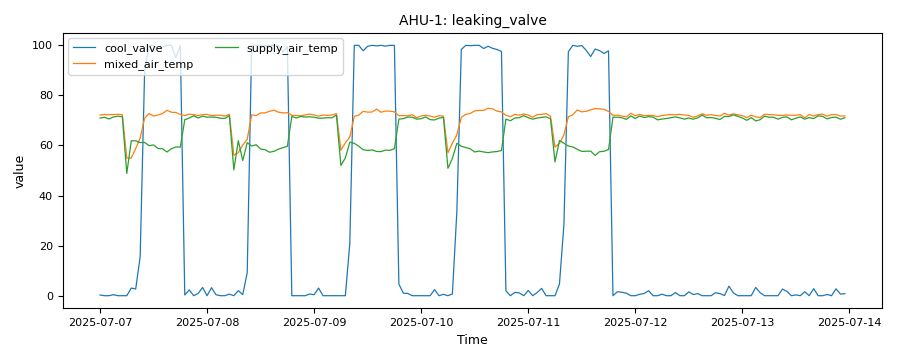

# Heating and cooling at the air handler: a leaking valve, and coils that fight

*Workbook exercise `air-heat-cool` · PNNL re-tuning chapter 5 · about 45 minutes*

## Goal

Look for heating and cooling energy spent against each other at the air handler: a cooling
valve that passes chilled water while it is commanded shut, and heating and cooling coils open
at the same time. Learn to tell a real fault from a design that heats and cools on purpose (a
dual-duct unit, or dehumidification with reheat), and see how a margin set from the unit's own
fan heat catches a small leak that a generic margin misses, and what that calibration costs.

## Learn more

Read these first (PNNL, free):

- [AHU Heating and Cooling Control][pnnl-guide-ahu-heat-cool], the re-tuning guide: its
  questions ask whether the heating and cooling coils are ever active together and whether the
  valves shut off fully. This exercise answers both from trends.
- [Chapter 5: Air Handling Units][pnnl-retuning-ch5] of the re-tuning training, for the valve
  and coil trends to collect.

[pnnl-guide-ahu-heat-cool]: https://www.pnnl.gov/sites/default/files/media/file/pnnl_sa_88359.pdf "Building Re-Tuning Training Guide: AHU Heating and Cooling Control (PNNL-SA-88359)"
[pnnl-retuning-ch5]: https://www.pnnl.gov/sites/default/files/media/file/ch5_air_handling.pdf "Large Commercial Buildings: Re-tuning for Efficiency, chapter 5: Air Handling Units: Pre-Re-Tuning and Trending and Re-Tuning (PNNL-SA-85063)"

## Datasets and licence

- **`lbnl-sdahu`**: LBNL's simulated single-duct VAV air handler (cooling coil only), a year at
  one-minute resolution, with a labelled cooling-valve leak run. Licence **CC-BY-4.0** (open;
  cite it). About 600 MB to download. The published leak "severities" turned out to be one
  10 % leak: see
  [its data issues](../DATASETS.md#lbnl-sdahu-lbnl-simulated-single-duct-ahu-labelled-faults).
- **`lbnl-ddahu`**: LBNL's simulated dual-duct air handler (a hot deck and a cold deck), a year
  at one-minute resolution. Licence **CC-BY-4.0** (open; cite it). About 1.8 GB to download.
  See [its data issues](../DATASETS.md#lbnl-ddahu-lbnl-simulated-dual-duct-ahu-labelled-faults).
- **`irish-ahu`**: five and a half years of 15-minute BMS trends from one real air handler with
  heating and cooling coils and a leaving-air sensor after each. Licence **CC-BY-4.0** (open;
  cite it). About 22 MB. See
  [its data issues](../DATASETS.md#irish-ahu-irish-industrial-ahu-real-bms-trends-unlabelled).

The equipment used: `AHU__fault_free` and `AHU__coi_leakage_010` in `ds-lbnl-sdahu`,
`DDAHU__fault_free` in `ds-lbnl-ddahu`, and `AHU__ahu` in `ds-irish-ahu`.

## Setup

### In the lab

1. Run `camber lab` and open `http://127.0.0.1:8765/lab`.
2. Tick `lbnl-sdahu`, `lbnl-ddahu` and `irish-ahu` and press **Fetch & ingest**.
3. The `lbnl-sdahu` and `irish-ahu` rows' **report** links run their default configs, which
   this exercise uses; the dual-duct part has its own config, run from the command line.

### On the command line

```
camber datasets fetch lbnl-sdahu lbnl-ddahu irish-ahu
camber datasets ingest lbnl-sdahu lbnl-ddahu irish-ahu --store lab_store
camber datasets config lbnl-sdahu --store lab_store --out sdahu.json
camber run sdahu.json --out sdahu_out
camber datasets score lbnl-sdahu --store lab_store --findings sdahu_out/findings.json
camber datasets config lbnl-ddahu --exercise air-heat-cool--lbnl-ddahu --store lab_store --out hc_dd.json
camber run hc_dd.json --out hc_dd_out
camber datasets config irish-ahu --store lab_store --out irish.json
camber run irish.json --out irish_out
```

- `leaking_valve` looks at the hours when the fan runs and every coil valve is commanded shut.
  Then the supply air should be the mixed air plus the supply fan's heat. By default it calls a
  cooling leak when the air leaves more than 3 °F *below* the mixed air, and a heating leak when
  it leaves more than 3 °F above the mixed air plus a 2 °F fan-heat allowance. Where a coil has
  its own leaving-air sensor, that sensor is used instead of the supply air.
- The `lbnl-sdahu` config does not use the default cooling test. It sets
  `measured_fan_heat_f: 1.0` (this unit's fan heat, measured on its fault-free run),
  `cool_delta_thr_f: 1.0` and `occupied_only: true`: a cooling leak is supply air that sits
  below the mixed air, in occupied hours. Read the config's comment for where the 1.0 °F came
  from.
- `simultaneous_heat_cool` counts the occupied hours with both coil valves open, after setting
  aside the hours it can show are dehumidification with reheat (a cooling coil running below
  the entering air's dew point, followed by reheat).

## Steps

1. **Look first.** In the trend viewer, plot `AHU__fault_free` and `AHU__coi_leakage_010` on a
   cool spring day: the cooling-valve command, the mixed-air and the supply-air temperature.
2. **Run the three configs** and read the findings.
3. **The leak.** Read `leaking_valve` on both single-duct runs: the severity, `chw_leak_pct`,
   `chw_median_delta_f` (the median supply-minus-mixed-air temperature with the valve shut),
   `cool_shift_f` and the caveat. Then run `camber datasets score` and read the `leaking_valve`
   line. Read the `_comment` and the `basis` of `leaking_valve` in `sdahu.json`.
4. **Both coils open.** Read `simultaneous_heat_cool` on `DDAHU__fault_free`, and its caveat.
5. **A real unit.** Read `simultaneous_heat_cool` and `leaking_valve` on the Irish unit, and
   which temperature each coil was judged on.

## Questions

1. Does CAMBER flag the leaking cooling valve? What does the label score say?
2. Compare `chw_median_delta_f` on the leak run and the fault-free run. What does the difference
   tell you? Why would the rule's default 3 °F margin not call it a leak, and what in the config
   makes it one? Which run was the 1.0 °F measured on, and what does that do to the fault-free
   run's **ok**?
3. The dual-duct unit has both valves open for a large share of its occupied hours. Is that
   coil fighting? What does the rule's caveat ask you for?
4. How would you tell dehumidification with reheat from coils fighting, on a unit that has a
   single air stream? Which trends would you ask for?
5. What do the rules say about the Irish unit's two coils, and which sensors did they use?

## What CAMBER shows

- **Findings.** `leaking_valve` reports `hw_leak_pct`, `chw_leak_pct`, `n_both_closed`,
  `chw_median_delta_f` / `hw_median_delta_f` and which temperature judged each coil;
  `simultaneous_heat_cool` reports `simultaneous_hc_pct`, how often each valve was open, and the
  dehumidification shares it set aside.
- **Score.** `camber datasets score` prints the true- and false-positive rates for the dataset's
  declared detectors, and which rules fired on each labelled run.
- **Caveats.** Both rules say what they could not check (a missing coil sensor, a missing
  humidity or dew point, a missing fan signal). Read them before the verdict.



*Synthetic illustration, not this exercise's dataset: the `leaking_valve` evidence trend. With the cooling valve at 0 %, the supply air still leaves several degrees colder than the mixed air: the coil passes chilled water.*

## Caveats

- One simulated leak, one size: the four published leak "severities" are byte-identical copies
  of one 10 % leak, so there is no severity sweep to learn a threshold from.
- The single-duct unit has no heating coil, so it cannot show simultaneous heating and cooling;
  the dual-duct unit shows it by design; the Irish unit is real but unlabelled.
- The Irish unit runs around the clock and trends no fan status, so its leak check includes any
  fan-off samples.
- The rules' default margins (3 °F, the 2 °F fan-heat allowance) are screening judgments. A
  smaller margin would catch a smaller leak and also more sensor noise.
- The config's 1.0 °F fan heat was measured on `AHU__fault_free`, which the label score also
  counts as a negative: its clean verdict is in-sample. On your own unit, measure the fan heat
  on one known-good period and judge another.

## Going further

- The Irish unit's valves were replaced on 2022-05-01. Add `"start"` / `"end"` to the `source`
  block of `irish.json` and compare the leak check before and after the replacement.
- Replace the `leaking_valve` entry in `sdahu.json` with the plain `"leaking_valve"` (the
  defaults) and run again: the leak goes back to **ok**.
- Calibrate out of sample: add `"start": "2018-01-01", "end": "2018-07-01"` to the `source`
  block, read the fault-free run's `chw_median_delta_f`, then judge July to December with that
  value as `measured_fan_heat_f`.
- The exercise `air-economizer` uses the same single-duct runs for the outdoor-air damper.
