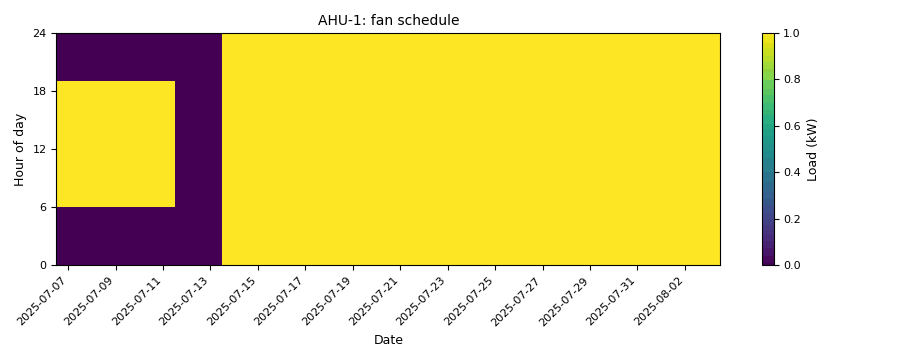

# Scheduling: 24/7 operation, night setback and after-hours fan energy

*Workbook exercise `air-scheduling` · PNNL re-tuning chapter 5 · about 35 minutes*

## Goal

Compare one building run two ways: around the clock, and with a night setback. Find out whether
CAMBER can tell a fan that never stops from one that cycles at night only to hold the setback
temperature, and measure what the setback saves in after-hours fan energy.

## Learn more

Read these first (PNNL, free):

- [Occupancy Scheduling][pnnl-guide-occupancy-scheduling], the re-tuning guide on night and
  weekend setback and supply-fan cycling during unoccupied hours: its questions ask whether the
  units run when the building is empty, and whether the fans cycle to hold a setback rather than
  run continuously.
- [Chapter 5: Air Handling Units][pnnl-retuning-ch5] of the re-tuning training, for scheduling
  as a re-tuning measure.

[pnnl-guide-occupancy-scheduling]: https://www.pnnl.gov/sites/default/files/media/file/pnnl_sa_85194.pdf "Building Re-Tuning Training Guide: Occupancy Scheduling: Night and Weekend Temperature Set back and Supply Fan Cycling during Unoccupied Hours (PNNL-SA-85194)"
[pnnl-retuning-ch5]: https://www.pnnl.gov/sites/default/files/media/file/ch5_air_handling.pdf "Large Commercial Buildings: Re-tuning for Efficiency, chapter 5: Air Handling Units: Pre-Re-Tuning and Trending and Re-Tuning (PNNL-SA-85063)"

## Datasets and licence

- **`ornl-frp-ops`**: ORNL's two-storey research office (one DX rooftop unit and ten VAV boxes
  with electric reheat), measured at one-minute resolution for about a week per operating
  scenario. Licence **CC-BY-4.0** (open; cite it). The default subset, the heating-season
  baseline and night-setback tests, is about 14 MB. See
  [its data issues](../DATASETS.md#ornl-frp-ops-ornl-frp-2-multizone-office-one-rtu-and-ten-vav-boxes-under-seven-operating-scenarios).

The equipment used: the rooftop unit of each test, `RTU__base_heating` (the 24/7 baseline) and
`RTU__sb_heating` (the night setback), in `ds-ornl-frp-ops`. The tests' schedule is occupied
07:00-22:00 every day; the setback test turns the unit off from 22:00 to 07:00 with a 15.6 °C
(60.1 °F) heating setback.

## Setup

### In the lab

1. Run `camber lab` and open the URL it prints (`http://127.0.0.1:8765/lab?token=...`).
2. Tick `ornl-frp-ops` and press **Fetch & ingest**.
3. When the job is done, the row links to **trends** and **report**. This exercise uses the
   dataset's default config, so the report shows its findings.

### On the command line

```
camber datasets fetch ornl-frp-ops
camber datasets ingest ornl-frp-ops --store lab_store
camber datasets config ornl-frp-ops --store lab_store --out ops.json
camber run ops.json --out ops_out
```

The config runs two rules on each rooftop unit at one-minute resolution:

- `night_weekend_setback` compares the supply fan's runtime in unoccupied and occupied hours.
  When the fan does run at night, it then asks whether it *cycles* (runs part of each hour) and
  whether the space it serves sits at the setback temperature rather than at daytime comfort; a
  unit with no zone sensor is judged on its return air while the fan runs.
- `compressor_short_cycle` counts the DX compressor's starts per day.

## Steps

1. **Look first.** In the trend viewer, plot each unit's supply-fan status and return-air
   temperature over two nights.
2. **Run the config** and read the findings.
3. **Setback.** Read `night_weekend_setback` on both units: `fan_run_unoccupied_pct`,
   `setback_basis`, `unoccupied_duty_when_running_pct`, `zone_temp_unoccupied_f` and
   `zone_temp_occupied_f`.
4. **Compressor.** Read `compressor_short_cycle`: `starts_per_day` and `runtime_pct`.
5. **After-hours energy.** Average each unit's supply-fan power (`power`, kW) by hour of day
   and add up the hours from 22:00 to 07:00: the fan's energy in an average night. In Python:

   ```python
   from camber.loadprofile import daily_profile
   from camber.store import ParquetStore

   store = ParquetStore("lab_store")
   for unit in ("RTU__base_heating", "RTU__sb_heating"):
       frame = store.read_role_frame(facility_id="ds-ornl-frp-ops", equip=unit)
       profile = daily_profile(frame["power"])
       print(unit, profile[(profile.index < 7) | (profile.index >= 22)].sum(), "kWh")
   ```

## Questions

1. What does CAMBER say about the 24/7 baseline's night operation?
2. In the setback test the fan still runs during a large share of the night. Why does CAMBER call
   the setback effective anyway? Which evidence decides it?
3. How much supply-fan energy does an average night use in each test?
4. The compressor short-cycles in both tests. Is scheduling the fix? What is?
5. What would you have to know before promising the night saving to a building owner?

## What CAMBER shows

- **Findings.** `night_weekend_setback` reports the unoccupied and occupied runtime, the verdict
  basis (`runtime`, or `held_setback` when the fan cycles to hold the setback), the fan's duty in
  the night hours it runs, and the return-air temperatures it compared; `compressor_short_cycle`
  reports starts per day against a 12-a-day threshold.
- **Caveats.** With no trended occupancy the rule uses the schedule in the config (07:00-22:00,
  every day), and says so.
- **Report.** `camber report ops.json --out ops.html` shows the findings as a report; add `--layout rcx` for the printable RCx report with evidence charts.



*Synthetic illustration, not this exercise's dataset: the `night_weekend_setback` evidence carpet of the supply-fan status. The first week follows a weekday schedule; from the second the fan runs nights and weekends.*

## Caveats

- The building was unoccupied during the tests, with no internal gains: the "daytime" load is
  the envelope alone.
- The two tests ran in different weeks (the baseline in March 2021, the setback in January
  2022), so the weather differs. The night-energy comparison is not a weather-normalized saving.
- Only the supply fan's power is mapped for the energy step; the compressor and the electric
  reheat also run at night in the setback test.
- The return air stands in for the space temperature: it reads the rooms only while the fan
  runs.

## Going further

- Fetch the `full` subset: it adds the cooling-season baseline and setback, a morning pre-heat
  and free-float tests. Compare the cooling-season setback verdict with the heating one.
- Change `start_hour` / `end_hour` in `ops.json` to a normal office day (07:00-18:00) and see how
  the verdicts change: the schedule you judge against matters.
- Whole-building meters show the same thing at the scale of a campus: the practice exercises use
  `bdg2` for load profiles and after-hours base load.
