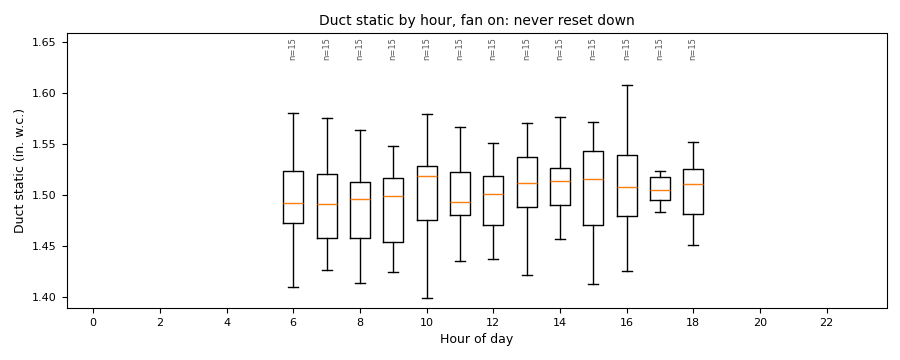

# Duct static pressure: a fixed setpoint and the damper census

*Workbook exercise `air-static-pressure` · PNNL re-tuning chapter 5 · about 40 minutes*

## Goal

Find out whether an air handler's duct static-pressure setpoint is reset, and use the terminal
boxes' damper positions to judge whether the static it holds is higher than the zones need. A
static setpoint held high all day makes the supply fan work against boxes that are throttling
the extra pressure away.

## Learn more

Read these first (PNNL, free):

- [AHU Static Pressure Control][pnnl-guide-static-pressure], the re-tuning guide: its questions
  ask whether the static setpoint is reset, and whether the terminal dampers show the static is
  too high or too low. Each half of this exercise answers one of them.
- [Chapter 5: Air Handling Units][pnnl-retuning-ch5] of the re-tuning training, for the
  static-pressure trends and the damper-position census.

[pnnl-guide-static-pressure]: https://www.pnnl.gov/sites/default/files/media/file/pnnl_sa_84187.pdf "Building Re-Tuning Training Guide: AHU Static Pressure Control (PNNL-SA-84187)"
[pnnl-retuning-ch5]: https://www.pnnl.gov/sites/default/files/media/file/ch5_air_handling.pdf "Large Commercial Buildings: Re-tuning for Efficiency, chapter 5: Air Handling Units: Pre-Re-Tuning and Trending and Re-Tuning (PNNL-SA-85063)"

## Datasets and licence

- **`lbnl-sdahu`**: LBNL's simulated single-duct VAV air handler, a year at one-minute
  resolution, fault-free plus labelled faulted runs. Licence **CC-BY-4.0** (open; cite it).
  About 600 MB to download. Its static-pressure points have two published problems, both
  handled at ingest: see
  [its data issues](../DATASETS.md#lbnl-sdahu-lbnl-simulated-single-duct-ahu-labelled-faults).
- **`ornl-frp-vav`**: a real two-storey test building at ORNL, one rooftop unit and ten VAV
  boxes logged at one-minute resolution, one day per test scenario. Licence **CC-BY-4.0**
  (open; cite it). About 8 MB. See
  [its data issues](../DATASETS.md#ornl-frp-vav-ornl-multi-zone-vav-terminal-faults-real-building-labelled).

The equipment used: `AHU__fault_free` (and the faulted runs) in `ds-lbnl-sdahu`, and the ten
boxes `RTU_VAV_<room>__d3_fault_free` of the fault-free test day in `ds-ornl-frp-vav`. The LBNL
units do not trend their zone boxes' dampers, and the ORNL rooftop unit does not trend its static
setpoint, which is why the exercise needs both datasets.

## Setup

### In the lab

1. Run `camber lab` and open `http://127.0.0.1:8765/lab`.
2. Tick `lbnl-sdahu` and `ornl-frp-vav` and press **Fetch & ingest**.
3. Use each row's **trends** link to look at the data; the exercise's own configs are run from
   the command line.

### On the command line

```
camber datasets fetch lbnl-sdahu ornl-frp-vav
camber datasets ingest lbnl-sdahu ornl-frp-vav --store lab_store
camber datasets config lbnl-sdahu --exercise air-static-pressure --store lab_store --out sp.json
camber run sp.json --out sp_out
camber datasets config ornl-frp-vav --exercise air-static-pressure--ornl-frp-vav --store lab_store --out census.json
camber run census.json --out census_out
```

- `sp.json` runs `static_pressure_reset`: does the trended static setpoint move, on enough
  days, and with the supply airflow, as a trim-and-respond reset would?
- `census.json` runs `damper_census` over the ten boxes of one test day: each box's median
  damper opening in occupied hours, and the share of boxes throttling below 50 % open or pinned
  at 90 % and above.

## Steps

1. **Look first.** In the trend viewer, plot `AHU__fault_free`'s duct static setpoint and its
   supply airflow for a week. Then plot two or three ORNL boxes' damper positions on the
   fault-free day.
2. **Run both configs** and read the findings.
3. **The setpoint.** Read `static_pressure_reset` on `AHU__fault_free`: `sp_range_inwc`,
   `sp_median_inwc` and `sp_behaviour`. Then look for the same rule on a faulted run such as
   `AHU__damper_stuck_075`.
4. **The census.** Read `damper_census`: `n_boxes`, `median_damper_pct`, `pct_boxes_low`,
   `pct_boxes_high` and `occupancy_gate`, and the verdict line.

## Questions

1. Is the single-duct unit's static setpoint reset? What value does it hold?
2. Why is there no static-pressure finding at all on the faulted single-duct runs?
3. What does the damper census say about the ORNL building's duct static on the fault-free day,
   and what would you propose?
4. What else, besides a static setpoint that is too high, could leave every box throttled in
   this building?

## What CAMBER shows

- **Findings.** `static_pressure_reset` reports the setpoint's range and median, the number of
  days it moved and the driver it was checked against; `damper_census` is one finding for the
  whole group of boxes (`<fleet>`), with the per-group shares.
- **Data issues.** `camber datasets info lbnl-sdahu` lists how the published static points were
  corrected at ingest; `camber datasets info ornl-frp-vav` lists the test days whose duct static
  collapsed.
- **Report.** `camber report sp.json --out sp.html` shows the same findings with evidence charts.



*Synthetic illustration, not this exercise's dataset: the RCx report's air-distribution chart, duct static by hour of day on fan-on samples. One flat band at every hour is a static setpoint that is never trimmed back at light load.*

## Caveats

- The single-duct unit is a simulation with a fixed sequence: a flat setpoint is its design, and
  the exercise asks what re-tuning would change.
- The ORNL tests are research tests, one day each: only the box under test was actively
  controlled, and the publisher advises treating the other rooms' data as supplementary (see
  `camber datasets info ornl-frp-vav`). Read the census as a screening signal for this day, not a
  verdict on the building's design.
- `damper_census` judges each box's occupied hours from the box's own trended occupancy point (the
  tests ran 07:00-22:00 every day), so a weekend test day gets a census too. A box with no
  occupancy trended falls back to CAMBER's assumed weekday 07:00-18:00 schedule; the finding's
  `occupancy_gate` says which applied (`trended occupancy`, the assumed schedule, or `mixed`).
- The census pools the boxes you give it. Mixing boxes from different air handlers, or different
  test days, mixes different static pressures.

## Going further

- Point the census at a stuck-damper day, for example the boxes of `d3_stuck_080`, or of
  `d3_stuck_000`, a weekend day (edit the `equip` list in `census.json`), and compare it with the
  fault-free day.
- `camber datasets info ornl-frp-vav` describes five test days in other subsets where the static
  collapsed; fetch the `full` subset and run the census on one of them.
- The exercise `air-sat-reset` looks at the other reset an air handler should have.
