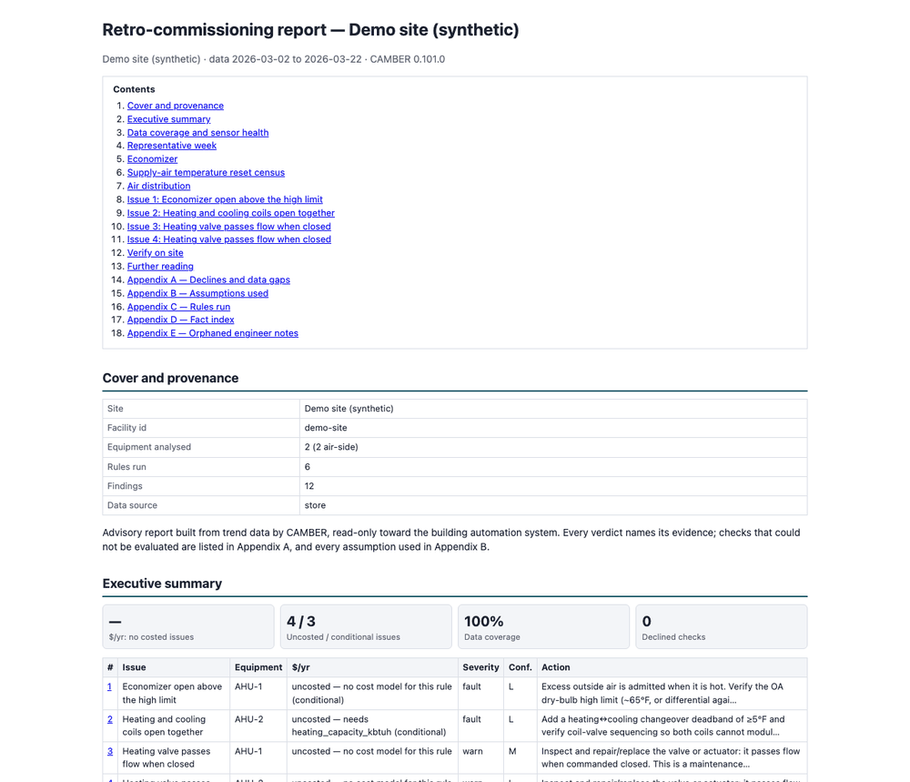

# Capstone: RCx report, walk-down, re-tuning plan and verification

*Workbook exercise `capstone` · PNNL re-tuning chapters 9 and 10 · about 2 hours*

## Goal

Run a re-tuning project end to end on open data. Build the RCx report for an air handler whose
outdoor-air damper sticks part way through the year, turn its issues into a walk-down checklist
and a re-tuning plan, then verify: with drift detection on the fault-onset series, and with a
before-and-after test of a scheduling measure, where you will also find out what M&V a
one-week test can and cannot support.

## Learn more

Read these first (PNNL, free):

- [Air-Side Economizer Operation][pnnl-guide-economizer], the re-tuning guide behind the report's
  economizer issue.
- [Chapter 9: Building Walk Down][pnnl-retuning-ch9] of the re-tuning training: what to look at
  on site, and how the walk-down feeds the re-tuning.
- [Chapter 10: Re-Tuning Building Controls and Systems][pnnl-retuning-ch10]: making the changes
  and checking that they hold.

[pnnl-guide-economizer]: https://www.pnnl.gov/sites/default/files/media/file/pnnl_sa_86706.pdf "Building Re-Tuning Training Guide: Air-Side Economizer Operation (PNNL-SA-86706)"
[pnnl-retuning-ch9]: https://www.pnnl.gov/sites/default/files/media/file/ch9_building_walkdown.pdf "Large Commercial Buildings: Re-tuning for Efficiency, chapter 9: Building Walk Down (PNNL-SA-85063)"
[pnnl-retuning-ch10]: https://www.pnnl.gov/sites/default/files/media/file/ch10_retuning_building.pdf "Large Commercial Buildings: Re-tuning for Efficiency, chapter 10: Re-Tuning Building Controls and Systems (PNNL-SA-85063)"

## Datasets and licence

- **`lbnl-sdahu`**: LBNL's simulated single-duct VAV air handler, a year at one-minute
  resolution. Licence **CC-BY-4.0** (open; cite it). About 600 MB to download. See
  [its data issues](../DATASETS.md#lbnl-sdahu-lbnl-simulated-single-duct-ahu-labelled-faults).
  CAMBER splices two of its runs into a **fault-onset series**, `AHU__onset_damper_stuck_025`:
  the fault-free run until 2018-07-01, then the run with the outdoor-air damper stuck at 25 %.
  `AHU__fault_free` is its control.
- **`ornl-frp-ops`**: a real multizone office test building at ORNL, one rooftop unit and ten
  VAV boxes, run through designed operating tests at one-minute resolution. Licence **CC-BY-4.0**
  (open; cite it). About 14 MB. See
  [its data issues](../DATASETS.md#ornl-frp-ops-ornl-frp-2-multizone-office-one-rtu-and-ten-vav-boxes-under-seven-operating-scenarios).
  The default subset holds the heating **baseline** test (`RTU__base_heating`, the unit on around
  the clock) and the heating **setback** test (`RTU__sb_heating`), about a week each in different
  winters; they play "before" and "after" a scheduling measure.

## Setup

### In the lab

1. Run `camber lab` and open `http://127.0.0.1:8765/lab`.
2. Tick `lbnl-sdahu` and `ornl-frp-ops` and press **Fetch & ingest**.
3. Use **trends** to look at `AHU__onset_damper_stuck_025` around 1 July, and at the two RTU
   tests at night. The runs below use the command line.

### On the command line

```
camber datasets fetch lbnl-sdahu
camber datasets fetch ornl-frp-ops
camber datasets ingest lbnl-sdahu ornl-frp-ops --store lab_store
camber datasets config lbnl-sdahu --exercise capstone --store lab_store --out cap.json
camber run cap.json --out cap_out
camber report cap.json --layout rcx --out cap_rcx.html
```

The exercise config runs the economizer rules with this unit's own design minimum and high
limit, and `free_cooling_missed` with the economizer low-limit lockout you found in the
[economizer exercise](air-economizer.md) (`low_limit_f` 33.8), plus the supply-air and
static-pressure rules, on the onset series and its control; read its `_comment`. **Write the RCx report before you freeze drift baselines**: once they exist,
`camber run` and `camber report` fold the drift verdicts in. Then, for verification:

```
camber drift freeze cap.json
camber drift run cap.json
camber datasets config ornl-frp-ops --store lab_store --out ornl.json
camber run ornl.json --out ornl_out
```

The drift section freezes a baseline on January to June and scores July to December. For the
M&V attempt on the RTU tests, in Python:

```python
from camber.mandv.caltrack import caltrack_savings_hourly
from camber.model.roles import Role
from camber.store import ParquetStore

store = ParquetStore("lab_store")


def hourly(equip, role):
    frame = store.read_role_frame(facility_id="ds-ornl-frp-ops", equip=equip, resample="1h")
    return frame[role]


caltrack_savings_hourly(
    hourly("RTU__base_heating", Role.POWER),
    hourly("WEATHER__base_heating", Role.OAT),
    hourly("RTU__sb_heating", Role.POWER),
    hourly("WEATHER__sb_heating", Role.OAT),
)
```

## Steps

1. **Read the report.** Open `cap_rcx.html`. Read the executive summary: every issue's rank,
   equipment, severity, confidence and action. Open each issue page, the data-coverage page and
   Appendix A (declines and data gaps).
2. **Build the walk-down checklist.** Before you read the report's **Verify on site** section,
   write your own from the rest of the report. Collect:
   - every recommended action that asks you to check or verify something in the field;
   - every *conditional* issue: the point it depends on is a sensor or setpoint to verify;
   - every confidence line that says the rule used defaults because no site parameter was
     configured: a design value to confirm on site (minimum outdoor air, high limit, setpoints);
   - anything in Appendix A that only a site visit can settle.
   For each item write what to look at, where, and what result would confirm or clear it. Then
   compare yours with the generated section: sensors first, then equipment, then design values
   the checks assumed, then points the checks lacked. What did it list that you missed, and what
   does your list have that a template cannot know?
3. **Write the re-tuning plan.** For each issue you keep after the walk-down, one line: the
   change, who makes it, what could go wrong, how you will verify it (which CAMBER check, which
   window) and what result counts as done. Order it: sensors first, then the equipment, then
   the sequences.
4. **Verify by drift.** Run `camber drift freeze` and `camber drift run`. Read each unit's
   locus, severity and the economizer signal.
5. **Verify a scheduling measure.** Run `ornl.json`. Compare `night_weekend_setback` and
   `compressor_short_cycle` between the baseline and setback tests. Then run the M&V snippet.

## Questions

1. Which issue does the report rank first, on which unit, at what severity and confidence? None
   of the issues has a cost here: what puts this one above the other warns? What cause does its
   heading name, what evidence in the `free_cooling_missed` finding supports that cause
   (`missed_cause`, `commanded_open_pct`), and what should the walk-down still confirm before
   anything is repaired?
2. How often did the onset unit run mechanical cooling in free-cooling weather, against the
   control? Why is a damper stuck for half the year only a warn over the whole year, and why do
   the outdoor-air-fraction rules stay quiet on it?
3. Which issue is *conditional*, on what, and with what trust? What goes on the walk-down list
   for it?
4. Write your walk-down checklist and your re-tuning plan (steps 2 and 3). How does your
   checklist compare with the report's **Verify on site** section?
5. What does drift report for the onset unit and for the control? How would you use the same
   frozen baseline after the damper is repaired?
6. What do the setback verdicts say before and after the scheduling measure, and did the
   measure fix the compressor's short cycling (starts per day before and after)?
7. What does CAMBER say when asked for an hourly M&V saving from the two RTU tests? What would
   a defensible measurement of this measure need?

## What CAMBER shows

- **RCx report** (`--layout rcx`): the ranked issues with severity, confidence and "why we
  believe this", cost or "uncosted" with the reason, the recommended action, conditional and
  dependent notes; data coverage and sensor trust; the economizer page; the **Verify on site**
  walk-down checklist (per issue: what to look at, which point, what would confirm or refute
  it; linked to PNNL Re-tuning chapter 9); Appendix A's declines.
- **Findings** (`cap_out/findings.json`): `free_cooling_missed`'s `missed_pct` and why the free
  cooling was missed (`missed_cause`: the damper was commanded open but did not deliver outside
  air, or the economizer never commanded it open; `commanded_open_pct`), the
  outdoor-air-fraction and high-limit verdicts, the supply-air and static-pressure checks.
- **Drift** (`camber drift run`): one verdict per unit with its `locus` (`outdoor-air`, `steady`
  ...), severity and each detector's signal; the threshold notes printed with it.
- **ORNL findings**: `night_weekend_setback` (fan runtime and, when the fan cycles, the held
  setback temperature) and `compressor_short_cycle` (`starts_per_day`, `runtime_pct`).
- **M&V**: `caltrack_savings_hourly` either returns a saving with its band or refuses, saying
  why. A refusal for too little baseline data also says what data is needed: the exception's
  `need` attribute (`e.need["text"]`) gives the hours required, available and still missing.



*Synthetic data: the opening of an RCx report (`--layout rcx`) for a two-AHU demo site: the contents, the cover and the executive summary's issue table.*

## Caveats

- `free_cooling_missed` judges the whole year: a damper that sticks on 1 July shares its
  free-cooling hours with six healthy months, so the yearly share understates it. Drift, which
  compares the two halves, is the check built for an onset.
- The onset series is a splice of two simulations, not one unit breaking; the "before" and
  "after" are perfect twins except for the damper.
- The damper and valve points map to the controller's demand signals, so the command keeps
  moving while the damper is stuck: that is what drift sees, and also why the command alone would
  never show the fault. The report's cause comes from setting the command against the
  mixed-air temperature.
- Drift thresholds are screening-grade and its timing parameters untuned; a drift verdict ranks
  equipment for a walk-down, it does not dispatch a repair.
- The ORNL tests were run in different winters, a week each; a before-and-after comparison of
  them is not weather-normalized.
- The report's recommended actions are generic; the walk-down decides what applies.

## Going further

- In a copy of `cap.json`, point `drift.store` at a new file and narrow `drift.current` to one
  week of July, then one week of December: does drift see the stuck damper as early as it sees
  it late?
- Add `report.loads` sizing to `cap.json` (see [RCx report](../RCX-REPORT.md)) and see which
  issues get a cost.
- Use `camber report cap.json --layout rcx --notes-template notes.json` to write your walk-down
  findings into the report as engineer's notes: the `section:verify` slot holds the walk-down's
  results next to the generated checklist.
