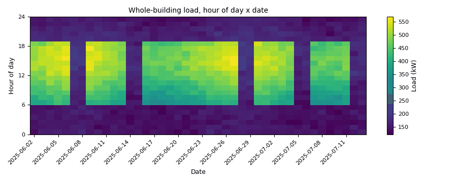

# Energy charting: load profiles, base load and weather dependence

*Workbook exercise `data-energy-charting` · PNNL re-tuning chapter 4 · about 45 minutes*

## Goal

Read whole-building meters the way a re-tuning engineer does before touching a controller:
weekday against weekend, night and weekend base load against the working day, the flatness of
the load, and how much of it the weather explains. Four meters at one campus and two university
buildings in Spain make the contrasts: a building that follows its schedule, one that never
sets back, one that should not set back, and a cooling load that tracks the weather.

## Learn more

Read these first (PNNL, free):

- [Chapter 4: Trend Data Collection and Analysis][pnnl-retuning-ch4] of the re-tuning training:
  the whole-building charts and metrics this exercise builds.
- [Occupancy Scheduling][pnnl-guide-occupancy-scheduling], the re-tuning guide on night and
  weekend setback: what a meter that never drops at night is telling you.

[pnnl-retuning-ch4]: https://www.pnnl.gov/sites/default/files/media/file/ch4_pre-re-tuning.pdf "Large Commercial Buildings: Re-tuning for Efficiency, chapter 4: Pre-Re-Tuning Phase: Trend Data Collection and Analysis (PNNL-SA-85063)"
[pnnl-guide-occupancy-scheduling]: https://www.pnnl.gov/sites/default/files/media/file/pnnl_sa_85194.pdf "Building Re-Tuning Training Guide: Occupancy Scheduling: Night and Weekend Temperature Set back and Supply Fan Cycling during Unoccupied Hours (PNNL-SA-85194)"

## Datasets and licence

- **`bdg2`**: the Building Data Genome 2, hourly whole-building meters from campuses, 2016-2017.
  Licence **CC-BY-SA-4.0** (open; cite it; an adaptation you redistribute keeps the licence).
  The default subset is about 270 MB. See
  [its data issues](../DATASETS.md#bdg2-building-data-genome-2-whole-building-meters).
- **`valladolid-uva`**: two university buildings in Valladolid, Spain, hourly electricity
  2016-2020, with the publisher's daily temperature. Licence **CC-BY-4.0** (open; cite it). About
  6 MB. See
  [its data issues](../DATASETS.md#valladolid-uva-valladolid-university-buildings-hourly-whole-building-electricity-2016-2020).

The meters used: at the BDG2 site Fox (facility `ds-bdg2-fox`), the lodging building's
electricity and chilled water (`Fox_lodging_Stephen__electricity`,
`Fox_lodging_Stephen__chilledwater`) and an assembly building's electricity
(`Fox_assembly_Audrey__electricity`); in Valladolid (facility `ds-valladolid-uva`), `UVA_A`
(the Faculty of Science) and `UVA_B` (the Faculty of Economics). All figures are for calendar
2016.

## Setup

### In the lab

1. Run `camber lab` and open `http://127.0.0.1:8765/lab`.
2. Tick `bdg2` and `valladolid-uva` and press **Fetch & ingest**.
3. Open **trends** for each meter: zoom to a week in March, then to a whole year.

### On the command line

```
camber datasets fetch bdg2
camber datasets fetch valladolid-uva
camber datasets ingest bdg2 valladolid-uva --store lab_store
camber datasets config bdg2 --facility ds-bdg2-fox --store lab_store --out fox.json
camber run fox.json --out fox_out
camber datasets config valladolid-uva --store lab_store --out uva.json
camber run uva.json --out uva_out
```

Both configs are the datasets' own templates: a daily change-point baseline (energy against the
day's mean outdoor temperature) for every meter over 2016, judged against the G14 acceptance
tiers. That is this exercise's weather-dependence chart in numbers. The load-shape metrics come
from CAMBER's Python API, on the same store:

```python
from camber.demand import analyze_demand, baseload_anomaly
from camber.loadprofile import weekday_weekend_profiles
from camber.model.roles import Role
from camber.store import ParquetStore

store = ParquetStore("lab_store")
kw = store.read_role_frame(facility_id="ds-valladolid-uva", equip="UVA_A")[Role.POWER]
kw = kw.loc["2016"]
weekday, weekend = weekday_weekend_profiles(kw)  # mean load by hour of day
print(weekend.max() / weekday.max())
print(baseload_anomaly(kw).summary)  # out-of-hours vs weekday 07-18 load
d = analyze_demand(kw)
print(d.load_factor, d.baseload_frac)  # mean / peak, 5th percentile / peak
```

Swap the facility and equipment ids for the other meters (Fox is `ds-bdg2-fox`).

## Steps

1. **Look first.** In the trend viewer, put one March week of `UVA_A` beside the same week of
   `Fox_assembly_Audrey__electricity`. Say what you expect each metric below to show before you
   compute it.
2. **Weekday against weekend.** Run `weekday_weekend_profiles` on `UVA_A`, `UVA_B` and
   `Fox_assembly_Audrey__electricity`; compare the weekend peak with the weekday peak.
3. **Night and weekend base load.** Run `baseload_anomaly` on the four electricity meters: it
   compares the load outside weekday 07:00-18:00 with the load inside it.
4. **Load shape.** Run `analyze_demand` on `Fox_lodging_Stephen__electricity` and `UVA_B`: the
   load factor (mean over peak) and the base-to-peak ratio (5th percentile over peak).
5. **Weather dependence.** Read the `mv_baseline` findings in `fox_out/findings.json` and
   `uva_out/findings.json`: the model form (`2P`, `3PC`, `3PH`, `4P`), R² and CV(RMSE), and
   whether the baseline meets the G14 tier.

## Questions

1. Which buildings drop at weekends, and by how much does `UVA_A`'s weekend peak fall short of
   its weekday peak? Which building does not drop?
2. Which meters does `baseload_anomaly` call a fault, and at what out-of-hours ratio? For which
   of them is a ratio near 1 the right answer, and why?
3. Which building has the flatter load, the lodging or `UVA_B`? Give both load factors.
4. What change-point model does the lodging's chilled-water baseline choose, and how much of the
   daily variation does the weather explain? Compare the same building's electricity.
5. `UVA_A`'s all-days daily baseline explains very little and fails G14. What does its load
   profile tell you is missing from a temperature-only model?

## What CAMBER shows

- **`mv_baseline` findings** (`camber run`): the model form, `r2`, `cv_rmse`, `nmbe`, `accept`
  and the temperature range the model is fitted on, per meter.
- **`weekday_weekend_profiles`**: two 24-value hour-of-day profiles.
- **`baseload_anomaly`**: occupied and unoccupied means, their ratio, and a severity (`warn` at
  0.6, `fault` at 0.8: CAMBER's thresholds, not a standard's).
- **`analyze_demand`**: peak, average, load factor, 5th-percentile base load and its share of
  the peak, and the monthly peaks.
- Charts of the same views: `camber.charts.loadprofile_chart` (weekday and weekend profiles,
  load-duration curve), see [Visualization](../VISUALIZATION.md).



*Synthetic illustration, not this exercise's dataset: a load carpet, hour of day against date. Each weekday shows the occupied block; the one weekend that runs a weekday schedule stands out at once.*

## Caveats

- The occupied window is a default (weekdays 07:00-18:00); a lodging building has no
  unoccupied hours, so its "fault" is the metric's, not the building's.
- The Fox meters are from a US campus in the BDG2 set; building use comes from the published
  names only. Check a meter's data issues before trusting its clock.
- A daily change-point model on all days mixes working days, weekends and holidays in one cloud;
  the `mv-baselines` exercise adds an occupied-day driver.
- The Valladolid temperature is the publisher's daily reanalysis value, not a site sensor.

## Going further

- Plot `load_duration_chart` for the lodging and for `UVA_B` and read where their base loads
  sit.
- Run `camber datasets config bdg2 --facility ds-bdg2-robin ...` and repeat questions 2 and 4
  on another site.
- Continue with [`mv-baselines`](mv-baselines.md), where an occupied-day driver and chaining
  turn these baselines into savings.
