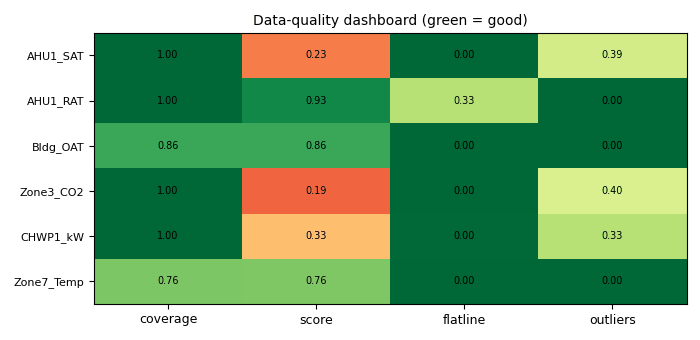

# Are the trends good enough? Point coverage and sensor health

*Workbook exercise `data-trend-quality` · PNNL re-tuning chapters 3 and 4 · about 60 minutes*

## Goal

Before you judge a single sequence, judge the data. Check which of the points a re-tuning
analysis needs each unit actually trends, then let CAMBER's sensor-health layer find the points
you should not believe: a copied point, a mixed-air sensor that fails its energy balance, a
reading clipped at full scale, a value held for a day and a half, a gap-filled stretch. Finally,
look at one "untrusted" verdict that is not a sensor fault at all.

## Learn more

Read these first (PNNL, free):

- [Trending Requirements for Re-Tuning][pnnl-trending-requirements]: which points to trend, at
  what interval and for how long. Question 1 asks you to hold the three units against it.
- [Chapter 3: Collect Initial Building Information][pnnl-retuning-ch3] of the re-tuning
  training, for what to gather before trending starts.
- [Chapter 4: Trend Data Collection and Analysis][pnnl-retuning-ch4], for how the trends are
  then read.

[pnnl-trending-requirements]: https://www.pnnl.gov/sites/default/files/media/file/trending_requirements_retuning.pdf "Re-Tuning Training Guide: Trending Requirements for Re-Tuning"
[pnnl-retuning-ch3]: https://www.pnnl.gov/sites/default/files/media/file/ch3_collect_initial.pdf "Large Commercial Buildings: Re-tuning for Efficiency, chapter 3: Collect Initial Building Information (PNNL-SA-85063)"
[pnnl-retuning-ch4]: https://www.pnnl.gov/sites/default/files/media/file/ch4_pre-re-tuning.pdf "Large Commercial Buildings: Re-tuning for Efficiency, chapter 4: Pre-Re-Tuning Phase: Trend Data Collection and Analysis (PNNL-SA-85063)"

## Datasets and licence

- **`nuig-ahu101`**: a real 100 % outdoor-air handler serving one lecture theatre, 14 months of
  BMS trends. Licence **CDLA-Permissive-1.0** (open). About 120 MB to download. See
  [its data issues](../DATASETS.md#nuig-ahu101-nuig-lecture-theatre-ahu101-real-bms-trends-unlabelled).
- **`lbnl-b59`**: three years of a real office's four rooftop units, zone CO2 and electricity
  meters. Licence **CC-BY-4.0** (open; cite it). A manual download of about 260 MB (the
  repository serves it only to a browser; `camber datasets info lbnl-b59` says how). See
  [its data issues](../DATASETS.md#lbnl-b59-lbnl-building-59-three-years-of-a-real-offices-rooftop-units-zone-co2-and-underfloor-terminals).
- **`irish-ahu`**: one real mixing-box air handler at an industrial site, 2017-2022. Licence
  **CC-BY-4.0** (open; cite it). About 22 MB. See
  [its data issues](../DATASETS.md#irish-ahu-irish-industrial-ahu-real-bms-trends-unlabelled).

The equipment used: `AHU101__ahu101` (facility `ds-nuig-ahu101`); `RTU01` to `RTU04`, the zone
`RTU01_zone_022` and the south lighting meter `ELE_lig_S` (facility `ds-lbnl-b59`); `AHU__ahu`
(facility `ds-irish-ahu`).

## Setup

### In the lab

1. Run `camber lab` and open `http://127.0.0.1:8765/lab`.
2. Tick `nuig-ahu101` and `irish-ahu` and press **Fetch & ingest**. For `lbnl-b59`, download the
   files by hand first (see the command line below), then ingest from that folder.
3. Each row links to **trends** and **report**. The trend viewer is where you will look at the
   points the health checks name.

### On the command line

```
camber datasets fetch nuig-ahu101
camber datasets fetch irish-ahu
camber datasets ingest nuig-ahu101 irish-ahu --store lab_store
camber datasets ingest lbnl-b59 --from-dir b59_download --store lab_store
```

(`b59_download` is the folder holding `Building_59.zip` and `README_Dryad_Bldg59.txt`.) Then
write each dataset's own config and build its RCx report. Page 2 of each report, *Data coverage
and sensor health*, holds the trust table this exercise reads:

```
camber datasets config nuig-ahu101 --store lab_store --out nuig.json
camber report nuig.json --layout rcx --out nuig_rcx.html
camber datasets config lbnl-b59 --store lab_store --out b59.json
camber report b59.json --layout rcx --out b59_rcx.html
camber datasets config irish-ahu --store lab_store --out irish.json
camber report irish.json --layout rcx --out irish_rcx.html
```

The report's trust table covers the air-handler points. For the others (a zone's CO2, a
meter) and for the screens the report does not run, read the same store in Python:

```python
from camber.model.roles import Role
from camber.sensorhealth import frame_sensor_health, gapfill_signature, sensor_trust
from camber.store import ParquetStore

store = ParquetStore("lab_store")
rtu = store.read_role_frame(facility_id="ds-lbnl-b59", equip="RTU04", resample="1h")
for role, t in frame_sensor_health(rtu, gate="fan", plant_gate="auto", mode="auto").items():
    print(role.value, t.verdict, round(t.trust, 2), t.flags)

zone = store.read_role_frame(facility_id="ds-lbnl-b59", equip="RTU01_zone_022")
print(gapfill_signature(zone[Role.CO2], Role.CO2).summary)

light = store.read_role_frame(facility_id="ds-lbnl-b59", equip="ELE_lig_S")
print(sensor_trust(light[Role.POWER], Role.POWER).stuck_intervals)
```

## Steps

1. **List the points.** For each unit, list the roles CAMBER stored (the trend viewer's point
   list, or `store.read_role_frame(...).columns`). Compare them with this core air-handler list:
   outdoor, mixed, return and supply air temperature, the supply-air setpoint, the outdoor-air
   damper, the cooling and heating valves, a supply-fan status or speed, duct static pressure
   and its setpoint. Then check your list against PNNL's trending guide.
2. **Read the trust tables.** Open page 2 of each RCx report. Note every point that is not
   *trusted*, and its flags.
3. **Find the copy.** In `b59_rcx.html`, one return-air point carries a `copied_signal` flag.
   Open that unit's return and supply air in the trend viewer and find where they become one
   line.
4. **Check the mixing balance.** Two B59 mixed-air sensors are flagged `mixing_balance`. That
   check needs the supply and outdoor-air flow stations; read the caveat on it in
   [Sensor health](../SENSOR-HEALTH.md).
5. **Find the ceiling.** Plot `AHU101__ahu101`'s room CO2 with its supply-fan status. Look at the
   highest values and what the fan was doing then.
6. **Find the held value and the filled stretch.** Run the Python above on `ELE_lig_S` and on
   `RTU01_zone_022`; also run `gapfill_signature(status, Role.SUPPLY_FAN_STATUS)` on
   `AHU101__ahu101`'s supply-fan status.
7. **Question a verdict.** In `irish_rcx.html` read the supply air's gated and ungated cells and
   the *Gate used* column. Then score the same hourly series with plain `sensor_trust` and with
   `frame_sensor_health(frame, mode="auto")`, and compare the flags.

## Questions

1. Which of the core points does each unit (`AHU101__ahu101`, `RTU01`, `AHU__ahu`) not trend?
   Which B59 point is trended for only part of the record, and from when?
2. Which B59 return-air point is a copy of another point, and how does CAMBER decide which of
   the two is the copy? What does that do to its trust score?
3. Which mixed-air sensors fail the flow-weighted mixing balance? Why is that verdict capped at
   *suspect*, never *untrusted*?
4. What is the highest room CO2 reading on `AHU101__ahu101`, how many stored samples read it, and
   what was the supply fan doing? Is that a measurement? How does the trust table name it?
5. `ELE_lig_S` is flagged *stuck*. How long are its held stretches, and on what day of the week
   do they start? Is the meter broken?
6. What does `gapfill_signature` say about `RTU01_zone_022`'s CO2, and about the nuig fan status?
   Which of the two do you believe, and what do you make of the repeats it does not explain?
7. Why does plain `sensor_trust` call `irish-ahu`'s supply-air temperature *untrusted* while the
   RCx table calls it *trusted*? What do the `stray_lead` flag and the per-mode read each change?
   Is the sensor bad?

## What CAMBER shows

- **Trust table** (RCx report page 2): each point's verdict (*trusted*, *suspect*,
  *untrusted*), score and flags, scored on fan-on samples (gated) and on all samples, and which
  fan signal the gate used (or `ungated — no fan signal`).
- **`frame_sensor_health`**: the same scores for every role of one unit, with the frame-level
  checks (`copied_signal`, `mixing_balance`, `all_points_frozen` ...) in each point's
  `frame_checks`, and `first_valid` / `window_coverage` for a point that starts late.
- **`sensor_trust`**: one point's score, with `stuck_intervals` (start, end, hours, value) for
  every held stretch longer than its role's limit.
- **`gapfill_signature`**: a screening verdict, with each 30-day window's class (*quantised*,
  *continuous*, *mixed*), the whole days that repeat exactly, and, for a stepwise point, the days
  that follow a fixed schedule (`scheduled_days`), which are not counted as repeats.
- **New flags (0.98)**: `clipped` (a pile-up at a round-number range limit, named in
  `SensorTrust.clipped`), `stray_lead` / `stray_tail` (rows beyond a long gap, left out of the
  judgement), and, on a unit with no fan point, an outlier read per inferred operating mode
  (`SensorTrust.mode_source`).
- **Ingest notes**: `camber datasets ingest` prints each quirk it annotates or fixes; the
  catalog's data issues say why.



*Synthetic illustration, not this exercise's dataset: CAMBER's data-quality dashboard for six trends with the usual problems: a return-air sensor held for a week, CO₂ spikes, a three-day gap in the outdoor temperature, a point trended from day six.*

## Caveats

- Every health verdict is a prompt to look, not a diagnosis. *Suspect* means "check this before
  you rely on it", and a flag can have an innocent cause (see questions 5 to 7).
- The mixing balance trusts the flow stations, whose own accuracy is unknown, and cannot say
  which of the mixed, outdoor or return sensors is wrong.
- `gapfill_signature` needs the raw trend. Hourly means erase the granularity signature, so run
  it on the stored grid, never on a resampled frame.
- CAMBER's ingest already fixes some problems (`irish-ahu`'s sentinel temperatures and its
  outages logged as zero, `lbnl-b59`'s gap-filled early outdoor-air flow). You are reading the
  corrected data; `--no-corrections` keeps the data as published.
- The core point list above is CAMBER's role list, not PNNL's text: the trending guide is the
  reference.

## Going further

- Ingest `irish-ahu` a second time with `--no-corrections` into another store and compare its
  outdoor and return air trust with the corrected ingest.
- Run `cross_unit_identity` (see [Sensor health](../SENSOR-HEALTH.md)) on the four B59
  supply-air flows and decide whether "four units at one common fan speed" explains what it
  reports.
- Set `"trust_gate": {"min_trust": 0.5}` in `b59.json` and see which findings decline.
